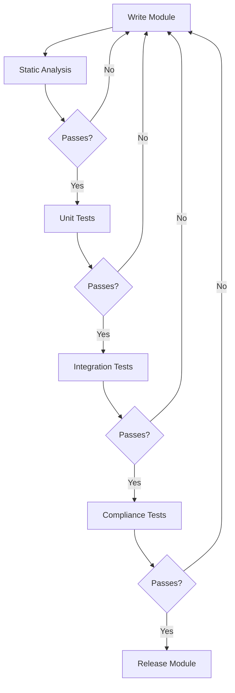

# Terraform Module Testing

## Introduction

Testing Terraform modules is a critical practice for ensuring that your infrastructure code works as expected and continues to function correctly as it evolves. Just as with traditional software development, thorough testing helps catch issues early, encourages good design patterns, and provides confidence when making changes.

In this guide, we'll explore various approaches to testing Terraform modules, from simple validation tests to comprehensive integration testing. Whether you're new to Terraform or looking to improve your existing workflow, these testing strategies will help you build more reliable infrastructure code.

## Why Test Terraform Modules?

Testing your Terraform modules provides several important benefits:

- **Reliability**: Ensures modules work as expected across different environments
- **Documentation**: Tests serve as executable documentation showing how modules should be used
- **Refactoring safety**: Allows you to modify modules with confidence
- **Collaboration**: Makes it easier for teams to work together on infrastructure code
- **Quality**: Improves the overall quality and maintainability of your modules

## Types of Terraform Module Tests

Testing Terraform modules typically involves several different types of tests, each serving a specific purpose:

### 1. Static Analysis

Static analysis focuses on checking your code without executing it, identifying issues like syntax errors, formatting problems, or security vulnerabilities.

#### Using `terraform validate`

The simplest form of static analysis is using Terraform's built-in validation command:

```bash
terraform validate
```

This ensures your configuration is syntactically correct and internally consistent.

#### Terraform Linting with `tflint`

TFLint is a powerful linting tool that can catch issues not detected by `terraform validate`:

```bash
# Install tflint
curl -s https://raw.githubusercontent.com/terraform-linters/tflint/master/install_linux.sh | bash

# Run against your module
tflint
```

A typical `.tflint.hcl` configuration file might look like:

```hcl
plugin "terraform" {
  enabled = true
  version = "0.2.0"
  source  = "github.com/terraform-linters/tflint-ruleset-terraform"
}

plugin "aws" {
  enabled = true
  version = "0.18.0"
  source  = "github.com/terraform-linters/tflint-ruleset-aws"
}

rule "terraform_unused_declarations" {
  enabled = true
}

rule "terraform_documented_variables" {
  enabled = true
}
```

### 2. Unit Testing with Terraform's Built-in Functions

For simple logic within your modules, you can use Terraform's built-in testing capabilities:

```hcl
# Example: Testing a local value transformation
locals {
  instance_types = {
    "dev"  = "t3.micro"
    "test" = "t3.small"
    "prod" = "t3.medium"
  }
  
  # Function to be tested
  selected_type = lookup(local.instance_types, var.environment, "t3.micro")
}

# Simple assertion
output "test_instance_type" {
  value = local.selected_type == "t3.medium" ? "PASS" : "FAIL: Expected t3.medium"
  
  # This only evaluates when explicitly referenced, e.g., with terraform output
  precondition {
    condition     = var.environment == "prod" ? local.selected_type == "t3.medium" : true
    error_message = "Production environment should use t3.medium instance type."
  }
}
```

### 3. Automated Testing with Terratest

[Terratest](https://terratest.gruntwork.io/) is a Go library that makes it easier to write automated tests for your infrastructure code. It provides a collection of helper functions and patterns for testing Terraform modules.

First, set up a Go test file (e.g., `main_test.go`) in a `test` directory:

```go
package test

import (
	"testing"
	
	"github.com/gruntwork-io/terratest/modules/terraform"
	"github.com/stretchr/testify/assert"
)

func TestTerraformBasicExample(t *testing.T) {
	// Arrange
	terraformOptions := terraform.WithDefaultRetryableErrors(t, &terraform.Options{
		TerraformDir: "../examples/basic",
		
		// Variables to pass to our Terraform code using -var options
		Vars: map[string]interface{}{
			"region":      "us-east-1",
			"environment": "test",
		},
	})
	
	// Act
	// Clean up resources when the test is complete
	defer terraform.Destroy(t, terraformOptions)
	
	// Initialize and apply the Terraform code
	terraform.InitAndApply(t, terraformOptions)
	
	// Assert
	// Get output values
	instanceType := terraform.Output(t, terraformOptions, "instance_type")
	
	// Verify we're getting the expected values
	assert.Equal(t, "t3.small", instanceType)
}
```

To run the test:

```bash
cd test
go mod init github.com/yourname/module-test
go get github.com/gruntwork-io/terratest/modules/terraform
go get github.com/stretchr/testify/assert
go test -v
```

### 4. Integration Testing with Kitchen-Terraform

Kitchen-Terraform combines Test Kitchen with Terraform to provide a complete testing framework:

First, install the required tools:

```bash
gem install kitchen-terraform
gem install kitchen-inspec
```

Create a `.kitchen.yml` file:

```yaml
---
driver:
  name: terraform
  
provisioner:
  name: terraform
  
platforms:
  - name: aws
  
verifier:
  name: terraform
  systems:
    - name: default
      backend: local
      controls:
        - vpc_check
        
suites:
  - name: default
    driver:
      root_module_directory: test/fixtures/default
```

Then create a test fixture and test file:

```ruby
# test/integration/default/controls/vpc_check.rb
control 'vpc_check' do
  describe aws_vpc(vpc_id: attribute('vpc_id')) do
    it { should exist }
    its('cidr_block') { should eq '10.0.0.0/16' }
  end
end
```

### 5. Compliance Testing with OPA/Conftest

For policy compliance testing, you can use Open Policy Agent (OPA) with Conftest:

```bash
# Install Conftest
brew install conftest

# Create a policy
mkdir -p policies
```

Create a policy file at `policies/naming.rego`:

```rego
package main

deny[msg] {
  resource := input.resource.aws_s3_bucket[name]
  not startswith(name, "prefix-")
  msg = sprintf("S3 bucket '%v' doesn't follow naming convention", [name])
}
```

Test your Terraform plan output:

```bash
terraform plan -out=tfplan
terraform show -json tfplan > tfplan.json
conftest test tfplan.json
```

## Setting Up a Testing Workflow

Let's walk through setting up a complete testing workflow for a simple module:

### Directory Structure

```
my-module/
├── main.tf
├── variables.tf
├── outputs.tf 
├── examples/
│   └── basic/
│       ├── main.tf
│       ├── outputs.tf
│       └── variables.tf
└── tests/
    ├── unit/
    │   └── main_test.go
    └── integration/
        └── default_test.go
```

### Sample Module (AWS VPC)

Here's a simple VPC module we'll use for testing:

```hcl
# main.tf
resource "aws_vpc" "main" {
  cidr_block = var.cidr_block
  
  tags = merge(
    var.tags,
    {
      Name = var.name
      Environment = var.environment
    }
  )
}

resource "aws_subnet" "public" {
  count = length(var.public_subnets)
  
  vpc_id     = aws_vpc.main.id
  cidr_block = var.public_subnets[count.index]
  
  tags = merge(
    var.tags,
    {
      Name = "${var.name}-public-${count.index}"
      Type = "Public"
    }
  )
}

# variables.tf
variable "cidr_block" {
  description = "The CIDR block for the VPC"
  type        = string
}

variable "name" {
  description = "Name to be used on all resources as prefix"
  type        = string
}

variable "environment" {
  description = "Environment for the VPC"
  type        = string
}

variable "public_subnets" {
  description = "A list of public subnets inside the VPC"
  type        = list(string)
  default     = []
}

variable "tags" {
  description = "A map of tags to add to all resources"
  type        = map(string)
  default     = {}
}

# outputs.tf
output "vpc_id" {
  description = "The ID of the VPC"
  value       = aws_vpc.main.id
}

output "public_subnet_ids" {
  description = "List of public subnet IDs"
  value       = aws_subnet.public[*].id
}
```

### Example Usage

```hcl
# examples/basic/main.tf
provider "aws" {
  region = var.region
}

module "vpc" {
  source = "../../"
  
  cidr_block    = "10.0.0.0/16"
  name          = "example"
  environment   = var.environment
  public_subnets = ["10.0.1.0/24", "10.0.2.0/24"]
  
  tags = {
    Project = "TerraformModuleTest"
  }
}

# examples/basic/variables.tf
variable "region" {
  description = "AWS region"
  type        = string
  default     = "us-west-2"
}

variable "environment" {
  description = "Environment to deploy"
  type        = string
  default     = "test"
}

# examples/basic/outputs.tf
output "vpc_id" {
  description = "The ID of the VPC"
  value       = module.vpc.vpc_id
}
```

### Terratest Example

```go
// tests/unit/main_test.go
package test

import (
	"testing"
	
	"github.com/gruntwork-io/terratest/modules/aws"
	"github.com/gruntwork-io/terratest/modules/terraform"
	"github.com/stretchr/testify/assert"
)

func TestVpcModule(t *testing.T) {
	t.Parallel()
	
	// Construct the terraform options with default retryable errors
	terraformOptions := terraform.WithDefaultRetryableErrors(t, &terraform.Options{
		// The path to where our Terraform code is located
		TerraformDir: "../../examples/basic",
		
		// Variables to pass to our Terraform code using -var options
		Vars: map[string]interface{}{
			"region":      "us-east-1",
			"environment": "test",
		},
	})
	
	// At the end of the test, run `terraform destroy` to clean up any resources that were created
	defer terraform.Destroy(t, terraformOptions)
	
	// This will run `terraform init` and `terraform apply` and fail the test if there are any errors
	terraform.InitAndApply(t, terraformOptions)
	
	// Run `terraform output` to get the value of an output variable
	vpcId := terraform.Output(t, terraformOptions, "vpc_id")
	
	// Verify we're getting back the outputs we expect
	assert.NotEmpty(t, vpcId)
	
	// Look up the VPC by ID
	region := "us-east-1"
	vpc := aws.GetVpcById(t, vpcId, region)
	
	// Verify it has the expected CIDR block
	assert.Equal(t, "10.0.0.0/16", vpc.CidrBlock)
}
```

## Continuous Integration

To fully automate your module testing, set up CI/CD pipelines. Here's an example GitHub Actions workflow:

```yaml
name: Terraform Module Tests

on:
  push:
    branches: [ main ]
  pull_request:
    branches: [ main ]

jobs:
  validate:
    runs-on: ubuntu-latest
    steps:
      - uses: actions/checkout@v3
      
      - name: Setup Terraform
        uses: hashicorp/setup-terraform@v2
        with:
          terraform_version: 1.3.0
      
      - name: Terraform Init
        run: terraform init -backend=false
      
      - name: Terraform Validate
        run: terraform validate
      
      - name: Install TFLint
        run: curl -s https://raw.githubusercontent.com/terraform-linters/tflint/master/install_linux.sh | bash
      
      - name: Run TFLint
        run: tflint --format=compact
  
  terratest:
    needs: validate
    runs-on: ubuntu-latest
    steps:
      - uses: actions/checkout@v3
      
      - name: Set up Go
        uses: actions/setup-go@v3
        with:
          go-version: 1.19
      
      - name: Run Terratest
        run: |
          cd tests/unit
          go mod init github.com/example/module-test
          go get github.com/gruntwork-io/terratest/modules/terraform
          go get github.com/stretchr/testify/assert
          go test -v
        env:
          AWS_ACCESS_KEY_ID: ${{ secrets.AWS_ACCESS_KEY_ID }}
          AWS_SECRET_ACCESS_KEY: ${{ secrets.AWS_SECRET_ACCESS_KEY }}
```

## Best Practices for Terraform Module Testing

1. **Test Isolation**: Ensure tests don't interfere with each other
2. **Cleanup Resources**: Always clean up resources after tests complete
3. **Avoid Production**: Never run tests against production environments
4. **Use Unique Names**: Generate unique resource names for each test run
5. **Parameterize Tests**: Test modules with different input combinations
6. **Mock External Services**: When possible, mock external API calls
7. **Test Failures**: Verify that your module handles failures gracefully
8. **Test Documentation**: Document your testing approach and how to run tests
9. **Use Terraform Plan Files**: Test plan outputs before applying
10. **Test Coverage**: Aim to test all major functionality

## Automated Testing Alternatives

While Terratest is popular, there are several alternatives:

- **Terraform's built-in testing framework**: Available in newer Terraform versions
- **Kitchen-Terraform**: Ruby-based testing for Terraform
- **Terragrunt**: Includes testing capabilities when using DRY Terraform code
- **Checkov**: Static analysis tool specifically for Terraform
- **Terraform Compliance**: BDD-style testing framework

## Testing Process Flow

The following diagram shows a typical testing workflow for Terraform modules:



## Summary

Testing Terraform modules is essential for building reliable, maintainable infrastructure as code. By implementing a combination of static analysis, unit tests, integration tests, and compliance checks, you can ensure your modules work correctly and continue to do so as they evolve.

The main testing approaches we covere