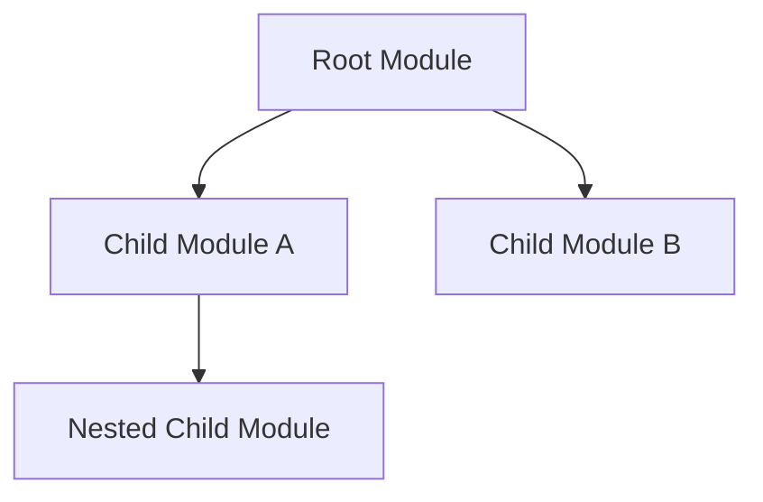
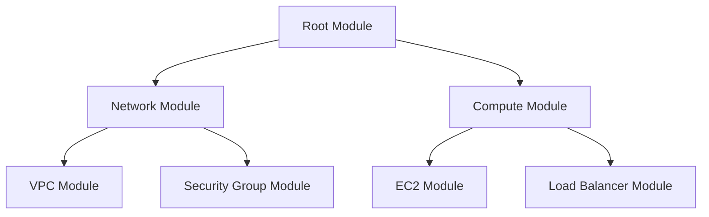
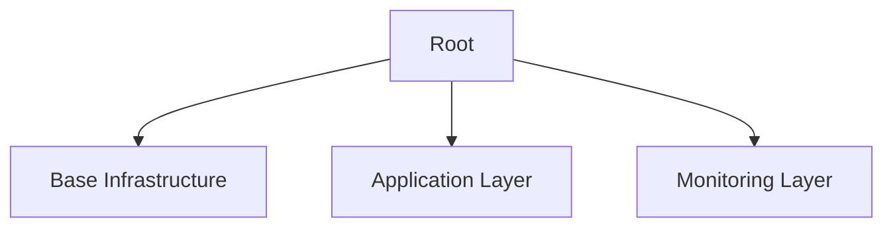

# Terraform Child Modules

## Introduction

When working with Terraform, you'll often find yourself creating similar infrastructure patterns across different projects or environments. Instead of duplicating code, Terraform modules allow you to package and reuse configurations. **Child modules** take this concept further by enabling you to create composable, nested module structures that enhance organization and reusability.

Child modules are modules that are called by another module (the parent module). This parent-child relationship creates a hierarchy that helps manage complex infrastructure as your projects grow.

## Understanding Child Modules

### What are Child Modules?

A child module is simply a Terraform module that's called from another module. The calling module is the parent, and the called module is the child.



### Benefits of Child Modules

1. **Encapsulation**: Hide complex implementation details
2. **Reusability**: Create once, use multiple times
3. **Maintainability**: Update logic in one place
4. **Organization**: Logical grouping of resources 
5. **Composition**: Build complex infrastructure from simple building blocks

## Creating Your First Child Module

Let's create a simple example with a parent module that calls a child module to create AWS resources.

### Step 1: Create the Child Module Structure

First, let's organize our file structure:

```
project/
├── main.tf         # Root module
├── modules/
│   └── vpc/        # Child module
│       ├── main.tf
│       ├── variables.tf
│       ├── outputs.tf
│       └── README.md
```

### Step 2: Define the Child Module

Here's what goes inside the child module files.

**modules/vpc/main.tf**:

```hcl
resource "aws_vpc" "this" {
  cidr_block = var.vpc_cidr
  
  tags = {
    Name = var.vpc_name
    Environment = var.environment
  }
}

resource "aws_subnet" "public" {
  count = length(var.public_subnet_cidrs)
  
  vpc_id     = aws_vpc.this.id
  cidr_block = var.public_subnet_cidrs[count.index]
  availability_zone = var.availability_zones[count.index]
  
  tags = {
    Name = "${var.vpc_name}-public-${count.index + 1}"
    Environment = var.environment
  }
}
```

**modules/vpc/variables.tf**:

```hcl
variable "vpc_cidr" {
  description = "CIDR block for the VPC"
  type        = string
}

variable "vpc_name" {
  description = "Name for the VPC"
  type        = string
}

variable "environment" {
  description = "Deployment environment"
  type        = string
}

variable "public_subnet_cidrs" {
  description = "List of public subnet CIDR blocks"
  type        = list(string)
}

variable "availability_zones" {
  description = "List of availability zones"
  type        = list(string)
}
```

**modules/vpc/outputs.tf**:

```hcl
output "vpc_id" {
  description = "The ID of the VPC"
  value       = aws_vpc.this.id
}

output "public_subnet_ids" {
  description = "List of public subnet IDs"
  value       = aws_subnet.public[*].id
}
```

### Step 3: Call the Child Module from Parent Module

Now, let's reference and use our child module.

**main.tf** (Root/Parent Module):

```hcl
provider "aws" {
  region = "us-west-2"
}

module "development_vpc" {
  source = "./modules/vpc"
  
  vpc_cidr    = "10.0.0.0/16"
  vpc_name    = "development"
  environment = "dev"
  
  public_subnet_cidrs = ["10.0.1.0/24", "10.0.2.0/24"]
  availability_zones  = ["us-west-2a", "us-west-2b"]
}

# Use the outputs from the child module
resource "aws_instance" "example" {
  ami           = "ami-0c55b159cbfafe1f0"
  instance_type = "t2.micro"
  subnet_id     = module.development_vpc.public_subnet_ids[0]
  
  tags = {
    Name = "example-instance"
  }
}
```

### Step 4: Initialize and Apply

To use the modules, run:

```bash
terraform init
terraform apply
```

The output would look something like:

```
Apply complete! Resources: 4 added, 0 changed, 0 destroyed.

Outputs:

development_vpc_id = "vpc-0a1b2c3d4e5f6g7h8"
```

## Nested Module Structures

Child modules can be nested multiple levels deep. Let's see how we can create a more complex structure:



### Example: Creating a Web Application Infrastructure

Here's how our directory structure might look:

```
webapp/
├── main.tf
├── variables.tf
├── outputs.tf
├── modules/
│   ├── network/
│   │   ├── main.tf
│   │   ├── variables.tf
│   │   ├── outputs.tf
│   │   └── modules/
│   │       ├── vpc/
│   │       └── security_groups/
│   └── compute/
│       ├── main.tf
│       ├── variables.tf
│       ├── outputs.tf
│       └── modules/
│           ├── ec2/
│           └── load_balancer/
```

The higher-level modules would call the lower-level modules, creating a clean, organized structure.

## Passing Data Between Modules

One of the most important aspects of working with child modules is passing data between them.

### Input Variables

We pass values to child modules through input variables, as shown in our earlier example:

```hcl
module "development_vpc" {
  source = "./modules/vpc"
  
  vpc_cidr    = "10.0.0.0/16"
  vpc_name    = "development"
  # ...
}
```

### Output Values and References

We can access output values from child modules using the `module.<MODULE_NAME>.<OUTPUT_NAME>` syntax:

```hcl
resource "aws_instance" "example" {
  # ...
  subnet_id = module.development_vpc.public_subnet_ids[0]
  # ...
}
```

## Module Sources

Child modules can be sourced from different locations:

### Local Paths

```hcl
module "vpc" {
  source = "./modules/vpc"
  # ...
}
```

### Git Repositories

```hcl
module "vpc" {
  source = "git::https://github.com/username/terraform-aws-vpc.git?ref=v1.0.0"
  # ...
}
```

### Terraform Registry

```hcl
module "vpc" {
  source  = "terraform-aws-modules/vpc/aws"
  version = "3.14.0"
  # ...
}
```

## Best Practices for Child Modules

1. **Keep modules focused**: Each module should have a single responsibility.

2. **Version your modules**: Use Git tags or specific commits to reference stable versions.

3. **Document your modules**: Include README.md files with usage examples.

4. **Use consistent variable names**: Maintain a naming convention across modules.

5. **Provide sensible defaults**: Make modules easy to use but configurable.

6. **Validate inputs**: Use variable validations to catch errors early:

```hcl
variable "environment" {
  description = "Deployment environment"
  type        = string
  
  validation {
    condition     = contains(["dev", "staging", "prod"], var.environment)
    error_message = "Environment must be one of: dev, staging, prod."
  }
}
```

7. **Test your modules**: Create automated tests to verify module functionality.

## Real-World Example: Web Application Infrastructure

Let's put everything together in a more comprehensive example. We'll create a web application infrastructure with multiple child modules.

### Root Module

**main.tf**:

```hcl
provider "aws" {
  region = var.aws_region
}

module "networking" {
  source = "./modules/networking"
  
  vpc_cidr            = var.vpc_cidr
  environment         = var.environment
  public_subnet_cidrs = var.public_subnet_cidrs
  private_subnet_cidrs = var.private_subnet_cidrs
  availability_zones  = var.availability_zones
}

module "database" {
  source = "./modules/database"
  
  subnet_ids          = module.networking.private_subnet_ids
  vpc_id              = module.networking.vpc_id
  environment         = var.environment
  db_instance_class   = var.db_instance_class
  db_name             = var.db_name
  db_user             = var.db_user
  db_password         = var.db_password
}

module "web_servers" {
  source = "./modules/web_servers"
  
  subnet_ids         = module.networking.public_subnet_ids
  vpc_id             = module.networking.vpc_id
  environment        = var.environment
  db_endpoint        = module.database.db_endpoint
  instance_type      = var.web_instance_type
  key_name           = var.key_name
  min_size           = var.web_min_size
  max_size           = var.web_max_size
  desired_capacity   = var.web_desired_capacity
}
```

### Networking Module

**modules/networking/main.tf**:

```hcl
module "vpc" {
  source = "./modules/vpc"
  
  vpc_cidr    = var.vpc_cidr
  vpc_name    = "${var.environment}-vpc"
  environment = var.environment
}

module "subnets" {
  source = "./modules/subnets"
  
  vpc_id              = module.vpc.vpc_id
  public_subnet_cidrs = var.public_subnet_cidrs
  private_subnet_cidrs = var.private_subnet_cidrs
  availability_zones  = var.availability_zones
  environment         = var.environment
}

module "security_groups" {
  source = "./modules/security_groups"
  
  vpc_id      = module.vpc.vpc_id
  environment = var.environment
}
```

## Module Composition Patterns

As your infrastructure grows, certain patterns emerge for composing modules:

### 1. Platform Pattern

Create modules that correspond to logical layers of your infrastructure:



### 2. Resource Group Pattern

Group related resources that are commonly used together:

```hcl
module "web_cluster" {
  source = "./modules/web_cluster"
  # This module contains: ASG, Launch Config, Load Balancer
}
```

### 3. Facade Pattern

Create a simplified interface over complex infrastructure:

```hcl
module "simple_webapp" {
  source        = "./modules/simple_webapp"
  app_name      = "my-app"
  environment   = "production"
  # Internally configures VPC, subnets, security groups, ASG, RDS, etc.
}
```

## Testing Child Modules

It's important to test your modules to ensure they work as expected. Here's a simple approach:

1. Create a test directory for each module
2. Write test configurations that use the module
3. Use tools like Terratest or Kitchen-Terraform for automated testing

Example test structure:

```
modules/vpc/
├── test/
│   ├── main.tf
│   ├── outputs.tf
│   └── variables.tf
```

## Summary

Terraform child modules are a powerful way to organize and reuse infrastructure code. Key takeaways include:

- Child modules help encapsulate complexity and promote reuse
- Modules can be nested to create organization hierarchies
- Data is passed between modules through input variables and outputs
- Module sources can be local paths, Git repositories, or the Terraform Registry
- Following best practices for module design will make your infrastructure more maintainable

By effectively using child modules, you'll create infrastructure that's easier to understand, maintain, and extend as your needs evolve.

## Additional Resources

- [Terraform Module Documentation](https://www.terraform.io/docs/language/modules/index.html)
- [Terraform Registry](https://registry.terraform.io/) - Explore public modules
- [Terraform Module Structure](https://www.terraform.io/docs/language/modules/develop/structure.html)

## Exercises

1. Create a simple VPC module that creates a VPC with public and private subnets
2. Refactor the module to separate the VPC and subnet creation into child modules
3. Add a security group child module that creates common security groups
4. Build a root module that uses all your child modules to deploy a simple web application
5. Add version constraints to your module sources and test different versions