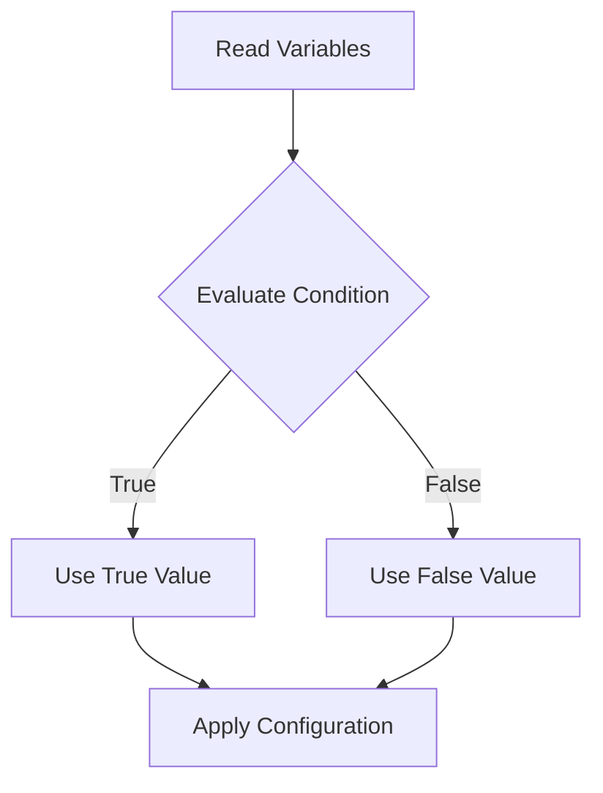

# Terraform Conditional Expressions

## Introduction

Conditional expressions in Terraform allow you to dynamically set values based on certain conditions. These expressions work similarly to conditional statements in other programming languages, letting you make decisions in your infrastructure code to accommodate different environments, requirements, and scenarios.

Terraform's conditional expressions provide a powerful way to make your infrastructure code more flexible and adaptable without creating separate configuration files for different conditions. As your infrastructure needs grow more complex, mastering conditionals becomes essential for writing clean, maintainable Terraform code.

## Understanding Conditional Expressions

Terraform uses a ternary operator syntax for conditional expressions, which takes the form:

```hcl
condition ? true_value : false_value
```

The expression evaluates the `condition` first. If the condition is `true`, the expression returns `true_value`; otherwise, it returns `false_value`.

### Basic Syntax Example

```hcl
resource "aws_instance" "server" {
  instance_type = var.environment == "production" ? "t2.medium" : "t2.micro"
  # Other configuration...
}
```

In this example, if the `environment` variable equals "production", a `t2.medium` instance will be provisioned; otherwise, a cheaper `t2.micro` instance will be used.

## Common Use Cases

### Environment-Based Configuration

One of the most common uses for conditional expressions is to adjust your infrastructure based on the environment:

```hcl
locals {
  instance_count = var.environment == "production" ? 3 : 1
  enable_monitoring = var.environment == "production" ? true : false
}

resource "aws_instance" "app" {
  count = local.instance_count
  
  monitoring = local.enable_monitoring
  
  # Other configuration...
}
```

### Feature Flags

Conditionals can be used to implement feature flags in your infrastructure:

```hcl
variable "enable_vpn" {
  description = "Whether to enable VPN functionality"
  type        = bool
  default     = false
}

resource "aws_vpn_gateway" "vpn" {
  # Only create this resource if enable_vpn is true
  count = var.enable_vpn ? 1 : 0
  
  vpc_id = aws_vpc.main.id
  
  tags = {
    Name = "main-vpn-gateway"
  }
}
```

### Default Values

Conditionals can provide default values when inputs might be null:

```hcl
locals {
  # Use provided subnet_id if available, otherwise use default
  subnet_id = var.subnet_id != null ? var.subnet_id : aws_subnet.default.id
}
```

## Advanced Conditional Patterns

### Chaining Conditional Expressions

You can chain multiple conditional expressions to create more complex logic:

```hcl
locals {
  instance_type = var.environment == "production" ? "m5.large" : 
                  var.environment == "staging" ? "t3.medium" : 
                  "t2.micro"
}
```

### Conditional with `for` Expressions

Combine conditionals with `for` expressions to filter collections:

```hcl
locals {
  production_instances = [
    for server in var.servers :
    server if server.environment == "production"
  ]
}
```

### Using with `count` and `for_each`

Conditionals are often used to control whether resources are created:

```hcl
resource "aws_cloudwatch_metric_alarm" "high_cpu" {
  count = var.enable_monitoring ? 1 : 0
  
  alarm_name = "high-cpu-usage"
  # Other configuration...
}
```

A more advanced pattern uses conditionals with `for_each`:

```hcl
resource "aws_route53_record" "www" {
  for_each = var.create_dns_records ? toset(var.domains) : []
  
  zone_id = aws_route53_zone.primary.zone_id
  name    = each.key
  type    = "A"
  ttl     = 300
  records = [aws_eip.lb.public_ip]
}
```

## Practical Examples

### Multi-Environment Infrastructure

This example creates a different setup based on the environment:

```hcl
variable "environment" {
  description = "Deployment environment"
  type        = string
  default     = "dev"
}

locals {
  # Determine settings based on environment
  settings = {
    dev = {
      instance_type  = "t2.micro"
      instance_count = 1
      multi_az       = false
    }
    staging = {
      instance_type  = "t2.medium"
      instance_count = 2
      multi_az       = false
    }
    production = {
      instance_type  = "m5.large"
      instance_count = 3
      multi_az       = true
    }
  }
  
  # Get settings for current environment or fall back to dev settings
  current = lookup(local.settings, var.environment, local.settings.dev)
}

resource "aws_instance" "application" {
  count = local.current.instance_count
  
  ami           = var.ami_id
  instance_type = local.current.instance_type
  
  tags = {
    Name        = "app-server-${count.index + 1}"
    Environment = var.environment
  }
}

resource "aws_db_instance" "database" {
  # Other configuration...
  multi_az = local.current.multi_az
}
```

### Conditional Resource Creation

This example shows how to conditionally create backups based on environment:

```hcl
resource "aws_backup_plan" "backup" {
  # Only create backups in production and staging
  count = var.environment == "dev" ? 0 : 1
  
  name = "backup-plan"
  
  rule {
    rule_name         = "daily-backup"
    target_vault_name = aws_backup_vault.backup_vault[0].name
    schedule          = var.environment == "production" ? "cron(0 12 * * ? *)" : "cron(0 0 * * ? *)"
    
    lifecycle {
      delete_after = var.environment == "production" ? 30 : 7
    }
  }
}

resource "aws_backup_vault" "backup_vault" {
  count = var.environment == "dev" ? 0 : 1
  name  = "backup-vault"
}
```

## Common Pitfalls and Best Practices

### Avoid Overly Complex Conditions

Excessively complex conditional expressions can make your code difficult to read and maintain. If your conditional logic becomes complicated, consider refactoring into modules or local variables.

**Instead of:**

```hcl
resource "aws_instance" "server" {
  instance_type = var.environment == "production" ? 
    (var.high_performance ? "m5.2xlarge" : "m5.large") : 
    (var.environment == "staging" ? "t3.medium" : "t2.micro")
}
```

**Consider:**

```hcl
locals {
  instance_types = {
    production = var.high_performance ? "m5.2xlarge" : "m5.large"
    staging    = "t3.medium"
    dev        = "t2.micro"
  }
}

resource "aws_instance" "server" {
  instance_type = lookup(local.instance_types, var.environment, "t2.micro")
}
```

### Testing Conditions Properly

Be careful with boolean testing. Terraform doesn't automatically convert values to booleans:

```hcl
# This may not work as expected if enable_feature is not explicitly a boolean
resource "aws_something" "feature" {
  count = var.enable_feature ? 1 : 0
  # Configuration...
}

# Instead, be explicit:
resource "aws_something" "feature" {
  count = var.enable_feature == true ? 1 : 0
  # Configuration...
}
```

### Use Conditionals with `dynamic` Blocks

Conditionals work well with dynamic blocks for optional configurations:

```hcl
resource "aws_security_group" "example" {
  name = "example"
  
  dynamic "ingress" {
    for_each = var.create_ssh_rule ? [1] : []
    content {
      from_port   = 22
      to_port     = 22
      protocol    = "tcp"
      cidr_blocks = ["10.0.0.0/16"]
    }
  }
}
```

## Visualizing Conditional Logic Flow

Let's visualize how conditional logic flows in Terraform:



## Summary

Terraform conditional expressions provide a powerful mechanism for creating dynamic, flexible infrastructure code. By mastering conditionals, you can:

- Create environment-specific configurations with a single codebase
- Implement feature flags to control resource creation
- Set sensible defaults while allowing customization
- Handle complex decision logic in your infrastructure

Conditional expressions are a key component of writing clean, maintainable Terraform code that can adapt to different scenarios without duplication or unnecessary complexity.

## Additional Resources

- Practice combining conditional expressions with other Terraform constructs like `for_each` and `dynamic` blocks
- Experiment with creating a module that uses conditionals to support multiple cloud providers
- Try implementing a "feature flag" system for your infrastructure using variables and conditionals

## Exercises

1. Create a Terraform configuration that deploys different sizes of databases based on the environment.
2. Write a module that conditionally creates backup resources only in production environments.
3. Implement a security group that uses conditionals to determine which ports to open based on input variables.