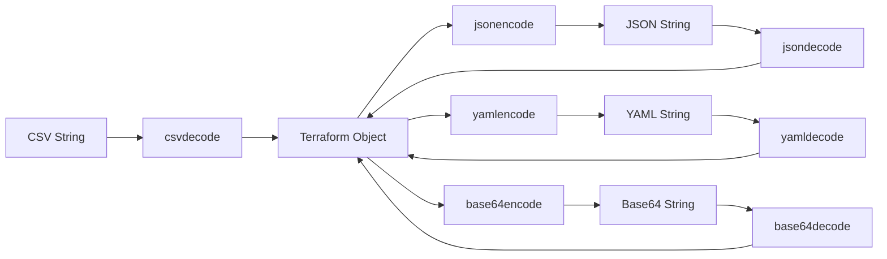

# Terraform Encoding Functions

## Introduction

Encoding functions in Terraform play a crucial role in transforming data between different formats. These functions enable you to convert data structures to and from formats like JSON, YAML, Base64, and CSV, facilitating integration with various systems and APIs. Whether you're working with external data sources or need to format outputs for other tools, understanding Terraform's encoding functions is essential for building flexible and interoperable infrastructure as code.

In this guide, we'll explore the various encoding functions available in Terraform, their syntax, and practical applications that demonstrate how they can be used in real-world scenarios.

## Core Encoding Functions

### The `jsonencode` Function

The `jsonencode` function converts a Terraform expression result to a JSON string representation.

#### Syntax

```hcl
jsonencode(value)
```

#### Example

```hcl
locals {
  user_data = {
    name  = "John Doe"
    email = "john@example.com"
    roles = ["admin", "developer"]
  }
}

output "json_output" {
  value = jsonencode(local.user_data)
}
```

#### Output

```
json_output = "{\"name\":\"John Doe\",\"email\":\"john@example.com\",\"roles\":[\"admin\",\"developer\"]}"
```

### The `jsondecode` Function

The `jsondecode` function parses a JSON string and produces a representation of its value.

#### Syntax

```hcl
jsondecode(string)
```

#### Example

```hcl
locals {
  json_string = <<EOT
{
  "server": {
    "hostname": "app.example.com",
    "port": 8080
  }
}
EOT
}

output "parsed_json" {
  value = jsondecode(local.json_string)
}
```

#### Output

```
parsed_json = {
  "server" = {
    "hostname" = "app.example.com"
    "port" = 8080
  }
}
```

### The `base64encode` Function

The `base64encode` function encodes a string to Base64 representation.

#### Syntax

```hcl
base64encode(string)
```

#### Example

```hcl
locals {
  user_script = <<-EOT
    #!/bin/bash
    echo "Hello, Terraform!"
  EOT
}

output "encoded_script" {
  value = base64encode(local.user_script)
}
```

#### Output

```
encoded_script = "IyEvYmluL2Jhc2gKZWNobyAiSGVsbG8sIFRlcnJhZm9ybSEiCg=="
```

### The `base64decode` Function

The `base64decode` function decodes a Base64 string to its original representation.

#### Syntax

```hcl
base64decode(string)
```

#### Example

```hcl
locals {
  encoded_data = "SGVsbG8sIFRlcnJhZm9ybSE="
}

output "decoded_data" {
  value = base64decode(local.encoded_data)
}
```

#### Output

```
decoded_data = "Hello, Terraform!"
```

### The `yamlencode` Function

The `yamlencode` function converts a Terraform value to a YAML string representation.

#### Syntax

```hcl
yamlencode(value)
```

#### Example

```hcl
locals {
  config = {
    app = {
      name    = "myapp"
      version = "1.0.0"
      environment = {
        name  = "production"
        debug = false
      }
    }
  }
}

output "yaml_config" {
  value = yamlencode(local.config)
}
```

#### Output

```
yaml_config = <<EOT
app:
  environment:
    debug: false
    name: production
  name: myapp
  version: 1.0.0
EOT
```

### The `yamldecode` Function

The `yamldecode` function parses a YAML string and produces a representation of its value.

#### Syntax

```hcl
yamldecode(string)
```

#### Example

```hcl
locals {
  yaml_string = <<EOT
servers:
  - name: web01
    ip: 192.168.1.10
  - name: web02
    ip: 192.168.1.11
EOT
}

output "parsed_yaml" {
  value = yamldecode(local.yaml_string)
}
```

#### Output

```
parsed_yaml = {
  "servers" = [
    {
      "ip" = "192.168.1.10"
      "name" = "web01"
    },
    {
      "ip" = "192.168.1.11"
      "name" = "web02"
    },
  ]
}
```

### The `csvdecode` Function

The `csvdecode` function parses a CSV string and produces a list of maps representing the rows.

#### Syntax

```hcl
csvdecode(string)
```

#### Example

```hcl
locals {
  csv_data = <<-EOT
name,role,active
john,admin,true
jane,developer,true
bob,tester,false
EOT
}

output "parsed_csv" {
  value = csvdecode(local.csv_data)
}
```

#### Output

```
parsed_csv = [
  {
    "active" = "true"
    "name" = "john"
    "role" = "admin"
  },
  {
    "active" = "true"
    "name" = "jane"
    "role" = "developer"
  },
  {
    "active" = "false"
    "name" = "bob"
    "role" = "tester"
  },
]
```

### The `urlencode` Function

The `urlencode` function applies URL encoding to a given string.

#### Syntax

```hcl
urlencode(string)
```

#### Example

```hcl
locals {
  query_string = "name=John Doe&role=admin&special=!@#$"
}

output "encoded_url" {
  value = urlencode(local.query_string)
}
```

#### Output

```
encoded_url = "name%3DJohn+Doe%26role%3Dadmin%26special%3D%21%40%23%24"
```

## Practical Applications

### 1. Creating User Data Scripts for EC2 Instances

```hcl
resource "aws_instance" "web_server" {
  ami           = "ami-0c55b159cbfafe1f0"
  instance_type = "t2.micro"

  user_data_base64 = base64encode(<<-EOT
    #!/bin/bash
    echo "Installing web server..."
    apt-get update
    apt-get install -y nginx
    echo "<h1>Deployed with Terraform</h1>" > /var/www/html/index.html
    systemctl start nginx
  EOT
  )

  tags = {
    Name = "WebServer"
  }
}
```

### 2. Working with External APIs and Webhooks

```hcl
locals {
  webhook_payload = {
    event       = "deployment"
    environment = "production"
    service     = "api-gateway"
    status      = "success"
    metadata    = {
      version = "1.2.3"
      commit  = "a1b2c3d4e5f6"
    }
  }
}

resource "null_resource" "notification_webhook" {
  provisioner "local-exec" {
    command = <<-EOT
      curl -X POST \
        -H "Content-Type: application/json" \
        -d '${jsonencode(local.webhook_payload)}' \
        https://webhook.example.com/notify
    EOT
  }
}
```

### 3. Reading Configuration from YAML Files

```hcl
locals {
  config_yaml = file("${path.module}/config.yaml")
  config      = yamldecode(local.config_yaml)
}

resource "aws_security_group" "allow_traffic" {
  name        = local.config.security_group.name
  description = local.config.security_group.description

  dynamic "ingress" {
    for_each = local.config.security_group.ingress_rules
    content {
      from_port   = ingress.value.from_port
      to_port     = ingress.value.to_port
      protocol    = ingress.value.protocol 
      cidr_blocks = ingress.value.cidr_blocks
    }
  }
}
```

### 4. Creating Kubernetes Resources from CSV Data

```hcl
locals {
  users_csv = file("${path.module}/users.csv")
  users     = csvdecode(local.users_csv)
}

resource "kubernetes_namespace" "user_namespaces" {
  count = length(local.users)

  metadata {
    name = "${local.users[count.index].username}-namespace"
    
    labels = {
      user = local.users[count.index].username
      role = local.users[count.index].role
    }
  }
}
```

## Function Chains and Transformations

You can chain encoding functions together to perform complex transformations:

```hcl
locals {
  yaml_config = file("${path.module}/config.yaml")
  config_map  = yamldecode(local.yaml_config)
  json_output = jsonencode(config_map)
  
  # Base64 encode for a Kubernetes Secret
  base64_json = base64encode(json_output)
}
```

## Best Practices

1. **Error Handling**: Always validate encoded/decoded content, especially when working with external data sources.

2. **Readability vs. Efficiency**: Consider readability when choosing between inline encoding and separate local variables.

```hcl
# Less readable (inline)
resource "aws_lambda_function" "example" {
  function_name = "example"
  role          = aws_iam_role.lambda_exec.arn
  handler       = "index.handler"
  runtime       = "nodejs14.x"
  
  environment {
    variables = jsondecode(file("${path.module}/env.json"))
  }
}

# More readable (separate locals)
locals {
  env_vars = jsondecode(file("${path.module}/env.json"))
}

resource "aws_lambda_function" "example" {
  function_name = "example"
  role          = aws_iam_role.lambda_exec.arn
  handler       = "index.handler"
  runtime       = "nodejs14.x"
  
  environment {
    variables = local.env_vars
  }
}
```

3. **Version Compatibility**: Be aware that some encoding functions (like `yamlencode`/`yamldecode`) were introduced in specific Terraform versions. Always check compatibility.

4. **Performance Considerations**: For large data structures, encoding/decoding operations can impact plan/apply times. Consider moving complex encoding logic to external scripts when appropriate.

## Data Flow with Encoding Functions

The following diagram illustrates how encoding functions transform data between different formats in a Terraform workflow:



## Summary

Terraform's encoding functions provide powerful capabilities for data transformation and interoperability with external systems. In this guide, we explored:

- Core encoding functions: `jsonencode`, `jsondecode`, `base64encode`, `base64decode`, `yamlencode`, `yamldecode`, `csvdecode`, and `urlencode`
- Practical applications including user data scripts, API integrations, configuration management, and resource generation
- Function chaining for complex transformations
- Best practices for using encoding functions effectively

By mastering these functions, you can create more flexible and maintainable infrastructure code that seamlessly integrates with various data formats and external systems.

## Additional Resources

- Practice encoding and decoding different data structures
- Try to build a multi-tier application that uses encoding functions for configuration management
- Experiment with reading external data sources and transforming them for use in your Terraform configurations

## Exercise Ideas

1. Create a Terraform configuration that reads a CSV file containing server configurations, transforms it to JSON, and uses it to provision AWS EC2 instances.

2. Build a module that accepts a YAML configuration file and generates appropriate security groups and network ACLs based on the configuration.

3. Implement a solution that fetches a remote JSON configuration, decodes it, modifies certain values, re-encodes it, and uses it as a configuration for another resource.