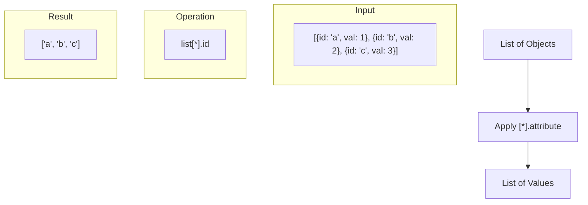

# Terraform Splat Expressions

## Introduction

When working with Terraform, you'll often need to extract specific attributes from complex data structures like lists of objects. Splat expressions provide an elegant shorthand syntax for these operations, making your code more concise and readable.

In this tutorial, we'll explore how splat expressions work in Terraform, when to use them, and how they can simplify your infrastructure code.

## What are Splat Expressions?

A splat expression in Terraform allows you to extract a specific attribute from all elements in a list of objects. The syntax uses an asterisk (`*`) followed by a period and the attribute name:

```hcl
[<LIST>.*.<ATTRIBUTE>]
```

This is equivalent to using a `for` expression:

```hcl
[for o in <LIST> : o.<ATTRIBUTE>]
```

But splat expressions offer a more concise syntax for this common operation.

## Basic Splat Expression Examples

### Example 1: Simple Attribute Extraction

Let's say you have a list of AWS EC2 instances and want to get all their IDs:

```hcl
resource "aws_instance" "web_servers" {
  count = 3
  ami   = "ami-0c55b159cbfafe1f0"
  instance_type = "t2.micro"
  tags = {
    Name = "web-server-${count.index}"
  }
}

# Using splat expression to get all instance IDs
output "instance_ids" {
  value = aws_instance.web_servers[*].id
}

# Output:
# instance_ids = [
#   "i-0123456789abcdef0",
#   "i-0123456789abcdef1",
#   "i-0123456789abcdef2"
# ]
```

In this example, `aws_instance.web_servers[*].id` returns a list of the `id` attribute from each instance.

### Example 2: Nested Attribute Access

Splat expressions can also access nested attributes:

```hcl
# Using splat expression to get all instance public IPs
output "public_ips" {
  value = aws_instance.web_servers[*].public_ip
}

# Using splat expression to access nested attributes in tags
output "instance_names" {
  value = aws_instance.web_servers[*].tags.Name
}

# Output:
# public_ips = [
#   "54.123.45.67",
#   "54.123.45.68",
#   "54.123.45.69"
# ]
# instance_names = [
#   "web-server-0",
#   "web-server-1",
#   "web-server-2"
# ]
```

## Legacy Splat Expression (Deprecated)

Before Terraform 0.12, there was a different syntax for splat expressions using the `.*` notation directly after a resource address:

```hcl
# Legacy syntax (deprecated)
aws_instance.web_servers.*.id
```

While this syntax still works for backward compatibility, you should use the newer `[*]` syntax as it's more consistent with other Terraform expressions.

## When to Use Splat Expressions

### 1. With Resource Collections (count and for_each)

Splat expressions are particularly useful when working with resource collections created using `count` or `for_each`:

```hcl
resource "aws_subnet" "private" {
  count             = 3
  vpc_id            = aws_vpc.main.id
  cidr_block        = "10.0.${count.index + 1}.0/24"
  availability_zone = data.aws_availability_zones.available.names[count.index]
}

# Get all subnet IDs using a splat expression
output "private_subnet_ids" {
  value = aws_subnet.private[*].id
}
```

### 2. With Local Variables Containing Lists

Splat expressions work with any list type variable:

```hcl
locals {
  users = [
    { name = "alice", role = "admin" },
    { name = "bob", role = "developer" },
    { name = "charlie", role = "developer" }
  ]
}

output "user_names" {
  value = local.users[*].name
}

# Output:
# user_names = [
#   "alice",
#   "bob",
#   "charlie"
# ]
```

## Advanced Splat Expression Techniques

### Combining with Other Expressions

You can combine splat expressions with other functions for more complex transformations:

```hcl
locals {
  instances = [
    { id = "i-1234", tags = { Name = "web", Environment = "prod" } },
    { id = "i-5678", tags = { Name = "app", Environment = "prod" } },
    { id = "i-9012", tags = { Name = "db", Environment = "prod" } }
  ]
}

# Combine splat with upper function
output "uppercase_names" {
  value = [for name in local.instances[*].tags.Name : upper(name)]
}

# Output:
# uppercase_names = [
#   "WEB",
#   "APP",
#   "DB"
# ]
```

### Handling Null or Empty Lists

Splat expressions handle `null` values gracefully by converting `null` to an empty list before applying the operation:

```hcl
locals {
  may_be_null = null
}

output "safe_output" {
  value = local.may_be_null[*].id
  # If may_be_null is null, this will return []
  # No error will be thrown
}
```

This behavior makes splat expressions safer to use than `for` expressions in some cases where you might have null values.

## Common Use Cases

### 1. Extracting Resource Attributes for Outputs

One of the most common use cases is to extract attributes from multiple resources for outputs:

```hcl
resource "aws_eip" "lb" {
  count = 3
  domain = "vpc"
}

output "elastic_ips" {
  description = "The public IP addresses of our load balancers"
  value = aws_eip.lb[*].public_ip
}
```

### 2. Passing Lists of Values to Modules

Splat expressions can help prepare data to pass to modules:

```hcl
module "security_group" {
  source = "./modules/security_group"
  
  # Pass all subnet IDs to the module
  subnet_ids = aws_subnet.private[*].id
}
```

### 3. Creating Maps from Lists

Combined with `for` expressions, you can transform data structures:

```hcl
locals {
  instances = [
    { name = "web1", ip = "10.0.1.10" },
    { name = "web2", ip = "10.0.1.11" },
    { name = "web3", ip = "10.0.1.12" }
  ]
}

# Create a map of name -> ip
output "instance_ips_by_name" {
  value = { for i, instance in local.instances : local.instances[*].name[i] => local.instances[*].ip[i] }
}

# Output:
# instance_ips_by_name = {
#   "web1" = "10.0.1.10"
#   "web2" = "10.0.1.11"
#   "web3" = "10.0.1.12"
# }
```

## Splat vs. For Expressions: When to Use Each

While splat expressions are convenient, they're not always the best choice:

| Use splat expressions when... | Use for expressions when... |
|-------------------------------|----------------------------|
| You need a simple attribute extraction | You need to filter elements |
| The operation is straightforward | You need more complex transformations |
| You want more concise syntax | You need to transform data structures |
| You're working with potentially null values | You need conditional logic |

## Visualizing Splat Expressions

Let's visualize how splat expressions work:



## Common Mistakes and Pitfalls

### Trying to Use Splat on Single Resources

Splat expressions only work on lists. If you try to use them on a single resource (not created with `count` or `for_each`), you'll get an error:

```hcl
# This will cause an error
resource "aws_vpc" "main" {
  cidr_block = "10.0.0.0/16"
}

output "wrong_usage" {
  value = aws_vpc.main[*].id  # Error: aws_vpc.main is not a list
}
```

### Confusion with Legacy Syntax

Be careful not to mix the legacy and new syntax:

```hcl
# Correct modern syntax
aws_instance.servers[*].id

# Legacy syntax (still works but not recommended)
aws_instance.servers.*.id

# Incorrect mixed syntax
aws_instance.servers.*[id]  # This will cause an error
```

## Summary

Terraform splat expressions provide a concise way to extract attributes from all elements in a list. They're particularly useful when working with resource collections created with `count` or `for_each`.

Key points to remember:
- Splat expressions use the `[*]` syntax: `resource_name[*].attribute`
- They transform lists of objects into lists of values
- They handle null values gracefully
- Use splat expressions for simple transformations and `for` expressions for more complex ones

With splat expressions, you can write more concise, readable Terraform code, especially when dealing with collections of resources.

## Practice Exercises

1. Create a list of EC2 instances with different tags and use a splat expression to get all instance IDs.
2. Create a list of objects with nested attributes and use splat expressions to extract specific nested values.
3. Compare the difference between using a splat expression and a for expression to extract the same attribute from a list of objects.

## Additional Resources

- [Terraform Documentation on Splat Expressions](https://www.terraform.io/docs/language/expressions/splat.html)
- [Terraform Collection Types](https://www.terraform.io/docs/language/expressions/type-constraints.html#collection-types)
- [Terraform For Expressions](https://www.terraform.io/docs/language/expressions/for.html)