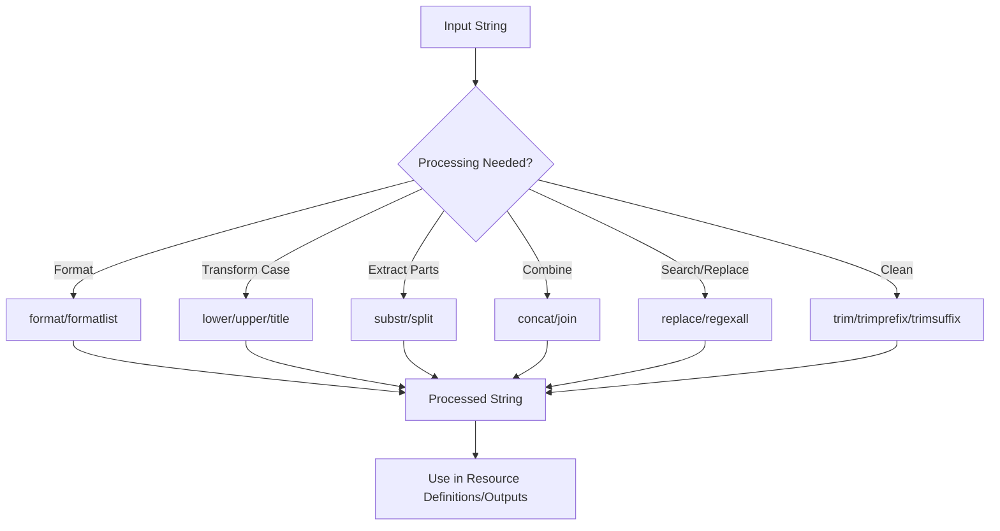

# Terraform String Functions

## Introduction

String manipulation is a fundamental part of creating dynamic and maintainable Terraform configurations. Terraform provides a robust set of built-in string functions that allow you to transform, combine, format, and validate string values. These functions are especially useful when you need to:

- Format strings for output display
- Manipulate user input
- Generate consistent resource names
- Process configuration data
- Implement conditional logic based on string content

In this guide, we'll explore the most useful string functions in Terraform, providing clear examples and practical applications to help you leverage these tools in your infrastructure code.

## Basic String Functions

### `concat`

The `concat` function combines multiple strings into a single string.

```hcl
locals {
  app_name = "my-webapp"
  env      = "prod"
  
  resource_name = "${local.app_name}-${local.env}"
  # Result: "my-webapp-prod"
}
```

### `join`

The `join` function combines a list of strings with a delimiter.

```hcl
locals {
  tags = ["web", "public", "prod"]
  
  combined_tags = join("-", local.tags)
  # Result: "web-public-prod"
}
```

**Output:**
```
combined_tags = "web-public-prod"
```

### `split`

The `split` function divides a string into a list of substrings based on a delimiter.

```hcl
locals {
  connection_string = "db:3306:myuser:mypassword"
  
  parts = split(":", local.connection_string)
  # Result: ["db", "3306", "myuser", "mypassword"]
  
  host = local.parts[0]     # "db"
  port = local.parts[1]     # "3306"
  username = local.parts[2] # "myuser"
}
```

## String Transformation Functions

### `lower` and `upper`

These functions convert a string to lowercase or uppercase.

```hcl
locals {
  environment = "Production"
  
  lowercase_env = lower(local.environment)
  # Result: "production"
  
  uppercase_env = upper(local.environment)
  # Result: "PRODUCTION"
}
```

### `title`

The `title` function converts the first letter of each word to uppercase.

```hcl
locals {
  service_name = "api gateway service"
  
  title_case = title(local.service_name)
  # Result: "Api Gateway Service"
}
```

### `substr`

The `substr` function extracts a substring from a string.

```hcl
# Syntax: substr(string, offset, length)

locals {
  account_id = "acc-123456789"
  
  # Extract just the number part
  id_number = substr(local.account_id, 4, 9)
  # Result: "123456789"
}
```

## String Format Functions

### `format`

The `format` function creates a string using formatting directives similar to C's `printf`.

```hcl
locals {
  instance_count = 5
  app_name       = "webserver"
  region         = "us-west-2"
  
  resource_name = format("%s-%s-instance-%02d", local.app_name, local.region, local.instance_count)
  # Result: "webserver-us-west-2-instance-05"
}
```

### `formatlist`

The `formatlist` function formats multiple values according to a specification, returning a list of strings.

```hcl
locals {
  instance_names = ["web", "app", "db"]
  environment    = "prod"
  
  full_names = formatlist("%s-server-%s", local.instance_names, local.environment)
  # Result: ["web-server-prod", "app-server-prod", "db-server-prod"]
}
```

### `indent`

The `indent` function adds a specified number of spaces at the beginning of each line.

```hcl
locals {
  config = <<-EOT
  server {
    listen 80;
    server_name example.com;
  }
  EOT
  
  indented = indent(2, local.config)
  # Result:
  #   server {
  #     listen 80;
  #     server_name example.com;
  #   }
}
```

## String Search and Replacement Functions

### `replace`

The `replace` function replaces all occurrences of a substring with another string.

```hcl
locals {
  dns_name = "my-service.internal.example.com"
  
  short_name = replace(local.dns_name, ".internal.example.com", "")
  # Result: "my-service"
}
```

### `regexall`

The `regexall` function finds all matches of a regular expression in a string.

```hcl
locals {
  log_entry = "IP: 192.168.1.1 accessed /api/users at 14:35:21"
  
  ips = regexall("\\d+\\.\\d+\\.\\d+\\.\\d+", local.log_entry)
  # Result: ["192.168.1.1"]
}
```

### `strcontains`

The `strcontains` function checks if a string contains another string.

```hcl
locals {
  instance_type = "t3.micro"
  
  is_t_series = strcontains(local.instance_type, "t3")
  # Result: true
}
```

## String Trimming Functions

### `trim`

The `trim` function removes specified characters from the beginning and end of a string.

```hcl
locals {
  user_input = "  my-resource  "
  
  clean_input = trim(local.user_input, " ")
  # Result: "my-resource"
}
```

### `trimprefix` and `trimsuffix`

These functions remove a prefix or suffix from a string if present.

```hcl
locals {
  s3_url = "https://my-bucket.s3.amazonaws.com/"
  
  bucket_name = trimprefix(trimsuffix(local.s3_url, "/"), "https://")
  # Result after trimprefix: "my-bucket.s3.amazonaws.com/"
  # Result after trimsuffix: "my-bucket.s3.amazonaws.com"
}
```

## Practical Examples

### Example 1: Creating Standardized Resource Names

```hcl
variable "project" {
  description = "Project name"
  type        = string
  default     = "myapp"
}

variable "environment" {
  description = "Environment name"
  type        = string
  default     = "dev"
}

locals {
  name_prefix = "${lower(var.project)}-${lower(var.environment)}"
  
  s3_bucket_name = "${local.name_prefix}-storage"
  lambda_name    = "${local.name_prefix}-processor"
  
  # Adding a timestamp for uniqueness when needed
  unique_name = "${local.name_prefix}-${formatdate("YYYYMMDDhhmmss", timestamp())}"
}

output "resource_names" {
  value = {
    bucket = local.s3_bucket_name
    lambda = local.lambda_name
    unique = local.unique_name
  }
}
```

### Example 2: Formatting User Data for EC2 Instances

```hcl
variable "server_config" {
  description = "Server configuration map"
  type        = map(string)
  default     = {
    app_port = "3000"
    log_level = "info"
    app_env = "production"
  }
}

locals {
  # Convert map to a series of export statements
  exports = [for k, v in var.server_config : "export ${upper(k)}=\"${v}\""]
  
  # Join them with newlines
  user_data_exports = join("
", local.exports)
  
  # Final user_data script
  user_data = <<-EOT
  #!/bin/bash
  
  # Environment variables
  ${local.user_data_exports}
  
  # Start application
  npm start
  EOT
}

output "user_data_script" {
  value = local.user_data
}
```

**Output:**
```
user_data_script = <<EOT
#!/bin/bash

# Environment variables
export APP_PORT="3000"
export LOG_LEVEL="info"
export APP_ENV="production"

# Start application
npm start
EOT
```

### Example 3: Validating and Formatting Inputs

```hcl
variable "database_name" {
  description = "Database name"
  type        = string
  default     = "myApp_Database"
  
  validation {
    condition     = can(regex("^[a-zA-Z0-9_]+$", var.database_name))
    error_message = "Database name must only contain alphanumeric characters and underscores."
  }
}

locals {
  # Ensure database name follows conventions
  formatted_db_name = lower(replace(var.database_name, "_", "-"))
  
  # Add a suffix based on environment
  environment = terraform.workspace
  db_full_name = format("%s-%s", local.formatted_db_name, local.environment)
}

output "database_name" {
  value = local.db_full_name
}
```

## Workflow Diagram



## Common Use Cases for String Functions

1. **Resource Naming Conventions**
   - Creating consistent, standardized names across resources
   - Ensuring names meet specific requirements (length, character limitations)

2. **Configuration Processing**
   - Parsing configuration strings from external sources
   - Processing environment variables or input variables

3. **Dynamic Template Generation**
   - Creating configuration files, scripts, or policy documents
   - Formatting output messages or logs

4. **Input Validation and Sanitization**
   - Validating user input against patterns
   - Cleaning and standardizing input values

5. **Tag Management**
   - Generating standardized tags across resources
   - Formatting tag values for consistency

## Summary

Terraform string functions provide powerful tools for manipulating text data within your infrastructure code. They enable you to create more dynamic, maintainable, and flexible configurations by allowing you to:

- Format strings consistently
- Transform input data
- Extract relevant information
- Combine related pieces of information
- Implement standardized naming conventions
- Process and validate user input

By mastering these string functions, you can write more concise, readable, and maintainable Terraform code that adapts to different environments and requirements.

## Additional Resources

- [Terraform String Functions Documentation](https://www.terraform.io/docs/language/functions/index.html)
- Practice exercises:
  1. Create a module that standardizes resource naming across a project
  2. Build a function to validate and format input variables
  3. Generate a configuration file using string manipulation functions
  4. Parse a complex connection string and extract its components