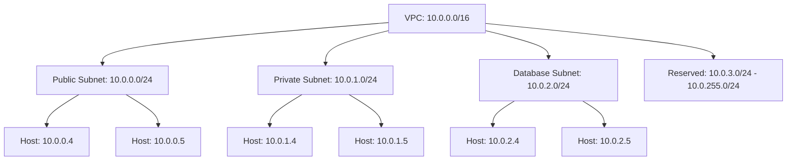

# Terraform IP Network Functions

## Introduction

When working with infrastructure as code using Terraform, you'll often need to manipulate and validate IP addresses and network ranges. Terraform provides a collection of specialized functions specifically designed for handling IP networking tasks. These functions help you calculate network addresses, validate CIDR blocks, determine if IP addresses belong to specific subnets, and more.

In this guide, we'll explore Terraform's IP network functions, understand how they work, and see practical examples of how to use them in your infrastructure configurations.

## IP Network Function Basics

Terraform's IP network functions allow you to work with IPv4 and IPv6 addresses and networks. These functions are particularly useful when:

- Setting up networking resources like VPCs, subnets, and security groups
- Calculating network addresses and ranges
- Validating IP-related input variables
- Working with CIDR notation

Let's explore the key IP network functions available in Terraform.

## Core IP Network Functions

### `cidrsubnet` Function

The `cidrsubnet` function calculates a subnet address within a given IP network address prefix.

#### Syntax

```hcl
cidrsubnet(prefix, newbits, netnum)
```

#### Parameters

- `prefix`: The CIDR expression for the larger network (e.g., "10.0.0.0/16")
- `newbits`: The number of additional bits to extend the prefix
- `netnum`: The subnet number to generate (in the range of `0` to `2^newbits - 1`)

#### Example

```hcl
locals {
  vpc_cidr = "10.0.0.0/16"
}

resource "aws_subnet" "example" {
  vpc_id     = aws_vpc.main.id
  cidr_block = cidrsubnet(local.vpc_cidr, 8, 0)  # Results in 10.0.0.0/24
}

resource "aws_subnet" "example2" {
  vpc_id     = aws_vpc.main.id
  cidr_block = cidrsubnet(local.vpc_cidr, 8, 1)  # Results in 10.0.1.0/24
}
```

In this example, we're taking a VPC with CIDR block `10.0.0.0/16` and creating two subnets by adding 8 more bits to the subnet mask (resulting in /24 subnets) and specifying subnet numbers 0 and 1.

### `cidrhost` Function

The `cidrhost` function calculates a full host IP address within a given CIDR prefix.

#### Syntax

```hcl
cidrhost(prefix, hostnum)
```

#### Parameters

- `prefix`: The CIDR expression (e.g., "10.0.0.0/16")
- `hostnum`: The host number within the network (zero-based)

#### Example

```hcl
resource "aws_instance" "web" {
  ami           = "ami-0c55b159cbfafe1f0"
  instance_type = "t2.micro"
  
  # Assign the 5th IP address in the subnet
  private_ip = cidrhost(aws_subnet.example.cidr_block, 5) # Results in 10.0.0.5
}
```

This example assigns the 5th usable IP address from the subnet's CIDR block to an EC2 instance.

### `cidrnetmask` Function

The `cidrnetmask` function converts a CIDR prefix to a subnet mask address.

#### Syntax

```hcl
cidrnetmask(prefix)
```

#### Example

```hcl
output "subnet_mask" {
  value = cidrnetmask("10.0.0.0/16") # Results in 255.255.0.0
}
```

### `cidrsubnets` Function

The `cidrsubnets` function calculates multiple consecutive subnet addresses within a prefix.

#### Syntax

```hcl
cidrsubnets(prefix, newbits...)
```

#### Parameters

- `prefix`: The CIDR expression for the larger network
- `newbits...`: A list of numbers of additional bits to extend the prefix for each consecutive subnet

#### Example

```hcl
locals {
  vpc_cidr = "10.0.0.0/16"
  subnets  = cidrsubnets(local.vpc_cidr, 8, 8, 8, 8) 
  # Results in ["10.0.0.0/24", "10.0.1.0/24", "10.0.2.0/24", "10.0.3.0/24"]
}

resource "aws_subnet" "web" {
  vpc_id     = aws_vpc.main.id
  cidr_block = local.subnets[0]
}

resource "aws_subnet" "app" {
  vpc_id     = aws_vpc.main.id
  cidr_block = local.subnets[1]
}

resource "aws_subnet" "db" {
  vpc_id     = aws_vpc.main.id
  cidr_block = local.subnets[2]
}

resource "aws_subnet" "mgmt" {
  vpc_id     = aws_vpc.main.id
  cidr_block = local.subnets[3]
}
```

This creates four equal-sized subnets from a VPC CIDR block, which is useful for creating multiple subnets in different availability zones.

### Variable-Sized Subnets with `cidrsubnets`

You can also create subnets of different sizes:

```hcl
locals {
  vpc_cidr     = "10.0.0.0/16"
  subnet_sizes = [4, 8, 8, 4]
  subnets      = cidrsubnets(local.vpc_cidr, local.subnet_sizes...)
  # Results in [
  #   "10.0.0.0/20" (large subnet with 4096 IPs),
  #   "10.0.16.0/24" (small subnet with 256 IPs),
  #   "10.0.17.0/24" (small subnet with 256 IPs),
  #   "10.0.18.0/20" (large subnet with 4096 IPs)
  # ]
}
```

## Validation Functions

### `cidrcontains` Function

The `cidrcontains` function checks whether a given IP address is within a given CIDR block.

#### Syntax

```hcl
cidrcontains(prefix, address)
```

#### Example

```hcl
variable "allowed_ip" {
  type        = string
  description = "IP address allowed to access the resource"
  
  validation {
    condition     = cidrcontains("10.0.0.0/8", var.allowed_ip)
    error_message = "The IP must be within the private 10.0.0.0/8 range."
  }
}
```

This validation ensures that the provided IP address falls within the private 10.0.0.0/8 range.

## Practical Examples

### Example 1: Creating a Multi-Tier Network Architecture

```hcl
locals {
  region_count = 3
  vpc_cidr     = "10.0.0.0/16"
}

# First, divide the VPC into three large chunks for each region
locals {
  region_cidrs = cidrsubnets(local.vpc_cidr, 2, 2, 2)
  # Results in ["10.0.0.0/18", "10.0.64.0/18", "10.0.128.0/18"]
}

# For each region, create public and private subnets
locals {
  public_subnets = [
    cidrsubnet(local.region_cidrs[0], 2, 0), # 10.0.0.0/20
    cidrsubnet(local.region_cidrs[1], 2, 0), # 10.0.64.0/20
    cidrsubnet(local.region_cidrs[2], 2, 0), # 10.0.128.0/20
  ]
  
  private_subnets = [
    cidrsubnet(local.region_cidrs[0], 2, 1), # 10.0.16.0/20
    cidrsubnet(local.region_cidrs[1], 2, 1), # 10.0.80.0/20
    cidrsubnet(local.region_cidrs[2], 2, 1), # 10.0.144.0/20
  ]
  
  database_subnets = [
    cidrsubnet(local.region_cidrs[0], 2, 2), # 10.0.32.0/20
    cidrsubnet(local.region_cidrs[1], 2, 2), # 10.0.96.0/20
    cidrsubnet(local.region_cidrs[2], 2, 2), # 10.0.160.0/20
  ]
}

# Resources would then use these CIDR blocks
resource "aws_subnet" "public" {
  count      = local.region_count
  vpc_id     = aws_vpc.main.id
  cidr_block = local.public_subnets[count.index]
  
  tags = {
    Name = "public-subnet-${count.index}"
    Tier = "public"
  }
}

resource "aws_subnet" "private" {
  count      = local.region_count
  vpc_id     = aws_vpc.main.id
  cidr_block = local.private_subnets[count.index]
  
  tags = {
    Name = "private-subnet-${count.index}"
    Tier = "private"
  }
}

resource "aws_subnet" "database" {
  count      = local.region_count
  vpc_id     = aws_vpc.main.id
  cidr_block = local.database_subnets[count.index]
  
  tags = {
    Name = "database-subnet-${count.index}"
    Tier = "database"
  }
}
```

This example creates a multi-tier architecture with public, private, and database subnets across three regions.

### Example 2: Security Group with Whitelist

```hcl
variable "office_cidrs" {
  type        = list(string)
  description = "List of office CIDR blocks allowed to access the resources"
  default     = ["203.0.113.0/24", "198.51.100.0/24"]
}

resource "aws_security_group" "allow_office" {
  name        = "allow_office"
  description = "Allow traffic from office IPs"
  vpc_id      = aws_vpc.main.id

  ingress {
    from_port   = 22
    to_port     = 22
    protocol    = "tcp"
    cidr_blocks = var.office_cidrs
  }
  
  ingress {
    from_port   = 443
    to_port     = 443
    protocol    = "tcp"
    cidr_blocks = var.office_cidrs
  }
}

# Validate that a custom IP is within an allowed range
variable "custom_access_ip" {
  type        = string
  description = "Custom IP allowed for admin access"
  
  validation {
    condition = anytrue([
      for office_cidr in var.office_cidrs : cidrcontains(office_cidr, var.custom_access_ip)
    ])
    error_message = "The custom access IP must be within one of the office CIDR ranges."
  }
}
```

This example creates a security group that allows SSH and HTTPS access from office IP ranges and validates that a custom admin IP is within the allowed ranges.

### Example 3: Dynamic Network Calculator

```hcl
variable "vpc_cidr" {
  type        = string
  description = "VPC CIDR block"
  default     = "10.0.0.0/16"
}

variable "subnet_count" {
  type        = number
  description = "Number of subnets to create"
  default     = 4
}

locals {
  # Calculate how many bits we need to represent subnet_count subnets
  bits_needed = ceil(log(var.subnet_count, 2))
  
  # Generate the subnet CIDRs
  subnet_cidrs = [
    for i in range(var.subnet_count) :
    cidrsubnet(var.vpc_cidr, local.bits_needed, i)
  ]
}

output "calculated_subnets" {
  value = local.subnet_cidrs
}

# For VPC CIDR 10.0.0.0/16 and 4 subnets, this would output:
# [
#   "10.0.0.0/18",
#   "10.0.64.0/18",
#   "10.0.128.0/18",
#   "10.0.192.0/18"
# ]
```

This example dynamically calculates the number of bits needed to represent a given number of subnets and generates the appropriate CIDR blocks.

## Visualizing CIDR Subdivision

To better understand how the CIDR functions work, here's a diagram showing how a VPC CIDR block is subdivided into subnets:



## Summary

Terraform's IP network functions are powerful tools for working with network addresses in infrastructure as code. They enable you to:

- Calculate subnet addresses with `cidrsubnet` and `cidrsubnets`
- Determine host IP addresses with `cidrhost`
- Convert CIDR notation to netmask with `cidrnetmask`
- Validate IP addresses with `cidrcontains`

These functions are especially useful when designing complex network architectures, creating multi-tier applications, or implementing security controls. By mastering these functions, you can create more dynamic, flexible, and maintainable infrastructure code.

## Additional Exercises

1. Create a Terraform configuration that divides a VPC CIDR block into subnets of varying sizes based on expected workload (e.g., larger subnets for data-intensive applications).

2. Write a validation rule that ensures custom IP addresses fall within a company's specific IP ranges.

3. Create a module that accepts a VPC CIDR and automatically calculates appropriate subnets across multiple availability zones for a standard three-tier architecture.

4. Implement a configuration that calculates the maximum number of hosts available in each subnet and outputs this information.

## Further Reading

- [Terraform Networking Provider Documentation](https://registry.terraform.io/providers/hashicorp/aws/latest/docs/resources/vpc)
- [CIDR Notation Explained](https://en.wikipedia.org/wiki/Classless_Inter-Domain_Routing)
- [IP Addressing Best Practices for AWS](https://docs.aws.amazon.com/vpc/latest/userguide/vpc-ip-addressing.html)