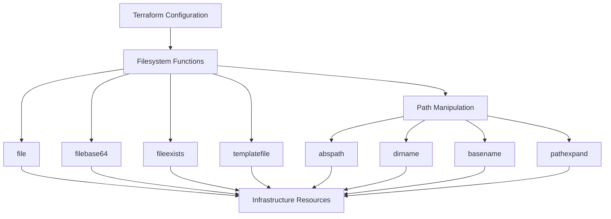

# Terraform Filesystem Functions

Terraform provides several built-in functions that enable you to interact with the filesystem during configuration evaluation. These functions are particularly useful when you need to read files, process content, or work with file paths as part of your infrastructure definition.

## Introduction

When defining infrastructure as code with Terraform, you might need to:
- Read configuration from external files
- Load certificates or SSH keys
- Process templates
- Work with file paths in a cross-platform manner

Terraform's filesystem functions make these operations possible without having to resort to external tools or scripts.

## Core Filesystem Functions

Let's explore the core filesystem functions available in Terraform.

### 1. `file` Function

The `file` function reads the contents of a file at the given path and returns them as a string.

#### Syntax

```hcl
file(path)
```

#### Parameters

- `path` - Path to the file to read. If the path is relative, it will be relative to the current working directory.

#### Example

Let's say you have an `init-script.sh` file you want to use in your configuration:

```hcl
resource "aws_instance" "web" {
  ami           = "ami-0c55b159cbfafe1f0"
  instance_type = "t2.micro"
  
  user_data = file("${path.module}/init-script.sh")
  
  tags = {
    Name = "Web Server"
  }
}
```

**Output:** The contents of `init-script.sh` will be passed as user data to the EC2 instance.

### 2. `filebase64` Function

The `filebase64` function reads the contents of a file at the given path and returns them as a base64-encoded string.

#### Syntax

```hcl
filebase64(path)
```

#### Example

This is particularly useful for files that need to be encoded, like binary files or certificates:

```hcl
resource "aws_launch_configuration" "example" {
  image_id      = "ami-0c55b159cbfafe1f0"
  instance_type = "t2.micro"
  
  user_data_base64 = filebase64("${path.module}/config.bin")
}
```

### 3. `fileexists` Function

The `fileexists` function determines whether a file exists at the given path.

#### Syntax

```hcl
fileexists(path)
```

#### Example

```hcl
locals {
  custom_script_exists = fileexists("${path.module}/custom-script.sh")
  user_data = local.custom_script_exists ? file("${path.module}/custom-script.sh") : file("${path.module}/default-script.sh")
}

resource "aws_instance" "example" {
  ami           = "ami-0c55b159cbfafe1f0"
  instance_type = "t2.micro"
  user_data     = local.user_data
}
```

**Output:** If `custom-script.sh` exists, its contents will be used; otherwise, `default-script.sh` will be used.

### 4. `templatefile` Function

The `templatefile` function reads the file at the given path and renders its content as a template using the provided variable values.

#### Syntax

```hcl
templatefile(path, vars)
```

#### Parameters

- `path` - Path to the template file
- `vars` - Map of variables to use for template rendering

#### Example

Template file (`init.tftpl`):

```bash
#!/bin/bash
echo "Hello, ${name}!"

# List of servers
%{ for server in servers ~}
echo "Server: ${server}"
%{ endfor ~}
```

Terraform configuration:

```hcl
resource "aws_instance" "web" {
  ami           = "ami-0c55b159cbfafe1f0"
  instance_type = "t2.micro"
  
  user_data = templatefile("${path.module}/init.tftpl", {
    name    = "Terraform User"
    servers = ["server1", "server2", "server3"]
  })
}
```

**Output:**
```bash
#!/bin/bash
echo "Hello, Terraform User!"

# List of servers
echo "Server: server1"
echo "Server: server2"
echo "Server: server3"
```

## Path Manipulation Functions

These functions help you work with file paths in a platform-independent way.

### 1. `abspath` Function

The `abspath` function converts a relative path to an absolute path.

#### Syntax

```hcl
abspath(path)
```

#### Example

```hcl
locals {
  absolute_path = abspath("./configs")
}

output "config_path" {
  value = local.absolute_path
}
```

**Output:** Something like `/home/user/project/configs` depending on your current directory.

### 2. `dirname` Function

The `dirname` function returns the directory portion of a path.

#### Syntax

```hcl
dirname(path)
```

#### Example

```hcl
locals {
  dir = dirname("/path/to/file.txt")
}

output "directory" {
  value = local.dir
}
```

**Output:** `/path/to`

### 3. `basename` Function

The `basename` function returns the filename portion of a path.

#### Syntax

```hcl
basename(path)
```

#### Example

```hcl
locals {
  filename = basename("/path/to/file.txt")
}

output "filename" {
  value = local.filename
}
```

**Output:** `file.txt`

### 4. `pathexpand` Function

The `pathexpand` function expands a leading `~` character to the current user's home directory.

#### Syntax

```hcl
pathexpand(path)
```

#### Example

```hcl
locals {
  home_config = pathexpand("~/.ssh/id_rsa.pub")
}

output "ssh_key_path" {
  value = local.home_config
}
```

**Output:** Something like `/home/username/.ssh/id_rsa.pub` on Linux/macOS or `C:\Users\username\.ssh\id_rsa.pub` on Windows.

## Real-World Examples

### Example 1: Loading SSH Keys

```hcl
resource "aws_key_pair" "deployer" {
  key_name   = "deployer-key"
  public_key = file(pathexpand("~/.ssh/id_rsa.pub"))
}
```

### Example 2: Configuration Templates for Multiple Environments

Directory structure:
```
project/
├── main.tf
├── templates/
│   ├── dev.json
│   └── prod.json
```

```hcl
locals {
  environment = "dev"
  config_path = "${path.module}/templates/${local.environment}.json"
}

resource "aws_lambda_function" "example" {
  function_name = "example-function"
  
  # Check if environment config exists
  environment {
    variables = {
      CONFIG = fileexists(local.config_path) ? file(local.config_path) : "{}"
    }
  }
}
```

### Example 3: Dynamic Application Configuration

Template file (`app-config.tftpl`):

```json
{
  "database": {
    "host": "${db_host}",
    "port": ${db_port},
    "username": "${db_username}",
    "password": "${db_password}"
  },
  "features": {
    %{ for name, enabled in features ~}
    "${name}": ${enabled ? "true" : "false"}%{ if !islastelement ~},%{ endif ~}
    %{ endfor ~}
  }
}
```

Terraform configuration:

```hcl
resource "aws_s3_object" "app_config" {
  bucket  = "my-app-configs"
  key     = "config.json"
  content = templatefile("${path.module}/app-config.tftpl", {
    db_host     = aws_db_instance.main.address
    db_port     = aws_db_instance.main.port
    db_username = aws_db_instance.main.username
    db_password = aws_db_instance.main.password
    features    = {
      logging  = true
      metrics  = true
      tracing  = false
    }
  })
  content_type = "application/json"
}
```

## File Content Processing Functions

When working with file contents, you might need to process them further. Here are some functions that work well with filesystem functions:

### Combining with `base64decode`

```hcl
locals {
  cert_content = base64decode(filebase64("${path.module}/certificate.pem"))
}
```

### Combining with `yamldecode`

```hcl
locals {
  config = yamldecode(file("${path.module}/config.yaml"))
  app_name = local.config.app.name
}
```

### Combining with `jsondecode`

```hcl
locals {
  settings = jsondecode(file("${path.module}/settings.json"))
  region = local.settings.aws.region
}
```

## Best Practices

1. **Use `path.module` for relative paths**: Always prefix relative paths with `path.module` to ensure they're relative to the module containing the expression, not to the working directory.

2. **Check if files exist**: Use `fileexists()` before trying to read a file that might not exist.

3. **Handle large files with care**: Terraform loads the entire file into memory, so be cautious with very large files.

4. **Keep sensitive information secure**: Be aware that file contents become part of your Terraform state. Use sensitive variables for sensitive content.

5. **Template validation**: Validate templates before applying your Terraform code, especially for complex templates.

## Visualizing Filesystem Functions



## Summary

Terraform's filesystem functions provide powerful capabilities for working with files and paths in your infrastructure code:

- The `file` and `filebase64` functions read file contents
- `fileexists` checks if a file exists
- `templatefile` renders templates with variables
- Path manipulation functions help deal with file paths consistently across platforms

These functions enable more dynamic and flexible infrastructure definitions by allowing you to separate configuration from code, load existing files, and generate content dynamically.

## Additional Resources

- [Terraform Functions Documentation](https://www.terraform.io/docs/language/functions/index.html)
- [Template Syntax Documentation](https://www.terraform.io/docs/language/expressions/strings.html#template-syntax)

## Exercises

1. Create a Terraform configuration that reads a public SSH key from your local machine and creates an AWS key pair.

2. Create a template file for a web server configuration and use the `templatefile` function to generate different configurations for development and production environments.

3. Write a Terraform configuration that checks if a custom script exists and uses it, falling back to a default script if not found.

4. Create a module that accepts a directory path and loads all JSON files in that directory, combining them into a single configuration.