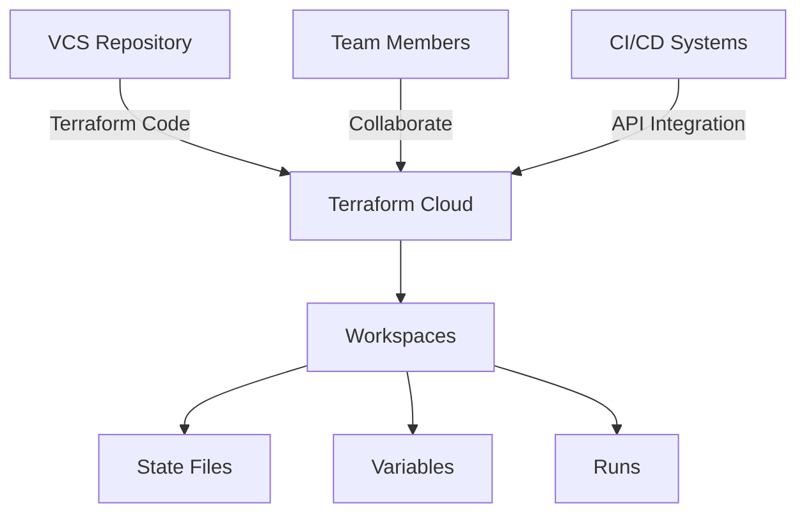

# Terraform Cloud Introduction

## What is Terraform Cloud?

Terraform Cloud is a managed service offering by HashiCorp that enhances the workflow and collaboration aspects of using Terraform. It provides a consistent and reliable environment for teams to collaborate on infrastructure as code, without the overhead of managing the Terraform execution environment themselves.

Think of Terraform Cloud as a centralized platform that helps teams work together on infrastructure provisioning, while providing additional features that aren't available in the open-source version of Terraform.

## Why Use Terraform Cloud?

When you're just getting started with Terraform, running it locally on your machine works fine. However, as teams grow and infrastructure needs become more complex, several challenges emerge:

- **State Management**: Storing state files securely and consistently
- **Secret Management**: Handling sensitive variables across team members
- **Collaboration**: Coordinating infrastructure changes among team members
- **Consistency**: Ensuring everyone uses the same Terraform version and providers

Terraform Cloud addresses these challenges by providing:

1. **Remote State Management**: Secure and centralized storage for state files
2. **Remote Terraform Execution**: Consistent runtime environment for Terraform operations
3. **Team-based Workflows**: Collaboration features including workspace sharing and role-based access control
4. **Version Control Integration**: Direct connection to your version control repositories
5. **Policy Enforcement**: Ability to enforce governance rules with Sentinel (in paid tiers)

## Terraform Cloud vs. Open Source Terraform

Before diving deeper, let's understand how Terraform Cloud differs from the open-source Terraform CLI:

| Feature | Terraform CLI (Open Source) | Terraform Cloud |
|---------|---------------------------|----------------|
| Execution Environment | Local machine | HashiCorp's managed environment |
| State Storage | Local files or configured backends | Built-in remote state storage |
| Collaboration | Manual coordination | Built-in collaboration features |
| Secret Management | Manual through various methods | Secure variable storage |
| Workflow Management | Manual process | Built-in workflow automation |
| Cost | Free | Free tier available, with paid options for more features |

## Terraform Cloud Architecture

Terraform Cloud follows a workspace-centric model. A workspace in Terraform Cloud is similar to working directories in the CLI workflow but with additional collaboration and automation features.



## Getting Started with Terraform Cloud

### Step 1: Create an Account

To begin using Terraform Cloud, you'll need to create an account at [Terraform Cloud](https://app.terraform.io/signup/account).

### Step 2: Create an Organization

After signing up, you'll need to create or join an organization. An organization is the top-level entity in Terraform Cloud that contains workspaces and team members.

### Step 3: Create Your First Workspace

Once you have an organization, you can create your first workspace:

1. Go to your organization page
2. Click "New Workspace"
3. Choose your workflow type (Version control, CLI-driven, or API-driven)

Here's how to create a workspace linked to a GitHub repository:

```hcl
# This is CLI configuration, not actual Terraform code
# You would use the Terraform Cloud CLI commands to set this up

# Login to Terraform Cloud
$ terraform login

# Initialize a new workspace from a local configuration
$ terraform init

# Configure the cloud workspace
$ terraform workspace new my-first-workspace
```

### Step 4: Configure Variables

Before running Terraform operations, you need to configure your variables in the workspace:

1. Navigate to your workspace
2. Go to the "Variables" tab
3. Add environment variables (like AWS credentials) or Terraform variables

Variables in Terraform Cloud can be marked as sensitive, which will encrypt their values and hide them in the UI.

## Workflow Example: Provisioning AWS Infrastructure

Let's see how to use Terraform Cloud to provision an AWS S3 bucket:

1. First, create a new file named `main.tf` in your repository:

```hcl
terraform {
  required_providers {
    aws = {
      source  = "hashicorp/aws"
      version = "~> 4.0"
    }
  }
  
  # Configure the Terraform Cloud backend
  cloud {
    organization = "your-organization-name"
    workspaces {
      name = "aws-s3-example"
    }
  }
}

provider "aws" {
  region = "us-west-2"
}

resource "aws_s3_bucket" "example" {
  bucket = "my-example-terraform-bucket"
  
  tags = {
    Environment = "Dev"
    Managed_by  = "Terraform"
  }
}

output "bucket_name" {
  value = aws_s3_bucket.example.bucket
}
```

2. Configure AWS credentials in Terraform Cloud:
   - Go to your workspace variables
   - Add `AWS_ACCESS_KEY_ID` and `AWS_SECRET_ACCESS_KEY` as environment variables
   - Mark them as sensitive

3. Push your code to your version control repo (if using VCS-driven workflow)

4. The Terraform Cloud will automatically:
   - Detect the changes
   - Queue a plan
   - Show you the changes to be made
   - Allow you to apply the changes

## Remote State Management

One of the key benefits of Terraform Cloud is state management. Let's see how to access remote state:

```hcl
# In a different configuration that needs to reference the S3 bucket

data "terraform_remote_state" "s3" {
  backend = "remote"
  
  config = {
    organization = "your-organization-name"
    workspaces = {
      name = "aws-s3-example"
    }
  }
}

# Now you can reference outputs from the remote state
resource "aws_iam_policy" "s3_access" {
  name = "s3-access-policy"
  
  policy = jsonencode({
    Version = "2012-10-17"
    Statement = [
      {
        Action = [
          "s3:GetObject",
          "s3:ListBucket",
        ]
        Effect = "Allow"
        Resource = [
          "arn:aws:s3:::${data.terraform_remote_state.s3.outputs.bucket_name}",
          "arn:aws:s3:::${data.terraform_remote_state.s3.outputs.bucket_name}/*",
        ]
      },
    ]
  })
}
```

## Collaboration Features

Terraform Cloud shines when working with teams. Here are some key collaboration features:

### Role-Based Access Control (RBAC)

You can assign different permission levels to team members:

- **Admin**: Can manage workspace settings and permissions
- **Write**: Can create and apply runs
- **Read**: Can view but not modify resources

### Run Triggers

Run triggers allow workspaces to start automatically when changes are applied in another workspace:

```hcl
# In the Terraform Cloud UI, you would configure workspace "network-infrastructure" 
# to trigger runs in "application-infrastructure" whenever changes are applied
```

### Notifications

Configure notifications to Slack, email, or webhooks when important events occur:

1. Go to your workspace settings
2. Navigate to "Notifications"
3. Add notification configurations for events like plan started, apply completed, etc.

## Terraform Cloud API

Terraform Cloud provides a comprehensive API for automation. Here's a simple example using curl:

```bash
# List workspaces using the API
curl \
  --header "Authorization: Bearer $TOKEN" \
  --header "Content-Type: application/vnd.api+json" \
  https://app.terraform.io/api/v2/organizations/your-organization/workspaces
```

## Free vs. Paid Features

Terraform Cloud offers a free tier with essential features:

- Remote state management
- Remote Terraform execution
- VCS integration
- Unlimited private modules

Paid tiers add:

- Team management and RBAC
- Sentinel policy enforcement
- Cost estimation
- SSO integration
- Run tasks and checks

## Summary

Terraform Cloud provides a powerful platform for teams to collaborate on infrastructure as code, offering:

- Remote state management
- Secure variable handling
- Consistent execution environments
- Team collaboration features
- Integration with version control systems

By using Terraform Cloud, teams can maintain consistent infrastructure deployments, improve collaboration, and implement governance across their infrastructure code.

## Additional Resources

- [Terraform Cloud Documentation](https://developer.hashicorp.com/terraform/cloud-docs)
- [Terraform Cloud API Documentation](https://developer.hashicorp.com/terraform/cloud-docs/api-docs)
- [Getting Started with Terraform Cloud](https://developer.hashicorp.com/terraform/tutorials/cloud-get-started)

## Practice Exercises

1. Create a free Terraform Cloud account and set up your first workspace.
2. Migrate an existing local Terraform project to Terraform Cloud.
3. Set up a workspace that provisions an AWS EC2 instance using Terraform Cloud.
4. Configure a notification to alert your team when infrastructure changes are applied.
5. Use the remote state data source to reference outputs from one workspace in another workspace.