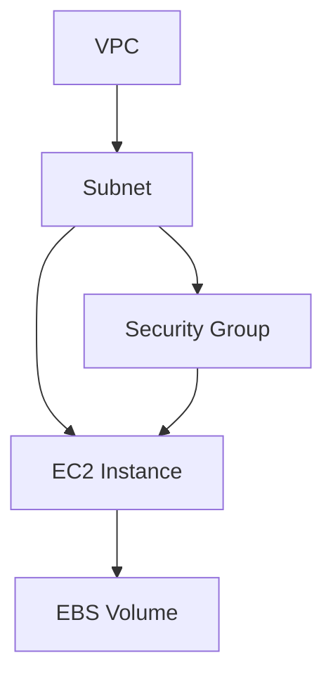

# Terraform Cloud Workspaces

## Introduction

Terraform Cloud Workspaces are isolated environments for managing infrastructure configurations. They serve as the organizational units within Terraform Cloud where your infrastructure code is stored, executed, and monitored. Workspaces separate your infrastructure deployments, allowing you to manage multiple environments (like development, staging, and production) without code conflicts or accidental modifications.

In this guide, we'll explore the concepts behind Terraform Cloud Workspaces, how to create and manage them, and how they can streamline your infrastructure provisioning workflow, especially in team settings.

## What are Terraform Cloud Workspaces?

A workspace in Terraform Cloud contains:

- Terraform configuration files (your infrastructure code)
- Variable values (both environment and Terraform variables)
- State files (the record of your currently deployed infrastructure)
- Run history (a log of all past operations)

Think of workspaces like project folders that keep everything related to a specific infrastructure deployment organized and separated from other deployments.

## Workspace Types in Terraform Cloud

Terraform Cloud offers two types of workspaces:

1. **Version Control System (VCS) workspaces**: Connected to a Git repository
2. **CLI-driven workspaces**: Used with Terraform's command-line interface

Let's explore each type in detail.

## Creating a VCS-backed Workspace

VCS-backed workspaces connect directly to your Git repository. Whenever you push changes to your repository, Terraform Cloud automatically detects them and triggers plans or applies based on your settings.

### Step-by-Step Creation Process

1. Log in to Terraform Cloud
2. Navigate to your organization
3. Click "New Workspace"
4. Select "Version control workflow"
5. Connect to your VCS provider (GitHub, GitLab, Bitbucket, etc.)
6. Select your repository
7. Configure workspace settings
8. Click "Create workspace"

Here's how it looks in code when referencing this workspace in your Terraform configuration:

```hcl
terraform {
  cloud {
    organization = "your-organization"
    workspaces {
      name = "my-vcs-workspace"
    }
  }
}
```

## Creating a CLI-driven Workspace

CLI-driven workspaces work with your local Terraform CLI, allowing you to execute commands locally while storing state and variables in Terraform Cloud.

### Step-by-Step Creation Process

1. Log in to Terraform Cloud
2. Navigate to your organization
3. Click "New Workspace"
4. Select "CLI-driven workflow"
5. Enter a workspace name
6. Click "Create workspace"

To use this workspace from your local CLI:

```hcl
terraform {
  cloud {
    organization = "your-organization"
    workspaces {
      name = "my-cli-workspace"
    }
  }
}
```

Then initialize and use Terraform as usual:

```bash
terraform login
terraform init
terraform plan
terraform apply
```

## Workspace Configuration Options

Terraform Cloud workspaces offer several configuration options:

### General Settings

- **Name**: Workspace identifier
- **Description**: Details about the workspace purpose
- **Execution Mode**: Where Terraform commands run (remote, local, or agent)
- **Apply Method**: Auto-apply or manual approval for changes
- **Terraform Version**: Specific version to use for this workspace

### Variables

Variables in workspaces can be:

1. **Terraform Variables**: Used in your Terraform code
2. **Environment Variables**: Available to Terraform providers during execution

Here's how to set variables in the web UI or with a variables.tf file:

```hcl
# variables.tf
variable "instance_type" {
  description = "EC2 instance type"
  default     = "t2.micro"
  type        = string
}

variable "region" {
  description = "AWS region"
  default     = "us-west-2"
  type        = string
}
```

### Workspace Organization with Tags

Workspaces can be organized using tags. This is especially useful when you have many workspaces:

```bash
# CLI command to add tags to a workspace
terraform workspace tag add dev my-workspace
```

## Workspace Workflows

Let's explore common workflows with Terraform Cloud Workspaces:

### Environment Separation

One common pattern is creating separate workspaces for each environment:

```
project-dev
project-staging
project-production
```

This provides isolation while allowing similar configuration across environments.

### Feature Development Workflow

A typical workflow might look like:

1. Developer creates a branch in Git
2. Makes infrastructure changes and pushes to the branch
3. Creates a pull request
4. Terraform Cloud runs a speculative plan on the PR
5. Team reviews changes and approves
6. Changes are merged and applied to the workspace

## Working with State

Terraform Cloud automatically manages state for each workspace, providing:

- Encrypted storage
- State locking
- Version history
- Remote operations

This eliminates the need for manual state management and reduces the risk of state corruption.

## Practical Example: Multi-Environment AWS Infrastructure

Let's create a practical example with multiple environments for an AWS infrastructure deployment:

1. First, create three workspaces:
   - `aws-infra-dev`
   - `aws-infra-staging`
   - `aws-infra-prod`

2. Set up workspace-specific variables:

```hcl
# Dev workspace variables
instance_type = "t2.micro"
instance_count = 1
environment = "development"

# Staging workspace variables
instance_type = "t2.medium"
instance_count = 2
environment = "staging"

# Production workspace variables
instance_type = "t2.large"
instance_count = 3
environment = "production"
```

3. Use a common configuration with environment-specific variables:

```hcl
# main.tf
provider "aws" {
  region = var.region
}

resource "aws_instance" "app_server" {
  count         = var.instance_count
  ami           = var.ami_id
  instance_type = var.instance_type
  
  tags = {
    Name        = "app-server-${var.environment}-${count.index}"
    Environment = var.environment
  }
}
```

## Team Collaboration Features

Terraform Cloud Workspaces excel at team collaboration through:

### Role-Based Access Control

Control who can:
- View workspaces
- Plan changes
- Apply changes
- Manage variables
- Manage settings

### Run Triggers

Configure workspaces to trigger runs in other workspaces:

```hcl
# Using a data source to reference outputs from another workspace
data "terraform_remote_state" "vpc" {
  backend = "remote"
  
  config = {
    organization = "your-organization"
    workspaces = {
      name = "network-infrastructure"
    }
  }
}

# Use the output in your resources
resource "aws_instance" "app_server" {
  subnet_id = data.terraform_remote_state.vpc.outputs.subnet_id
  # Other configuration...
}
```

### Cost Estimation

Terraform Cloud can estimate costs for AWS, Azure, and GCP resources before you apply changes.

## Workspace State Management

### Remote State Access

Access outputs from other workspaces:

```hcl
data "terraform_remote_state" "vpc" {
  backend = "remote"
  
  config = {
    organization = "your-organization"
    workspaces = {
      name = "vpc-prod"
    }
  }
}

# Use VPC outputs
resource "aws_instance" "web" {
  subnet_id = data.terraform_remote_state.vpc.outputs.public_subnet_id
  # Other settings...
}
```

### State Operations

Terraform Cloud provides UI access to state operations that would normally require CLI commands:

- State locking during operations
- State versions with the ability to recover previous states
- State inspector to view resources

## Workspace Visualization

Terraform Cloud offers a visual representation of dependencies between resources:



## Advanced Workspace Features

### Sentinel Policies

Terraform Cloud allows policy-as-code with Sentinel:

```hcl
# Example Sentinel policy to enforce instance types
import "tfplan"

# Allowed instance types
allowed_types = ["t2.micro", "t2.small", "t2.medium"]

# Rule to check if all EC2 instances use allowed types
ec2_instance_type = rule {
  all tfplan.resources.aws_instance as _, instances {
    all instances as _, instance {
      instance.applied.instance_type in allowed_types
    }
  }
}

main = rule {
  ec2_instance_type
}
```

### Private Module Registry

Create reusable modules specific to your organization:

```hcl
# Using a private module
module "vpc" {
  source  = "app.terraform.io/your-organization/vpc/aws"
  version = "1.0.0"
  
  cidr_block = "10.0.0.0/16"
  # Other parameters...
}
```

## Best Practices for Terraform Cloud Workspaces

1. **Use meaningful naming conventions**:
   ```
   <project>-<environment>-<region>
   ```

2. **Limit workspace scope**: Each workspace should manage a logical grouping of resources

3. **Use consistent variable patterns** across environments

4. **Implement CI/CD integration** for automated testing and deployment

5. **Document workspace purpose** in the description field

6. **Use workspace tagging** for better organization

7. **Implement least-privilege access** through RBAC

## Summary

Terraform Cloud Workspaces provide a powerful way to organize, manage, and secure your infrastructure deployments. They enable team collaboration, environment separation, and automated workflows that improve productivity and reduce the risk of errors.

By following the patterns and practices outlined in this guide, you'll be well-equipped to use Terraform Cloud Workspaces effectively in your infrastructure management journey.

## Additional Resources

Here are some exercises to reinforce your understanding:

1. Create three workspaces for a simple web application (dev, staging, prod)
2. Configure workspace-specific variables for each environment
3. Implement a shared module across all three workspaces
4. Set up workspace tags and filters
5. Create a run trigger between dependent workspaces

Happy Terraforming!