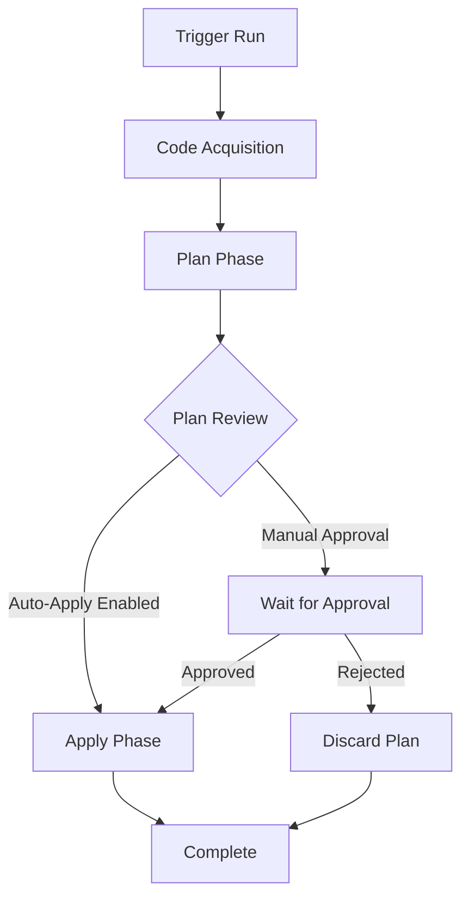

# Terraform Cloud Runs

## Introduction

Terraform Cloud Runs are a core feature of Terraform Cloud that automate and manage the execution of Terraform operations in a controlled, collaborative environment. When you work with infrastructure as code using Terraform locally, you typically run commands like `terraform plan` and `terraform apply` manually. Terraform Cloud Runs take these operations to a centralized platform, adding collaboration features, consistent execution environments, and governance capabilities.

In this guide, we'll explore how Terraform Cloud Runs work, the different types available, and how they fit into your infrastructure as code workflow. Whether you're a beginner just starting with Terraform or looking to scale your infrastructure management in a team setting, understanding Cloud Runs is essential for effectively using Terraform Cloud.

## What is a Terraform Cloud Run?

A "Run" in Terraform Cloud is a complete execution of a Terraform configuration against infrastructure, consisting of a plan phase and (optionally) an apply phase. Each run performs the following operations:

1. **Code Acquisition**: Terraform Cloud retrieves the Terraform configuration from your connected version control system (VCS) repository, module registry, or direct upload.
2. **Plan Phase**: Terraform analyzes your configuration and current state to determine what changes need to be made.
3. **Apply Phase**: If approved, Terraform makes the necessary infrastructure changes.

Let's visualize the Run workflow:



## Types of Terraform Cloud Runs

Terraform Cloud supports several types of runs, each serving different purposes in your workflow:

### 1. Plan-Only Runs

Plan-only runs execute just the planning phase without applying changes. These are useful for:
- Checking what changes would be made before committing
- Code reviews and compliance validation
- Previewing changes in pull requests

### 2. Apply Runs

Apply runs include both planning and applying phases, making actual changes to your infrastructure. These can be:
- **Auto-apply**: Changes are applied automatically after a successful plan
- **Manual apply**: Changes require explicit approval before being applied

### 3. Speculative Plans

Speculative plans are plan-only runs that don't affect the state file or lock workspace resources. They're typically used for:
- Pull request checks
- Testing configuration changes without risk
- Previewing effects of potential changes

## Triggering Terraform Cloud Runs

There are several ways to initiate a run in Terraform Cloud:

### VCS-Driven Workflow

The most common way to trigger runs is through your version control system:

```bash
# Make changes to your Terraform files
git add main.tf
git commit -m "Update EC2 instance type"
git push origin main
```

Once changes are pushed to your connected repository, Terraform Cloud automatically:
1. Detects the change to tracked files
2. Creates a new run
3. Executes the plan phase
4. Either auto-applies or waits for approval based on your workspace settings

### UI-Triggered Runs

You can manually start a run from the Terraform Cloud web interface:

1. Navigate to your workspace
2. Click the "Actions" dropdown
3. Select "Start new run"
4. Choose the run type and provide any necessary input variables

### API-Triggered Runs

For automation purposes, you can trigger runs using the Terraform Cloud API:

```bash
curl \
  --header "Authorization: Bearer $TOKEN" \
  --header "Content-Type: application/vnd.api+json" \
  --request POST \
  --data @payload.json \
  https://app.terraform.io/api/v2/runs
```

Where `payload.json` might look like:

```json
{
  "data": {
    "attributes": {
      "message": "Triggered via API"
    },
    "type": "runs",
    "relationships": {
      "workspace": {
        "data": {
          "type": "workspaces",
          "id": "ws-example123"
        }
      }
    }
  }
}
```

### CLI-Driven Runs

You can also use the Terraform CLI with Terraform Cloud backend:

```bash
# Initialize with cloud backend
terraform init

# Create a plan
terraform plan

# Apply changes
terraform apply
```

When configured to use Terraform Cloud, these commands will create remote runs instead of running locally.

## Anatomy of a Terraform Cloud Run

Let's break down what happens during a run and what information is available to you:

### Plan Phase

During the plan phase, Terraform Cloud:

1. Sets up a temporary execution environment
2. Installs the required Terraform version
3. Downloads your Terraform configuration
4. Initializes any modules and providers
5. Loads the current state from Terraform Cloud
6. Creates an execution plan

The output looks similar to running `terraform plan` locally:

```
Terraform used the selected providers to generate the following execution plan. Resource actions are indicated with the following symbols:
  + create

Terraform will perform the following actions:

  # aws_instance.example will be created
  + resource "aws_instance" "example" {
      + ami                          = "ami-0c55b159cbfafe1f0"
      + instance_type                = "t2.micro"
      + ...
    }

Plan: 1 to add, 0 to change, 0 to destroy.
```

### Apply Phase

During the apply phase (if approved), Terraform Cloud:

1. Sets up another temporary execution environment
2. Re-runs the plan to confirm it's still valid
3. Makes the actual infrastructure changes
4. Updates the state file in Terraform Cloud

The output is similar to running `terraform apply` locally:

```
aws_instance.example: Creating...
aws_instance.example: Creation complete after 40s [id=i-0123456789abcdef0]

Apply complete! Resources: 1 added, 0 changed, 0 destroyed.
```

## Run States and Transitions

A Terraform Cloud Run goes through several states during its lifecycle:

1. **Pending** - Waiting to be picked up by a worker
2. **Planning** - Executing the plan phase
3. **Planned** - Plan completed successfully, waiting for approval (if required)
4. **Applying** - Executing the apply phase
5. **Applied** - Successfully completed the apply phase
6. **Discarded** - The plan was manually discarded without applying
7. **Errored** - An error occurred during any phase

Understanding these states helps you track the progress of your infrastructure changes and troubleshoot any issues.

## Configuring Run Behavior

Terraform Cloud offers several configuration options to customize how runs behave:

### Auto-Apply Settings

You can configure workspaces to automatically apply changes without manual approval:

```hcl
terraform {
  cloud {
    organization = "my-org"
    
    workspaces {
      name = "my-workspace"
    }
  }
}
```

This is configured in the workspace settings, not directly in your Terraform configuration.

### Run Triggers

Run triggers allow runs in one workspace to automatically trigger runs in another workspace:

1. Navigate to your workspace settings
2. Go to the "Run Triggers" section
3. Select which source workspaces can trigger runs in this workspace

This is useful for managing dependencies between infrastructure components.

### Sentinel Policies

In Terraform Cloud for Business and Enterprise, you can enforce governance with Sentinel policies:

```hcl
# Example Sentinel policy to restrict EC2 instance types
import "tfplan"

allowed_types = ["t2.micro", "t2.small", "t2.medium"]

ec2_instances = filter tfplan.resource_changes as _, rc {
    rc.type is "aws_instance" and
    (rc.change.actions contains "create" or rc.change.actions is ["update"])
}

violation = rule {
    all ec2_instances as _, instance {
        instance.change.after.instance_type in allowed_types
    }
}

main = rule {
    violation
}
```

These policies run after the plan phase but before approval, providing an additional governance layer.

## Real-World Example: CI/CD Pipeline with Terraform Cloud Runs

Let's walk through a complete example of integrating Terraform Cloud Runs into a CI/CD pipeline:

### 1. Repository Structure

```
├── main.tf           # Main infrastructure code
├── variables.tf      # Variable definitions
├── outputs.tf        # Output definitions
├── environments/
│   ├── dev.tfvars    # Development environment variables
│   ├── staging.tfvars # Staging environment variables
│   └── prod.tfvars   # Production environment variables
└── modules/          # Reusable Terraform modules
```

### 2. GitHub Actions Workflow

```yaml
name: Terraform CI/CD

on:
  pull_request:
    branches: [ main ]
  push:
    branches: [ main ]

jobs:
  terraform:
    runs-on: ubuntu-latest
    steps:
      - name: Checkout
        uses: actions/checkout@v3

      - name: Setup Terraform
        uses: hashicorp/setup-terraform@v2
        with:
          cli_config_credentials_token: ${{ secrets.TF_API_TOKEN }}

      - name: Terraform Format
        run: terraform fmt -check

      - name: Terraform Init
        run: terraform init

      - name: Terraform Validate
        run: terraform validate

      # For pull requests, run speculative plan
      - name: Terraform Plan (PR)
        if: github.event_name == 'pull_request'
        run: terraform plan -var-file=environments/dev.tfvars
        
      # For pushes to main, trigger run in Terraform Cloud
      - name: Trigger Terraform Cloud Run (Push)
        if: github.event_name == 'push'
        run: |
          curl \
            --header "Authorization: Bearer ${{ secrets.TF_API_TOKEN }}" \
            --header "Content-Type: application/vnd.api+json" \
            --request POST \
            --data '{"data":{"attributes":{"message":"Triggered by GitHub Actions"},"type":"runs","relationships":{"workspace":{"data":{"type":"workspaces","id":"${{ secrets.TF_WORKSPACE_ID }}"}}}}}' \
            https://app.terraform.io/api/v2/runs
```

### 3. Terraform Cloud Workspace Configuration

1. Create three workspaces: `dev`, `staging`, and `prod`
2. Configure:
   - VCS connection to your repository
   - Environment variables for cloud provider credentials
   - Variable sets for environment-specific variables
   - Run triggers so changes to `dev` can trigger `staging` runs
   - Auto-apply for `dev`, but manual approval for `staging` and `prod`

### 4. Development Workflow

1. Developer creates a feature branch and makes changes
2. Opens pull request to `main`
3. GitHub Actions runs format check, validation, and speculative plan
4. Team reviews PR including the speculative plan output
5. Once approved and merged to `main`:
   - GitHub Actions triggers a run in the `dev` workspace
   - Changes are automatically applied to the dev environment
   - If successful, run is triggered in `staging` (requires approval)
   - After testing in staging, manually trigger a run in `prod`

This workflow gives you progressive deployment with appropriate safeguards for each environment.

## Best Practices for Terraform Cloud Runs

To get the most out of Terraform Cloud Runs, follow these best practices:

### 1. Use Workspaces Strategically

- Create separate workspaces for different environments (dev, staging, prod)
- Consider component-based workspaces for large infrastructures

### 2. Set Appropriate Run Approvals

- Enable auto-apply for development environments
- Require manual approvals for production environments

### 3. Leverage Run Triggers

- Set up run triggers to ensure dependent infrastructures are updated together
- Create a dependency graph that matches your infrastructure's real dependencies

### 4. Implement Comprehensive Testing

- Use speculative plans in pull requests
- Add automated tests for your Terraform code

### 5. Monitor Run Metrics

- Track run duration, success rates, and frequency
- Identify trends that might indicate configuration problems

### 6. Control Variable Values

- Use variable sets for shared credentials and secrets
- Set appropriate variable values per workspace

### 7. Implement Cost Estimation

If available in your Terraform Cloud tier:
- Enable cost estimation to preview cost changes
- Set up cost thresholds for approvals on significant changes

## Troubleshooting Common Issues

### Failed Runs Due to State Conflicts

If you encounter state conflicts where Terraform Cloud can't reconcile the current infrastructure with the state:

1. Review the detailed logs in the run output
2. Consider running a state refresh operation
3. In extreme cases, you might need to import resources or recreate the workspace

### Timeout Errors

For complex infrastructures, runs might time out:

1. Break your configuration into smaller workspaces
2. Optimize your providers and resource configurations
3. Consider increasing timeout limits if available in your tier

### Provider Authentication Issues

If runs fail due to provider authentication:

1. Verify environment variables are correctly set in the workspace
2. Check that service accounts have appropriate permissions
3. Ensure any temporary credentials haven't expired

## Summary

Terraform Cloud Runs provide a powerful way to automate, manage, and govern your infrastructure deployments. By understanding the different types of runs, how to trigger them, and best practices for their use, you can create efficient, reliable infrastructure deployment pipelines.

Key takeaways include:

- Terraform Cloud Runs automate the plan and apply workflow in a collaborative environment
- Different run types (plan-only, apply, speculative) serve different purposes in your workflow
- Runs can be triggered via VCS integration, the UI, API, or CLI
- Proper configuration of workspaces, run triggers, and approval settings creates an effective deployment pipeline
- Following best practices helps avoid common pitfalls and optimize your infrastructure management

## Additional Resources

To continue learning about Terraform Cloud Runs:

- Try creating different types of runs in a test workspace
- Experiment with setting up a complete CI/CD pipeline using the example provided
- Practice troubleshooting common issues by intentionally creating them in a safe environment

## Exercises

1. Create three workspaces (dev, staging, prod) and configure them with appropriate auto-apply settings and run triggers.
2. Set up a GitHub repository with a GitHub Actions workflow that triggers speculative plans on pull requests.
3. Implement a Sentinel policy that enforces tagging standards for your cloud resources.
4. Create a monitoring dashboard that tracks key metrics for your Terraform Cloud Runs.
5. Design a disaster recovery plan for your Terraform workspaces, including state backup strategies.