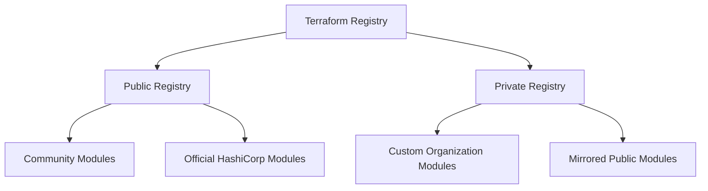

# Terraform Cloud Private Registry

## Introduction

The Terraform Cloud Private Registry is a powerful feature that allows organizations to store, version, and share their custom Terraform modules privately within their Terraform Cloud environment. This feature solves a common challenge in infrastructure-as-code practices: how to consistently distribute and reuse internal infrastructure modules across teams while maintaining security and governance.

In this guide, we'll explore what the Terraform Cloud Private Registry is, why it's valuable, and how to use it effectively in your infrastructure automation workflows. By the end, you'll understand how to publish modules to your private registry, consume them in your Terraform configurations, and implement best practices for module management.

## What is a Private Registry?

Before diving into the Terraform Cloud Private Registry specifically, let's understand what a registry is in the context of Terraform:



A Terraform Registry is a repository for Terraform modules. Modules are reusable, self-contained packages of Terraform configurations that can be used to create standardized infrastructure components.

The Terraform Cloud Private Registry extends this concept by providing:

1. **Private storage** for your organization's custom modules
2. **Version control** integration with Git repositories
3. **Access controls** aligned with your Terraform Cloud organization permissions
4. **Automatic documentation** generation from your module's README files
5. **Semantic versioning** support for module consumption

## Why Use a Private Registry?

Here are some key benefits of using the Terraform Cloud Private Registry:

- **Standardization**: Establish consistent, best-practice implementations for common infrastructure patterns
- **Security**: Share modules within your organization without exposing them publicly
- **Governance**: Implement and enforce infrastructure policies by providing approved modules
- **Efficiency**: Reduce duplicate effort by reusing tested infrastructure code
- **Collaboration**: Enable teams to work together on infrastructure components

## Setting Up Your Private Registry

Terraform Cloud includes the Private Registry feature with all paid plans. Let's walk through how to get started.

### Prerequisites

Before you begin, you'll need:

1. A Terraform Cloud account with a paid plan
2. Administrator permissions in your Terraform Cloud organization
3. A Git repository containing a Terraform module

### Publishing a Module to Your Private Registry

To publish a module to your Terraform Cloud Private Registry:

1. First, ensure your module follows the [standard module structure](https://www.terraform.io/language/modules/develop/structure):

```
my-module/
  ├── main.tf
  ├── variables.tf
  ├── outputs.tf
  ├── README.md
  └── examples/
      └── basic/
          ├── main.tf
          ├── variables.tf
          └── outputs.tf
```

2. Navigate to your Terraform Cloud organization and select the "Registry" tab from the main navigation.

3. Click the "+ Add Module" button.

4. Choose your version control provider (GitHub, GitLab, Bitbucket, or Azure DevOps) and select the repository containing your module.

5. Configure the module details:
   - **Module Name**: A name for your module (following the naming convention `terraform-provider-name`)
   - **Provider**: The primary provider used by your module
   - **Description**: A short description of what your module does

6. Click "Publish Module".

Once published, Terraform Cloud will automatically scan the repository and import any available versions (Git tags) as module versions.

### Using Semantic Versioning

For optimal module management, use semantic versioning (SemVer) in your Git tags:

- **Major version** (`X.y.z`): Breaking changes
- **Minor version** (`x.Y.z`): New features, backward compatible
- **Patch version** (`x.y.Z`): Bug fixes, backward compatible

Example Git commands to tag and push a new module version:

```bash
git tag -a "v1.0.0" -m "Initial stable release"
git push origin v1.0.0
```

## Using Modules from Your Private Registry

Once your modules are published, you can use them in your Terraform configurations. Here's how:

### Module Source Syntax

To reference a module from your private registry, use the following syntax:

```hcl
module "vpc" {
  source  = "app.terraform.io/your-organization/vpc/aws"
  version = "1.0.0"
  
  # Module input variables
  name   = "production-vpc"
  cidr   = "10.0.0.0/16"
  region = "us-west-2"
}
```

Let's break down this syntax:

- `app.terraform.io`: The Terraform Cloud hostname
- `your-organization`: Your Terraform Cloud organization name
- `vpc`: The module name
- `aws`: The provider name

### Authenticating to the Private Registry

When using modules from your private registry, Terraform needs to authenticate with Terraform Cloud. There are several ways to do this:

1. **CLI-driven workflow**: Run `terraform login` to authenticate the CLI
2. **Environment variable**: Set `TF_TOKEN_app_terraform_io` with your API token
3. **Terraform credentials block**:

```hcl
credentials "app.terraform.io" {
  token = "your-terraform-cloud-token"
}
```

### Managing Module Versions

Best practices for consuming modules include:

- Always specify a version constraint to ensure consistent infrastructure
- Use version constraints to control when you adopt new versions:

```hcl
module "vpc" {
  source  = "app.terraform.io/your-organization/vpc/aws"
  version = "~> 1.0.0"  # Allows patch updates but not minor or major
}
```

Common version constraint operators:

- `=1.0.0`: Exact version
- `>=1.0.0`: Version 1.0.0 or newer
- `~>1.0.0`: Any version in the 1.0.x range
- `>=1.0.0, <2.0.0`: Version 1.0.0 or newer, but less than 2.0.0

## Creating Effective Private Registry Modules

To create modules that are easy to use and maintain:

### Module Structure

Follow the standard structure:

```
my-module/
  ├── main.tf          # Main resources
  ├── variables.tf     # Input variables
  ├── outputs.tf       # Output values
  ├── versions.tf      # Required providers and versions
  ├── README.md        # Documentation
  └── examples/        # Example implementations
```

### Documentation

Document your module thoroughly in the README.md file:

1. **Description**: What does the module do?
2. **Requirements**: Required provider versions, Terraform version
3. **Providers**: Which providers does this module use?
4. **Inputs**: All module input variables and their descriptions
5. **Outputs**: All module outputs and their descriptions
6. **Examples**: Simple usage examples

Example of a well-documented `README.md`:

```markdown
# AWS VPC Terraform Module

This Terraform module creates a VPC in AWS with customizable CIDR blocks, subnets, and routing.

## Requirements

| Name | Version |
|------|---------|
| terraform | >= 1.0.0 |
| aws | >= 4.0.0 |

## Providers

| Name | Version |
|------|---------|
| aws | >= 4.0.0 |

## Inputs

| Name | Description | Type | Default | Required |
|------|-------------|------|---------|:--------:|
| name | Name of the VPC | `string` | n/a | yes |
| cidr | CIDR block for the VPC | `string` | n/a | yes |
| azs | List of availability zones | `list(string)` | `[]` | no |

## Outputs

| Name | Description |
|------|-------------|
| vpc_id | The ID of the VPC |
| subnet_ids | List of subnet IDs |

## Example Usage

```hcl
module "vpc" {
  source = "app.terraform.io/my-org/vpc/aws"
  version = "1.0.0"
  
  name = "production"
  cidr = "10.0.0.0/16"
  azs  = ["us-west-2a", "us-west-2b", "us-west-2c"]
}
```
```

Terraform Cloud will automatically generate documentation from your README.md file.

## Practical Example: Creating and Using a Basic AWS S3 Module

Let's walk through a complete example of creating an S3 bucket module, publishing it to your private registry, and then using it.

### Step 1: Create the Module Repository

First, create a repository with the following files:

**main.tf**:
```hcl
resource "aws_s3_bucket" "this" {
  bucket = var.bucket_name
  tags   = var.tags
}

resource "aws_s3_bucket_versioning" "this" {
  bucket = aws_s3_bucket.this.id
  
  versioning_configuration {
    status = var.enable_versioning ? "Enabled" : "Disabled"
  }
}

resource "aws_s3_bucket_server_side_encryption_configuration" "this" {
  bucket = aws_s3_bucket.this.id

  rule {
    apply_server_side_encryption_by_default {
      sse_algorithm = "AES256"
    }
  }
}
```

**variables.tf**:
```hcl
variable "bucket_name" {
  description = "Name of the S3 bucket to create"
  type        = string
}

variable "tags" {
  description = "Tags to apply to the bucket"
  type        = map(string)
  default     = {}
}

variable "enable_versioning" {
  description = "Enable versioning for the S3 bucket"
  type        = bool
  default     = false
}
```

**outputs.tf**:
```hcl
output "bucket_id" {
  description = "The ID of the S3 bucket"
  value       = aws_s3_bucket.this.id
}

output "bucket_arn" {
  description = "The ARN of the S3 bucket"
  value       = aws_s3_bucket.this.arn
}
```

**versions.tf**:
```hcl
terraform {
  required_version = ">= 1.0.0"
  
  required_providers {
    aws = {
      source  = "hashicorp/aws"
      version = ">= 4.0.0"
    }
  }
}
```

### Step 2: Publish the Module

1. Commit these files to your Git repository
2. Tag the repository with a version: `git tag v1.0.0`
3. Push the tag: `git push origin v1.0.0`
4. Navigate to your Terraform Cloud organization's Registry page
5. Click "Add Module" and select your repository
6. Complete the publishing process

### Step 3: Use the Module

Now you can use your module in a Terraform configuration:

```hcl
provider "aws" {
  region = "us-west-2"
}

module "storage_bucket" {
  source  = "app.terraform.io/your-organization/s3-bucket/aws"
  version = "1.0.0"
  
  bucket_name      = "my-secure-storage-bucket"
  enable_versioning = true
  
  tags = {
    Environment = "Production"
    Project     = "Data Lake"
  }
}

output "bucket_details" {
  value = {
    id  = module.storage_bucket.bucket_id
    arn = module.storage_bucket.bucket_arn
  }
}
```

When you run `terraform init`, Terraform will download the module from your private registry.

## Managing Module Access

The Terraform Cloud Private Registry integrates with your organization's team permissions:

1. **Organization owners** can publish, update, and delete modules
2. **Team permissions** determine who can use modules in their workspaces
3. **Module visibility** can be set to:
   - **Private**: Only your organization can access it
   - **Public**: Available to everyone (when enabled by organization settings)

To manage permissions:

1. Go to your organization settings
2. Navigate to "Teams"
3. Configure the appropriate permissions for each team

## Advanced Features

### Module Testing

To ensure module quality, implement automated testing:

1. Use [Terratest](https://github.com/gruntwork-io/terratest) for integration testing
2. Implement CI/CD pipelines to test modules before publishing

Example `.github/workflows/test.yml` for GitHub Actions:

```yaml
name: Test Terraform Module

on:
  push:
    branches: [ main ]
  pull_request:
    branches: [ main ]

jobs:
  test:
    runs-on: ubuntu-latest
    steps:
    - uses: actions/checkout@v3
    - name: Setup Terraform
      uses: hashicorp/setup-terraform@v2
      with:
        terraform_version: 1.0.0
    
    - name: Terraform Init
      run: terraform init
      working-directory: ./examples/basic
    
    - name: Terraform Validate
      run: terraform validate
      working-directory: ./examples/basic
    
    - name: Terraform Format Check
      run: terraform fmt -check -recursive
```

### Private Module Dependencies

Modules can reference other modules from your private registry:

```hcl
module "network" {
  source  = "app.terraform.io/your-organization/network/aws"
  version = "1.0.0"
  # ...
}
```

This allows you to build a hierarchy of modules for complex infrastructure.

## Troubleshooting

Common issues and solutions:

### Module Not Found

If you encounter a "module not found" error:

1. Verify the module path is correct (`app.terraform.io/org/name/provider`)
2. Check your authentication credentials
3. Confirm you have access to the module

### Version Constraint Errors

If you see version constraint errors:

1. Verify the version exists in the registry
2. Check your constraint syntax
3. Consider using looser constraints during development (`~>` instead of `=`)

## Summary

The Terraform Cloud Private Registry provides a powerful way to share and reuse infrastructure code within your organization. By creating well-structured, documented modules and publishing them to your private registry, you can:

- Standardize infrastructure patterns
- Improve team productivity
- Implement governance at scale
- Reduce errors through code reuse

As your organization's infrastructure grows, the private registry becomes increasingly valuable, serving as a central repository of trusted, tested infrastructure components.

## Additional Resources

To learn more about the Terraform Cloud Private Registry:

- [Terraform Cloud Documentation](https://www.terraform.io/cloud-docs/registry)
- [Module Development Guide](https://www.terraform.io/language/modules/develop)
- [Standard Module Structure](https://www.terraform.io/language/modules/develop/structure)

## Exercises

To practice using the Terraform Cloud Private Registry:

1. Create a simple module for a common resource you use (e.g., S3 bucket, VPC, security group)
2. Publish it to your private registry
3. Use the module in a workspace configuration
4. Update the module with a new feature and publish a new version
5. Update your configuration to use the new version