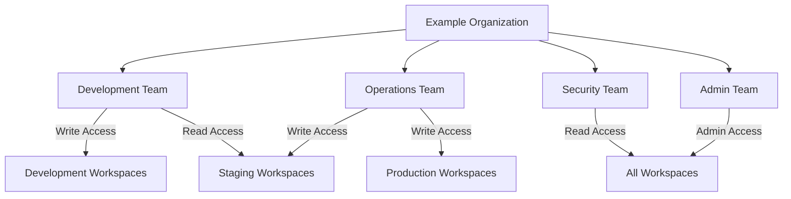

# Terraform Cloud Teams

## Introduction

Terraform Cloud Teams provide a powerful way to organize users and manage access permissions in your Terraform Cloud organization. Teams are collections of users that can be granted specific permissions to workspaces and other resources, allowing for fine-grained access control and better collaboration within your infrastructure as code workflow.

In this guide, we'll explore how teams work in Terraform Cloud, how to create and manage them, and how to implement effective team-based access control strategies for your organization.

## Understanding Teams in Terraform Cloud

Teams are a fundamental component of Terraform Cloud's organizational model. They serve as the primary mechanism for managing permissions and access controls across your organization's resources.

### Key Concepts

- **Organizations**: The top-level entity in Terraform Cloud that represents your company or group
- **Teams**: Collections of users within an organization
- **Workspaces**: Environments where Terraform configurations are executed
- **Team Permissions**: Access rights granted to teams for specific workspaces

Teams allow you to group users according to their roles, departments, or responsibilities, making it easier to manage who can do what with your infrastructure resources.

## Team Types in Terraform Cloud

Terraform Cloud includes several built-in team types with predefined permission sets:

| Team Type | Description | Default Permissions |
|-----------|-------------|---------------------|
| Owners | Organization administrators | Full control over the organization |
| Organization API | Used for API-driven operations | Organization-wide read access and the ability to create workspaces |
| Custom Teams | User-defined teams | No permissions by default (assigned manually) |

## Creating and Managing Teams

Let's look at how to create and manage teams in Terraform Cloud:

### Creating a New Team

1. Navigate to your organization in Terraform Cloud
2. Select "Teams" from the organization settings menu
3. Click "Create a team"
4. Enter the team name and optional description
5. Choose team members from your organization

Here's how you'd create a team using the Terraform Cloud API:

```hcl
# Using the tfe provider to create a team
resource "tfe_team" "developers" {
  name         = "developers"
  organization = "example-org"
  visibility   = "organization"
}
```

### Adding Users to a Team

Once you've created a team, you can add users:

```hcl
# Adding a user to the developers team
resource "tfe_team_member" "dev_user" {
  team_id  = tfe_team.developers.id
  username = "developer.username"
}
```

## Team Access Control

The real power of teams comes from their ability to manage access control to workspaces. Let's explore how this works.

### Workspace Access Levels

Teams can be granted the following access levels to workspaces:

- **Read**: View the workspace, states, and runs
- **Plan**: Read access plus the ability to queue plans
- **Write**: Plan access plus the ability to apply runs
- **Admin**: Full control over the workspace

### Assigning Team Access

To assign a team access to a workspace:

```hcl
# Granting the developers team write access to a workspace
resource "tfe_team_access" "dev_access" {
  team_id      = tfe_team.developers.id
  workspace_id = tfe_workspace.example.id
  permissions {
    runs = "apply"
    variables = "write"
    state_versions = "read"
    sentinel_mocks = "read"
    workspace_locking = true
  }
}
```

## Team Organization Patterns

Let's explore some common patterns for organizing teams in Terraform Cloud:

### Functional Teams

Organize teams based on job functions:

- **Platform Team**: Administers Terraform Cloud and sets standards
- **Developers**: Creates and updates application infrastructure
- **Security**: Reviews and approves security-related changes
- **Operations**: Monitors and maintains deployed infrastructure

### Project-Based Teams

Organize teams around specific projects or products:

- **Project Alpha Team**: Manages resources for Project Alpha
- **Project Beta Team**: Manages resources for Project Beta

### Hybrid Approach

Combine functional and project-based approaches:

- **Project Alpha Developers**
- **Project Alpha Operations**
- **Project Beta Developers**
- **Project Beta Operations**

## Real-World Example: Multi-Environment Access Control

Let's look at a practical example of using teams to manage access across development, staging, and production environments:



### Implementation with Terraform

```hcl
# Define three workspaces for different environments
resource "tfe_workspace" "development" {
  name         = "app-development"
  organization = "example-org"
}

resource "tfe_workspace" "staging" {
  name         = "app-staging"
  organization = "example-org"
}

resource "tfe_workspace" "production" {
  name         = "app-production"
  organization = "example-org"
}

# Create teams
resource "tfe_team" "developers" {
  name         = "developers"
  organization = "example-org"
}

resource "tfe_team" "operations" {
  name         = "operations"
  organization = "example-org"
}

resource "tfe_team" "security" {
  name         = "security"
  organization = "example-org"
}

# Assign access permissions
resource "tfe_team_access" "dev_access_dev" {
  team_id      = tfe_team.developers.id
  workspace_id = tfe_workspace.development.id
  permissions {
    runs = "apply"
    variables = "write"
  }
}

resource "tfe_team_access" "dev_access_staging" {
  team_id      = tfe_team.developers.id
  workspace_id = tfe_workspace.staging.id
  permissions {
    runs = "read"
    variables = "read"
  }
}

resource "tfe_team_access" "ops_access_staging" {
  team_id      = tfe_team.operations.id
  workspace_id = tfe_workspace.staging.id
  permissions {
    runs = "apply"
    variables = "write"
  }
}

resource "tfe_team_access" "ops_access_prod" {
  team_id      = tfe_team.operations.id
  workspace_id = tfe_workspace.production.id
  permissions {
    runs = "apply"
    variables = "write"
  }
}

resource "tfe_team_access" "security_access_all" {
  team_id      = tfe_team.security.id
  workspace_id = tfe_workspace.development.id
  permissions {
    runs = "read"
  }
}

# Repeat for staging and production workspaces for security team
```

## Team API Access Management

Teams also play an important role in API token management. Each team in Terraform Cloud can have its own API token, which allows for programmatic access to resources the team has permissions for.

### Creating a Team API Token

To create a team API token through the UI:

1. Navigate to the team settings
2. Select "API Token"
3. Click "Generate Token"
4. Save the token securely

Using the token in your Terraform configuration:

```hcl
provider "tfe" {
  token = var.team_api_token
}
```

## Best Practices for Team Management

Here are some best practices to follow when managing teams in Terraform Cloud:

1. **Follow the Principle of Least Privilege**: Grant teams only the permissions they need to do their jobs
2. **Use Descriptive Team Names**: Names should clearly indicate the team's purpose
3. **Document Team Purposes**: Maintain documentation about what each team is responsible for
4. **Review Team Memberships Regularly**: Periodically audit team memberships to remove users who no longer need access
5. **Use Service Accounts Judiciously**: For automation, create dedicated service accounts rather than using personal accounts
6. **Implement Team Hierarchies Where Appropriate**: Use nested team structures for complex organizations

## Terraform Cloud Teams vs. Terraform Enterprise Teams

If you're considering Terraform Enterprise, here's how teams differ between the two offerings:

| Feature | Terraform Cloud | Terraform Enterprise |
|---------|----------------|----------------------|
| Basic Team Management | ✓ | ✓ |
| Custom Team Types | Limited | Enhanced |
| SAML Team Mapping | Available in Business tier | ✓ |
| SSO Integration | Available in Business tier | Enhanced |
| Nested Teams | Limited | Enhanced |

## Troubleshooting Team Access Issues

Common issues with team access and their solutions:

1. **User Cannot Access Workspace**
   - Verify the user is a member of the appropriate team
   - Check that the team has been granted access to the workspace
   - Ensure the permission level is correct

2. **Permission Denied for Specific Actions**
   - Verify the team has the necessary permission level
   - Check if there are conflicting permissions from multiple team memberships

3. **API Token Not Working**
   - Ensure the team's API token is valid and not expired
   - Verify the team has appropriate permissions

## Summary

Terraform Cloud Teams provide a flexible and powerful system for managing access control in your infrastructure as code workflow. By organizing users into teams with appropriate permissions, you can implement the principle of least privilege while still enabling efficient collaboration.

Key takeaways:

- Teams are collections of users with shared permissions
- Different access levels can be assigned to teams for different workspaces
- Team organization should reflect your company's structure and needs
- Best practices include using descriptive names and following least privilege principles

## Additional Resources

To continue learning about Terraform Cloud Teams, consider exploring:

- Terraform Cloud documentation on teams and access control
- HashiCorp Learn tutorials on Terraform Cloud
- The Terraform Cloud API documentation for programmatic team management

## Exercises

1. Create a team structure for a hypothetical company with development, operations, and security departments
2. Implement workspace access controls for development, staging, and production environments
3. Write a Terraform configuration to automate the creation of your team structure
4. Develop a policy for handling team membership changes when employees join or leave