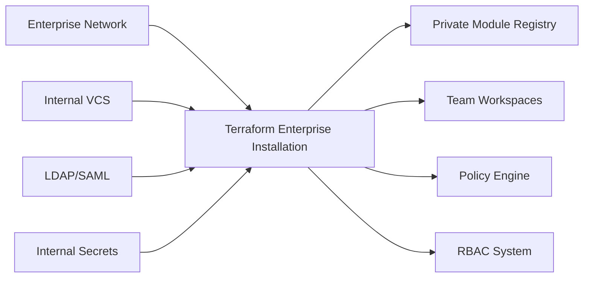
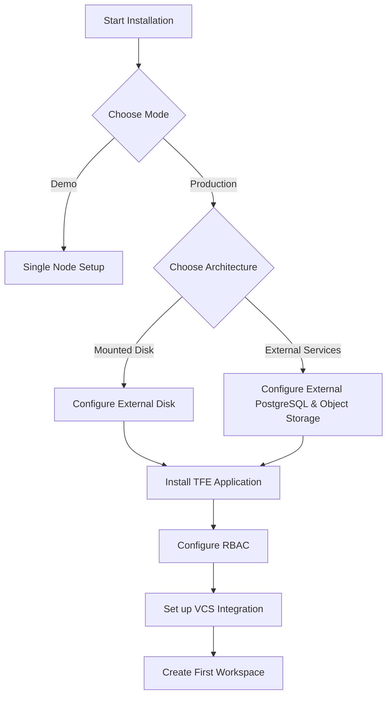
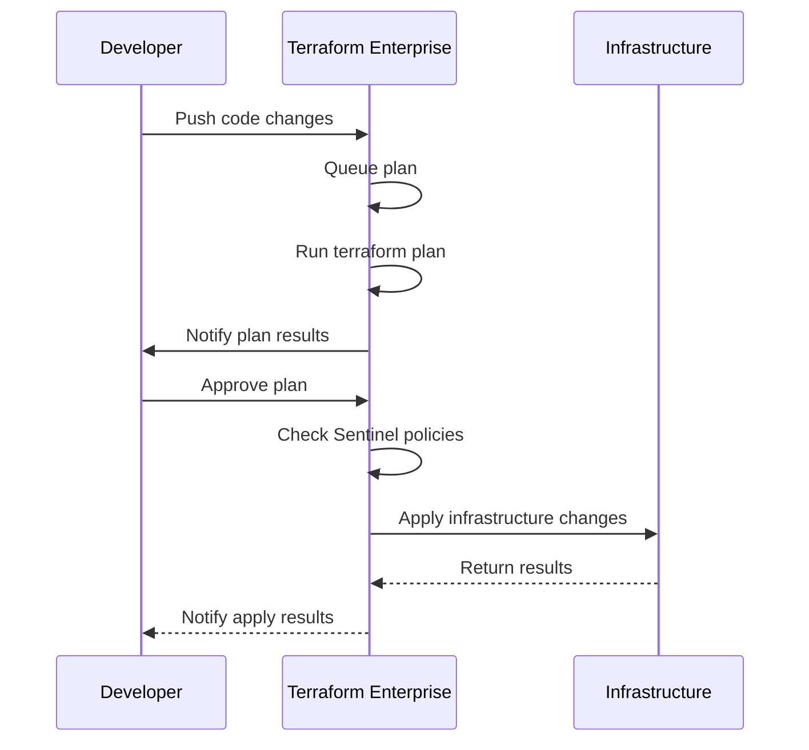

# Terraform Enterprise

## Introduction

Terraform Enterprise is HashiCorp's self-hosted distribution of Terraform Cloud, providing organizations with a private instance of the Terraform Cloud application that can be deployed in their own infrastructure environments. It extends the capabilities of open-source Terraform with features specifically designed for team collaboration, governance, and operational stability in enterprise environments.

While open-source Terraform is a powerful tool for infrastructure as code, Terraform Enterprise addresses the unique challenges that larger organizations face when implementing infrastructure automation at scale:

* **Team Collaboration**: Centralized state management and workspaces
* **Security**: Role-based access control and private module registry
* **Governance**: Policy enforcement and cost estimation
* **Reliability**: High availability configurations and enterprise-grade support

This guide will walk you through the key concepts, features, and implementation strategies for Terraform Enterprise to help you understand how it can benefit your organization's infrastructure management practices.

## Key Features of Terraform Enterprise

### Private Installation

Unlike Terraform Cloud which is a SaaS offering, Terraform Enterprise can be installed in your own data center or cloud environment, allowing you to:

* Meet strict data sovereignty requirements
* Operate in air-gapped environments
* Integrate with existing internal systems
* Control upgrade cycles according to your organizational policies



### Collaborative Workspaces

Terraform Enterprise organizes infrastructure into workspaces, which function as discrete environments for managing specific collections of infrastructure:

* Each workspace contains its own state file
* Teams can collaborate on infrastructure changes
* Changes can be tracked, audited, and rolled back if needed

Here's an example of how to set up workspace variables for different environments:

```hcl
# Development Workspace Variables
region = "us-west-2"
instance_type = "t2.micro"
environment = "development"

# Production Workspace Variables
region = "us-east-1"
instance_type = "m5.large"
environment = "production"
```

### Private Module Registry

Terraform Enterprise includes a private module registry that allows teams to:

* Share and reuse Terraform code across the organization
* Implement version control for infrastructure modules
* Enforce standardization and best practices

Here's how to reference a module from your private registry:

```hcl
module "vpc" {
  source = "app.terraform.io/your-organization/vpc/aws"
  version = "1.2.0"
  
  vpc_name = "production-vpc"
  cidr_block = "10.0.0.0/16"
  azs = ["us-east-1a", "us-east-1b", "us-east-1c"]
}
```

### Role-Based Access Control (RBAC)

Terraform Enterprise provides granular access control to ensure proper governance:

* User management with role assignments
* Team-based permissions
* Workspace-level access policies
* Organization-wide policies

### Sentinel Policy as Code

One of the most powerful features of Terraform Enterprise is Sentinel, a policy as code framework that enforces governance rules across your infrastructure:

```hcl
import "tfplan"

# Rule: Ensure all EC2 instances have tags
ec2_instances = filter tfplan.resource_changes as _, rc {
    rc.type is "aws_instance" and
    (rc.change.actions contains "create" or rc.change.actions contains "update")
}

mandatory_tags = ["Name", "Environment", "Owner"]

tag_validation = rule {
    all ec2_instances as _, instance {
        all mandatory_tags as tag {
            instance.change.after.tags contains tag
        }
    }
}

main = rule {
    tag_validation
}
```

This policy ensures that all EC2 instances have required tags before the infrastructure can be provisioned.

## Setting Up Terraform Enterprise

### Installation Requirements

Terraform Enterprise can be deployed in several ways:

* On-premises with Kubernetes or VMs
* On major cloud providers (AWS, Azure, GCP)

Minimum system requirements:
* 4 CPU cores
* 16 GB RAM
* 50 GB disk space
* Linux operating system

### Installation Modes

Terraform Enterprise supports three installation modes:

1. **Demo**: Single-node installation for testing
2. **Mounted Disk**: Production setup with external disk storage
3. **External Services**: Production setup with external PostgreSQL and object storage

Here's a simplified setup flow:



### Basic Configuration

After installation, you'll need to configure:

1. Admin user account
2. SMTP settings for notifications
3. VCS integration (GitHub, GitLab, Bitbucket, etc.)
4. SAML or LDAP authentication (optional)

## Working with Terraform Enterprise

### Creating and Managing Workspaces

To create a new workspace in Terraform Enterprise:

1. Navigate to your organization
2. Click "New Workspace"
3. Select your Version Control System
4. Choose a repository and branch
5. Configure workspace settings

Workspace operations can be managed through the UI or via the Terraform Enterprise API:

```bash
# Create a new workspace using the API
curl \
  --header "Authorization: Bearer $TOKEN" \
  --header "Content-Type: application/vnd.api+json" \
  --request POST \
  --data @payload.json \
  https://your-tfe-address/api/v2/organizations/your-org/workspaces
```

Where `payload.json` might contain:

```json
{
  "data": {
    "attributes": {
      "name": "my-new-workspace",
      "terraform-version": "1.5.0",
      "vcs-repo": {
        "identifier": "your-org/your-repo",
        "oauth-token-id": "ot-abcdefg123456",
        "branch": "main"
      }
    },
    "type": "workspaces"
  }
}
```

### Running Terraform Operations

Terraform Enterprise executes plans and applies in a consistent, controlled environment:

1. **Queue Plan**: Triggered by VCS changes, API calls, or UI actions
2. **Plan Phase**: Terraform generates an execution plan
3. **Policy Check**: Sentinel policies are evaluated against the plan
4. **Apply Phase**: If approved, changes are applied to infrastructure

The workflow looks like this:



### Implementing Governance with Sentinel

To implement policy-as-code with Sentinel:

1. Navigate to your organization settings
2. Go to "Policy Sets"
3. Create a new policy set connected to a VCS repository
4. Configure enforcement levels (advisory, soft-mandatory, hard-mandatory)

Example Sentinel policy to restrict AWS regions:

```hcl
# allowed-regions.sentinel
import "tfplan"

# Get all AWS resources from the plan
get_aws_resources = func() {
    aws_resources = filter tfplan.resource_changes as _, rc {
        rc.provider_name matches "^aws$" and
        (rc.change.actions contains "create" or rc.change.actions contains "update")
    }
    return aws_resources
}

# List of allowed AWS regions
allowed_regions = [
    "us-east-1",
    "us-east-2",
    "us-west-2",
]

# Rule to check if all AWS resources use allowed regions
aws_region_allowed = rule {
    all get_aws_resources() as _, resource {
        resource.change.after.region in allowed_regions
    }
}

# Main rule
main = rule {
    aws_region_allowed
}
```

### Using the Private Module Registry

To publish a module to the private registry:

1. Create a Git repository following the Terraform module structure
2. Tag versions using semantic versioning (e.g., v1.0.0)
3. In Terraform Enterprise, go to "Registry" and add the module
4. Reference it in your configurations as shown earlier

A basic module structure looks like:

```
my-aws-vpc/
  ├── README.md
  ├── main.tf
  ├── variables.tf
  ├── outputs.tf
  └── examples/
      └── simple/
          └── main.tf
```

### Cost Estimation

Terraform Enterprise can provide cost estimates for infrastructure changes before they're applied:

1. Enable cost estimation in workspace settings
2. Configure provider credentials for cost APIs
3. View estimated costs during the plan phase

## Enterprise Features

### High Availability

For mission-critical environments, Terraform Enterprise offers high availability configurations:

* Multiple application nodes
* Load balancing
* Database replication
* Automated failover

### External Audit Logging

Configure comprehensive logging to meet compliance requirements:

```hcl
# Example TFE configuration for audit logging
{
  "logging": {
    "level": "INFO",
    "syslog_enabled": true,
    "syslog_facility": "LOCAL0",
    "syslog_host": "log-aggregator.example.com",
    "syslog_port": 514
  }
}
```

### Single Sign-On

Terraform Enterprise integrates with major identity providers:

* Okta
* Azure AD
* OneLogin
* Custom SAML providers
* LDAP

### Air-Gapped Environments

For high-security environments, Terraform Enterprise can run completely disconnected from the internet:

* Offline provider installation
* Internal module registry
* Custom run environments

## Integrating with CI/CD Pipelines

Terraform Enterprise can be integrated into existing CI/CD workflows:

```bash
# Example: Triggering a run from CI/CD
curl \
  --header "Authorization: Bearer $TOKEN" \
  --header "Content-Type: application/vnd.api+json" \
  --request POST \
  --data @payload.json \
  https://your-tfe-address/api/v2/runs
```

With a payload like:

```json
{
  "data": {
    "attributes": {
      "message": "Triggered from CI pipeline"
    },
    "type":"runs",
    "relationships": {
      "workspace": {
        "data": {
          "type": "workspaces",
          "id": "ws-123456"
        }
      }
    }
  }
}
```

## Comparing Terraform Enterprise and Terraform Cloud

| Feature | Terraform Cloud | Terraform Enterprise |
|---------|----------------|----------------------|
| Hosting | SaaS | Self-hosted |
| Compliance | HashiCorp managed | Customer managed |
| Single Sign-On | Business tier | Included |
| Air-gapped operation | No | Yes |
| Support | Tiered | Enterprise-grade |
| Custom run environments | Limited | Full support |
| Audit logging | Limited | Comprehensive |
| High availability | HashiCorp managed | Customer configurable |

## Best Practices

### Organization Structure

* Create logical organization boundaries
* Use workspaces for environment separation (dev, staging, prod)
* Implement naming conventions for all resources

### Security

* Implement least-privilege access policies
* Regularly rotate credentials
* Use Vault integration for secrets management
* Enable two-factor authentication
* Review audit logs regularly

### Module Development

* Follow the standard module structure
* Include comprehensive documentation
* Write automated tests
* Version modules semantically
* Publish reusable components to the private registry

### Governance

* Start with advisory policies and progress to enforcement
* Create policy sets for different resource types and environments
* Document policy rationales
* Use parameterized policies for flexibility

## Common Challenges and Solutions

### Migration from Open Source

When migrating from open-source Terraform to Terraform Enterprise:

1. Import existing state files into workspaces
2. Refactor configurations to use remote state
3. Implement gradual governance policies

```hcl
# Example of state migration
terraform state pull > current-state.tfstate

# Then use the TFE API to import the state to a workspace
```

### Managing Large State Files

For very large infrastructures:

* Split state into smaller logical units
* Use workspaces strategically
* Consider read replicas for state
* Implement state performance monitoring

### Team Onboarding

To effectively onboard teams:

* Create role-based documentation
* Develop training materials
* Start with simpler workspaces
* Implement a module request process
* Establish an internal support system

## Summary

Terraform Enterprise provides a robust, secure, and collaborative platform for managing infrastructure as code in enterprise environments. Its key advantages include:

* Private, self-hosted installation options
* Team-based collaboration with workspaces
* Governance through policy as code
* Private module registry for code reuse
* Advanced security features including RBAC and audit logging
* Integrations with enterprise systems

By implementing Terraform Enterprise, organizations can standardize infrastructure practices, enforce compliance, accelerate development, and reduce operational risk.

## Additional Resources

* [Official Terraform Enterprise Documentation](https://www.terraform.io/enterprise)
* [HashiCorp Learn - Terraform Enterprise](https://learn.hashicorp.com/terraform)
* [Terraform Enterprise API Documentation](https://www.terraform.io/docs/cloud/api/index.html)

## Exercises

1. **Basic Setup**: Design a workspace structure for a typical three-tier application with development, staging, and production environments.

2. **Policy Creation**: Write a Sentinel policy that ensures all AWS resources are properly tagged with department and project tags.

3. **Module Development**: Create a reusable network module for your organization and publish it to the private module registry.

4. **Integration Exercise**: Set up a CI/CD pipeline that triggers Terraform Enterprise runs when infrastructure code changes.

5. **Migration Planning**: Create a migration plan to move existing infrastructure managed by open-source Terraform to Terraform Enterprise.