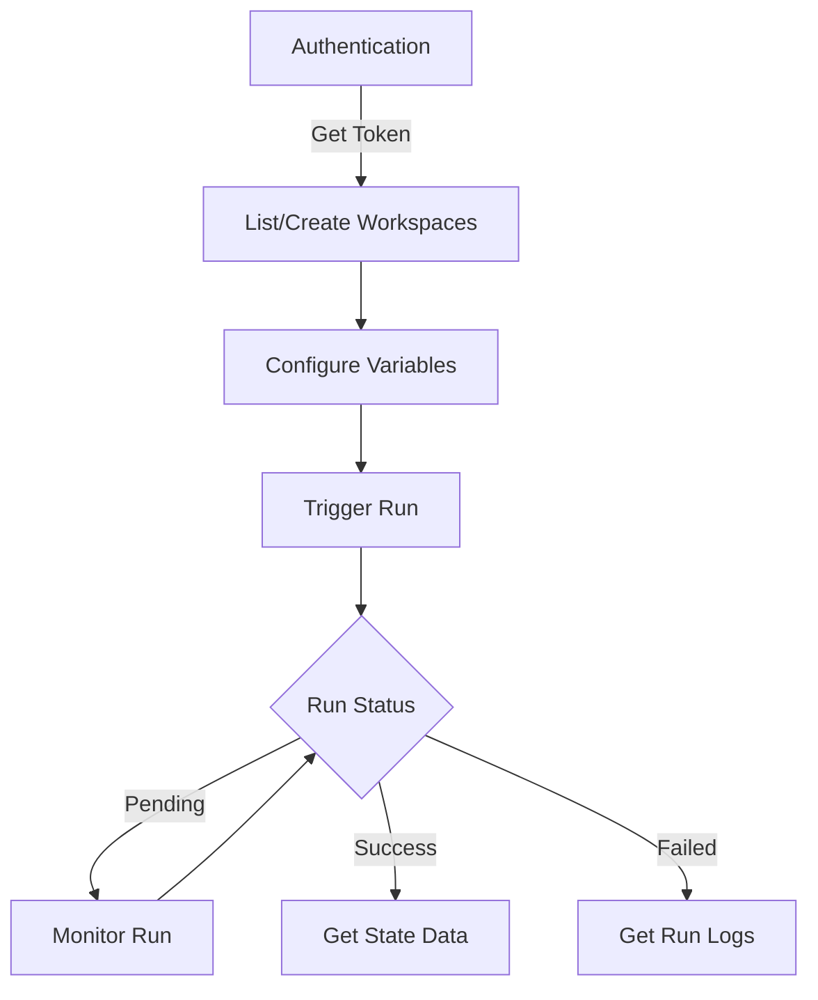

# Terraform Cloud API

## Introduction

The Terraform Cloud API provides a programmatic interface to Terraform Cloud, allowing you to automate and integrate your infrastructure management workflows with other tools and systems. This API follows REST principles and uses JSON for data formatting, making it accessible from virtually any programming language or automation tool.

Whether you need to create workspaces, manage variables, trigger runs, or retrieve state data, the Terraform Cloud API gives you the flexibility to interact with all aspects of Terraform Cloud programmatically rather than through the web interface.

## API Basics

### Authentication

Before making any API requests, you'll need to authenticate. Terraform Cloud API supports authentication using tokens:

```bash
curl \
  --header "Authorization: Bearer $TOKEN" \
  --header "Content-Type: application/vnd.api+json" \
  https://app.terraform.io/api/v2/organizations
```

You can generate API tokens in two ways:

1. **User tokens**: Created in your user settings, these tokens have the same permissions as your user account
2. **Team tokens**: Associated with a specific team in your organization, with that team's permissions

### API URL Structure

The Terraform Cloud API follows a consistent URL structure:

```
https://app.terraform.io/api/v2/{resource}/{resource_id}/{sub-resource}
```

For example:
- List all workspaces: `https://app.terraform.io/api/v2/organizations/{org_name}/workspaces`
- Get workspace details: `https://app.terraform.io/api/v2/workspaces/{workspace_id}`

### Request and Response Format

The API uses JSON API specification for both requests and responses:

```bash
# Request example
curl \
  --header "Authorization: Bearer $TOKEN" \
  --header "Content-Type: application/vnd.api+json" \
  --request GET \
  https://app.terraform.io/api/v2/organizations/my-organization/workspaces
```

Response example:

```json
{
  "data": [
    {
      "id": "ws-cZE9LERN34XuzWjr",
      "type": "workspaces",
      "attributes": {
        "name": "my-workspace",
        "created-at": "2020-05-12T15:48:00.000Z",
        "terraform-version": "0.12.24"
        // more attributes...
      }
    }
    // more workspaces...
  ]
}
```

## Common API Operations

Let's explore some common operations you might perform with the Terraform Cloud API.

### Managing Workspaces

#### Create a Workspace

```bash
curl \
  --header "Authorization: Bearer $TOKEN" \
  --header "Content-Type: application/vnd.api+json" \
  --request POST \
  --data @payload.json \
  https://app.terraform.io/api/v2/organizations/my-organization/workspaces
```

With `payload.json` containing:

```json
{
  "data": {
    "type": "workspaces",
    "attributes": {
      "name": "my-new-workspace",
      "terraform-version": "1.0.0",
      "description": "Created via API"
    }
  }
}
```

Response:

```json
{
  "data": {
    "id": "ws-SihZTyXKfNXUWuUa",
    "type": "workspaces",
    "attributes": {
      "name": "my-new-workspace",
      "terraform-version": "1.0.0",
      "description": "Created via API"
      // more attributes...
    }
  }
}
```

#### List All Workspaces

```bash
curl \
  --header "Authorization: Bearer $TOKEN" \
  --header "Content-Type: application/vnd.api+json" \
  --request GET \
  https://app.terraform.io/api/v2/organizations/my-organization/workspaces
```

### Managing Variables

Variables in Terraform Cloud can be managed via API, which is especially useful for automation.

#### Create a Variable

```bash
curl \
  --header "Authorization: Bearer $TOKEN" \
  --header "Content-Type: application/vnd.api+json" \
  --request POST \
  --data @var-payload.json \
  https://app.terraform.io/api/v2/workspaces/ws-SihZTyXKfNXUWuUa/vars
```

With `var-payload.json` containing:

```json
{
  "data": {
    "type": "vars",
    "attributes": {
      "key": "database_password",
      "value": "supersecret",
      "category": "terraform",
      "hcl": false,
      "sensitive": true
    }
  }
}
```

### Triggering Runs

One of the most common operations is triggering a Terraform run programmatically:

```bash
curl \
  --header "Authorization: Bearer $TOKEN" \
  --header "Content-Type: application/vnd.api+json" \
  --request POST \
  --data @run-payload.json \
  https://app.terraform.io/api/v2/runs
```

With `run-payload.json` containing:

```json
{
  "data": {
    "type": "runs",
    "attributes": {
      "message": "Run triggered via API"
    },
    "relationships": {
      "workspace": {
        "data": {
          "type": "workspaces",
          "id": "ws-SihZTyXKfNXUWuUa"
        }
      }
    }
  }
}
```

## Practical Examples

Let's walk through some practical examples that demonstrate how to use the Terraform Cloud API in real-world scenarios.

### Example 1: Automating Workspace Creation in CI/CD

This example shows how to create a workspace automatically as part of a CI/CD pipeline:

```bash
#!/bin/bash

# Input parameters
ORG_NAME="my-organization"
WORKSPACE_NAME="project-${CI_PROJECT_NAME}-${CI_ENVIRONMENT_NAME}"
TERRAFORM_VERSION="1.1.0"

# Create JSON payload
cat > payload.json << EOF
{
  "data": {
    "type": "workspaces",
    "attributes": {
      "name": "${WORKSPACE_NAME}",
      "terraform-version": "${TERRAFORM_VERSION}",
      "description": "Auto-created by CI for ${CI_PROJECT_NAME}",
      "auto-apply": true
    }
  }
}
EOF

# Send API request
curl \
  --header "Authorization: Bearer ${TF_API_TOKEN}" \
  --header "Content-Type: application/vnd.api+json" \
  --request POST \
  --data @payload.json \
  https://app.terraform.io/api/v2/organizations/${ORG_NAME}/workspaces

# Clean up
rm payload.json
```

### Example 2: Retrieving State Data

This example demonstrates how to extract state data for integration with other systems:

```python
import requests
import json

# Configuration
api_token = "YOUR_API_TOKEN"
org_name = "my-organization"
workspace_name = "production-infrastructure"

# Set up headers
headers = {
    "Authorization": f"Bearer {api_token}",
    "Content-Type": "application/vnd.api+json"
}

# Get workspace ID
workspace_url = f"https://app.terraform.io/api/v2/organizations/{org_name}/workspaces/{workspace_name}"
workspace_response = requests.get(workspace_url, headers=headers)
workspace_data = workspace_response.json()
workspace_id = workspace_data["data"]["id"]

# Get current state version
state_url = f"https://app.terraform.io/api/v2/workspaces/{workspace_id}/current-state-version"
state_version_response = requests.get(state_url, headers=headers)
state_version_data = state_version_response.json()
state_file_url = state_version_data["data"]["attributes"]["hosted-state-download-url"]

# Download state file
state_response = requests.get(state_file_url)
state_data = state_response.json()

# Now you can extract and use specific outputs
outputs = state_data["outputs"]
print(f"Database endpoint: {outputs['db_endpoint']['value']}")
print(f"Load balancer address: {outputs['lb_address']['value']}")
```

### Example 3: Setting Multiple Variables at Once

This Python script demonstrates how to set multiple variables for a workspace:

```python
import requests
import json

# Configuration
api_token = "YOUR_API_TOKEN"
workspace_id = "ws-SihZTyXKfNXUWuUa"

# Variables to set
variables = [
    {"key": "region", "value": "us-west-2", "category": "terraform", "sensitive": False},
    {"key": "environment", "value": "staging", "category": "terraform", "sensitive": False},
    {"key": "db_username", "value": "admin", "category": "terraform", "sensitive": False},
    {"key": "db_password", "value": "super-secret-password", "category": "terraform", "sensitive": True}
]

# Set up headers
headers = {
    "Authorization": f"Bearer {api_token}",
    "Content-Type": "application/vnd.api+json"
}

# Create each variable
for var in variables:
    payload = {
        "data": {
            "type": "vars",
            "attributes": {
                "key": var["key"],
                "value": var["value"],
                "category": var["category"],
                "sensitive": var["sensitive"]
            }
        }
    }
    
    response = requests.post(
        f"https://app.terraform.io/api/v2/workspaces/{workspace_id}/vars",
        headers=headers,
        data=json.dumps(payload)
    )
    
    if response.status_code == 201:
        print(f"Successfully created variable {var['key']}")
    else:
        print(f"Failed to create variable {var['key']}: {response.text}")
```

## API Workflow Visualization

Here's a diagram showing the typical workflow when using the Terraform Cloud API:



## Advanced API Features

### Configuring Workspace Settings

The API allows you to configure almost all workspace settings:

```bash
curl \
  --header "Authorization: Bearer $TOKEN" \
  --header "Content-Type: application/vnd.api+json" \
  --request PATCH \
  --data @settings-payload.json \
  https://app.terraform.io/api/v2/workspaces/ws-SihZTyXKfNXUWuUa
```

With `settings-payload.json` containing:

```json
{
  "data": {
    "type": "workspaces",
    "id": "ws-SihZTyXKfNXUWuUa",
    "attributes": {
      "terraform-version": "1.1.5",
      "auto-apply": true,
      "execution-mode": "remote",
      "working-directory": "environments/staging"
    }
  }
}
```

### Managing Team Access

You can programmatically manage team access to workspaces:

```bash
curl \
  --header "Authorization: Bearer $TOKEN" \
  --header "Content-Type: application/vnd.api+json" \
  --request POST \
  --data @team-access-payload.json \
  https://app.terraform.io/api/v2/team-workspaces
```

With `team-access-payload.json` containing:

```json
{
  "data": {
    "type": "team-workspaces",
    "attributes": {
      "access": "write"
    },
    "relationships": {
      "workspace": {
        "data": {
          "type": "workspaces",
          "id": "ws-SihZTyXKfNXUWuUa"
        }
      },
      "team": {
        "data": {
          "type": "teams",
          "id": "team-L5DuCjPVHXqS9xMj"
        }
      }
    }
  }
}
```

## Error Handling

When working with the API, you'll need to handle various error responses:

```json
{
  "errors": [
    {
      "status": "422",
      "title": "invalid attribute",
      "detail": "Workspace name must be unique within the organization"
    }
  ]
}
```

Best practices for error handling:

1. Always check response status codes
2. Parse the error object for specific details 
3. Implement appropriate retry logic for transient errors
4. Log detailed error information for debugging

## API Rate Limiting

Terraform Cloud implements rate limiting to prevent API abuse. Current limits:

- 30 requests per second per IP address
- Additional organization-based rate limits may apply

If you exceed the rate limit, you'll receive a `429 Too Many Requests` response. The response headers include:

- `X-RateLimit-Limit`: Maximum number of requests allowed
- `X-RateLimit-Remaining`: Number of requests remaining in the current window
- `Retry-After`: Seconds to wait before making another request

## Summary

The Terraform Cloud API provides a powerful way to automate your infrastructure management workflows:

- Create and manage workspaces programmatically
- Configure variables securely
- Trigger and monitor Terraform runs
- Retrieve state data for integration with other systems
- Manage team access and permissions

By leveraging this API, you can integrate Terraform Cloud with your existing CI/CD pipelines, create custom dashboards, implement advanced automation, and much more.

## Additional Resources

- [Terraform Cloud API Documentation](https://www.terraform.io/docs/cloud/api/index.html)
- [API Tokens Guide](https://www.terraform.io/docs/cloud/users-teams-organizations/api-tokens.html)
- [JSON API Specification](https://jsonapi.org/)

## Exercises

1. Create a script that generates a new workspace with predefined variables for each branch in your repository.
2. Write a program that extracts outputs from Terraform state and updates DNS records in your domain provider.
3. Build a simple dashboard that shows the status of all your Terraform runs across different workspaces.
4. Create a notification system that sends alerts when Terraform plan shows infrastructure changes.
5. Implement a script that compares variables across different workspaces to ensure consistency.