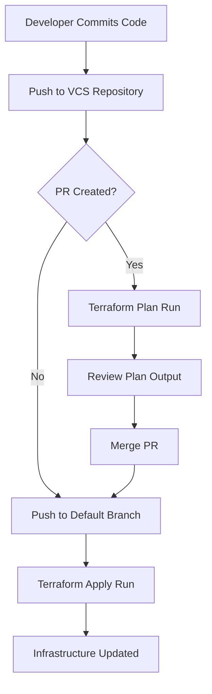

# Terraform Cloud VCS Integration

## Introduction

Version Control System (VCS) integration is one of the most powerful features of Terraform Cloud, enabling teams to manage infrastructure as code through familiar Git workflows. This integration connects your Terraform configurations stored in repositories with Terraform Cloud's execution and state management capabilities.

In this guide, we'll explore how to set up VCS integration in Terraform Cloud, understand its benefits, and implement practical workflows that mirror real-world DevOps practices.

## Why VCS Integration Matters

Version control systems like GitHub, GitLab, and Bitbucket provide crucial capabilities for collaborative infrastructure development:

- **Change tracking** - Every modification to your infrastructure is tracked with commit history
- **Code reviews** - Teams can review infrastructure changes before they're applied
- **Branching strategies** - Develop and test infrastructure changes in isolation
- **CI/CD workflows** - Automatically trigger Terraform runs when code is pushed

By connecting Terraform Cloud to your VCS, you create a seamless workflow where infrastructure changes follow the same process as application code - they are committed, reviewed, approved, and then deployed.

## Supported VCS Providers

Terraform Cloud supports integration with several popular VCS providers:

- GitHub and GitHub Enterprise
- GitLab and GitLab Enterprise
- Bitbucket Cloud and Bitbucket Server
- Azure DevOps Server and Azure DevOps Services

## How VCS Integration Works

When you connect Terraform Cloud to a VCS provider, the following workflow is established:



1. Developers write Terraform configuration and commit to a repository
2. On pull/merge requests, Terraform Cloud performs a speculative plan
3. Team members review the plan output in the PR
4. When changes are merged to the default branch, Terraform Cloud performs an apply
5. Infrastructure is provisioned or updated according to the configuration

This pattern creates a robust GitOps workflow for infrastructure changes.

## Setting Up VCS Integration

Let's walk through the process of connecting Terraform Cloud to a GitHub repository:

### Step 1: Create a VCS Connection

First, you need to establish the connection between Terraform Cloud and your VCS provider:

1. In Terraform Cloud, navigate to **Settings > VCS Providers**
2. Click **Add a VCS Provider**
3. Select **GitHub** (or your preferred provider)
4. Follow the OAuth authorization flow

```hcl
# After connecting, you should see your VCS provider listed
# with a status of "Connected"
```

### Step 2: Create a VCS-backed Workspace

Now create a workspace that connects to a specific repository:

1. Go to **Workspaces** and click **New Workspace**
2. Select **Version control workflow**
3. Choose your configured VCS provider
4. Select the repository containing your Terraform code
5. Configure additional workspace settings as needed

```hcl
# Example configuration directory structure in your repo
/
├── main.tf
├── variables.tf
├── outputs.tf
└── README.md
```

### Step 3: Configure Workspace Settings

Customize how Terraform Cloud interacts with your repository:

1. **Terraform Working Directory** - Specify a subdirectory if your Terraform files aren't in the root
2. **VCS Branch** - Set a specific branch to track (defaults to the repository's default branch)
3. **Automatic Run Triggering** - Enable or disable automatic runs when changes are pushed
4. **Speculative Plans** - Configure whether plans are created for pull requests

## Working With VCS-Integrated Workspaces

### The Pull Request Workflow

When your workspace is connected to a VCS repository, the workflow typically looks like this:

1. Create a feature branch for your infrastructure changes:

```bash
git checkout -b feature/add-new-resources
```

2. Make changes to your Terraform configuration:

```hcl
# Add a new resource
resource "aws_s3_bucket" "example" {
  bucket = "my-example-bucket"
  
  tags = {
    Environment = "Dev"
    Project     = "Learning"
  }
}
```

3. Commit and push your changes:

```bash
git add .
git commit -m "Add new S3 bucket resource"
git push origin feature/add-new-resources
```

4. Create a pull request in your VCS provider
5. Terraform Cloud automatically runs a speculative plan
6. Review the plan output right in the pull request comments
7. After approval and merge, Terraform Cloud executes the apply

### Example: GitHub PR with Terraform Plan

When you create a pull request, Terraform Cloud will add a comment showing the plan output:

```
Terraform Cloud Plan Output:

Terraform will perform the following actions:

  # aws_s3_bucket.example will be created
  + resource "aws_s3_bucket" "example" {
      + bucket                      = "my-example-bucket"
      + id                          = (known after apply)
      + tags                        = {
          + "Environment" = "Dev"
          + "Project"     = "Learning"
        }
      # ... other attributes ...
    }

Plan: 1 to add, 0 to change, 0 to destroy.
```

## Advanced VCS Configurations

### Working with Terraform Variables

When using VCS integration, you can define variables in multiple ways:

1. **Environment Variables** - Set sensitive credentials in the Terraform Cloud workspace
2. **Terraform Variables** - Define configuration variables in the workspace
3. **Variable Sets** - Share variables across multiple workspaces
4. **Variable Files** - Store non-sensitive variables in `.tfvars` files in your repository

```hcl
# Example .tfvars file in your repository
region = "us-west-2"
instance_type = "t3.micro"
environment = "development"
```

### Using Trigger Patterns

You can configure your workspace to only run when specific files change:

1. Go to your workspace settings
2. Find the **Triggering Paths** section
3. Add patterns that match the files that should trigger runs

Example trigger patterns:
- `*.tf` - Run when any Terraform file changes
- `modules/**/*.tf` - Run when module files change
- `environments/production/**` - Run when production environment configs change

### Branch-Specific Workspaces

For larger projects, you might want different workspaces for different environments:

1. Create multiple workspaces pointing to the same repository
2. Configure each to use a different branch or working directory
3. Apply environment-specific variables to each workspace

```
Workspace: project-dev
  - Branch: development
  - Directory: environments/dev

Workspace: project-prod
  - Branch: main
  - Directory: environments/prod
```

## Real-World Example: Multi-Environment Infrastructure

Let's look at a practical example of managing development and production environments:

### Repository Structure

```
/
├── modules/
│   ├── networking/
│   │   ├── main.tf
│   │   ├── variables.tf
│   │   └── outputs.tf
│   └── compute/
│       ├── main.tf
│       ├── variables.tf
│       └── outputs.tf
├── environments/
│   ├── dev/
│   │   ├── main.tf
│   │   ├── variables.tf
│   │   └── terraform.tfvars
│   └── prod/
│       ├── main.tf
│       ├── variables.tf
│       └── terraform.tfvars
└── README.md
```

### Dev Environment Configuration

```hcl
# environments/dev/main.tf
module "networking" {
  source = "../../modules/networking"
  
  vpc_cidr = var.vpc_cidr
  environment = "development"
}

module "compute" {
  source = "../../modules/compute"
  
  instance_count = 2
  instance_type = "t3.micro"
  subnet_ids = module.networking.subnet_ids
  environment = "development"
}
```

### Prod Environment Configuration

```hcl
# environments/prod/main.tf
module "networking" {
  source = "../../modules/networking"
  
  vpc_cidr = var.vpc_cidr
  environment = "production"
}

module "compute" {
  source = "../../modules/compute"
  
  instance_count = 4
  instance_type = "t3.large"
  subnet_ids = module.networking.subnet_ids
  environment = "production"
}
```

### Workspace Configuration

Create two workspaces in Terraform Cloud:

1. **project-dev**:
   - Connected to your repository
   - Working directory: `environments/dev`
   - Environment variables for AWS credentials
   - Auto-apply enabled for rapid development

2. **project-prod**:
   - Connected to your repository
   - Working directory: `environments/prod`
   - Environment variables for AWS credentials
   - Manual apply required for review before deployment

## Best Practices for VCS Integration

1. **Use Consistent Repository Structure** - Organize your code in a modular, reusable way
2. **Leverage Branch Protection Rules** - Require PR approvals before merging infrastructure changes
3. **Implement Meaningful Commit Messages** - Document why infrastructure changes are being made
4. **Add Comprehensive README Files** - Document the purpose and usage of your infrastructure code
5. **Store Sensitive Values Securely** - Never commit secrets to your repository
6. **Use Consistent Naming Conventions** - For resources, variables, and outputs
7. **Write and Run Tests** - Validate your infrastructure code with tools like Terratest

## Troubleshooting VCS Integration

### Common Issues and Solutions

1. **VCS Connection Errors**
   - Check that your OAuth tokens are valid
   - Verify network connectivity between Terraform Cloud and your VCS provider
   - Ensure proper permissions are set for the OAuth application

2. **Missing Plan Comments in Pull Requests**
   - Check webhook configuration in your VCS provider
   - Verify that the correct repository is connected
   - Ensure the Terraform working directory is correctly set

3. **Automatic Runs Not Triggering**
   - Check the trigger patterns configuration
   - Verify changes are being made to the correct branch
   - Check if auto-run is disabled in workspace settings

## Summary

Terraform Cloud's VCS integration transforms how teams manage infrastructure as code by combining the collaboration features of version control with Terraform's powerful infrastructure management capabilities.

By following the GitOps workflow enabled by this integration, teams can:

- Track all infrastructure changes with detailed history
- Implement peer reviews for infrastructure modifications
- Test changes in isolation before deployment
- Automate infrastructure deployments based on code merges
- Create consistent workflows across application and infrastructure code

As you grow more comfortable with this integration, you can implement more sophisticated patterns like environment-specific workspaces, modular code structures, and comprehensive testing practices.

## Additional Resources

- [Official Terraform Cloud VCS Documentation](https://www.terraform.io/cloud-docs/vcs)
- [GitHub Actions with Terraform Cloud](https://learn.hashicorp.com/tutorials/terraform/github-actions)
- [Terraform Modules Registry](https://registry.terraform.io/browse/modules)

## Practice Exercises

1. Set up a Terraform Cloud workspace connected to a simple GitHub repository
2. Implement a pull request workflow for changing infrastructure
3. Create separate workspaces for development and production environments
4. Configure branch protection rules to require approvals for infrastructure changes
5. Set up trigger patterns to only run certain workspaces based on file changes