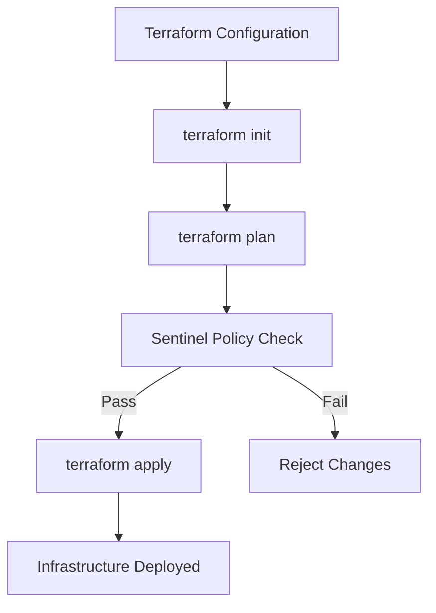
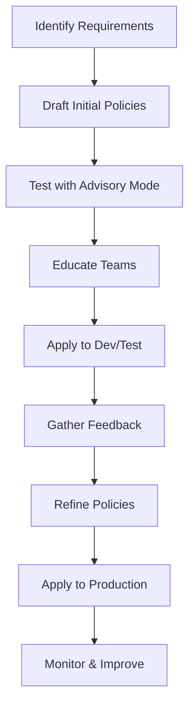

# Terraform Cloud Sentinel Policies

## Introduction

Terraform Cloud Sentinel Policies implement "policy as code" - a methodology where compliance, security, and operational rules are defined as code and integrated into your infrastructure workflow. Sentinel is HashiCorp's policy as code framework that enables fine-grained, logic-based policy decisions to be enforced across all HashiCorp products.

In Terraform Cloud, Sentinel policies act as guardrails that ensure your infrastructure deployments adhere to organizational standards and best practices. These policies are evaluated during the plan phase of a Terraform run, before any infrastructure changes are applied.

## Understanding Sentinel Policies

### What is Sentinel?

Sentinel is HashiCorp's policy as code framework designed for the following purposes:

- **Compliance Validation**: Ensure infrastructure adheres to regulatory requirements
- **Security Enforcement**: Prevent deployment of vulnerable configurations
- **Cost Control**: Restrict usage of expensive resources
- **Standardization**: Enforce naming conventions and resource configurations

### How Sentinel Works with Terraform Cloud

Sentinel integrates with Terraform Cloud's workflow at a critical checkpoint:



Sentinel policy checks occur after the plan is created but before any changes are applied. This placement ensures that potential policy violations are caught before they become actual infrastructure changes.

## Setting Up Sentinel Policies

### Policy Set Configuration

Sentinel policies are organized into "policy sets" in Terraform Cloud. A policy set is a collection of policies that can be attached to workspaces or projects.

To create a policy set:

1. Navigate to your organization settings
2. Select "Policy Sets"
3. Click "Create Policy Set"
4. Configure your policy set with:
   - Name
   - Description
   - Version control integration or direct upload
   - Scope (which workspaces or projects it applies to)

### Policy Structure

A typical Sentinel policy file has the `.sentinel` extension and follows this structure:

```hcl
# Import common Terraform Cloud Sentinel functions
import "tfplan"
import "tfplan/v2" as tfplan
import "tfstate"
import "tfconfig"

# Define a rule that checks if S3 buckets have encryption enabled
s3_buckets = filter tfplan.resource_changes as _, rc {
    rc.type is "aws_s3_bucket" and
    (rc.change.actions contains "create" or rc.change.actions contains "update")
}

bucket_encryption_enabled = rule {
    all s3_buckets as _, bucket {
        bucket.change.after.server_side_encryption_configuration != null
    }
}

# Main rule that determines if the policy passes or fails
main = rule {
    bucket_encryption_enabled
}
```

## Core Sentinel Concepts

### Imports

Sentinel policies use imports to access data about your Terraform configuration:

| Import | Description |
|--------|-------------|
| `tfplan` | Provides access to the Terraform plan data |
| `tfplan/v2` | Enhanced plan data with improved querying capabilities |
| `tfstate` | Access to the current state of resources |
| `tfconfig` | Access to the Terraform configuration itself |
| `tfrun` | Information about the current run context |

### Rules

Rules are expressions that evaluate to `true` or `false`:

```
<rule_name> = rule {
    <logical_expression>
}
```

Rules can be combined and referenced in other rules:

```hcl
tag_check = rule {
    all resources as _, r {
        r.tags contains "environment"
    }
}

name_check = rule {
    all resources as _, r {
        r.name matches "^[a-z]+-[a-z]+-[0-9]+$"
    }
}

main = rule {
    tag_check and name_check
}
```

### Policy Enforcement Levels

Terraform Cloud supports three levels of policy enforcement:

1. **Advisory**: Policy failures are reported but don't block applies
2. **Soft-Mandatory**: Policy failures block applies but can be overridden by users with permission
3. **Hard-Mandatory**: Policy failures block applies and cannot be overridden

## Practical Examples

### Example 1: Enforcing Resource Naming Conventions

This policy ensures that all AWS EC2 instances follow a naming convention:

```hcl
import "tfplan/v2" as tfplan

# Get all EC2 instances from the plan
ec2_instances = filter tfplan.resource_changes as _, rc {
    rc.type is "aws_instance" and
    (rc.change.actions contains "create" or 
     rc.change.actions contains "update")
}

# Define the naming convention: env-purpose-number (e.g., prod-web-01)
name_pattern = "^(dev|test|staging|prod)-(\\w+)-(\\d+)$"

# Rule to check if all EC2 instances follow the naming convention
properly_named = rule {
    all ec2_instances as _, instance {
        instance.change.after.tags.Name matches name_pattern
    }
}

main = rule {
    properly_named
}
```

### Example 2: Enforcing Security Settings

This policy ensures that all AWS security groups do not allow unrestricted inbound access:

```hcl
import "tfplan/v2" as tfplan

# Get all security groups from the plan
security_groups = filter tfplan.resource_changes as _, rc {
    rc.type is "aws_security_group" and
    (rc.change.actions contains "create" or 
     rc.change.actions contains "update")
}

# Check for unrestricted ingress rules (0.0.0.0/0 to port 22)
no_public_ssh = rule {
    all security_groups as _, sg {
        all sg.change.after.ingress as ingress {
            !(ingress.from_port <= 22 and 
              ingress.to_port >= 22 and 
              contains(ingress.cidr_blocks, "0.0.0.0/0"))
        }
    }
}

main = rule {
    no_public_ssh
}
```

### Example 3: Cost Control Policy

This policy restricts EC2 instance types to control costs:

```hcl
import "tfplan/v2" as tfplan

# Get all EC2 instances from the plan
ec2_instances = filter tfplan.resource_changes as _, rc {
    rc.type is "aws_instance" and
    (rc.change.actions contains "create" or 
     rc.change.actions contains "update")
}

# Define allowed instance types
allowed_types = [
    "t3.micro", 
    "t3.small", 
    "t3.medium"
]

# Rule to check if all EC2 instances use allowed types
instance_type_allowed = rule {
    all ec2_instances as _, instance {
        instance.change.after.instance_type in allowed_types
    }
}

main = rule {
    instance_type_allowed
}
```

## Testing Sentinel Policies

Before deploying policies to production, you can test them using the Sentinel CLI:

1. Install the Sentinel CLI from HashiCorp's website
2. Create a mock data file that simulates Terraform data
3. Run your policy against the mock data

Example test:

```bash
# Create mock data
cat > mock-tfplan-v2.sentinel << EOF
resource_changes = {
  "aws_instance.example": {
    "address": "aws_instance.example",
    "type": "aws_instance",
    "change": {
      "actions": ["create"],
      "after": {
        "instance_type": "t3.large",
        "tags": {
          "Name": "prod-web-01"
        }
      }
    }
  }
}
EOF

# Test the policy
sentinel apply -test instance-type-policy.sentinel
```

## Advanced Sentinel Features

### Functions

Sentinel supports custom functions to improve code reusability:

```hcl
# Define a function to check if a value is in a list
check_in_list = func(value, allowed_values) {
    return value in allowed_values
}

# Use the function in a rule
valid_instance_type = rule {
    all ec2_instances as _, instance {
        check_in_list(instance.change.after.instance_type, allowed_types)
    }
}
```

### Parameterized Policies

You can create more flexible policies by using parameters that can be configured in the Terraform Cloud UI:

```hcl
# Define parameters with defaults
param allowed_regions default ["us-east-1", "us-west-2"]
param max_instance_count default 10

# Use parameters in rules
region_check = rule {
    all aws_resources as _, resource {
        resource.region in allowed_regions
    }
}

instance_count_check = rule {
    length(ec2_instances) <= max_instance_count
}
```

## Real-World Implementation Strategy

When implementing Sentinel policies in an organization, follow these best practices:

1. **Start Small**: Begin with advisory policies to understand impact
2. **Progressive Rollout**: Apply to non-production workspaces first
3. **Education**: Ensure teams understand why policies exist
4. **Documentation**: Document each policy's purpose and rationale
5. **Exceptions Process**: Create a process for legitimate exceptions
6. **Continuous Improvement**: Regularly review and update policies

### Example Implementation Plan



## Common Challenges and Solutions

### Challenge: Policy Exceptions

**Solution**: Implement a policy exception mechanism using Sentinel parameters or workspace variables:

```hcl
import "tfrun"

# Check if this workspace has an exception
has_exception = tfrun.workspace.variables["bypass_s3_encryption"] == "true"

# Apply the rule unless an exception exists
main = rule {
    has_exception or bucket_encryption_enabled
}
```

### Challenge: Complex Policy Logic

**Solution**: Break down complex policies into smaller, reusable modules:

```hcl
# In module_security.sentinel
has_secure_transit = rule { ... }
has_secure_storage = rule { ... }

# In main policy
import "module_security"

main = rule {
    module_security.has_secure_transit and
    module_security.has_secure_storage
}
```

## Summary

Terraform Cloud Sentinel Policies provide a powerful framework for enforcing governance across your infrastructure. By implementing policy as code:

- You establish guardrails that prevent costly mistakes
- You enforce security best practices consistently
- You ensure compliance with organizational standards
- You promote infrastructure standardization

As you grow your Terraform adoption, Sentinel policies become increasingly valuable in maintaining control and governance at scale.

## Additional Resources

- [Sentinel Policy Documentation](https://www.terraform.io/cloud-docs/sentinel)
- [Sentinel Language Documentation](https://docs.hashicorp.com/sentinel/language)
- [Terraform Registry Policy Libraries](https://registry.terraform.io/browse/policies)

## Practice Exercises

1. Write a Sentinel policy that ensures all AWS resources have at least the tags "Environment", "Owner", and "Project".
2. Create a policy that restricts deployments to specific AWS regions.
3. Develop a policy that prevents the destruction of production database resources.
4. Implement a policy that enforces encryption for all data storage resources across multiple cloud providers.
5. Design a policy set structure for a multi-team organization with different compliance requirements.