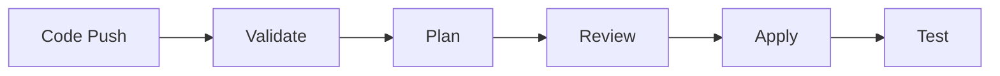

# Terraform in CI/CD Pipelines

## Introduction

Integrating Terraform with Continuous Integration and Continuous Deployment (CI/CD) pipelines enables teams to automate infrastructure provisioning and management alongside application code. This approach, often called "GitOps," ensures that infrastructure changes follow the same workflow as application development: code review, testing, approval, and deployment.

In this guide, we'll explore how to effectively integrate Terraform into CI/CD pipelines, enabling automated testing and deployment of infrastructure changes while maintaining security and consistency.

## Why Use Terraform in CI/CD Pipelines?

Before diving into implementation, let's understand the benefits:

1. **Consistency** - Infrastructure changes follow a standardized process
2. **Collaboration** - Team members can review infrastructure changes
3. **Visibility** - Changes are tracked and auditable
4. **Reliability** - Automated testing reduces human error
5. **Speed** - Automated deployments accelerate delivery

## CI/CD Pipeline Flow for Terraform

A typical Terraform CI/CD pipeline includes these stages:



Let's break down each stage:

### 1. Code Push
Developers commit Terraform configuration changes to a Git repository.

### 2. Validation
The pipeline runs `terraform validate` to check syntax and configuration errors.

### 3. Plan
The pipeline runs `terraform plan` to show what changes would be made.

### 4. Review
Team members review the plan output and approve/reject changes.

### 5. Apply
After approval, the pipeline runs `terraform apply` to deploy changes.

### 6. Testing
Post-deployment tests verify the infrastructure works as expected.

## Setting Up Terraform in Different CI/CD Platforms

Let's look at how to implement Terraform pipelines in popular CI/CD platforms.

### GitHub Actions

Here's a basic GitHub Actions workflow for Terraform:

```yaml
name: "Terraform CI/CD Pipeline"

on:
  push:
    branches: [ main ]
  pull_request:
    branches: [ main ]

jobs:
  terraform:
    name: "Terraform"
    runs-on: ubuntu-latest
    
    steps:
      - name: Checkout
        uses: actions/checkout@v3

      - name: Setup Terraform
        uses: hashicorp/setup-terraform@v2
        with:
          terraform_version: 1.3.0

      - name: Terraform Init
        id: init
        run: terraform init
        
      - name: Terraform Validate
        id: validate
        run: terraform validate

      - name: Terraform Plan
        id: plan
        if: github.event_name == 'pull_request'
        run: terraform plan -no-color
        continue-on-error: true
        
      - name: Add Plan Comment
        uses: actions/github-script@v6
        if: github.event_name == 'pull_request'
        env:
          PLAN: "terraform
${{ steps.plan.outputs.stdout }}"
        with:
          github-token: ${{ secrets.GITHUB_TOKEN }}
          script: |
            const output = `#### Terraform Plan 📝\`${{ steps.plan.outcome }}\`
            <details><summary>Show Plan</summary>
            
            \`\`\`${process.env.PLAN}\`\`\`
            
            </details>`;
            
            github.rest.issues.createComment({
              issue_number: context.issue.number,
              owner: context.repo.owner,
              repo: context.repo.repo,
              body: output
            })
            
      - name: Terraform Apply
        if: github.ref == 'refs/heads/main' && github.event_name == 'push'
        run: terraform apply -auto-approve
```

### GitLab CI

Here's a sample GitLab CI configuration:

```yaml
image: hashicorp/terraform:1.3.0

stages:
  - validate
  - plan
  - apply

variables:
  TF_ROOT: ${CI_PROJECT_DIR}/terraform

cache:
  paths:
    - ${TF_ROOT}/.terraform

before_script:
  - cd ${TF_ROOT}
  - terraform --version
  - terraform init

validate:
  stage: validate
  script:
    - terraform validate

plan:
  stage: plan
  script:
    - terraform plan -out=tfplan
  artifacts:
    paths:
      - ${TF_ROOT}/tfplan

apply:
  stage: apply
  script:
    - terraform apply -input=false tfplan
  dependencies:
    - plan
  when: manual
  only:
    - main
```

### Jenkins

For Jenkins, you can create a pipeline script like this:

```groovy
pipeline {
    agent any
    
    tools {
        terraform 'terraform-1.3.0'
    }
    
    stages {
        stage('Checkout') {
            steps {
                checkout scm
            }
        }
        
        stage('Init') {
            steps {
                sh 'terraform init'
            }
        }
        
        stage('Validate') {
            steps {
                sh 'terraform validate'
            }
        }
        
        stage('Plan') {
            steps {
                sh 'terraform plan -out=tfplan'
                sh 'terraform show -no-color tfplan > tfplan.txt'
            }
        }
        
        stage('Approval') {
            when {
                branch 'main'
            }
            steps {
                script {
                    def plan = readFile 'tfplan.txt'
                    input message: "Apply the plan?",
                          parameters: [text(name: 'Plan', description: 'Review the plan', defaultValue: plan)]
                }
            }
        }
        
        stage('Apply') {
            when {
                branch 'main'
            }
            steps {
                sh 'terraform apply -input=false tfplan'
            }
        }
    }
}
```

## Best Practices for Terraform in CI/CD

### 1. Use Remote State

Store Terraform state remotely to enable collaboration and prevent state conflicts:

```hcl
terraform {
  backend "s3" {
    bucket = "terraform-state-bucket"
    key    = "path/to/my/key"
    region = "us-east-1"
  }
}
```

### 2. Manage Secrets Securely

Never store sensitive values in your repository. Use environment variables or a secrets manager:

```hcl
provider "aws" {
  region     = var.aws_region
  # Credentials provided via CI/CD environment variables
}
```

In your CI/CD configuration, set these environment variables securely:

```yaml
# GitHub Actions example
env:
  AWS_ACCESS_KEY_ID: ${{ secrets.AWS_ACCESS_KEY_ID }}
  AWS_SECRET_ACCESS_KEY: ${{ secrets.AWS_SECRET_ACCESS_KEY }}
```

### 3. Use Terraform Workspaces

Workspaces help manage multiple environments (dev, staging, prod) from the same code:

```bash
# In your CI/CD pipeline
terraform workspace select ${TF_WORKSPACE} || terraform workspace new ${TF_WORKSPACE}
terraform plan -out=tfplan -var-file=${TF_WORKSPACE}.tfvars
```

### 4. Implement Drift Detection

Regularly check for infrastructure drift - differences between the actual infrastructure and your Terraform code:

```yaml
# Add to your CI/CD configuration
drift-detection:
  script:
    - terraform plan -detailed-exitcode
  rules:
    - if: '$CI_PIPELINE_SOURCE == "schedule"'
```

### 5. Use Terraform Modules

Encapsulate reusable components as modules to ensure consistency:

```hcl
module "vpc" {
  source  = "./modules/vpc"
  version = "1.0.0"
  
  cidr_block = var.vpc_cidr
  name       = var.environment
}
```

## Real-World Example: Complete CI/CD Pipeline

Let's put everything together in a practical example. We'll create a CI/CD pipeline that deploys a web application infrastructure including a VPC, subnets, an EC2 instance, and an RDS database.

### Project Structure

```
├── main.tf
├── variables.tf
├── outputs.tf
├── modules/
│   ├── vpc/
│   ├── ec2/
│   └── rds/
├── environments/
│   ├── dev.tfvars
│   ├── staging.tfvars
│   └── prod.tfvars
└── .github/
    └── workflows/
        └── terraform.yml
```

### Main Terraform Configuration

```hcl
# main.tf
terraform {
  required_version = ">= 1.0.0"
  
  backend "s3" {
    bucket = "my-terraform-state"
    key    = "webapp/terraform.tfstate"
    region = "us-east-1"
    encrypt = true
    dynamodb_table = "terraform-locks"
  }
  
  required_providers {
    aws = {
      source  = "hashicorp/aws"
      version = "~> 4.0"
    }
  }
}

provider "aws" {
  region = var.aws_region
}

module "vpc" {
  source = "./modules/vpc"
  
  cidr_block = var.vpc_cidr
  environment = var.environment
}

module "webserver" {
  source = "./modules/ec2"
  
  instance_type = var.instance_type
  subnet_id     = module.vpc.public_subnet_id
  vpc_security_group_ids = [module.vpc.security_group_id]
  environment = var.environment
  
  depends_on = [module.vpc]
}

module "database" {
  source = "./modules/rds"
  
  allocated_storage = var.db_allocated_storage
  instance_class    = var.db_instance_class
  subnet_group_name = module.vpc.db_subnet_group_name
  vpc_security_group_ids = [module.vpc.db_security_group_id]
  environment = var.environment
  
  depends_on = [module.vpc]
}
```

### GitHub Actions Workflow

```yaml
name: "Terraform CI/CD Pipeline"

on:
  push:
    branches: [ main ]
  pull_request:
    branches: [ main ]

jobs:
  terraform:
    name: "Terraform"
    runs-on: ubuntu-latest
    strategy:
      matrix:
        environment: [dev, staging, prod]
    
    steps:
      - name: Checkout
        uses: actions/checkout@v3

      - name: Setup Terraform
        uses: hashicorp/setup-terraform@v2
        with:
          terraform_version: 1.3.0

      - name: Configure AWS Credentials
        uses: aws-actions/configure-aws-credentials@v1
        with:
          aws-access-key-id: ${{ secrets.AWS_ACCESS_KEY_ID }}
          aws-secret-access-key: ${{ secrets.AWS_SECRET_ACCESS_KEY }}
          aws-region: us-east-1

      - name: Terraform Init
        run: terraform init

      - name: Terraform Workspace
        run: terraform workspace select ${{ matrix.environment }} || terraform workspace new ${{ matrix.environment }}
      
      - name: Terraform Validate
        run: terraform validate

      - name: Terraform Plan
        id: plan
        run: terraform plan -var-file=environments/${{ matrix.environment }}.tfvars -out=tfplan
        continue-on-error: true
        
      - name: Add Plan Comment
        uses: actions/github-script@v6
        if: github.event_name == 'pull_request'
        env:
          PLAN: "terraform
${{ steps.plan.outputs.stdout }}"
          ENVIRONMENT: ${{ matrix.environment }}
        with:
          github-token: ${{ secrets.GITHUB_TOKEN }}
          script: |
            const output = `#### Terraform Plan for ${process.env.ENVIRONMENT} 📝\`${{ steps.plan.outcome }}\`
            <details><summary>Show Plan</summary>
            
            \`\`\`${process.env.PLAN}\`\`\`
            
            </details>`;
            
            github.rest.issues.createComment({
              issue_number: context.issue.number,
              owner: context.repo.owner,
              repo: context.repo.repo,
              body: output
            })
            
      - name: Terraform Apply
        if: github.ref == 'refs/heads/main' && github.event_name == 'push' && matrix.environment != 'prod'
        run: terraform apply -auto-approve tfplan
        
      - name: Terraform Apply (Production)
        if: github.ref == 'refs/heads/main' && github.event_name == 'push' && matrix.environment == 'prod'
        uses: trstringer/manual-approval@v1
        with:
          secret: ${{ secrets.GITHUB_TOKEN }}
          approvers: username1,username2
          minimum-approvals: 2
          issue-title: "Deploy to Production"
          issue-body: "Please review and approve the production deployment"
          exclude-workflow-initiator-as-approver: false
          additional-approved-words: ""
          additional-denied-words: ""

      - name: Production Apply
        if: github.ref == 'refs/heads/main' && github.event_name == 'push' && matrix.environment == 'prod' && steps.approval.outputs.approved == 'true'
        run: terraform apply -auto-approve tfplan
```

### Post-Deployment Testing

You can add automated tests to verify your infrastructure works correctly:

```yaml
# Add this to your GitHub Actions workflow
- name: Test Infrastructure
  if: github.ref == 'refs/heads/main' && github.event_name == 'push'
  run: |
    # Fetch outputs from terraform
    EC2_IP=$(terraform output -raw instance_public_ip)
    
    # Simple connectivity test
    timeout 300 bash -c 'until nc -z $0 22; do sleep 5; done' $EC2_IP
    
    # Application health check
    curl -f http://$EC2_IP/health || exit 1
```

## Advanced Techniques

### 1. Terraform Cost Estimation

Integrate cost estimation tools like Infracost:

```yaml
- name: Infracost
  uses: infracost/actions/setup@v2
  with:
    api-key: ${{ secrets.INFRACOST_API_KEY }}

- name: Generate Infracost Report
  run: |
    infracost breakdown --path . --terraform-var-file=environments/${{ matrix.environment }}.tfvars --format=json > infracost.json
    infracost output --path infracost.json --format=markdown > infracost.md

- name: Post Infracost Comment
  uses: infracost/actions/comment@v2
  if: github.event_name == 'pull_request'
  with:
    path: infracost.md
```

### 2. Policy-as-Code with Terraform

Integrate policy checking tools like OPA (Open Policy Agent):

```yaml
- name: OPA Policy Check
  run: |
    # Install OPA
    curl -L -o opa https://openpolicyagent.org/downloads/latest/opa_linux_amd64
    chmod 755 ./opa
    
    # Generate Terraform plan in JSON format
    terraform show -json tfplan > tfplan.json
    
    # Run OPA policy evaluation
    ./opa eval --format pretty --data policies/ --input tfplan.json 'data.terraform.deny'
    
    # Check if there are policy violations
    if [ $(./opa eval --format pretty --data policies/ --input tfplan.json