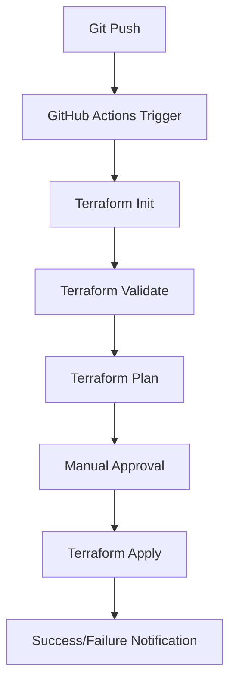

# Terraform with GitHub Actions

## Introduction

Integrating Terraform with GitHub Actions creates a powerful combination for implementing Infrastructure as Code (IaC) with proper CI/CD practices. This automation ensures your infrastructure changes are tested, validated, and deployed consistently.

In this guide, you'll learn how to:
- Set up GitHub Actions workflows for Terraform
- Implement automated testing and validation of Terraform code
- Configure secure credential management
- Create deployment pipelines for different environments

## Prerequisites

Before we begin, you should have:
- Basic knowledge of Terraform concepts
- A GitHub account and repository
- A Terraform project ready to deploy
- AWS, Azure, or GCP account (for examples)

## Understanding the Workflow

GitHub Actions automates your Terraform deployment process with these key steps:

<br />



## Setting Up GitHub Actions for Terraform

### 1. Creating the GitHub Actions Workflow File

First, create a `.github/workflows` directory in your repository. Then add a workflow file named `terraform.yml`:

```yaml
name: "Terraform CI/CD"

on:
  push:
    branches: [ main ]
  pull_request:
    branches: [ main ]

jobs:
  terraform:
    name: "Terraform"
    runs-on: ubuntu-latest
    
    steps:
      - name: Checkout code
        uses: actions/checkout@v3

      - name: Setup Terraform
        uses: hashicorp/setup-terraform@v2
        with:
          terraform_version: 1.5.5

      - name: Terraform Init
        id: init
        run: terraform init

      - name: Terraform Format
        id: fmt
        run: terraform fmt -check

      - name: Terraform Validate
        id: validate
        run: terraform validate

      - name: Terraform Plan
        id: plan
        if: github.event_name == 'pull_request'
        run: terraform plan -no-color
        continue-on-error: true
        env:
          AWS_ACCESS_KEY_ID: ${{ secrets.AWS_ACCESS_KEY_ID }}
          AWS_SECRET_ACCESS_KEY: ${{ secrets.AWS_SECRET_ACCESS_KEY }}

      - name: Update Pull Request
        uses: actions/github-script@v6
        if: github.event_name == 'pull_request'
        with:
          github-token: ${{ secrets.GITHUB_TOKEN }}
          script: |
            const output = `#### Terraform Format and Style 🖌\`${{ steps.fmt.outcome }}\`
            #### Terraform Validation 🤖\`${{ steps.validate.outcome }}\`
            #### Terraform Plan 📖\`${{ steps.plan.outcome }}\`
            
            <details><summary>Show Plan</summary>
            
            \`\`\`terraform
            ${{ steps.plan.outputs.stdout }}
            \`\`\`
            
            </details>`;
              
            github.rest.issues.createComment({
              issue_number: context.issue.number,
              owner: context.repo.owner,
              repo: context.repo.repo,
              body: output
            })

      - name: Terraform Apply
        if: github.ref == 'refs/heads/main' && github.event_name == 'push'
        run: terraform apply -auto-approve
        env:
          AWS_ACCESS_KEY_ID: ${{ secrets.AWS_ACCESS_KEY_ID }}
          AWS_SECRET_ACCESS_KEY: ${{ secrets.AWS_SECRET_ACCESS_KEY }}
```

### 2. Understanding the Workflow Components

Let's break down what's happening in this workflow:

- **Triggers**: The workflow runs on pushes to the `main` branch and on pull requests targeting `main`.
- **Jobs**: We define a single job named "Terraform" running on the latest Ubuntu.
- **Steps**:
  - Checkout the code from the repository
  - Setup Terraform with a specific version
  - Initialize Terraform
  - Check formatting
  - Validate the Terraform configuration
  - Create a plan (for pull requests)
  - Comment the plan results on pull requests
  - Apply changes (only on merges to main)

## Securing Credentials

Never store sensitive credentials in your code. GitHub Actions provides a secure way to manage secrets:

1. In your GitHub repository, go to Settings > Secrets and variables > Actions
2. Click "New repository secret"
3. Add your credentials:
   - `AWS_ACCESS_KEY_ID`
   - `AWS_SECRET_ACCESS_KEY`

These will be securely passed to your Terraform commands during execution.

## Implementing a Complete Example

Let's see how to use this with an actual Terraform project.

### Project Structure

```
project-root/
├── .github/
│   └── workflows/
│       └── terraform.yml
├── main.tf
├── variables.tf
├── outputs.tf
└── README.md
```

### Sample Terraform Configuration

Here's a simple example that creates an AWS S3 bucket:

```hcl
# main.tf
terraform {
  required_providers {
    aws = {
      source  = "hashicorp/aws"
      version = "~> 4.0"
    }
  }
  
  # For production use, configure a backend for state
  # backend "s3" {
  #   bucket = "my-terraform-state"
  #   key    = "state/terraform.tfstate"
  #   region = "us-east-1"
  # }
}

provider "aws" {
  region = var.region
}

resource "aws_s3_bucket" "example" {
  bucket = var.bucket_name
  tags   = var.tags
}

resource "aws_s3_bucket_versioning" "example" {
  bucket = aws_s3_bucket.example.id
  
  versioning_configuration {
    status = "Enabled"
  }
}
```

```hcl
# variables.tf
variable "region" {
  description = "AWS region to deploy resources"
  type        = string
  default     = "us-east-1"
}

variable "bucket_name" {
  description = "Name of the S3 bucket"
  type        = string
}

variable "tags" {
  description = "Tags to apply to resources"
  type        = map(string)
  default     = {
    Environment = "dev"
    ManagedBy   = "terraform"
  }
}
```

```hcl
# outputs.tf
output "bucket_name" {
  description = "Name of the created bucket"
  value       = aws_s3_bucket.example.bucket
}

output "bucket_arn" {
  description = "ARN of the created bucket"
  value       = aws_s3_bucket.example.arn
}
```

## Advanced GitHub Actions Workflow

For more complex projects, you might want to separate environments and add approval workflows:

```yaml
name: "Terraform Multi-Environment CI/CD"

on:
  push:
    branches: [ main, development ]
  pull_request:
    branches: [ main, development ]

jobs:
  terraform-plan:
    name: "Terraform Plan"
    runs-on: ubuntu-latest
    strategy:
      matrix:
        environment: [dev, prod]
        include:
          - environment: dev
            branch: development
          - environment: prod
            branch: main
    
    # Only run plan for the environment matching the branch
    if: |
      (github.ref == 'refs/heads/development' && matrix.environment == 'dev') ||
      (github.ref == 'refs/heads/main' && matrix.environment == 'prod') ||
      github.event_name == 'pull_request'
    
    steps:
      - name: Checkout code
        uses: actions/checkout@v3

      - name: Setup Terraform
        uses: hashicorp/setup-terraform@v2
        with:
          terraform_version: 1.5.5

      - name: Configure AWS Credentials
        uses: aws-actions/configure-aws-credentials@v2
        with:
          aws-access-key-id: ${{ secrets.AWS_ACCESS_KEY_ID }}
          aws-secret-access-key: ${{ secrets.AWS_SECRET_ACCESS_KEY }}
          aws-region: us-east-1

      - name: Terraform Init
        id: init
        run: terraform init -backend-config="key=${{ matrix.environment }}/terraform.tfstate"

      - name: Terraform Validate
        id: validate
        run: terraform validate

      - name: Terraform Plan
        id: plan
        run: terraform plan -var-file=${{ matrix.environment }}.tfvars -out=tfplan
        continue-on-error: true

      - name: Upload Plan Artifact
        uses: actions/upload-artifact@v3
        with:
          name: tfplan-${{ matrix.environment }}
          path: tfplan
          retention-days: 7

  terraform-apply:
    name: "Terraform Apply"
    runs-on: ubuntu-latest
    needs: terraform-plan
    strategy:
      matrix:
        environment: [dev, prod]
        include:
          - environment: dev
            branch: development
          - environment: prod
            branch: main
    
    # Only run apply for the environment matching the branch, and only on push
    if: |
      github.event_name == 'push' && 
      ((github.ref == 'refs/heads/development' && matrix.environment == 'dev') ||
       (github.ref == 'refs/heads/main' && matrix.environment == 'prod'))
    
    # For production, require manual approval
    environment:
      name: ${{ matrix.environment }}
      
    steps:
      - name: Checkout code
        uses: actions/checkout@v3

      - name: Setup Terraform
        uses: hashicorp/setup-terraform@v2
        with:
          terraform_version: 1.5.5

      - name: Configure AWS Credentials
        uses: aws-actions/configure-aws-credentials@v2
        with:
          aws-access-key-id: ${{ secrets.AWS_ACCESS_KEY_ID }}
          aws-secret-access-key: ${{ secrets.AWS_SECRET_ACCESS_KEY }}
          aws-region: us-east-1

      - name: Terraform Init
        id: init
        run: terraform init -backend-config="key=${{ matrix.environment }}/terraform.tfstate"

      - name: Download Plan Artifact
        uses: actions/download-artifact@v3
        with:
          name: tfplan-${{ matrix.environment }}

      - name: Terraform Apply
        id: apply
        run: terraform apply -auto-approve tfplan
```

This advanced workflow:
- Runs separate plans for development and production environments
- Stores the plan as an artifact for later use
- Requires manual approval for production deployments using GitHub Environments
- Uses different state files for each environment

## Best Practices

### 1. Remote State Storage

Always use remote state storage for team environments:

```hcl
terraform {
  backend "s3" {
    bucket = "my-terraform-state"
    key    = "path/to/state"
    region = "us-east-1"
    
    # Enable state locking
    dynamodb_table = "terraform-state-lock"
  }
}
```

### 2. State Locking

Implement state locking to prevent concurrent modifications:

```hcl
# Create a DynamoDB table for state locking
resource "aws_dynamodb_table" "terraform_locks" {
  name         = "terraform-state-lock"
  billing_mode = "PAY_PER_REQUEST"
  hash_key     = "LockID"
  
  attribute {
    name = "LockID"
    type = "S"
  }
}
```

### 3. Pull Request Workflows

Use branch protection rules in GitHub to:
- Require status checks to pass before merging
- Require reviews before merging
- Prohibit direct pushes to main

### 4. Testing Terraform Code

Add testing to your workflow:

```yaml
- name: Install Terratest dependencies
  run: |
    go mod init example.com/terraform-test
    go get github.com/gruntwork-io/terratest/modules/terraform
    go get github.com/stretchr/testify/assert

- name: Run Terraform tests
  working-directory: ./test
  run: go test -v ./...
```

## Handling Sensitive Data

For handling sensitive values like passwords or API keys:

1. Use GitHub Secrets for external credentials
2. Use Terraform's sensitive variables:

```hcl
variable "db_password" {
  description = "Database password"
  type        = string
  sensitive   = true  # This prevents the value from appearing in logs
}
```

## Real-World Example: Deploying a Web Application

Let's put everything together with a more complex example that deploys a web application infrastructure:

```hcl
# main.tf for web application infrastructure
module "vpc" {
  source = "terraform-aws-modules/vpc/aws"
  version = "3.14.0"
  
  name = "${var.project_name}-${var.environment}"
  cidr = var.vpc_cidr
  
  azs             = var.availability_zones
  private_subnets = var.private_subnet_cidrs
  public_subnets  = var.public_subnet_cidrs
  
  enable_nat_gateway = true
  single_nat_gateway = var.environment != "prod"
  
  tags = var.tags
}

module "web_server" {
  source = "./modules/web_server"
  
  vpc_id            = module.vpc.vpc_id
  subnet_ids        = module.vpc.private_subnets
  environment       = var.environment
  instance_type     = var.environment == "prod" ? "t3.medium" : "t3.micro"
  min_size          = var.environment == "prod" ? 2 : 1
  max_size          = var.environment == "prod" ? 5 : 2
  app_version       = var.app_version
  
  tags = var.tags
}

module "database" {
  source = "./modules/database"
  
  vpc_id                 = module.vpc.vpc_id
  subnet_ids             = module.vpc.private_subnets
  environment            = var.environment
  db_username            = var.db_username
  db_password            = var.db_password
  backup_retention_days  = var.environment == "prod" ? 7 : 1
  instance_class         = var.environment == "prod" ? "db.t3.medium" : "db.t3.micro"
  
  tags = var.tags
}

module "load_balancer" {
  source = "./modules/load_balancer"
  
  vpc_id         = module.vpc.vpc_id
  subnet_ids     = module.vpc.public_subnets
  instance_ids   = module.web_server.instance_ids
  environment    = var.environment
  
  tags = var.tags
}
```

With this setup, our GitHub Actions workflow would:
1. Plan and deploy the development environment when changes are pushed to the development branch
2. Plan and deploy to production only after manual approval when changes are merged to main
3. Use different environment-specific variables for each deployment

## Troubleshooting Common Issues

### Failed GitHub Actions Workflow

If your workflow fails:

1. Check the GitHub Actions logs for error messages
2. Verify your credentials are set correctly in GitHub Secrets
3. Ensure your Terraform code is valid
4. Check if you have the necessary permissions in your cloud provider

### Terraform State Lock Issues

If you encounter state locking problems:

```bash
# To manually unlock the state if a previous run failed
terraform force-unlock LOCK_ID
```

### Managing Drift

Infrastructure can drift from your Terraform state: