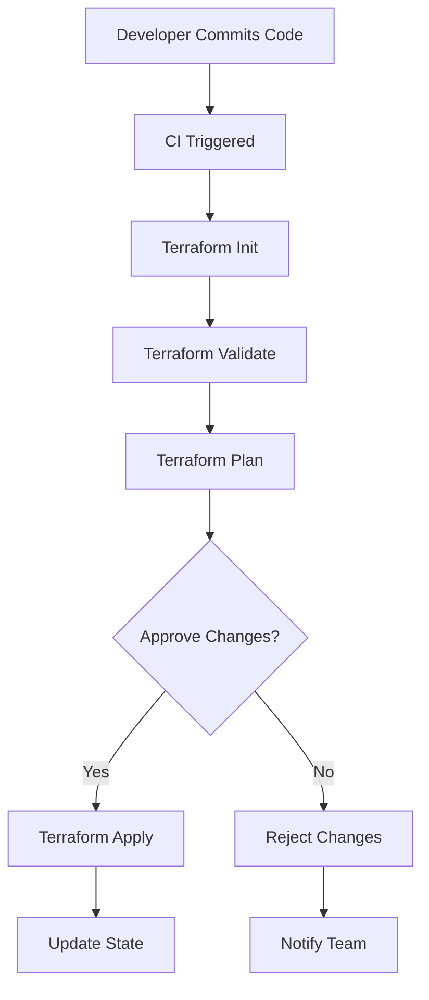

# Terraform Apply Automation

## Introduction

When working with Infrastructure as Code (IaC), manually running Terraform commands becomes impractical as your infrastructure grows in complexity. **Terraform Apply Automation** is the process of integrating Terraform operations into your CI/CD pipeline, allowing for consistent, reliable, and automated infrastructure deployments.

In this guide, we'll explore how to automate the `terraform apply` process within CI/CD workflows to ensure your infrastructure deployments are repeatable, validated, and controlled. Whether you're deploying to development, staging, or production environments, proper automation ensures consistency and reduces human error.

## Why Automate Terraform Apply?

Before diving into implementation, let's understand the benefits of automating Terraform apply:

1. **Consistency** - Every deployment follows the same process
2. **Validation** - Changes are verified before being applied
3. **Traceability** - Every change is tied to a commit/PR
4. **Security** - Reduce access to credentials through managed service accounts
5. **Collaboration** - Team members can propose changes via PRs

## Basic CI/CD Flow for Terraform

Here's the typical flow for Terraform in a CI/CD pipeline:



## Setting Up Terraform Apply Automation

Let's go through the process of setting up Terraform apply automation in different CI/CD environments.

### Prerequisites

Before you begin, make sure you have:

1. A version control system (Git repository)
2. A CI/CD platform (GitHub Actions, GitLab CI, Jenkins, etc.)
3. Terraform configurations in your repository
4. Access to remote state storage (S3, Azure Blob, etc.)
5. Service account credentials for your cloud provider

### Example: GitHub Actions Workflow

Here's a complete example of a GitHub Actions workflow that automates Terraform:

```yaml
name: "Terraform CI/CD"

on:
  push:
    branches: [ main ]
  pull_request:
    branches: [ main ]

env:
  TF_LOG: INFO
  AWS_REGION: "us-west-2"

jobs:
  terraform:
    name: "Terraform"
    runs-on: ubuntu-latest
    
    steps:
      - name: Checkout Repository
        uses: actions/checkout@v3
      
      - name: Setup Terraform
        uses: hashicorp/setup-terraform@v2
        with:
          terraform_version: 1.5.0
      
      - name: Configure AWS Credentials
        uses: aws-actions/configure-aws-credentials@v2
        with:
          aws-access-key-id: ${{ secrets.AWS_ACCESS_KEY_ID }}
          aws-secret-access-key: ${{ secrets.AWS_SECRET_ACCESS_KEY }}
          aws-region: ${{ env.AWS_REGION }}
      
      - name: Terraform Init
        id: init
        run: terraform init
      
      - name: Terraform Validate
        id: validate
        run: terraform validate
      
      - name: Terraform Plan
        id: plan
        if: github.event_name == 'pull_request'
        run: terraform plan -no-color
        continue-on-error: true
      
      - name: Update Pull Request
        uses: actions/github-script@v6
        if: github.event_name == 'pull_request'
        env:
          PLAN: "terraform
${{ steps.plan.outputs.stdout }}"
        with:
          github-token: ${{ secrets.GITHUB_TOKEN }}
          script: |
            const output = `#### Terraform Plan 📝\`${{ steps.plan.outcome }}\`
            
            <details><summary>Show Plan</summary>
            
            \`\`\`${process.env.PLAN}\`\`\`
            
            </details>`;
              
            github.rest.issues.createComment({
              issue_number: context.issue.number,
              owner: context.repo.owner,
              repo: context.repo.repo,
              body: output
            })
      
      - name: Terraform Apply
        if: github.ref == 'refs/heads/main' && github.event_name == 'push'
        run: terraform apply -auto-approve
```

This workflow:
1. Runs on both push to main and pull requests
2. Sets up Terraform and configures cloud provider credentials
3. Initializes and validates the Terraform configuration
4. For PRs: Creates a plan and posts it as a comment
5. For pushes to main: Automatically applies the changes

### Example: GitLab CI Pipeline

Here's how you can set up Terraform automation in GitLab CI:

```yaml
image: hashicorp/terraform:1.5.0

stages:
  - validate
  - plan
  - apply

variables:
  TF_ROOT: ${CI_PROJECT_DIR}/terraform
  TF_STATE_NAME: ${CI_PROJECT_NAME}

cache:
  paths:
    - ${TF_ROOT}/.terraform

before_script:
  - cd ${TF_ROOT}
  - terraform --version
  - terraform init

validate:
  stage: validate
  script:
    - terraform validate

plan:
  stage: plan
  script:
    - terraform plan -out=tfplan
  artifacts:
    paths:
      - ${TF_ROOT}/tfplan

apply:
  stage: apply
  script:
    - terraform apply -input=false tfplan
  dependencies:
    - plan
  when: manual
  only:
    - main
```

In this GitLab example, we've made the apply stage manual, requiring explicit approval before changes get deployed.

## Managing Environment-Specific Deployments

In real-world scenarios, you often need to deploy to multiple environments. Here's how to handle environment-specific deployments:

### Directory Structure Approach

One approach is to organize your Terraform code by environment:

```
project/
├── terraform/
│   ├── dev/
│   │   ├── main.tf
│   │   └── variables.tf
│   ├── staging/
│   │   ├── main.tf
│   │   └── variables.tf
│   └── prod/
│       ├── main.tf
│       └── variables.tf
```

Then modify your CI/CD pipeline to work with the appropriate directory:

```yaml
# Example for GitHub Actions
jobs:
  terraform-dev:
    name: "Terraform Dev"
    runs-on: ubuntu-latest
    defaults:
      run:
        working-directory: terraform/dev
    steps:
      # Steps as in the previous example
      
  terraform-staging:
    name: "Terraform Staging"
    runs-on: ubuntu-latest
    defaults:
      run:
        working-directory: terraform/staging
    needs: terraform-dev
    # Additional steps
```

### Workspace Approach

Alternatively, you can use Terraform workspaces:

```yaml
# Example workflow steps using workspaces
- name: Select Dev Workspace
  run: terraform workspace select dev || terraform workspace new dev

- name: Terraform Plan Dev
  run: terraform plan -var-file=dev.tfvars
```

## Best Practices for Terraform Automation

### 1. Use Backend Configuration for Remote State

Always store your state remotely for team collaboration:

```hcl
terraform {
  backend "s3" {
    bucket = "my-terraform-state"
    key    = "terraform.tfstate"
    region = "us-west-1"
    dynamodb_table = "terraform-locks"
    encrypt = true
  }
}
```

### 2. Implement State Locking

Ensure your backend configuration includes state locking to prevent concurrent modifications:

```hcl
# For AWS, use DynamoDB table for locking
terraform {
  backend "s3" {
    # other configurations...
    dynamodb_table = "terraform-locks"
  }
}
```

### 3. Use Variables and Variable Files

Separate your environment-specific variables:

```hcl
# variables.tf
variable "environment" {
  type = string
  description = "Deployment environment (dev, staging, prod)"
}

variable "instance_count" {
  type = number
  description = "Number of instances to provision"
}
```

```hcl
# dev.tfvars
environment = "dev"
instance_count = 1
```

```hcl
# prod.tfvars
environment = "prod"
instance_count = 3
```

### 4. Implement Drift Detection

Add a job to your pipeline to detect infrastructure drift:

```yaml
drift-detection:
  runs-on: ubuntu-latest
  steps:
    - name: Checkout Repository
      uses: actions/checkout@v3
    
    - name: Setup Terraform
      uses: hashicorp/setup-terraform@v2
    
    - name: Terraform Init
      run: terraform init
    
    - name: Check for Drift
      run: |
        terraform plan -detailed-exitcode
        if [ $? -eq 2 ]; then
          echo "Drift detected!"
          exit 1
        else
          echo "No drift detected"
        fi
```

### 5. Secure Sensitive Variables

Never hardcode sensitive values. Use your CI/CD platform's secrets management:

```yaml
# GitHub Actions example
- name: Configure AWS Credentials
  uses: aws-actions/configure-aws-credentials@v2
  with:
    aws-access-key-id: ${{ secrets.AWS_ACCESS_KEY_ID }}
    aws-secret-access-key: ${{ secrets.AWS_SECRET_ACCESS_KEY }}
    aws-region: us-west-2
```

## Real-World Example: Multi-Environment Web Application

Let's see how to automate the deployment of a web application infrastructure across multiple environments:

```hcl
# main.tf
provider "aws" {
  region = var.region
}

module "vpc" {
  source = "./modules/vpc"
  environment = var.environment
  vpc_cidr = var.vpc_cidr
}

module "web_app" {
  source = "./modules/web_app"
  environment = var.environment
  vpc_id = module.vpc.vpc_id
  subnet_ids = module.vpc.public_subnet_ids
  instance_type = var.instance_type
  instance_count = var.instance_count
}

output "load_balancer_dns" {
  value = module.web_app.load_balancer_dns
}
```

With our CI/CD setup, deploying this infrastructure becomes as simple as merging a pull request. The pipeline will:

1. Validate the configurations
2. Generate and display the execution plan
3. Apply the changes when approved
4. Update the appropriate environment

## Testing in CI/CD

Don't forget to add automated tests to your Terraform pipeline:

```yaml
- name: Run Terraform Tests
  run: |
    cd tests
    go test -v ./...
```

You can use tools like Terratest to write infrastructure tests in Go:

```go
package test

import (
    "testing"
    "github.com/gruntwork-io/terratest/modules/terraform"
    "github.com/stretchr/testify/assert"
)

func TestTerraformWebApp(t *testing.T) {
    terraformOptions := &terraform.Options{
        TerraformDir: "../",
        Vars: map[string]interface{}{
            "environment": "test",
        },
    }

    defer terraform.Destroy(t, terraformOptions)
    terraform.InitAndApply(t, terraformOptions)
    
    vpcID := terraform.Output(t, terraformOptions, "vpc_id")
    assert.NotEmpty(t, vpcID, "VPC ID should not be empty")
}
```

## Handling Terraform Apply Failures

When automation fails, you need a strategy to handle it:

1. **Notification System**: Configure alerts to notify the team of failures
2. **Rollback Strategy**: Consider implementing auto-rollbacks for critical failures
3. **Manual Intervention**: For complex issues, have a documented process for manual fixes

Add a notification step to your CI/CD pipeline:

```yaml
- name: Notify on Failure
  if: failure()
  uses: some-notification-action@v1
  with:
    status: ${{ job.status }}
    message: "Terraform apply failed in ${{ github.repository }}"
```

## Summary

Terraform Apply Automation is a crucial component of modern infrastructure management. By integrating Terraform into your CI/CD pipeline, you ensure consistent deployments, reduce human error, and increase the reliability of your infrastructure changes.

Key takeaways:
- Automate the entire Terraform workflow (init, validate, plan, apply)
- Use environment-specific variables or workspaces
- Implement proper state management with remote backends
- Add security measures for handling credentials
- Include testing and notification systems

By following these practices, you'll build a robust, automated infrastructure deployment system that scales with your organization's needs.

## Additional Resources

- Terraform's official documentation on [CI/CD Integration](https://developer.hashicorp.com/terraform/tutorials/automation/automate-terraform)
- Learn more about [Terraform Cloud](https://cloud.hashicorp.com/products/terraform), a managed service for Terraform workflows
- Explore [Atlantis](https://www.runatlantis.io/), an open-source tool for Terraform pull request automation

## Exercises

1. Set up a basic GitHub Actions workflow for a simple Terraform configuration that provisions an S3 bucket
2. Extend your workflow to handle multiple environments (dev, staging, prod)
3. Implement drift detection in your pipeline to alert on unauthorized changes
4. Create a notification system that sends deployment results to a Slack channel
5. Write a simple Terratest test for your infrastructure code