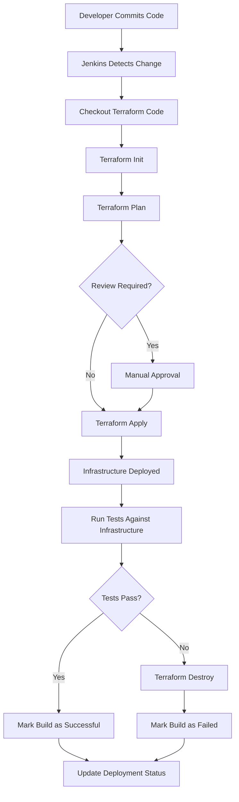

# Terraform with Jenkins

## Introduction

Integrating Terraform with Jenkins creates a powerful CI/CD pipeline for infrastructure automation. This combination allows teams to consistently deploy, update, and manage infrastructure with the same rigor and automation applied to application code. In this guide, we'll explore how to set up Terraform within Jenkins pipelines to automate infrastructure provisioning and management.

Terraform is an Infrastructure as Code (IaC) tool that lets you define and provision infrastructure using a declarative configuration language. Jenkins is a popular automation server that helps to implement continuous integration and continuous delivery (CI/CD) workflows. By combining these tools, you can automate the process of infrastructure deployment, ensuring consistency and reducing manual errors.

## Prerequisites

Before diving into the integration, make sure you have:

- Basic understanding of Terraform concepts (providers, resources, state)
- Familiarity with Jenkins concepts (jobs, pipelines)
- Jenkins server installed and running
- Terraform CLI installed on the Jenkins server

## Setting Up Jenkins for Terraform

### 1. Installing Required Jenkins Plugins

First, we need to install some Jenkins plugins to help with Terraform integration:

- **Terraform Plugin**: Provides native support for running Terraform commands
- **Credentials Plugin**: Manages cloud provider credentials securely
- **Pipeline Plugin**: Supports defining pipelines as code

To install these plugins:

1. Navigate to Jenkins dashboard
2. Go to **Manage Jenkins** > **Manage Plugins**
3. Click on the **Available** tab
4. Search for and select the plugins listed above
5. Click **Install without restart**

### 2. Configuring Credentials in Jenkins

To allow Jenkins to authenticate with your cloud provider (AWS, Azure, GCP, etc.), you need to set up credentials:

1. Go to **Manage Jenkins** > **Manage Credentials**
2. Click on the appropriate domain (usually "global")
3. Click **Add Credentials**
4. Choose the credential type based on your cloud provider:
   - For AWS: Select "AWS Credentials"
   - For other providers: Use "Secret text" or "Username with password"
5. Fill in the required information and give the credential an ID (e.g., `aws-terraform-credentials`)
6. Click **OK** to save

## Creating a Basic Terraform Jenkins Pipeline

Let's create a simple Jenkins pipeline that uses Terraform to provision infrastructure:

### Jenkinsfile Example

```groovy
pipeline {
    agent any
    
    environment {
        TF_IN_AUTOMATION = 'true'
        PATH = "${env.PATH}:/usr/local/bin"
    }
    
    stages {
        stage('Checkout') {
            steps {
                checkout scm
            }
        }
        
        stage('Terraform Init') {
            steps {
                withCredentials([[$class: 'AmazonWebServicesCredentialsBinding', 
                                  accessKeyVariable: 'AWS_ACCESS_KEY_ID',
                                  secretKeyVariable: 'AWS_SECRET_ACCESS_KEY',
                                  credentialsId: 'aws-terraform-credentials']]) {
                    sh 'terraform init'
                }
            }
        }
        
        stage('Terraform Plan') {
            steps {
                withCredentials([[$class: 'AmazonWebServicesCredentialsBinding', 
                                  accessKeyVariable: 'AWS_ACCESS_KEY_ID',
                                  secretKeyVariable: 'AWS_SECRET_ACCESS_KEY',
                                  credentialsId: 'aws-terraform-credentials']]) {
                    sh 'terraform plan -out=tfplan'
                }
            }
        }
        
        stage('Approval') {
            steps {
                input message: 'Do you want to apply this plan?'
            }
        }
        
        stage('Terraform Apply') {
            steps {
                withCredentials([[$class: 'AmazonWebServicesCredentialsBinding', 
                                  accessKeyVariable: 'AWS_ACCESS_KEY_ID',
                                  secretKeyVariable: 'AWS_SECRET_ACCESS_KEY',
                                  credentialsId: 'aws-terraform-credentials']]) {
                    sh 'terraform apply -auto-approve tfplan'
                }
            }
        }
    }
    
    post {
        always {
            archiveArtifacts artifacts: 'tfplan', allowEmptyArchive: true
        }
    }
}
```

This pipeline performs the following steps:

1. **Checkout**: Retrieves the Terraform configuration files from source control
2. **Terraform Init**: Initializes the Terraform working directory
3. **Terraform Plan**: Creates an execution plan and saves it to a file
4. **Approval**: Waits for manual approval before applying changes
5. **Terraform Apply**: Applies the saved plan to create infrastructure

## Understanding Terraform Backend Configuration

When using Terraform with Jenkins, it's important to configure a remote backend to store Terraform state files. This ensures that multiple Jenkins jobs or parallel builds don't interfere with each other.

Here's an example of a backend configuration for AWS S3:

```hcl
terraform {
  backend "s3" {
    bucket = "my-terraform-state-bucket"
    key    = "jenkins/terraform.tfstate"
    region = "us-west-2"
    dynamodb_table = "terraform-state-lock"
  }
}
```

This configuration:
- Stores the state file in an S3 bucket
- Uses DynamoDB for state locking to prevent concurrent modifications

## Advanced Jenkins Pipeline for Terraform

For more complex scenarios, you can enhance your Jenkins pipeline to include:

### Workspace Isolation

```groovy
pipeline {
    agent any
    
    environment {
        TF_WORKSPACE = "${env.BRANCH_NAME == 'main' ? 'prod' : 'dev'}"
    }
    
    stages {
        // ...pipeline stages...
    }
}
```

This example sets different Terraform workspaces based on the Git branch, allowing for environment-specific infrastructure.

### Parallel Terraform Validation

```groovy
stage('Validate') {
    parallel {
        stage('Terraform Format') {
            steps {
                sh 'terraform fmt -check'
            }
        }
        stage('Terraform Validate') {
            steps {
                sh 'terraform validate'
            }
        }
    }
}
```

This runs format checking and validation in parallel to speed up the pipeline.

## Parameterized Terraform Deployments

You can make your pipeline more flexible with parameters:

```groovy
pipeline {
    agent any
    
    parameters {
        choice(name: 'ENVIRONMENT', choices: ['dev', 'stage', 'prod'], description: 'Select deployment environment')
        string(name: 'INSTANCE_COUNT', defaultValue: '1', description: 'Number of instances to deploy')
    }
    
    stages {
        stage('Terraform Plan') {
            steps {
                sh """
                terraform plan \
                  -var="environment=${params.ENVIRONMENT}" \
                  -var="instance_count=${params.INSTANCE_COUNT}" \
                  -out=tfplan
                """
            }
        }
        
        // ...other stages...
    }
}
```

This allows users to select the environment and specify the number of instances when triggering the pipeline.

## Real-world Example: Web Application Infrastructure

Let's create a practical example that provisions infrastructure for a web application:

### 1. Terraform Configuration (`main.tf`)

```hcl
provider "aws" {
  region = var.region
}

module "vpc" {
  source = "terraform-aws-modules/vpc/aws"
  version = "3.14.0"
  
  name = "${var.project}-vpc"
  cidr = "10.0.0.0/16"
  
  azs             = ["${var.region}a", "${var.region}b"]
  private_subnets = ["10.0.1.0/24", "10.0.2.0/24"]
  public_subnets  = ["10.0.101.0/24", "10.0.102.0/24"]
  
  enable_nat_gateway = true
  single_nat_gateway = true
  
  tags = var.tags
}

module "web_server" {
  source = "terraform-aws-modules/ec2-instance/aws"
  version = "3.5.0"
  
  name = "${var.project}-web-server"
  
  ami                    = var.ami_id
  instance_type          = var.instance_type
  vpc_security_group_ids = [module.web_server_sg.security_group_id]
  subnet_id              = module.vpc.public_subnets[0]
  
  user_data = <<-EOT
    #!/bin/bash
    echo "Hello from Terraform deployed through Jenkins!" > index.html
    nohup python -m SimpleHTTPServer 80 &
  EOT
  
  tags = var.tags
}

module "web_server_sg" {
  source = "terraform-aws-modules/security-group/aws"
  version = "4.9.0"
  
  name        = "${var.project}-web-sg"
  description = "Security group for web server"
  vpc_id      = module.vpc.vpc_id
  
  ingress_cidr_blocks = ["0.0.0.0/0"]
  ingress_rules       = ["http-80-tcp", "ssh-tcp"]
  egress_rules        = ["all-all"]
}

output "web_url" {
  value = "http://${module.web_server.public_ip}"
}
```

### 2. Jenkins Pipeline for Deployment

```groovy
pipeline {
    agent any
    
    parameters {
        choice(name: 'ACTION', choices: ['plan', 'apply', 'destroy'], description: 'Terraform action to execute')
        string(name: 'INSTANCE_TYPE', defaultValue: 't2.micro', description: 'EC2 instance type')
    }
    
    environment {
        TF_VAR_project = "webapp-demo"
        TF_VAR_region = "us-west-2"
        TF_VAR_instance_type = "${params.INSTANCE_TYPE}"
        TF_VAR_ami_id = "ami-0c55b159cbfafe1f0" // Amazon Linux 2
        TF_VAR_tags = '{"Environment":"dev","Terraform":"true","Project":"WebDemo"}'
    }
    
    stages {
        stage('Checkout') {
            steps {
                checkout scm
            }
        }
        
        stage('Terraform Init') {
            steps {
                withCredentials([[$class: 'AmazonWebServicesCredentialsBinding', 
                                  credentialsId: 'aws-terraform-credentials']]) {
                    sh 'terraform init'
                }
            }
        }
        
        stage('Terraform Plan') {
            when {
                expression { params.ACTION == 'plan' || params.ACTION == 'apply' }
            }
            steps {
                withCredentials([[$class: 'AmazonWebServicesCredentialsBinding', 
                                  credentialsId: 'aws-terraform-credentials']]) {
                    sh 'terraform plan -out=tfplan'
                }
            }
        }
        
        stage('Terraform Apply') {
            when {
                expression { params.ACTION == 'apply' }
            }
            steps {
                withCredentials([[$class: 'AmazonWebServicesCredentialsBinding', 
                                  credentialsId: 'aws-terraform-credentials']]) {
                    sh 'terraform apply -auto-approve tfplan'
                }
            }
        }
        
        stage('Terraform Destroy') {
            when {
                expression { params.ACTION == 'destroy' }
            }
            steps {
                withCredentials([[$class: 'AmazonWebServicesCredentialsBinding', 
                                  credentialsId: 'aws-terraform-credentials']]) {
                    sh 'terraform destroy -auto-approve'
                }
            }
        }
    }
    
    post {
        success {
            script {
                if (params.ACTION == 'apply') {
                    def tfOutput = sh(script: 'terraform output -json', returnStdout: true).trim()
                    def outputJson = readJSON text: tfOutput
                    echo "Web application deployed successfully: ${outputJson.web_url.value}"
                }
            }
        }
    }
}
```

## Visualizing the Terraform CI/CD Process

To better understand how Terraform integrates with Jenkins, let's visualize the workflow:



## Best Practices for Terraform with Jenkins

1. **Use Remote State Storage**: Always configure a remote backend for state files
2. **Implement State Locking**: Prevent concurrent modifications with state locking
3. **Separate Environments**: Use workspaces or separate directories for different environments
4. **Version Control Terraform Code**: Store configurations in version control
5. **Implement Approval Gates**: Require approval for changes to production environments
6. **Store Sensitive Values Securely**: Use Jenkins credentials for API keys and secrets
7. **Archive Plans as Artifacts**: Save Terraform plans for audit and troubleshooting
8. **Add Timeouts**: Set timeouts for Terraform operations to prevent hung jobs
9. **Implement Drift Detection**: Periodically run `terraform plan` to detect manual changes
10. **Clean Workspaces**: Ensure Jenkins workspaces are clean before operations

## Handling Terraform State in CI/CD

Terraform state management is crucial when working with CI/CD pipelines. Here are some strategies:

### State Locking

```hcl
terraform {
  backend "s3" {
    bucket         = "terraform-state-bucket"
    key            = "path/to/my/key"
    region         = "us-east-1"
    dynamodb_table = "terraform-locks"
  }
}
```

The DynamoDB table prevents concurrent modifications of the same infrastructure.

### Handling State in Pull Requests

For pull requests, you can use a separate state file to avoid affecting production:

```groovy
environment {
    TF_CLI_ARGS_init = "-backend-config='key=pr-${env.CHANGE_ID}.tfstate'"
}
```

## Troubleshooting Common Issues

### 1. Jenkins Can't Find Terraform

**Problem**: Jenkins cannot locate the Terraform executable.

**Solution**: 
```groovy
environment {
    PATH = "${env.PATH}:/path/to/terraform"
}
```

### 2. Authentication Failures

**Problem**: Terraform cannot authenticate with the cloud provider.

**Solution**: Check credential binding in the pipeline and verify the credentials in Jenkins.

### 3. Concurrent Builds Conflict

**Problem**: Multiple builds interfere with each other.

**Solution**: Use the lock step in Jenkins to prevent concurrent execution:

```groovy
stage('Terraform Apply') {
    steps {
        lock('terraform-state') {
            sh 'terraform apply -auto-approve'
        }
    }
}
```

## Summary

Integrating Terraform with Jenkins provides a powerful framework for automating infrastructure deployment and management. By following the practices outlined in this guide, you can:

- Create automated pipelines for infrastructure changes
- Ensure consistency across environments
- Implement proper security and review processes
- Maintain a history of infrastructure changes
- Apply the principles of Infrastructure as Code at scale

This combination brings the benefits of CI/CD practices to infrastructure management, allowing teams to manage infrastructure with the same level of automation, testing,