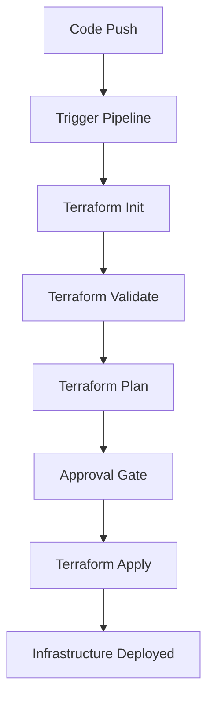

# Terraform with Azure DevOps

## Introduction

Infrastructure as Code (IaC) has revolutionized how we manage cloud resources, and Terraform has emerged as one of the leading tools in this space. While Terraform allows us to define infrastructure in a declarative way, integrating it into a CI/CD pipeline brings additional benefits like automation, consistency, and collaboration. 

Azure DevOps provides a robust platform for implementing CI/CD pipelines for Terraform, enabling teams to automate infrastructure deployments with proper testing and approval processes. This guide will walk you through setting up Terraform with Azure DevOps pipelines to create an efficient infrastructure deployment workflow.

## Prerequisites

Before we begin, make sure you have:

- An Azure subscription
- An Azure DevOps organization and project
- Basic familiarity with Terraform concepts
- Basic understanding of YAML and Azure DevOps pipelines

## Setting Up Your Repository

First, we need to set up a repository structure that works well for Terraform projects in Azure DevOps:

```
📁 terraform-project/
├── 📁 environments/
│   ├── 📁 dev/
│   │   ├── main.tf
│   │   ├── variables.tf
│   │   └── terraform.tfvars
│   ├── 📁 staging/
│   │   ├── main.tf
│   │   ├── variables.tf
│   │   └── terraform.tfvars
│   └── 📁 prod/
│       ├── main.tf
│       ├── variables.tf
│       └── terraform.tfvars
├── 📁 modules/
│   ├── 📁 networking/
│   ├── 📁 compute/
│   └── 📁 database/
├── azure-pipelines.yml
└── README.md
```

This structure separates configuration by environment while reusing common modules, which is a best practice for Terraform projects.

## Storing Terraform State in Azure

When working with Terraform in a team environment, storing state remotely is crucial. Azure Storage provides a perfect backend for Terraform state:

```hcl
# In each environment's main.tf file
terraform {
  required_providers {
    azurerm = {
      source  = "hashicorp/azurerm"
      version = "~> 3.0"
    }
  }

  backend "azurerm" {
    resource_group_name  = "terraform-state-rg"
    storage_account_name = "terraformstate12345"
    container_name       = "tfstate"
    key                  = "dev.terraform.tfstate"
  }
}

provider "azurerm" {
  features {}
}
```

## Creating Service Connections

Before setting up our pipeline, we need to create a service connection in Azure DevOps to allow our pipeline to interact with Azure:

1. In your Azure DevOps project, go to **Project Settings** > **Service connections**
2. Click **New service connection** > **Azure Resource Manager**
3. Select **Service principal (automatic)**
4. Fill in the required details and give it a name like `terraform-service-connection`

## Creating Azure DevOps Pipeline

Now, let's create our pipeline. Create an `azure-pipelines.yml` file in your repository:

```yaml
trigger:
  branches:
    include:
    - main
  paths:
    include:
    - environments/dev/**

pool:
  vmImage: 'ubuntu-latest'

variables:
  environment: 'dev'
  workingDirectory: '$(System.DefaultWorkingDirectory)/environments/$(environment)'

stages:
- stage: Validate
  jobs:
  - job: ValidateTerraform
    steps:
    - task: TerraformInstaller@0
      displayName: 'Install Terraform'
      inputs:
        terraformVersion: '1.3.7'
    
    - task: TerraformTaskV4@4
      displayName: 'Terraform Init'
      inputs:
        provider: 'azurerm'
        command: 'init'
        workingDirectory: '$(workingDirectory)'
        backendServiceArm: 'terraform-service-connection'
        backendAzureRmResourceGroupName: 'terraform-state-rg'
        backendAzureRmStorageAccountName: 'terraformstate12345'
        backendAzureRmContainerName: 'tfstate'
        backendAzureRmKey: 'dev.terraform.tfstate'
    
    - task: TerraformTaskV4@4
      displayName: 'Terraform Validate'
      inputs:
        provider: 'azurerm'
        command: 'validate'
        workingDirectory: '$(workingDirectory)'
    
    - task: TerraformTaskV4@4
      displayName: 'Terraform Plan'
      inputs:
        provider: 'azurerm'
        command: 'plan'
        workingDirectory: '$(workingDirectory)'
        environmentServiceNameAzureRM: 'terraform-service-connection'

- stage: Apply
  dependsOn: Validate
  condition: succeeded()
  jobs:
  - deployment: DeployTerraform
    environment: 'dev'
    strategy:
      runOnce:
        deploy:
          steps:
          - task: TerraformInstaller@0
            displayName: 'Install Terraform'
            inputs:
              terraformVersion: '1.3.7'
          
          - task: TerraformTaskV4@4
            displayName: 'Terraform Init'
            inputs:
              provider: 'azurerm'
              command: 'init'
              workingDirectory: '$(workingDirectory)'
              backendServiceArm: 'terraform-service-connection'
              backendAzureRmResourceGroupName: 'terraform-state-rg'
              backendAzureRmStorageAccountName: 'terraformstate12345'
              backendAzureRmContainerName: 'tfstate'
              backendAzureRmKey: 'dev.terraform.tfstate'
          
          - task: TerraformTaskV4@4
            displayName: 'Terraform Apply'
            inputs:
              provider: 'azurerm'
              command: 'apply'
              workingDirectory: '$(workingDirectory)'
              environmentServiceNameAzureRM: 'terraform-service-connection'
```

## Pipeline Workflow

Let's understand what our pipeline does:

<div>

</div>

The pipeline consists of two main stages:

1. **Validate Stage**: Initializes Terraform, validates the syntax, and creates an execution plan
2. **Apply Stage**: Applies the changes to create/update the infrastructure

## Understanding Key Pipeline Components

### Terraform Tasks

Azure DevOps provides built-in tasks for working with Terraform:

- **TerraformInstaller**: Installs the specified version of Terraform
- **TerraformTaskV4**: Executes Terraform commands (init, validate, plan, apply)

### Environment Approvals

To add a manual approval step before deploying to production, you can configure approvals:

1. Go to **Pipelines** > **Environments**
2. Select or create your environment (e.g., `prod`)
3. Click on the three dots (...) and select **Approvals and checks**
4. Add approvers who need to authorize deployments

### Parameterizing the Pipeline

To make our pipeline more flexible, we can use parameters to specify the environment:

```yaml
parameters:
- name: environment
  displayName: Environment
  type: string
  default: dev
  values:
  - dev
  - staging
  - prod

variables:
  workingDirectory: '$(System.DefaultWorkingDirectory)/environments/${{ parameters.environment }}'
```

## Creating a Multi-Environment Pipeline

For a complete CI/CD solution, we can extend our pipeline to handle multiple environments:

```yaml
trigger:
  branches:
    include:
    - main

pool:
  vmImage: 'ubuntu-latest'

stages:
- stage: DeployDev
  displayName: 'Deploy to Development'
  jobs:
  - template: pipeline-templates/terraform-deploy.yml
    parameters:
      environment: 'dev'

- stage: DeployStaging
  displayName: 'Deploy to Staging'
  dependsOn: DeployDev
  jobs:
  - template: pipeline-templates/terraform-deploy.yml
    parameters:
      environment: 'staging'

- stage: DeployProduction
  displayName: 'Deploy to Production'
  dependsOn: DeployStaging
  jobs:
  - template: pipeline-templates/terraform-deploy.yml
    parameters:
      environment: 'prod'
```

## Best Practices for Terraform with Azure DevOps

1. **Use Remote State**: Always store Terraform state in Azure Storage.

2. **State Locking**: Ensure state locking is enabled to prevent concurrent modifications.

3. **Separate Environments**: Maintain separate state files for each environment.

4. **Module Reusability**: Create reusable modules for common infrastructure components.

5. **Variable Management**: Use variable files and Azure DevOps variable groups for configuration.

6. **Plan Output as Artifact**: Save the Terraform plan output as a pipeline artifact for review.

7. **Include Automated Testing**: Add infrastructure testing using tools like Terratest.

8. **Use Workspaces**: Leverage Terraform workspaces for managing multiple environments with the same configuration.

## Practical Example: Deploying a Web App

Let's create a practical example that deploys an Azure Web App using Terraform and Azure DevOps:

First, our Terraform configuration in `environments/dev/main.tf`:

```hcl
terraform {
  required_providers {
    azurerm = {
      source  = "hashicorp/azurerm"
      version = "~> 3.0"
    }
  }

  backend "azurerm" {
    resource_group_name  = "terraform-state-rg"
    storage_account_name = "terraformstate12345"
    container_name       = "tfstate"
    key                  = "dev.terraform.tfstate"
  }
}

provider "azurerm" {
  features {}
}

resource "azurerm_resource_group" "example" {
  name     = "example-resources"
  location = "East US"
}

resource "azurerm_app_service_plan" "example" {
  name                = "example-appserviceplan"
  location            = azurerm_resource_group.example.location
  resource_group_name = azurerm_resource_group.example.name
  kind                = "Linux"
  reserved            = true

  sku {
    tier = "Basic"
    size = "B1"
  }
}

resource "azurerm_app_service" "example" {
  name                = "example-webapp-12345"
  location            = azurerm_resource_group.example.location
  resource_group_name = azurerm_resource_group.example.name
  app_service_plan_id = azurerm_app_service_plan.example.id

  site_config {
    linux_fx_version = "NODE|14-lts"
  }
}

output "webapp_url" {
  value = "https://${azurerm_app_service.example.default_site_hostname}"
}
```

For variables, in `environments/dev/variables.tf`:

```hcl
variable "location" {
  description = "The Azure region where resources will be created"
  type        = string
  default     = "East US"
}

variable "app_name" {
  description = "Name of the web application"
  type        = string
  default     = "example-webapp"
}
```

## Advanced: Using Variable Groups

To better manage environment-specific variables, we can use Azure DevOps variable groups:

1. Go to **Pipelines** > **Library** > **Variable groups**
2. Create a new variable group named `terraform-dev-variables`
3. Add variables like `resource_group_name`, `location`, etc.

Then, reference them in your pipeline:

```yaml
variables:
- group: terraform-dev-variables
- name: workingDirectory 
  value: '$(System.DefaultWorkingDirectory)/environments/$(environment)'

steps:
- task: TerraformTaskV4@4
  displayName: 'Terraform Apply'
  inputs:
    provider: 'azurerm'
    command: 'apply'
    workingDirectory: '$(workingDirectory)'
    environmentServiceNameAzureRM: 'terraform-service-connection'
    commandOptions: '-var="resource_group_name=$(resource_group_name)" -var="location=$(location)"'
```

## Troubleshooting Common Issues

### Authentication Failures

If your pipeline fails with authentication errors:
1. Check that your service connection has the right permissions
2. Verify that the service principal hasn't expired
3. Ensure the service principal has required roles (Contributor) on your subscription

### State Locking Issues

If you encounter state locking problems:
1. Check if a previous pipeline run is still holding the lock
2. Verify that the storage account allows the service principal to create blobs and leases
3. As a last resort, use the Azure portal to delete the lease on the state blob

### Failed Deployments

For failed Terraform deployments:
1. Review the detailed logs from the Terraform apply step
2. Check Azure Activity Log for specific resource creation failures
3. Try running the same commands locally to see if you can reproduce the issue

## Summary

Integrating Terraform with Azure DevOps provides a powerful combination for implementing Infrastructure as Code with proper CI/CD practices. In this guide, we covered:

- Setting up a Terraform repository structure
- Configuring Azure Storage for remote state management
- Creating an Azure DevOps pipeline for Terraform deployment
- Implementing a multi-environment deployment strategy
- Best practices for managing Terraform in a team environment

By following these practices, you can create reliable, repeatable infrastructure deployments that scale with your organization's needs.

## Additional Resources

- [Terraform Documentation](https://www.terraform.io/docs)
- [Azure DevOps Documentation](https://docs.microsoft.com/en-us/azure/devops/)
- [Terraform Provider for Azure](https://registry.terraform.io/providers/hashicorp/azurerm/latest/docs)
- [HashiCorp Learn - Terraform on Azure](https://learn.hashicorp.com/collections/terraform/azure-get-started)

## Exercises

1. Create a Terraform configuration that deploys a virtual network with subnets and integrate it into an Azure DevOps pipeline.
2. Modify the pipeline to support deployment to multiple environments (dev, staging, prod) with different configurations.
3. Add a manual approval step before deploying to the production environment.
4. Configure a policy that requires all Terraform changes to be reviewed before merging to the main branch.
5. Implement a backend service for remote state with proper state locking and versioning.