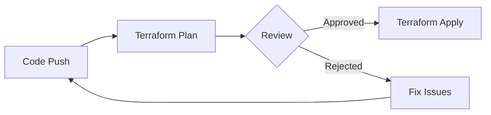
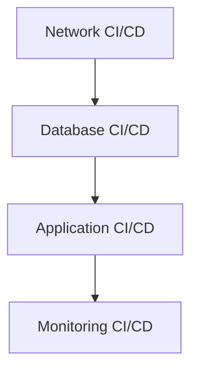

# Terraform Automation

## Introduction

Terraform Automation refers to the practice of integrating Terraform's infrastructure as code capabilities into automated workflows, primarily through Continuous Integration and Continuous Deployment (CI/CD) pipelines. By automating Terraform operations, teams can consistently provision, update, and manage infrastructure without manual intervention, reducing human error and increasing efficiency.

When we build infrastructure manually, we face several challenges:
- Inconsistent environments
- Configuration drift
- Lack of audit trails
- Time-consuming repetitive tasks
- Potential for human error

Automation solves these problems by creating a standardized, repeatable process for infrastructure deployment and management.

## Prerequisites

Before diving into Terraform automation, you should have:

- Basic understanding of Terraform concepts
- Familiarity with version control systems (like Git)
- Access to a CI/CD platform (GitHub Actions, GitLab CI, Jenkins, etc.)
- A cloud provider account (AWS, Azure, GCP, etc.)

## Core Components of Terraform Automation

### Version Control

The foundation of any automation workflow is version control. For Terraform, this means storing your `.tf` files in a Git repository.

```bash
# Initialize a Git repository for your Terraform code
git init
git add *.tf
git commit -m "Initial Terraform configuration"
```

Version control provides:
- History of all changes
- Collaboration capabilities
- Branch-based workflows
- A single source of truth

### Terraform State Management

When automating Terraform, remote state storage is essential. This allows multiple team members and CI/CD pipelines to access the same state file.

```hcl
terraform {
  backend "s3" {
    bucket = "my-terraform-state"
    key    = "prod/terraform.tfstate"
    region = "us-east-1"
    # For production, consider enabling:
    # encrypt = true
    # dynamodb_table = "terraform-locks"
  }
}
```

Options for remote state storage include:
- AWS S3 + DynamoDB (shown above)
- Azure Storage
- Google Cloud Storage
- Terraform Cloud
- HashiCorp Consul

### Workspace Management

Terraform workspaces help manage multiple environments (dev, staging, prod) with the same code base.

```bash
# Create and switch to a new workspace
terraform workspace new dev
terraform workspace new prod
terraform workspace select dev

# Check current workspace
terraform workspace show
```

In your CI/CD pipeline, you can select the appropriate workspace based on the deployment target:

```bash
terraform workspace select ${ENVIRONMENT}
terraform apply -auto-approve
```

## Setting Up CI/CD for Terraform

Let's explore how to set up Terraform automation using different CI/CD platforms.

### GitHub Actions Example

Create a `.github/workflows/terraform.yml` file:

```yaml
name: "Terraform CI/CD"

on:
  push:
    branches: [ main ]
  pull_request:
    branches: [ main ]

jobs:
  terraform:
    name: "Terraform"
    runs-on: ubuntu-latest
    
    env:
      AWS_ACCESS_KEY_ID: ${{ secrets.AWS_ACCESS_KEY_ID }}
      AWS_SECRET_ACCESS_KEY: ${{ secrets.AWS_SECRET_ACCESS_KEY }}
      
    steps:
      - name: Checkout
        uses: actions/checkout@v3
      
      - name: Setup Terraform
        uses: hashicorp/setup-terraform@v2
        with:
          terraform_version: 1.5.0
      
      - name: Terraform Init
        id: init
        run: terraform init
      
      - name: Terraform Format
        id: fmt
        run: terraform fmt -check
      
      - name: Terraform Plan
        id: plan
        if: github.event_name == 'pull_request'
        run: terraform plan -no-color
        continue-on-error: true
      
      - name: Update PR
        uses: actions/github-script@v6
        if: github.event_name == 'pull_request'
        with:
          github-token: ${{ secrets.GITHUB_TOKEN }}
          script: |
            const output = `#### Terraform Format and Style 🖌\`${{ steps.fmt.outcome }}\`
            #### Terraform Plan 📖\`${{ steps.plan.outcome }}\`
            
            <details><summary>Show Plan</summary>
            
            \`\`\`terraform
            ${{ steps.plan.outputs.stdout }}
            \`\`\`
            
            </details>`;
              
            github.rest.issues.createComment({
              issue_number: context.issue.number,
              owner: context.repo.owner,
              repo: context.repo.repo,
              body: output
            })
      
      - name: Terraform Apply
        if: github.ref == 'refs/heads/main' && github.event_name == 'push'
        run: terraform apply -auto-approve
```

This workflow:
1. Runs on pushes to main and pull requests
2. Initializes Terraform
3. Checks formatting
4. Creates a plan for pull requests and comments the results
5. Applies changes automatically when code is merged to main

### GitLab CI Example

Create a `.gitlab-ci.yml` file:

```yaml
image: hashicorp/terraform:1.5.0

stages:
  - validate
  - plan
  - apply

variables:
  TF_ROOT: ${CI_PROJECT_DIR}/terraform

cache:
  paths:
    - ${TF_ROOT}/.terraform

before_script:
  - cd ${TF_ROOT}
  - terraform --version
  - terraform init

validate:
  stage: validate
  script:
    - terraform validate
    - terraform fmt -check

plan:
  stage: plan
  script:
    - terraform plan -out=tfplan
  artifacts:
    paths:
      - ${TF_ROOT}/tfplan

apply:
  stage: apply
  script:
    - terraform apply -auto-approve tfplan
  artifacts:
    paths:
      - ${TF_ROOT}/terraform.tfstate
  dependencies:
    - plan
  only:
    - main
```

## Best Practices for Terraform Automation

### 1. Implement Proper Validation Steps

Always include validation steps in your pipeline:

```bash
# Validate Terraform syntax
terraform validate

# Check formatting
terraform fmt -check

# Run custom policy checks with tools like Checkov or tfsec
checkov -d .
tfsec .
```

### 2. Use Terraform Plan Approval Process

For production environments, implement a manual approval process:



### 3. Implement Environment-Specific Variables

Use variable files for different environments:

```
├── environments/
│   ├── dev.tfvars
│   ├── staging.tfvars
│   └── prod.tfvars
```

Then in your CI/CD pipeline:

```bash
terraform apply -var-file=environments/${ENVIRONMENT}.tfvars -auto-approve
```

### 4. Leverage Terraform Modules

Create reusable modules to standardize infrastructure components:

```hcl
module "vpc" {
  source = "./modules/vpc"
  
  cidr_block = var.vpc_cidr
  environment = var.environment
}

module "ec2_instance" {
  source = "./modules/ec2"
  
  instance_type = var.instance_type
  subnet_id = module.vpc.subnet_id
}
```

## Real-world Example: Multi-Environment AWS Infrastructure

Let's create a practical example that provisions AWS infrastructure across multiple environments.

First, our project structure:

```
terraform-project/
├── main.tf
├── variables.tf
├── outputs.tf
├── environments/
│   ├── dev.tfvars
│   ├── staging.tfvars
│   └── prod.tfvars
├── modules/
│   ├── vpc/
│   ├── ec2/
│   └── rds/
└── .github/
    └── workflows/
        └── terraform.yml
```

### Module Example: VPC Module

```hcl
# modules/vpc/main.tf
resource "aws_vpc" "main" {
  cidr_block = var.cidr_block
  
  tags = {
    Name = "${var.environment}-vpc"
    Environment = var.environment
  }
}

resource "aws_subnet" "public" {
  count = length(var.public_subnets)
  
  vpc_id = aws_vpc.main.id
  cidr_block = var.public_subnets[count.index]
  availability_zone = var.availability_zones[count.index]
  
  tags = {
    Name = "${var.environment}-public-subnet-${count.index}"
    Environment = var.environment
  }
}

# Additional VPC resources would be defined here
```

### Main Configuration

```hcl
# main.tf
terraform {
  required_providers {
    aws = {
      source = "hashicorp/aws"
      version = "~> 4.0"
    }
  }
  
  backend "s3" {
    bucket = "my-terraform-state"
    key    = "terraform.tfstate"
    region = "us-east-1"
    dynamodb_table = "terraform-locks"
  }
}

provider "aws" {
  region = var.aws_region
}

module "vpc" {
  source = "./modules/vpc"
  
  cidr_block = var.vpc_cidr
  environment = var.environment
  public_subnets = var.public_subnets
  availability_zones = var.availability_zones
}

module "ec2_instances" {
  source = "./modules/ec2"
  
  instance_count = var.instance_count
  instance_type = var.instance_type
  vpc_id = module.vpc.vpc_id
  subnet_ids = module.vpc.public_subnet_ids
  environment = var.environment
}

# Additional modules would be included here
```

### Environment Variables

```hcl
# environments/dev.tfvars
environment = "dev"
aws_region = "us-east-1"
vpc_cidr = "10.0.0.0/16"
public_subnets = ["10.0.1.0/24", "10.0.2.0/24"]
availability_zones = ["us-east-1a", "us-east-1b"]
instance_count = 1
instance_type = "t2.micro"
```

```hcl
# environments/prod.tfvars
environment = "prod"
aws_region = "us-east-1"
vpc_cidr = "10.1.0.0/16"
public_subnets = ["10.1.1.0/24", "10.1.2.0/24", "10.1.3.0/24"]
availability_zones = ["us-east-1a", "us-east-1b", "us-east-1c"]
instance_count = 3
instance_type = "t3.medium"
```

## Automating Terraform with Terraform Cloud

Terraform Cloud offers built-in automation capabilities:

1. Connect your VCS repository to Terraform Cloud
2. Configure workspace settings and variables
3. Set up run triggers between workspaces

```hcl
terraform {
  cloud {
    organization = "my-organization"
    
    workspaces {
      name = "my-project-prod"
    }
  }
}
```

Benefits of Terraform Cloud for automation:
- Built-in state management
- Secret management for variables
- Run history and logging
- Policy as code with Sentinel
- Team collaboration features

## Implementing Drift Detection

Infrastructure can drift from its desired state. Automated drift detection helps identify unauthorized changes:

```yaml
# .github/workflows/drift-detection.yml
name: "Terraform Drift Detection"

on:
  schedule:
    - cron: '0 8 * * *'  # Run daily at 8 AM

jobs:
  detect-drift:
    runs-on: ubuntu-latest
    steps:
      - name: Checkout
        uses: actions/checkout@v3
      
      - name: Setup Terraform
        uses: hashicorp/setup-terraform@v2
      
      - name: Terraform Init
        run: terraform init
      
      - name: Detect Drift
        id: drift
        run: |
          terraform plan -detailed-exitcode
          echo "DRIFT_EXITCODE=$?" >> $GITHUB_ENV
      
      - name: Send Notification
        if: env.DRIFT_EXITCODE == 2
        uses: actions/github-script@v6
        with:
          github-token: ${{ secrets.GITHUB_TOKEN }}
          script: |
            github.rest.issues.create({
              owner: context.repo.owner,
              repo: context.repo.repo,
              title: 'Infrastructure Drift Detected',
              body: 'Terraform plan detected drift in infrastructure. Please investigate.'
            })
```

This workflow:
1. Runs daily
2. Performs a `terraform plan`
3. Checks for differences (exit code 2 indicates differences)
4. Creates an issue if drift is detected

## Handling Terraform Dependencies

In real-world scenarios, you might need to manage dependencies between infrastructure components. Terraform's remote state data sources help with this:

```hcl
# In database deployment
terraform {
  backend "s3" {
    bucket = "my-terraform-state"
    key    = "database/terraform.tfstate"
    region = "us-east-1"
  }
}

# In application deployment
data "terraform_remote_state" "database" {
  backend = "s3"
  config = {
    bucket = "my-terraform-state"
    key    = "database/terraform.tfstate"
    region = "us-east-1"
  }
}

resource "aws_instance" "app_server" {
  # Use outputs from the database state
  subnet_id = data.terraform_remote_state.database.outputs.subnet_id
}
```

In CI/CD, you can automate the sequence:



## Advanced Terraform Automation Techniques

### 1. Automated Testing of Infrastructure

Use Terratest to write automated tests for your infrastructure:

```go
// test/vpc_test.go
package test

import (
	"testing"
	"github.com/gruntwork-io/terratest/modules/terraform"
	"github.com/stretchr/testify/assert"
)

func TestVpcModule(t *testing.T) {
	terraformOptions := terraform.WithDefaultRetryableErrors(t, &terraform.Options{
		TerraformDir: "../modules/vpc",
		Vars: map[string]interface{}{
			"cidr_block": "10.0.0.0/16",
			"environment": "test",
		},
	})

	defer terraform.Destroy(t, terraformOptions)
	terraform.InitAndApply(t, terraformOptions)

	vpcId := terraform.Output(t, terraformOptions, "vpc_id")
	assert.NotEmpty(t, vpcId)
}
```

Add this to your CI pipeline:

```yaml
test:
  stage: test
  script:
    - cd test
    - go test -v
```

### 2. Cost Estimation in CI/CD

Integrate Infracost to estimate infrastructure costs:

```yaml
cost-estimate:
  stage: plan
  script:
    - terraform plan -out=tfplan
    - terraform show -json tfplan > plan.json
    - infracost breakdown --path plan.json --format table
  artifacts:
    paths:
      - infracost-report.html
```

### 3. Security Scanning

Add security scanning with tools like tfsec:

```yaml
security-scan: