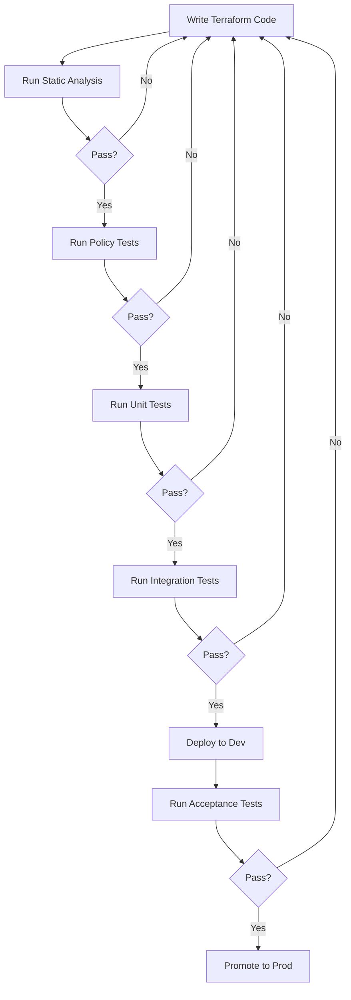

# Terraform Testing

## Introduction

Testing your Terraform code is a critical practice in modern Infrastructure as Code (IaC) workflows. Just like application code, infrastructure code needs to be validated to ensure it's reliable, secure, and compliant with organizational standards. In this guide, we'll explore different approaches to testing Terraform configurations and how to integrate them into your CI/CD pipelines.

Testing Terraform code helps catch issues early, prevents costly mistakes in production environments, and improves the overall quality of your infrastructure code. Let's dive into the world of Terraform testing!

## Why Test Terraform Code?

Before we explore specific testing methods, let's understand why testing Terraform configurations is essential:

1. **Prevent Configuration Errors**: Catch syntax errors and invalid resource configurations before deployment
2. **Ensure Security Compliance**: Verify that your infrastructure follows security best practices
3. **Validate Business Logic**: Confirm that your infrastructure meets functional requirements
4. **Prevent Regressions**: Ensure changes don't break existing functionality
5. **Document Expected Behavior**: Tests serve as documentation for how infrastructure should work

## Types of Terraform Tests

### Static Analysis

Static analysis examines your Terraform code without executing it. This is typically the first line of defense against errors.

#### Terraform Validate

The simplest form of static analysis is using the built-in `terraform validate` command:

```bash
terraform validate
```

**Example Output:**
```
Success! The configuration is valid.
```

#### Terraform Format

The `terraform fmt` command ensures consistent code formatting:

```bash
terraform fmt -check
```

**Example Output:**
```
main.tf
variables.tf
```

This output indicates files that need formatting. To automatically format them, run:

```bash
terraform fmt
```

#### Terraform Lint with TFLint

[TFLint](https://github.com/terraform-linters/tflint) is a third-party linter that catches issues Terraform's built-in validation might miss:

```bash
tflint
```

**Example Output:**
```
main.tf:15:1: Error: Instance type "t2.micro" is previous generation (aws_instance_previous_type)
```

#### Example TFLint Configuration

Create a `.tflint.hcl` file in your project root:

```hcl
plugin "aws" {
  enabled = true
  version = "0.21.0"
  source  = "github.com/terraform-linters/tflint-ruleset-aws"
}

rule "terraform_documented_outputs" {
  enabled = true
}

rule "terraform_documented_variables" {
  enabled = true
}
```

### Policy as Code

Policy as Code tools help enforce organizational standards and security best practices.

#### Checkov

[Checkov](https://github.com/bridgecrewio/checkov) scans your Terraform code for security and compliance issues:

```bash
checkov -d .
```

**Example Output:**
```
Check: CKV_AWS_41: "Ensure no hard coded AWS access key and secret key in provider"
   PASSED for resource: aws.default
   File: /provider.tf:1-7
Check: CKV_AWS_126: "Ensure that detailed monitoring is enabled for EC2 instances"
   FAILED for resource: aws_instance.web
   File: /main.tf:15-25
      15 | resource "aws_instance" "web" {
      16 |   ami           = "ami-0c55b159cbfafe1f0"
      17 |   instance_type = "t2.micro"
      18 |   
      19 |   tags = {
      20 |     Name = "WebServer"
      21 |   }
      22 | }
```

#### Terrascan

[Terrascan](https://github.com/accurics/terrascan) is another popular tool for compliance and security scanning:

```bash
terrascan scan -d .
```

#### Terraform Sentinel

For HashiCorp Terraform Cloud/Enterprise users, [Sentinel](https://www.hashicorp.com/sentinel) provides policy enforcement:

```hcl
policy "enforce-mandatory-tags" {
  enforcement_level = "hard-mandatory"
}
```

**Example Sentinel Policy:**

```python
import "tfplan"

required_tags = ["Environment", "Owner"]

tags_validation = rule {
  all tfplan.resources.aws_instance as _, instances {
    all instances as _, instance {
      all required_tags as rt {
        instance.applied.tags contains rt
      }
    }
  }
}

main = rule {
  tags_validation
}
```

### Automated Testing

#### Terratest

[Terratest](https://github.com/gruntwork-io/terratest) is a Go library that makes it easier to write automated tests for your infrastructure code:

```go
package test

import (
	"testing"
	"github.com/gruntwork-io/terratest/modules/terraform"
	"github.com/stretchr/testify/assert"
)

func TestTerraformHelloWorldExample(t *testing.T) {
	// Arrange
	terraformOptions := terraform.WithDefaultRetryableErrors(t, &terraform.Options{
		TerraformDir: "../examples/terraform-hello-world-example",
	})

	// Act
	defer terraform.Destroy(t, terraformOptions)
	terraform.InitAndApply(t, terraformOptions)

	// Assert
	output := terraform.Output(t, terraformOptions, "hello_world")
	assert.Equal(t, "Hello, World!", output)
}
```

To run Terratest:

```bash
cd test
go test -v
```

#### Terraform Test Framework (Experimental)

HashiCorp's experimental Terraform test framework allows writing tests in native HCL:

```hcl
// tests/vpc_test.tf
provider "aws" {
  region = "us-west-2"
}

module "vpc_test" {
  source = "../modules/vpc"
  cidr_block = "10.0.0.0/16"
}

resource "terraform_data" "test" {
  depends_on = [module.vpc_test]

  provisioner "local-exec" {
    command = <<-EOT
      test "$(aws ec2 describe-vpcs --vpc-ids ${module.vpc_test.vpc_id} --query 'Vpcs[0].CidrBlock' --output text)" = "10.0.0.0/16"
    EOT
  }
}
```

Run with:

```bash
terraform test
```

### Integration Testing with Kitchen-Terraform

[Kitchen-Terraform](https://github.com/newcontext-oss/kitchen-terraform) combines Test Kitchen with Terraform to provide a framework for testing infrastructure code.

Create a `.kitchen.yml` file:

```yaml
---
driver:
  name: terraform
  root_module_directory: test/fixtures/default

provisioner:
  name: terraform

verifier:
  name: terraform
  systems:
    - name: aws
      backend: aws

platforms:
  - name: aws

suites:
  - name: default
    verifier:
      controls:
        - example
```

Create test files in Ruby:

```ruby
# test/integration/default/controls/example.rb
control 'example' do
  title 'Example Test'
  
  describe aws_vpc(vpc_id: attribute('vpc_id')) do
    it { should exist }
    its('cidr_block') { should eq '10.0.0.0/16' }
  end
end
```

Run with:

```bash
kitchen test
```

## Integrating with CI/CD Pipelines

Let's look at how to incorporate Terraform testing into popular CI/CD platforms.

### GitHub Actions Example

```yaml
name: Terraform CI

on:
  push:
    branches: [ main ]
  pull_request:
    branches: [ main ]

jobs:
  validate:
    runs-on: ubuntu-latest
    steps:
      - uses: actions/checkout@v3
      
      - name: Setup Terraform
        uses: hashicorp/setup-terraform@v2
        
      - name: Terraform Init
        run: terraform init
        
      - name: Terraform Format
        run: terraform fmt -check
        
      - name: Terraform Validate
        run: terraform validate
        
      - name: Setup TFLint
        uses: terraform-linters/setup-tflint@v3
        
      - name: Run TFLint
        run: tflint --format=compact
        
      - name: Install Checkov
        run: pip install checkov
        
      - name: Run Checkov
        run: checkov -d .
        
  test:
    needs: validate
    runs-on: ubuntu-latest
    steps:
      - uses: actions/checkout@v3
      
      - name: Setup Go
        uses: actions/setup-go@v3
        with:
          go-version: '1.19'
          
      - name: Setup Terraform
        uses: hashicorp/setup-terraform@v2
        
      - name: Run Terratest
        run: |
          cd test
          go test -v -timeout 30m
```

### GitLab CI Example

```yaml
stages:
  - validate
  - test

variables:
  TF_ROOT: ${CI_PROJECT_DIR}

validate:
  stage: validate
  image: hashicorp/terraform:latest
  script:
    - cd ${TF_ROOT}
    - terraform init
    - terraform fmt -check
    - terraform validate
    - terraform plan -out=plan.tfplan

lint:
  stage: validate
  image: ghcr.io/terraform-linters/tflint:latest
  script:
    - cd ${TF_ROOT}
    - tflint --format=compact

security_scan:
  stage: validate
  image: bridgecrew/checkov:latest
  script:
    - cd ${TF_ROOT}
    - checkov -d .

terratest:
  stage: test
  image: golang:1.19
  script:
    - cd ${TF_ROOT}/test
    - go test -v -timeout 30m
```

## Real-World Testing Workflow

Let's walk through a typical workflow for testing Terraform code:



## Best Practices

1. **Start Simple**: Begin with static analysis, then gradually add more complex tests
2. **Test in Isolation**: Use mock providers or isolated environments for testing
3. **Use Test Fixtures**: Create separate test directories with minimal configurations
4. **Clean Up Resources**: Always clean up created resources after tests complete
5. **Test Failures**: Test that your code fails properly when it should
6. **CI Integration**: Run tests automatically on every commit/PR
7. **Test Coverage**: Aim to test all critical infrastructure components
8. **Keep Tests Fast**: Optimize tests to run quickly in CI pipelines

## Example Project Structure

Here's an example of how to structure your Terraform project for testability:

```
project/
├── main.tf
├── variables.tf
├── outputs.tf
├── .tflint.hcl
├── .github/
│   └── workflows/
│       └── terraform.yml
├── examples/
│   └── complete/
│       ├── main.tf
│       ├── variables.tf
│       └── outputs.tf
└── test/
    ├── fixtures/
    │   └── default/
    │       ├── main.tf
    │       └── outputs.tf
    └── integration/
        └── default/
            └── controls/
                └── example.rb
```

## Summary

Testing Terraform code is a crucial practice for maintaining high-quality infrastructure as code. We've covered:

- Static analysis tools like Terraform validate, fmt, and TFLint
- Policy as Code with Checkov and Sentinel
- Automated testing with Terratest and Kitchen-Terraform 
- CI/CD integration with GitHub Actions and GitLab CI
- Best practices for structuring your Terraform projects for testability

By implementing a comprehensive testing strategy, you can catch issues early, ensure compliance with organizational standards, and deliver more reliable infrastructure.

## Additional Resources

- [Terraform Documentation](https://www.terraform.io/docs/index.html)
- [Terratest GitHub Repository](https://github.com/gruntwork-io/terratest)
- [Checkov Documentation](https://www.checkov.io/1.Welcome/Quick%20Start.html)
- [Kitchen-Terraform GitHub Repository](https://github.com/newcontext-oss/kitchen-terraform)

## Exercises

1. Set up a basic Terraform project and implement `terraform validate` and `terraform fmt` checks.
2. Install TFLint and create a custom rule set for your project.
3. Write a simple Terratest test for a Terraform module that creates an AWS S3 bucket.
4. Implement a GitHub Actions workflow for your Terraform project that runs all the validation steps.
5. Create a policy test using Checkov that ensures all your AWS resources have required tags.