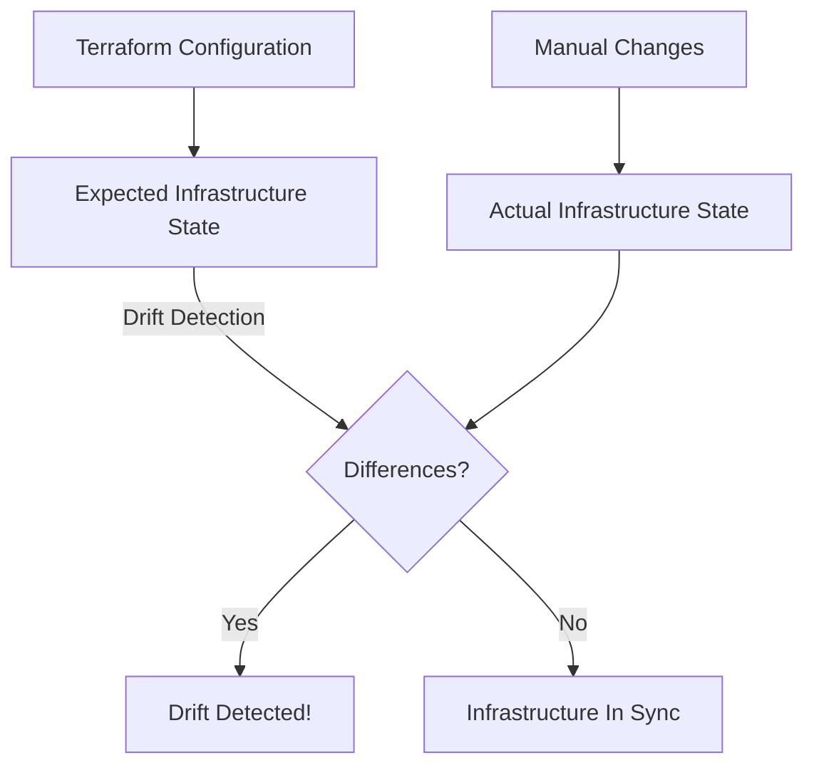

# Terraform Drift Detection

## Introduction

Infrastructure as Code (IaC) tools like Terraform help us define and provision our infrastructure in a declarative way. When we define infrastructure in Terraform, we expect the actual deployed infrastructure to match our configuration files. However, in real-world scenarios, infrastructure can change over time due to manual modifications, emergency fixes, or changes made through other tools. These untracked changes are known as "infrastructure drift."

Drift detection is the process of identifying differences between your infrastructure's actual state and the state defined in your Terraform configuration. This is a critical practice for maintaining infrastructure integrity and preventing unexpected behavior in your applications.

## What is Infrastructure Drift?

Infrastructure drift occurs when your actual deployed resources no longer match your Terraform configuration. For example:

- Someone manually modifies a security group rule in the AWS console
- A database instance is resized without updating the Terraform configuration
- A resource is deleted outside of Terraform

Let's visualize this concept:



## How Terraform Tracks State

Before diving into drift detection, it's important to understand how Terraform tracks state:

1. **State File**: Terraform maintains a state file (usually `terraform.tfstate`) that maps your configuration to real-world resources
2. **Resource IDs**: Each resource in your state file is mapped to a unique ID in your cloud provider
3. **Attributes**: The state file stores the current values of all resource attributes

Terraform uses this state file to determine what actions it needs to take during operations like `plan` and `apply`.

## Detecting Drift with Terraform

Terraform provides several commands that can help detect infrastructure drift:

### Using `terraform plan`

The most common way to check for drift is by running `terraform plan`:

```bash
terraform plan
```

If your infrastructure has drifted, you'll see output similar to:

```
Terraform will perform the following actions:

  # aws_security_group.example will be updated in-place
  ~ resource "aws_security_group" "example" {
        id                     = "sg-0123456789abcdef"
        name                   = "example"
      ~ ingress                = [
          - {
              - cidr_blocks      = [
                  - "0.0.0.0/0",
                ]
              - description      = "HTTP from anywhere"
              - from_port        = 80
              - protocol         = "tcp"
              - to_port          = 80
            },
          + {
              + cidr_blocks      = [
                  + "10.0.0.0/8",
                ]
              + description      = "HTTP from VPC"
              + from_port        = 80
              + protocol         = "tcp"
              + to_port          = 80
            },
        ]
        # ... other attributes
    }

Plan: 0 to add, 1 to change, 0 to destroy.
```

In this example, the security group ingress rules have been modified outside of Terraform.

### Using `terraform refresh`

You can update the state file to match the actual infrastructure by running:

```bash
terraform refresh
```

This command updates the state file but doesn't modify your infrastructure. After running `refresh`, you can compare your state file with your configuration using `terraform plan` to identify drift.

> **Warning**: Be careful with `terraform refresh` as it will overwrite your state file to match the current infrastructure, which might cause you to lose track of changes.

### Using `terraform show`

To inspect the current state:

```bash
terraform show
```

This command displays the resources and their attributes as currently tracked in your state file.

## Automating Drift Detection in CI/CD

Detecting drift manually is important, but incorporating it into your CI/CD pipeline ensures that drift is identified early and consistently.

### Example CI/CD Pipeline with Drift Detection

Here's how you might set up a basic drift detection job in a CI/CD pipeline:

1. **GitHub Actions Example**:

```yaml
name: Terraform Drift Detection

on:
  schedule:
    - cron: '0 0 * * *' # Run daily at midnight
  workflow_dispatch: # Allow manual triggering

jobs:
  detect_drift:
    runs-on: ubuntu-latest
    steps:
      - name: Checkout code
        uses: actions/checkout@v3

      - name: Setup Terraform
        uses: hashicorp/setup-terraform@v2
        with:
          terraform_version: 1.0.0

      - name: Configure AWS credentials
        uses: aws-actions/configure-aws-credentials@v1
        with:
          aws-access-key-id: ${{ secrets.AWS_ACCESS_KEY_ID }}
          aws-secret-access-key: ${{ secrets.AWS_SECRET_ACCESS_KEY }}
          aws-region: us-west-2

      - name: Initialize Terraform
        run: terraform init

      - name: Detect drift
        id: drift
        run: |
          terraform plan -detailed-exitcode -out=tfplan
          echo "EXITCODE=$?" >> $GITHUB_ENV

      - name: Send notification if drift detected
        if: env.EXITCODE == '2'
        uses: some-action/send-notification@v1
        with:
          message: "Infrastructure drift detected in project!"
          channel: "#infrastructure-alerts"
```

The key here is using `terraform plan -detailed-exitcode`, which returns:
- `0` if no changes are needed
- `1` if there's an error
- `2` if changes are needed (drift detected)

## Real-world Drift Detection Strategy

In a production environment, you should implement a comprehensive drift detection strategy:

1. **Regular Scheduled Checks**: Run automated drift detection at least daily
2. **Pre-deployment Checks**: Check for drift before deploying new changes
3. **Alerting**: Set up notifications when drift is detected
4. **Remediation Plan**: Define how to handle drift when it's detected

### Handling Detected Drift

When drift is detected, you have several options:

1. **Apply Terraform Configuration**: Use `terraform apply` to bring the infrastructure back in line with your code
2. **Update Configuration**: If the manual changes are necessary, update your Terraform code to match
3. **Hybrid Approach**: Apply your Terraform configuration but incorporate necessary manual changes into your code

## Advanced Drift Detection

### Using Terraform Cloud or Enterprise

Terraform Cloud and Enterprise offer more advanced drift detection capabilities:

- **Sentinel Policy**: Create policies that prevent drift or require approval
- **Run Triggers**: Automatically run drift detection when changes are detected
- **Detailed Auditing**: Track when and how drift was introduced

### Third-party Tools

Several third-party tools can enhance your drift detection capabilities:

- **Atlantis**: Server to automate Terraform workflow with built-in drift detection
- **Terragrunt**: Thin wrapper for Terraform with additional features including drift detection helpers
- **cloud-custodian**: Rules engine for cloud security, governance, and management

## Common Challenges and Solutions

### Working with Teams

When multiple teams work on the same infrastructure:

- Establish clear ownership boundaries for resources
- Use remote state and state locking
- Implement strict access controls for production infrastructure

### Example: Module-Based Approach

```hcl
# Define a module that includes drift detection
module "drift_detection" {
  source = "./modules/drift-detection"
  
  resources_to_monitor = [
    "aws_security_group.example",
    "aws_instance.web_servers"
  ]
  
  notification_channel = "slack"
  alert_threshold      = "high"
}
```

### Handling Dynamic Resources

Some resources may change frequently by design. For these cases:

- Use the `lifecycle` meta-argument to ignore specific attributes:

```hcl
resource "aws_instance" "example" {
  ami           = "ami-0c55b159cbfafe1f0"
  instance_type = "t2.micro"
  
  # Other configuration...
  
  lifecycle {
    # Don't consider changes to these attributes as drift
    ignore_changes = [
      tags["LastUpdated"],
      metadata_options,
    ]
  }
}
```

## Practical Example: Detecting and Fixing Drift in AWS Resources

Let's walk through a complete example of detecting and fixing drift in an AWS environment:

### Step 1: Create a Basic Infrastructure

```hcl
# main.tf
provider "aws" {
  region = "us-west-2"
}

resource "aws_security_group" "web" {
  name        = "web-sg"
  description = "Allow web traffic"

  ingress {
    from_port   = 80
    to_port     = 80
    protocol    = "tcp"
    cidr_blocks = ["0.0.0.0/0"]
    description = "Allow HTTP"
  }

  ingress {
    from_port   = 443
    to_port     = 443
    protocol    = "tcp"
    cidr_blocks = ["0.0.0.0/0"]
    description = "Allow HTTPS"
  }

  egress {
    from_port   = 0
    to_port     = 0
    protocol    = "-1"
    cidr_blocks = ["0.0.0.0/0"]
  }

  tags = {
    Name = "web-sg"
    Environment = "Production"
  }
}
```

### Step 2: Apply the Configuration

```bash
terraform init
terraform apply -auto-approve
```

### Step 3: Simulate Drift

Let's assume someone makes manual changes in the AWS Console:
- Adds a new ingress rule for SSH (port 22)
- Changes the Environment tag from "Production" to "Prod"

### Step 4: Detect the Drift

```bash
terraform plan
```

Output will show:

```
Terraform will perform the following actions:

  # aws_security_group.web will be updated in-place
  ~ resource "aws_security_group" "web" {
        id          = "sg-0123456789abcdef"
        name        = "web-sg"
      ~ ingress     = [
          # (Existing ingress rules...)
          - {
              - cidr_blocks      = [
                  - "0.0.0.0/0",
                ]
              - description      = "SSH Access"
              - from_port        = 22
              - protocol         = "tcp"
              - to_port          = 22
            },
        ]
      ~ tags        = {
          ~ "Environment" = "Prod" -> "Production"
            # (Other tags unchanged)
        }
    }

Plan: 0 to add, 1 to change, 0 to destroy.
```

### Step 5: Fix the Drift

You have two options:

1. **Bring infrastructure back to the configuration**:

```bash
terraform apply
```

2. **Update your configuration to match the current state**:

```hcl
resource "aws_security_group" "web" {
  # Existing configuration...

  ingress {
    from_port   = 22
    to_port     = 22
    protocol    = "tcp"
    cidr_blocks = ["0.0.0.0/0"]
    description = "SSH Access"
  }

  tags = {
    Name = "web-sg"
    Environment = "Prod"
  }
}
```

Then apply the updated configuration:

```bash
terraform apply
```

## Best Practices for Drift Prevention

Preventing drift is better than just detecting it. Here are some best practices:

1. **Enforce Infrastructure as Code**: All changes should go through version-controlled IaC
2. **Implement Proper Access Controls**: Limit who can make direct changes to infrastructure
3. **Use Immutable Infrastructure**: When possible, rebuild rather than modify
4. **Document Exceptions**: When manual changes are necessary, document them and update code promptly
5. **Automate Testing**: Test infrastructure changes before applying them
6. **Regular Audits**: Perform regular compliance and configuration audits

## Summary

Terraform drift detection is an essential practice for maintaining infrastructure integrity in modern DevOps environments. By understanding what drift is, how to detect it, and how to incorporate detection into your CI/CD pipelines, you can prevent many common infrastructure problems.

Remember these key points:

- Drift occurs when actual infrastructure differs from your Terraform configuration
- Regular drift detection helps maintain infrastructure integrity
- Automating drift detection in CI/CD pipelines ensures consistency
- A comprehensive drift management strategy includes detection, alerting, and remediation

## Additional Resources

- [Terraform Documentation on State](https://www.terraform.io/docs/language/state/index.html)
- [HashiCorp Learn: Detect and Manage Configuration Drift](https://learn.hashicorp.com/tutorials/terraform/drift-detection)
- [Terraform Best Practices](https://www.terraform-best-practices.com/)

## Exercises

1. Set up a basic Terraform configuration and deliberately change a resource outside of Terraform. Then use `terraform plan` to detect the drift.
2. Create a GitHub Actions workflow that checks for infrastructure drift and sends a notification if drift is detected.
3. Experiment with the `ignore_changes` lifecycle block to see how it affects drift detection.
4. Design a drift remediation plan for a hypothetical production environment.