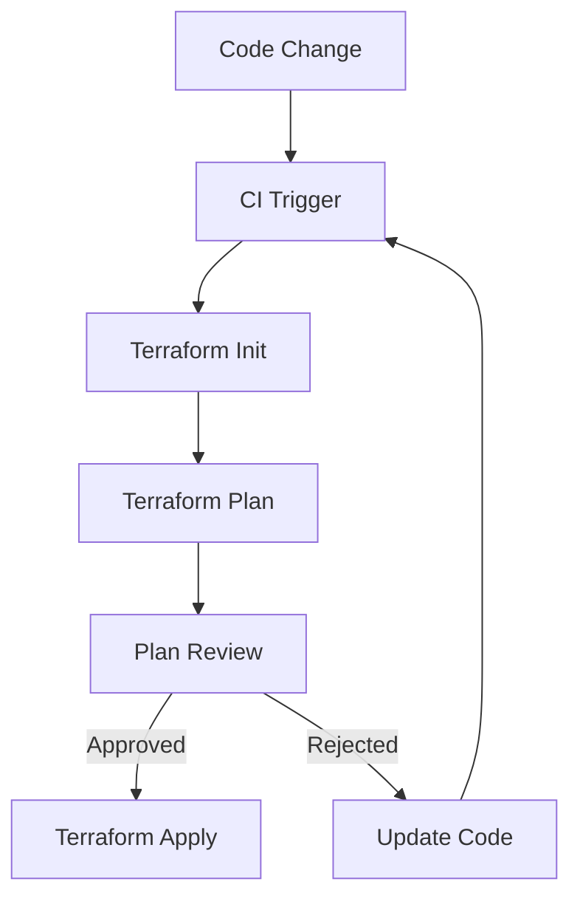

# Terraform Plan Automation

## Introduction

Terraform plan automation is a crucial component in modern Infrastructure as Code (IaC) workflows. When integrated into Continuous Integration/Continuous Deployment (CI/CD) pipelines, automated Terraform plans help teams validate infrastructure changes before applying them to production environments. This validation step catches errors early, improves collaboration, and creates a record of proposed changes that can be reviewed before deployment.

In this guide, we'll explore how to automate Terraform plans in CI/CD pipelines, examine best practices, and implement practical solutions for your infrastructure workflows.

## Why Automate Terraform Plans?

Before diving into implementation, let's understand why automating Terraform plans is valuable:

1. **Early Error Detection** - Catch syntax errors, validation issues, and potential configuration problems before they reach production
2. **Consistent Validation** - Ensure every change follows the same validation process
3. **Improved Collaboration** - Generate plans that team members can review during pull/merge requests
4. **Change Documentation** - Create a record of proposed changes for audit and compliance purposes
5. **Reduced Human Error** - Minimize mistakes that can occur with manual plan execution

## Basic Terraform Plan Command

At its simplest, a Terraform plan is executed with:

```bash
terraform plan -out=tfplan
```

This command:
- Evaluates your Terraform configuration
- Determines what actions are necessary to achieve the desired state
- Outputs a plan file (`tfplan`) containing the execution plan

The output looks something like this:

```
Terraform used the selected providers to generate the following execution plan. Resource actions are indicated with the following symbols:
  + create
  - destroy
  ~ update in-place

Terraform will perform the following actions:

  # aws_s3_bucket.example will be created
  + resource "aws_s3_bucket" "example" {
      + bucket = "my-example-bucket"
      + id     = (known after apply)
      + region = "us-west-2"
    }

Plan: 1 to add, 0 to change, 0 to destroy.
```

## Automating Terraform Plan in CI/CD

Let's explore how to integrate automated Terraform plans into popular CI/CD platforms:

### GitHub Actions Example

Here's how to set up a GitHub Actions workflow for Terraform plan automation:

```yaml
name: "Terraform Plan"

on:
  pull_request:
    branches: [ main ]
    paths:
      - 'terraform/**'

jobs:
  terraform:
    name: "Terraform Plan"
    runs-on: ubuntu-latest
    
    defaults:
      run:
        working-directory: ./terraform
    
    steps:
      - name: Checkout code
        uses: actions/checkout@v3

      - name: Setup Terraform
        uses: hashicorp/setup-terraform@v2
        with:
          terraform_version: 1.3.7

      - name: Terraform Init
        id: init
        run: terraform init
        env:
          AWS_ACCESS_KEY_ID: ${{ secrets.AWS_ACCESS_KEY_ID }}
          AWS_SECRET_ACCESS_KEY: ${{ secrets.AWS_SECRET_ACCESS_KEY }}

      - name: Terraform Format
        id: fmt
        run: terraform fmt -check
      
      - name: Terraform Validate
        id: validate
        run: terraform validate

      - name: Terraform Plan
        id: plan
        run: terraform plan -out=tfplan
        env:
          AWS_ACCESS_KEY_ID: ${{ secrets.AWS_ACCESS_KEY_ID }}
          AWS_SECRET_ACCESS_KEY: ${{ secrets.AWS_SECRET_ACCESS_KEY }}
        continue-on-error: true
      
      - name: Post Plan to PR
        uses: actions/github-script@v6
        if: github.event_name == 'pull_request'
        env:
          PLAN: "terraform
${{ steps.plan.outputs.stdout }}"
        with:
          github-token: ${{ secrets.GITHUB_TOKEN }}
          script: |
            const output = `#### Terraform Format and Style 🖌\`${{ steps.fmt.outcome }}\`
            #### Terraform Initialization ⚙️\`${{ steps.init.outcome }}\`
            #### Terraform Validation 🤖\`${{ steps.validate.outcome }}\`
            #### Terraform Plan 📖\`${{ steps.plan.outcome }}\`
            
            <details><summary>Show Plan</summary>
            
            \`\`\`

            ${process.env.PLAN}
            \`\`\`
            
            </details>`;
              
            github.rest.issues.createComment({
              issue_number: context.issue.number,
              owner: context.repo.owner,
              repo: context.repo.repo,
              body: output
            })
```

This workflow:
1. Triggers on pull requests to the main branch when Terraform files change
2. Sets up the required Terraform version
3. Initializes Terraform, checks formatting, and validates the configuration
4. Runs `terraform plan` and captures the output
5. Posts the plan results as a comment on the pull request for review

### GitLab CI Example

For GitLab CI, you can use this `.gitlab-ci.yml` configuration:

```yaml
image: hashicorp/terraform:1.3.7

variables:
  TF_ROOT: ${CI_PROJECT_DIR}/terraform

cache:
  paths:
    - ${TF_ROOT}/.terraform

before_script:
  - cd ${TF_ROOT}

stages:
  - validate
  - plan
  - apply

validate:
  stage: validate
  script:
    - terraform init -backend=false
    - terraform validate
    - terraform fmt -check
  only:
    - merge_requests
    - main

plan:
  stage: plan
  script:
    - terraform init
    - terraform plan -out=tfplan
  artifacts:
    paths:
      - ${TF_ROOT}/tfplan
    reports:
      terraform: ${TF_ROOT}/tfplan.json
  only:
    - merge_requests
    - main
```

## Adding Approval Gates

A crucial aspect of automating Terraform plans is implementing approval gates to control when changes can be applied:



Different CI/CD platforms offer various mechanisms for approval gates:

### GitHub Actions Approval Gate

For GitHub Actions, you can use environments with required reviewers:

```yaml
jobs:
  terraform-plan:
    # Plan job configuration as shown earlier
    
  terraform-apply:
    needs: terraform-plan
    if: github.ref == 'refs/heads/main'
    environment: production
    runs-on: ubuntu-latest
    steps:
      - name: Checkout
        uses: actions/checkout@v3
      
      # Additional steps for apply
```

By configuring the `production` environment with required reviewers in your GitHub repository settings, you enforce an approval step before the apply job runs.

## Enhanced Plan Outputs

To make Terraform plans more useful for reviewers, you can generate additional outputs:

### JSON Output for Processing

```bash
terraform show -json tfplan > tfplan.json
```

### Visual Diagrams with Terraform Graph

```bash
terraform graph -plan=tfplan | dot -Tsvg > plan.svg
```

### Cost Estimation

Using the Infracost tool:

```bash
infracost breakdown --path . --format json --out-file cost.json
```

## Handling State in CI/CD

Proper management of Terraform state is critical for automated workflows. Here are the recommended approaches:

### Remote State Configuration

```hcl
terraform {
  backend "s3" {
    bucket         = "terraform-state-bucket"
    key            = "path/to/terraform.tfstate"
    region         = "us-west-2"
    dynamodb_table = "terraform-locks"
    encrypt        = true
  }
}
```

### State Locking Considerations

When multiple CI/CD pipelines might run simultaneously, state locking prevents conflicts. The DynamoDB table in the S3 backend example above provides this locking mechanism.

## Security Considerations

When automating Terraform plans, you need to handle secrets securely:

1. **Never commit credentials** - Store secrets in your CI/CD platform's secret management system
2. **Use least privilege principles** - CI/CD credentials should only have permissions for required operations
3. **Review plan outputs before publishing** - Ensure sensitive data isn't inadvertently exposed in plan outputs
4. **Encrypt state files** - Always enable encryption for remote state

## Practical Example: Multi-Environment Pipeline

Let's look at a more advanced example that supports different environments:

```yaml
name: "Terraform Multi-Environment"

on:
  pull_request:
    branches: [ main ]
  push:
    branches: [ main ]

jobs:
  terraform-plan:
    name: "Terraform Plan"
    runs-on: ubuntu-latest
    strategy:
      matrix:
        environment: [dev, staging, prod]
    
    defaults:
      run:
        working-directory: ./terraform/${{ matrix.environment }}
    
    steps:
      - name: Checkout code
        uses: actions/checkout@v3

      - name: Setup Terraform
        uses: hashicorp/setup-terraform@v2
        with:
          terraform_version: 1.3.7

      - name: Terraform Init
        run: terraform init
        env:
          AWS_ACCESS_KEY_ID: ${{ secrets.AWS_ACCESS_KEY_ID }}
          AWS_SECRET_ACCESS_KEY: ${{ secrets.AWS_SECRET_ACCESS_KEY }}

      - name: Terraform Plan
        run: terraform plan -out=tfplan-${{ matrix.environment }}
        env:
          AWS_ACCESS_KEY_ID: ${{ secrets.AWS_ACCESS_KEY_ID }}
          AWS_SECRET_ACCESS_KEY: ${{ secrets.AWS_SECRET_ACCESS_KEY }}
          TF_VAR_environment: ${{ matrix.environment }}
      
      - name: Upload Plan Artifact
        uses: actions/upload-artifact@v3
        with:
          name: tfplan-${{ matrix.environment }}
          path: ./terraform/${{ matrix.environment }}/tfplan-${{ matrix.environment }}
```

## Best Practices for Terraform Plan Automation

To maximize the effectiveness of your automated Terraform plans:

1. **Keep plans readable** - Configure Terraform to produce meaningful output
2. **Version your provider configurations** - Use version constraints for providers
3. **Implement drift detection** - Schedule regular plan runs to detect manual changes
4. **Test your modules** - Use tools like Terratest to validate modules before integration
5. **Enforce consistent formatting** - Run `terraform fmt -check` to ensure code readability
6. **Validate variable values** - Use variables with validation blocks:

```hcl
variable "environment" {
  type        = string
  description = "Deployment environment"
  
  validation {
    condition     = contains(["dev", "staging", "prod"], var.environment)
    error_message = "Environment must be dev, staging, or prod."
  }
}
```

## Troubleshooting Common Issues

When automating Terraform plans, you might encounter these common issues:

| Issue | Solution |
|-------|----------|
| Credentials not available | Ensure secrets are properly configured in your CI/CD platform |
| State locking timeouts | Implement retry logic or manual lock removal procedures |
| Large plans timing out | Increase CI/CD job timeouts or split infrastructure into smaller modules |
| Plan differences between local and CI | Use container-based CI with the exact same Terraform version |

## Summary

Automating Terraform plans in CI/CD pipelines is an essential practice for modern infrastructure management. By implementing automated plans, you can:

- Catch configuration errors early in the development process
- Provide transparency and visibility into infrastructure changes
- Enforce governance and approval processes
- Document proposed changes for audit trails
- Improve team collaboration on infrastructure changes

As you implement Terraform plan automation, remember to adapt these examples to your specific workflow needs, security requirements, and organizational processes.

## Additional Learning Resources

To further explore Terraform automation, consider these resources:

- [Terraform CI Documentation](https://developer.hashicorp.com/terraform/tutorials/automation/automate-terraform)
- [HashiCorp Learn - Terraform Automation](https://learn.hashicorp.com/collections/terraform/automation)
- [Terraform Cloud](https://cloud.hashicorp.com/products/terraform) - A managed service for Terraform workflows

## Practice Exercises

1. Set up a GitHub Actions workflow for a simple Terraform configuration
2. Implement environment-specific variables in your automated plans
3. Create a custom script that processes Terraform plan JSON output to provide a summary of changes
4. Implement a drift detection workflow that runs on a schedule
5. Add cost estimation to your CI/CD pipeline using Infracost