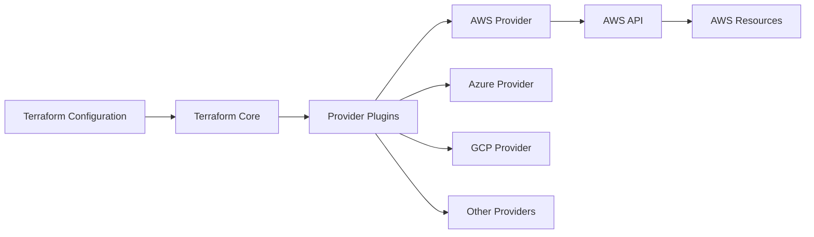

# Terraform AWS Provider

## Introduction

The AWS Provider is a plugin for Terraform that allows you to manage and provision AWS (Amazon Web Services) resources using Terraform's declarative configuration language. This integration is crucial for implementing Infrastructure as Code (IaC) with AWS, enabling you to define, deploy, and manage your cloud infrastructure in a consistent and repeatable way.

In this guide, we'll explore how to configure the AWS Provider, understand its basic structure, and learn how to use it to create and manage AWS resources. By the end, you'll have a solid foundation for building AWS infrastructure using Terraform.

## Understanding Terraform Providers

Before diving into the AWS Provider specifically, let's understand what Terraform providers are:



Providers in Terraform are responsible for:
- Understanding API interactions with the service provider (AWS in this case)
- Exposing resources that can be managed
- Authenticating with the service provider

The AWS Provider specifically translates Terraform configurations into AWS API calls, allowing you to manage resources like EC2 instances, S3 buckets, IAM roles, and more.

## Setting Up the AWS Provider

### Installation

The AWS Provider comes bundled with Terraform and will be automatically downloaded when you initialize a Terraform project that uses it. Here's how to get started:

1. Create a new directory for your Terraform project:

```bash
mkdir terraform-aws-demo
cd terraform-aws-demo
```

2. Create a file named `main.tf` with the following content:

```hcl
terraform {
  required_providers {
    aws = {
      source  = "hashicorp/aws"
      version = "~> 5.0"
    }
  }
}

provider "aws" {
  region = "us-west-2"
}
```

3. Initialize your Terraform project:

```bash
terraform init
```

This command downloads the AWS Provider plugin and sets up your working directory.

### Provider Configuration

The AWS Provider can be configured with various parameters. Here are the most common ones:

```hcl
provider "aws" {
  region     = "us-east-1"
  access_key = "my-access-key"
  secret_key = "my-secret-key"
  
  # Optional: Specify AWS profile from your credentials file
  profile = "default"
  
  # Optional: Configure API retry behavior
  max_retries = 5
}
```

:::caution
Never hardcode your AWS credentials directly in your Terraform files. Instead, use environment variables, shared credentials file, or AWS roles.
:::

### Authentication Methods

There are several ways to authenticate with AWS:

1. **Environment Variables**:
```bash
export AWS_ACCESS_KEY_ID="anaccesskey"
export AWS_SECRET_ACCESS_KEY="asecretkey"
export AWS_REGION="us-west-2"
```

2. **Shared Credentials File** (`~/.aws/credentials` or `%USERPROFILE%\.aws\credentials`):
```ini
[default]
aws_access_key_id = anaccesskey
aws_secret_access_key = asecretkey
```

3. **AWS IAM Roles** (recommended for EC2 instances or when using AWS services):
   - No explicit configuration needed in Terraform
   - Instance or service assumes the role automatically

## Working with AWS Resources

### Syntax Basics

AWS resources in Terraform follow this general syntax:

```hcl
resource "aws_[service]_[resource]" "name" {
  # Configuration options
  parameter1 = value1
  parameter2 = value2
}
```

For example, to create an S3 bucket:

```hcl
resource "aws_s3_bucket" "my_bucket" {
  bucket = "my-unique-bucket-name"
  
  tags = {
    Name        = "My bucket"
    Environment = "Dev"
  }
}
```

### Simple Example: Creating an EC2 Instance

Let's create a simple EC2 instance:

```hcl
provider "aws" {
  region = "us-west-2"
}

resource "aws_instance" "web_server" {
  ami           = "ami-0c55b159cbfafe1f0"  # Amazon Linux 2 AMI
  instance_type = "t2.micro"
  
  tags = {
    Name = "WebServer"
  }
}

output "instance_public_ip" {
  description = "Public IP address of the EC2 instance"
  value       = aws_instance.web_server.public_ip
}
```

To deploy this infrastructure:

```bash
terraform plan    # Preview changes
terraform apply   # Apply changes
```

Output example:
```
Apply complete! Resources: 1 added, 0 changed, 0 destroyed.

Outputs:

instance_public_ip = "54.186.202.254"
```

### Using Data Sources

Data sources allow you to fetch information about existing AWS resources. For example, to get the latest Amazon Linux 2 AMI:

```hcl
data "aws_ami" "amazon_linux" {
  most_recent = true
  owners      = ["amazon"]
  
  filter {
    name   = "name"
    values = ["amzn2-ami-hvm-*-x86_64-gp2"]
  }
  
  filter {
    name   = "virtualization-type"
    values = ["hvm"]
  }
}

resource "aws_instance" "web_server" {
  ami           = data.aws_ami.amazon_linux.id
  instance_type = "t2.micro"
  
  tags = {
    Name = "WebServer"
  }
}
```

## Real-World Example: Web Server Infrastructure

Let's build a more comprehensive example with common AWS resources:

```hcl
provider "aws" {
  region = "us-west-2"
}

# Create a VPC
resource "aws_vpc" "main" {
  cidr_block = "10.0.0.0/16"
  
  tags = {
    Name = "MainVPC"
  }
}

# Create a subnet
resource "aws_subnet" "public" {
  vpc_id            = aws_vpc.main.id
  cidr_block        = "10.0.1.0/24"
  availability_zone = "us-west-2a"
  
  tags = {
    Name = "PublicSubnet"
  }
}

# Create an internet gateway
resource "aws_internet_gateway" "gw" {
  vpc_id = aws_vpc.main.id
  
  tags = {
    Name = "MainIGW"
  }
}

# Create a route table
resource "aws_route_table" "public" {
  vpc_id = aws_vpc.main.id
  
  route {
    cidr_block = "0.0.0.0/0"
    gateway_id = aws_internet_gateway.gw.id
  }
  
  tags = {
    Name = "PublicRouteTable"
  }
}

# Associate route table with subnet
resource "aws_route_table_association" "public" {
  subnet_id      = aws_subnet.public.id
  route_table_id = aws_route_table.public.id
}

# Create a security group
resource "aws_security_group" "web" {
  name        = "web_sg"
  description = "Allow web traffic"
  vpc_id      = aws_vpc.main.id
  
  ingress {
    from_port   = 80
    to_port     = 80
    protocol    = "tcp"
    cidr_blocks = ["0.0.0.0/0"]
  }
  
  ingress {
    from_port   = 22
    to_port     = 22
    protocol    = "tcp"
    cidr_blocks = ["0.0.0.0/0"]
  }
  
  egress {
    from_port   = 0
    to_port     = 0
    protocol    = "-1"
    cidr_blocks = ["0.0.0.0/0"]
  }
  
  tags = {
    Name = "WebSG"
  }
}

# Get latest Amazon Linux 2 AMI
data "aws_ami" "amazon_linux" {
  most_recent = true
  owners      = ["amazon"]
  
  filter {
    name   = "name"
    values = ["amzn2-ami-hvm-*-x86_64-gp2"]
  }
}

# Create EC2 instance
resource "aws_instance" "web" {
  ami                         = data.aws_ami.amazon_linux.id
  instance_type               = "t2.micro"
  subnet_id                   = aws_subnet.public.id
  vpc_security_group_ids      = [aws_security_group.web.id]
  associate_public_ip_address = true
  
  user_data = <<-EOF
              #!/bin/bash
              yum update -y
              yum install -y httpd
              systemctl start httpd
              systemctl enable httpd
              echo "<h1>Hello from Terraform</h1>" > /var/www/html/index.html
              EOF
  
  tags = {
    Name = "WebServer"
  }
}

# Output the public IP of the web server
output "web_server_ip" {
  value = aws_instance.web.public_ip
}
```

This infrastructure creates:
- A VPC with a public subnet
- An internet gateway for external connectivity
- A security group allowing HTTP and SSH traffic
- An EC2 instance running a simple web server

## Working with Multiple AWS Regions or Accounts

Sometimes you need to manage resources across multiple AWS regions or accounts. The AWS Provider allows for this with provider aliases:

```hcl
# Default provider configuration
provider "aws" {
  region = "us-west-2"
}

# Additional provider configuration for east region
provider "aws" {
  alias  = "east"
  region = "us-east-1"
}

# Use the default provider (us-west-2)
resource "aws_s3_bucket" "west_bucket" {
  bucket = "my-west-bucket"
}

# Use the east provider
resource "aws_s3_bucket" "east_bucket" {
  provider = aws.east
  bucket   = "my-east-bucket"
}
```

## Managing AWS Infrastructure State

Terraform keeps track of your infrastructure in a state file. For teams working on the same infrastructure, it's recommended to use a remote state backend like S3 with DynamoDB locking:

```hcl
terraform {
  backend "s3" {
    bucket         = "terraform-state-bucket"
    key            = "terraform.tfstate"
    region         = "us-west-2"
    dynamodb_table = "terraform-locks"
    encrypt        = true
  }
  
  required_providers {
    aws = {
      source  = "hashicorp/aws"
      version = "~> 5.0"
    }
  }
}
```

## Common AWS Resources

The AWS Provider supports hundreds of AWS resources. Here are some commonly used ones:

| Resource Type | Description | Example |
| --- | --- | --- |
| `aws_instance` | EC2 instances | Virtual servers |
| `aws_s3_bucket` | S3 buckets | Object storage |
| `aws_rds_instance` | RDS database instances | Managed relational databases |
| `aws_dynamodb_table` | DynamoDB tables | NoSQL database |
| `aws_lambda_function` | Lambda functions | Serverless computing |
| `aws_iam_role` | IAM roles | Identity and access management |
| `aws_vpc` | Virtual Private Clouds | Network isolation |
| `aws_security_group` | Security groups | Firewall rules |

## Best Practices

When working with the AWS Provider in Terraform:

1. **Use variables for configuration**:
```hcl
variable "region" {
  description = "AWS region"
  default     = "us-west-2"
}

provider "aws" {
  region = var.region
}
```

2. **Organize resources with modules**:
```hcl
module "vpc" {
  source = "./modules/vpc"
  
  cidr_block = "10.0.0.0/16"
}

module "web_server" {
  source = "./modules/web_server"
  
  vpc_id = module.vpc.vpc_id
}
```

3. **Use workspaces for environment separation**:
```bash
terraform workspace new dev
terraform workspace new prod
```

4. **Tag all resources appropriately**:
```hcl
resource "aws_instance" "web" {
  # ... other configuration ...
  
  tags = {
    Name        = "WebServer"
    Environment = "Production"
    Project     = "Website"
    ManagedBy   = "Terraform"
  }
}
```

5. **Use data sources to query existing resources**

6. **Practice least privilege for IAM policies**

## Debugging and Troubleshooting

When you encounter issues with the AWS Provider:

1. **Enable Terraform logging**:
```bash
export TF_LOG=DEBUG
export TF_LOG_PATH=terraform.log
```

2. **Check AWS service status** if you encounter API errors

3. **Validate your Terraform files**:
```bash
terraform validate
```

4. **Use AWS CLI to verify resources** and cross-check with Terraform state:
```bash
aws ec2 describe-instances --region us-west-2
terraform state list
terraform state show aws_instance.web
```

## Summary

The AWS Provider for Terraform is a powerful tool that enables you to define, deploy, and manage AWS infrastructure as code. In this guide, we've explored:

- How to set up and configure the AWS Provider
- Basic syntax for defining AWS resources
- Authentication methods for connecting to AWS
- Creating common AWS resources like EC2 instances, VPCs, and security groups
- Working with multiple regions or accounts
- Best practices for managing AWS infrastructure with Terraform

By using the AWS Provider, you gain the benefits of Infrastructure as Code, including version control, consistency, and automation for your AWS resources.

## Additional Resources

- [Terraform AWS Provider Documentation](https://registry.terraform.io/providers/hashicorp/aws/latest/docs)
- [AWS Architecture Center](https://aws.amazon.com/architecture/)
- [Terraform Best Practices](https://www.terraform-best-practices.com/)

## Exercises

1. Create a Terraform configuration that deploys a static website using S3 and CloudFront.
2. Build a multi-tier architecture with web, application, and database tiers in separate subnets.
3. Create a serverless application using Lambda, API Gateway, and DynamoDB.
4. Set up a continuous integration pipeline for your Terraform code using GitHub Actions or AWS CodePipeline.