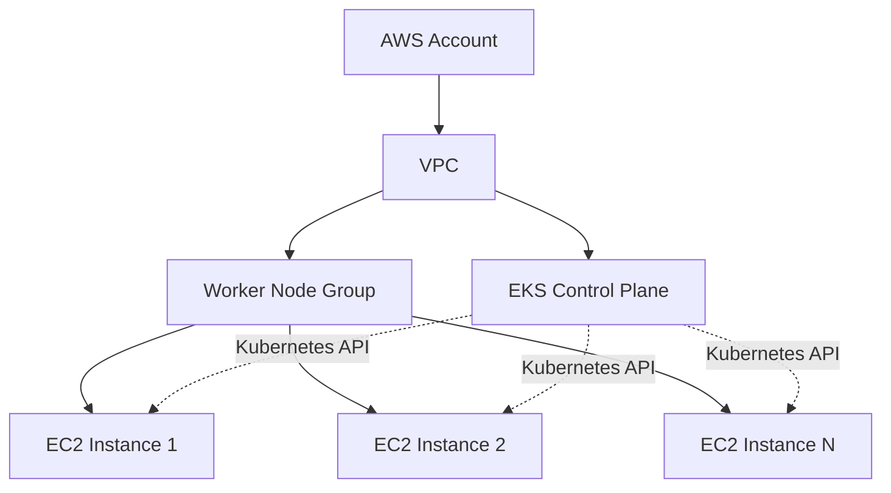

# Terraform AWS EKS

## Introduction

Amazon Elastic Kubernetes Service (EKS) is a managed Kubernetes service that makes it easy to run Kubernetes on AWS without needing to install and operate your own Kubernetes control plane. In this tutorial, you'll learn how to provision an Amazon EKS cluster using Terraform, which will allow you to define your infrastructure as code, making it repeatable, maintainable, and version-controlled.

By the end of this guide, you'll understand:
- The basic components of an EKS cluster
- How to use Terraform to provision an EKS cluster
- How to configure networking for your EKS cluster
- How to deploy applications to your new cluster

## Prerequisites

Before we begin, ensure you have:

- An AWS account with appropriate permissions
- AWS CLI installed and configured
- Terraform installed (v1.0.0+)
- kubectl installed
- Basic understanding of Kubernetes concepts

## Understanding EKS Architecture

Amazon EKS consists of two main components:

1. **EKS Control Plane**: This is managed by AWS and includes the Kubernetes API server, etcd, and other control plane components.

2. **Worker Nodes**: These are EC2 instances that run your containers. They can be managed using node groups.

Let's visualize the architecture:



## Setting Up Your Terraform Project

Let's start by creating a new directory for your Terraform project:

```bash
mkdir terraform-eks-demo
cd terraform-eks-demo
touch main.tf variables.tf outputs.tf
```

### Provider Configuration

First, let's set up the AWS provider in `main.tf`:

```hcl
provider "aws" {
  region = var.region
}

# For Kubernetes provider
data "aws_eks_cluster" "cluster" {
  name = module.eks.cluster_id
}

data "aws_eks_cluster_auth" "cluster" {
  name = module.eks.cluster_id
}

provider "kubernetes" {
  host                   = data.aws_eks_cluster.cluster.endpoint
  cluster_ca_certificate = base64decode(data.aws_eks_cluster.cluster.certificate_authority[0].data)
  token                  = data.aws_eks_cluster_auth.cluster.token
}
```

### Variables

Now, let's define our variables in `variables.tf`:

```hcl
variable "region" {
  description = "AWS region"
  type        = string
  default     = "us-west-2"
}

variable "cluster_name" {
  description = "Name of the EKS cluster"
  type        = string
  default     = "my-eks-cluster"
}

variable "vpc_cidr" {
  description = "CIDR block for the VPC"
  type        = string
  default     = "10.0.0.0/16"
}

variable "subnet_cidrs" {
  description = "CIDR blocks for the subnets"
  type        = list(string)
  default     = ["10.0.1.0/24", "10.0.2.0/24", "10.0.3.0/24", "10.0.4.0/24"]
}

variable "instance_types" {
  description = "Instance types for the worker nodes"
  type        = list(string)
  default     = ["t3.medium"]
}

variable "desired_capacity" {
  description = "Desired number of worker nodes"
  type        = number
  default     = 2
}

variable "max_capacity" {
  description = "Maximum number of worker nodes"
  type        = number
  default     = 5
}

variable "min_capacity" {
  description = "Minimum number of worker nodes"
  type        = number
  default     = 1
}
```

## Creating the VPC

Before creating an EKS cluster, we need a VPC with public and private subnets. Let's add the following to our `main.tf`:

```hcl
module "vpc" {
  source  = "terraform-aws-modules/vpc/aws"
  version = "~> 3.0"

  name = "${var.cluster_name}-vpc"
  cidr = var.vpc_cidr

  azs             = ["${var.region}a", "${var.region}b"]
  private_subnets = [var.subnet_cidrs[0], var.subnet_cidrs[1]]
  public_subnets  = [var.subnet_cidrs[2], var.subnet_cidrs[3]]

  enable_nat_gateway   = true
  single_nat_gateway   = true
  enable_dns_hostnames = true

  # Tags required for EKS
  tags = {
    "kubernetes.io/cluster/${var.cluster_name}" = "shared"
  }

  public_subnet_tags = {
    "kubernetes.io/cluster/${var.cluster_name}" = "shared"
    "kubernetes.io/role/elb"                    = "1"
  }

  private_subnet_tags = {
    "kubernetes.io/cluster/${var.cluster_name}" = "shared"
    "kubernetes.io/role/internal-elb"           = "1"
  }
}
```

## Creating the EKS Cluster

Now, let's create the EKS cluster using the terraform-aws-modules/eks/aws module:

```hcl
module "eks" {
  source  = "terraform-aws-modules/eks/aws"
  version = "~> 18.0"

  cluster_name    = var.cluster_name
  cluster_version = "1.24"

  vpc_id     = module.vpc.vpc_id
  subnet_ids = module.vpc.private_subnets

  # Enable EKS Managed Node Group
  eks_managed_node_group_defaults = {
    ami_type       = "AL2_x86_64"
    disk_size      = 50
    instance_types = var.instance_types
  }

  eks_managed_node_groups = {
    main = {
      min_size     = var.min_capacity
      max_size     = var.max_capacity
      desired_size = var.desired_capacity

      instance_types = var.instance_types
    }
  }

  # Allow worker nodes to assume role for the cluster
  manage_aws_auth_configmap = true

  tags = {
    Environment = "dev"
    Terraform   = "true"
  }
}
```

## Define Outputs

Let's configure some useful outputs in `outputs.tf`:

```hcl
output "cluster_endpoint" {
  description = "Endpoint for EKS control plane"
  value       = module.eks.cluster_endpoint
}

output "cluster_security_group_id" {
  description = "Security group ID attached to the EKS cluster"
  value       = module.eks.cluster_security_group_id
}

output "cluster_name" {
  description = "Kubernetes Cluster Name"
  value       = module.eks.cluster_id
}

output "cluster_ca_certificate" {
  description = "Cluster CA certificate"
  value       = base64decode(module.eks.cluster_certificate_authority_data)
  sensitive   = true
}

output "kubeconfig_command" {
  description = "Command to configure kubectl"
  value       = "aws eks update-kubeconfig --region ${var.region} --name ${module.eks.cluster_id}"
}
```

## Deploying the Infrastructure

With our configuration files ready, let's deploy the infrastructure:

```bash
# Initialize Terraform
terraform init

# Preview the changes
terraform plan

# Apply the changes
terraform apply
```

This process will take around 15-20 minutes to complete. Once done, Terraform will output the cluster endpoint and other information.

## Connecting to Your EKS Cluster

After your EKS cluster is provisioned, you can connect to it using kubectl:

```bash
# Use the command from the output
aws eks update-kubeconfig --region us-west-2 --name my-eks-cluster

# Verify the connection
kubectl get nodes
```

You should see your worker nodes listed:

```
NAME                                       STATUS   ROLES    AGE     VERSION
ip-10-0-1-45.us-west-2.compute.internal    Ready    <none>   5m32s   v1.24.x-eks-xxxxx
ip-10-0-2-187.us-west-2.compute.internal   Ready    <none>   5m35s   v1.24.x-eks-xxxxx
```

## Deploying a Sample Application

Let's deploy a simple application to test our cluster. Create a file named `nginx-deployment.yaml`:

```yaml
apiVersion: apps/v1
kind: Deployment
metadata:
  name: nginx-deployment
  labels:
    app: nginx
spec:
  replicas: 2
  selector:
    matchLabels:
      app: nginx
  template:
    metadata:
      labels:
        app: nginx
    spec:
      containers:
      - name: nginx
        image: nginx:1.21
        ports:
        - containerPort: 80
---
apiVersion: v1
kind: Service
metadata:
  name: nginx-service
spec:
  selector:
    app: nginx
  ports:
  - port: 80
    targetPort: 80
  type: LoadBalancer
```

Deploy it to your cluster:

```bash
kubectl apply -f nginx-deployment.yaml
```

Check the deployment status:

```bash
kubectl get deployments
kubectl get services
```

After a few minutes, the LoadBalancer service will provision an AWS ELB and provide an external DNS name:

```
NAME            TYPE           CLUSTER-IP       EXTERNAL-IP                        PORT(S)        AGE
kubernetes      ClusterIP      10.100.0.1       <none>                             443/TCP        20m
nginx-service   LoadBalancer   10.100.204.136   a1b2c3d4e5f6.us-west-2.elb.amazonaws.com   80:31669/TCP   3m
```

You can access your application at the EXTERNAL-IP.

## Advanced EKS Configuration

### Auto-scaling

Let's enhance our EKS cluster with Cluster Autoscaler, which automatically adjusts the number of nodes based on pod demand:

```hcl
# Add this to your main.tf

resource "helm_release" "cluster_autoscaler" {
  name       = "cluster-autoscaler"
  repository = "https://kubernetes.github.io/autoscaler"
  chart      = "cluster-autoscaler"
  namespace  = "kube-system"
  version    = "9.21.0"

  set {
    name  = "autoDiscovery.clusterName"
    value = module.eks.cluster_id
  }

  set {
    name  = "awsRegion"
    value = var.region
  }

  set {
    name  = "rbac.create"
    value = "true"
  }

  depends_on = [module.eks]
}
```

Don't forget to add the Helm provider to your configuration:

```hcl
provider "helm" {
  kubernetes {
    host                   = data.aws_eks_cluster.cluster.endpoint
    cluster_ca_certificate = base64decode(data.aws_eks_cluster.cluster.certificate_authority[0].data)
    token                  = data.aws_eks_cluster_auth.cluster.token
  }
}
```

### Adding Kubernetes Dashboard

You can deploy the Kubernetes Dashboard for a web-based UI:

```hcl
resource "helm_release" "kubernetes_dashboard" {
  name       = "kubernetes-dashboard"
  repository = "https://kubernetes.github.io/dashboard/"
  chart      = "kubernetes-dashboard"
  namespace  = "kube-system"

  depends_on = [module.eks]
}
```

## Updating and Managing Your EKS Cluster

To update your EKS cluster (e.g., to change the number of nodes or upgrade the Kubernetes version), simply modify the relevant parameters in your Terraform files and run:

```bash
terraform plan
terraform apply
```

For example, to scale the number of nodes:

```hcl
# Change in variables.tf
variable "desired_capacity" {
  description = "Desired number of worker nodes"
  type        = number
  default     = 3  # Changed from 2 to 3
}
```

## Cleaning Up

When you're done experimenting, don't forget to clean up your resources to avoid unnecessary charges:

```bash
terraform destroy
```

Confirm the action by typing `yes` when prompted.

## Common Issues and Troubleshooting

### Insufficient IAM Permissions

If you encounter permission errors, ensure your AWS user has sufficient permissions to create the required resources. The minimum required permissions include:

- AmazonEKSClusterPolicy
- AmazonEKSVPCResourceController
- AmazonEC2FullAccess

### Connectivity Issues

If you can't connect to your cluster after creation:

1. Check your AWS CLI configuration:
```bash
aws configure list
```

2. Verify the kubeconfig was properly updated:
```bash
kubectl config current-context
```

3. Check for network issues:
```bash
kubectl get nodes --v=6
```

## Best Practices for EKS with Terraform

1. **Use modules**: Leverage community-maintained modules like the ones we used.
2. **Version pinning**: Always specify versions for providers and modules.
3. **Structure your code**: Separate your code into logical units (modules).
4. **State management**: Use remote state (like S3 with DynamoDB locking) for team environments.
5. **Security**: Follow the principle of least privilege when assigning IAM roles.
6. **Monitoring**: Set up CloudWatch for EKS monitoring.

## Summary

In this tutorial, you've learned how to:

- Set up a complete EKS cluster using Terraform
- Configure the necessary networking components
- Deploy applications to your cluster
- Implement autoscaling for your worker nodes
- Add additional tooling like Kubernetes Dashboard

EKS combined with Terraform provides a powerful way to manage Kubernetes infrastructure as code. This approach ensures consistency, repeatability, and easy maintenance of your infrastructure.

## Next Steps and Exercises

1. **Add persistent storage**: Configure an EBS CSI driver and create persistent volumes for your applications.
2. **Implement CI/CD**: Set up a CI/CD pipeline to deploy applications to your EKS cluster.
3. **Configure logging**: Set up logging with CloudWatch or the ELK stack.
4. **Secure your cluster**: Implement network policies and security contexts.

## Additional Resources

- [AWS EKS Documentation](https://docs.aws.amazon.com/eks/latest/userguide/what-is-eks.html)
- [Terraform AWS EKS Module Documentation](https://registry.terraform.io/modules/terraform-aws-modules/eks/aws/latest)
- [Kubernetes Documentation](https://kubernetes.io/docs/home/)
- [EKS Workshop](https://www.eksworkshop.com/)

Happy Terraforming!