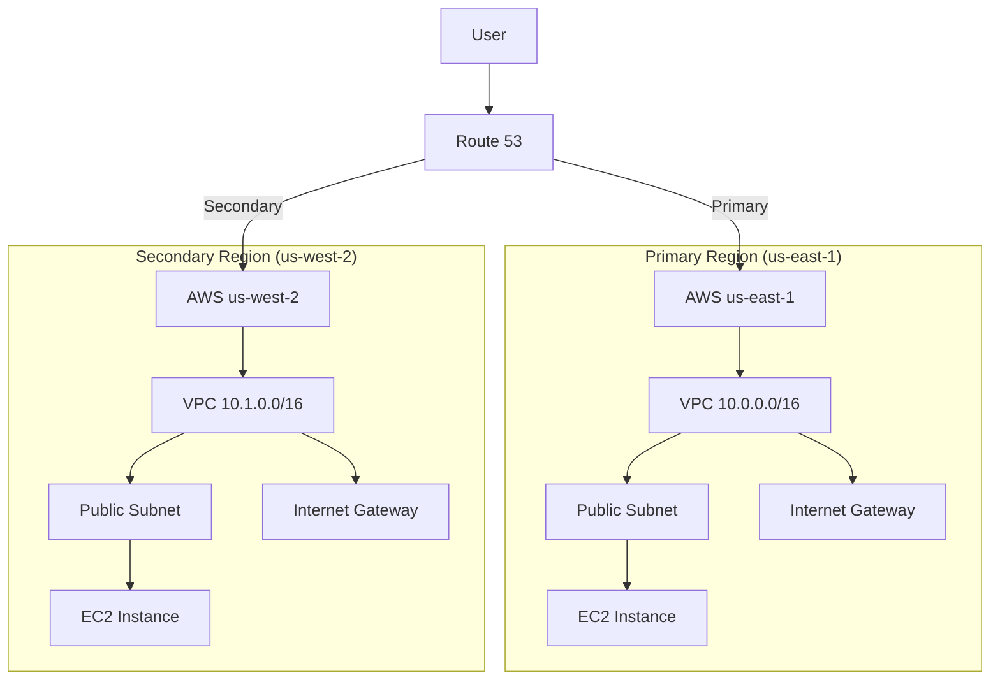

# Terraform AWS Multi-Region

## Introduction

Deploying infrastructure across multiple AWS regions is a critical strategy for building highly available, fault-tolerant applications. When your infrastructure spans multiple geographic locations, your applications can withstand regional outages, provide lower latency for global users, and meet data sovereignty requirements.

In this tutorial, we'll explore how to use Terraform to manage multi-region AWS deployments effectively. We'll cover the foundational concepts, configuration strategies, and practical examples to help you implement multi-region architectures.

## Why Deploy to Multiple Regions?

Before diving into the technical implementation, let's understand the key benefits of multi-region deployments:

1. **High Availability**: If one AWS region experiences an outage, your application can continue serving traffic from other regions.
2. **Disaster Recovery**: Regional redundancy provides resilience against catastrophic failures.
3. **Lower Latency**: Serving users from the closest region reduces network latency.
4. **Data Sovereignty**: Meeting regulatory requirements by keeping data within specific geographic boundaries.
5. **Load Distribution**: Balancing traffic across regions for better resource utilization.

## Terraform Concepts for Multi-Region Deployments

### Provider Configuration

When working with multiple AWS regions in Terraform, you'll need to configure multiple provider instances. Each provider instance will target a specific AWS region.

```hcl
# Configure the AWS Provider for us-east-1 (primary region)
provider "aws" {
  region = "us-east-1"
  alias  = "east"
}

# Configure the AWS Provider for us-west-2 (secondary region)
provider "aws" {
  region = "us-west-2"
  alias  = "west"
}
```

The `alias` attribute creates a named provider configuration that you can reference when creating resources.

### Using Multiple Providers

When creating resources, you specify which provider to use via the `provider` argument:

```hcl
# Create a VPC in us-east-1
resource "aws_vpc" "vpc_east" {
  provider = aws.east
  cidr_block = "10.0.0.0/16"
  
  tags = {
    Name = "vpc-east"
  }
}

# Create a VPC in us-west-2
resource "aws_vpc" "vpc_west" {
  provider = aws.west
  cidr_block = "10.1.0.0/16"
  
  tags = {
    Name = "vpc-west"
  }
}
```

## Step-by-Step Multi-Region Setup

Let's build a basic multi-region infrastructure with Terraform:

### 1. Project Structure

Organize your project with a clear structure:

```
terraform-aws-multi-region/
├── main.tf         # Main configuration file
├── variables.tf    # Input variables
├── outputs.tf      # Output values
├── regions/
│   ├── east.tf     # Resources for us-east-1
│   └── west.tf     # Resources for us-west-2
└── modules/        # Reusable modules
```

### 2. Define Variables

Create variables to make your configuration more flexible:

```hcl
# variables.tf
variable "primary_region" {
  description = "Primary AWS region"
  type        = string
  default     = "us-east-1"
}

variable "secondary_region" {
  description = "Secondary AWS region"
  type        = string
  default     = "us-west-2"
}

variable "vpc_cidr_primary" {
  description = "CIDR block for primary VPC"
  type        = string
  default     = "10.0.0.0/16"
}

variable "vpc_cidr_secondary" {
  description = "CIDR block for secondary VPC"
  type        = string
  default     = "10.1.0.0/16"
}

variable "environment" {
  description = "Deployment environment"
  type        = string
  default     = "dev"
}
```

### 3. Configure Providers

Set up the provider configurations in the main file:

```hcl
# main.tf
terraform {
  required_providers {
    aws = {
      source  = "hashicorp/aws"
      version = "~> 4.0"
    }
  }
}

# Primary region provider
provider "aws" {
  region = var.primary_region
  alias  = "primary"
}

# Secondary region provider
provider "aws" {
  region = var.secondary_region
  alias  = "secondary"
}
```

### 4. Create Basic Infrastructure

Let's create basic infrastructure in both regions:

```hcl
# regions/east.tf
# Primary region VPC
resource "aws_vpc" "primary" {
  provider   = aws.primary
  cidr_block = var.vpc_cidr_primary

  tags = {
    Name        = "${var.environment}-vpc-primary"
    Environment = var.environment
  }
}

# Primary region subnets
resource "aws_subnet" "primary_public" {
  provider   = aws.primary
  vpc_id     = aws_vpc.primary.id
  cidr_block = cidrsubnet(var.vpc_cidr_primary, 8, 0)
  availability_zone = "${var.primary_region}a"

  tags = {
    Name = "${var.environment}-public-subnet-primary"
    Environment = var.environment
  }
}

# Primary region internet gateway
resource "aws_internet_gateway" "primary" {
  provider = aws.primary
  vpc_id   = aws_vpc.primary.id

  tags = {
    Name = "${var.environment}-igw-primary"
    Environment = var.environment
  }
}
```

```hcl
# regions/west.tf
# Secondary region VPC
resource "aws_vpc" "secondary" {
  provider   = aws.secondary
  cidr_block = var.vpc_cidr_secondary

  tags = {
    Name        = "${var.environment}-vpc-secondary"
    Environment = var.environment
  }
}

# Secondary region subnets
resource "aws_subnet" "secondary_public" {
  provider   = aws.secondary
  vpc_id     = aws_vpc.secondary.id
  cidr_block = cidrsubnet(var.vpc_cidr_secondary, 8, 0)
  availability_zone = "${var.secondary_region}a"

  tags = {
    Name = "${var.environment}-public-subnet-secondary"
    Environment = var.environment
  }
}

# Secondary region internet gateway
resource "aws_internet_gateway" "secondary" {
  provider = aws.secondary
  vpc_id   = aws_vpc.secondary.id

  tags = {
    Name = "${var.environment}-igw-secondary"
    Environment = var.environment
  }
}
```

### 5. Define Outputs

Create outputs to easily retrieve information about your infrastructure:

```hcl
# outputs.tf
output "primary_vpc_id" {
  description = "ID of the primary VPC"
  value       = aws_vpc.primary.id
}

output "secondary_vpc_id" {
  description = "ID of the secondary VPC"
  value       = aws_vpc.secondary.id
}

output "primary_subnet_id" {
  description = "ID of the primary public subnet"
  value       = aws_subnet.primary_public.id
}

output "secondary_subnet_id" {
  description = "ID of the secondary public subnet"
  value       = aws_subnet.secondary_public.id
}
```

## Advanced Multi-Region Patterns

Now that we understand the basics, let's explore more advanced patterns for multi-region deployments.

### Using Terraform Modules for Consistency

Modules help maintain consistency across regions:

```hcl
# main.tf
module "vpc_primary" {
  source = "./modules/vpc"
  
  providers = {
    aws = aws.primary
  }
  
  vpc_cidr        = var.vpc_cidr_primary
  environment     = var.environment
  region          = var.primary_region
  vpc_name_suffix = "primary"
}

module "vpc_secondary" {
  source = "./modules/vpc"
  
  providers = {
    aws = aws.secondary
  }
  
  vpc_cidr        = var.vpc_cidr_secondary
  environment     = var.environment
  region          = var.secondary_region
  vpc_name_suffix = "secondary"
}
```

The VPC module would look like:

```hcl
# modules/vpc/main.tf
terraform {
  required_providers {
    aws = {
      source  = "hashicorp/aws"
      version = "~> 4.0"
    }
  }
}

variable "vpc_cidr" {
  description = "CIDR block for VPC"
  type        = string
}

variable "environment" {
  description = "Deployment environment"
  type        = string
}

variable "region" {
  description = "AWS region"
  type        = string
}

variable "vpc_name_suffix" {
  description = "Suffix for VPC name"
  type        = string
}

resource "aws_vpc" "this" {
  cidr_block = var.vpc_cidr

  tags = {
    Name        = "${var.environment}-vpc-${var.vpc_name_suffix}"
    Environment = var.environment
  }
}

resource "aws_subnet" "public" {
  count             = 2
  vpc_id            = aws_vpc.this.id
  cidr_block        = cidrsubnet(var.vpc_cidr, 8, count.index)
  availability_zone = "${var.region}${["a", "b"][count.index]}"

  tags = {
    Name        = "${var.environment}-public-subnet-${count.index}-${var.vpc_name_suffix}"
    Environment = var.environment
  }
}

resource "aws_internet_gateway" "this" {
  vpc_id = aws_vpc.this.id

  tags = {
    Name        = "${var.environment}-igw-${var.vpc_name_suffix}"
    Environment = var.environment
  }
}

output "vpc_id" {
  description = "The ID of the VPC"
  value       = aws_vpc.this.id
}

output "public_subnet_ids" {
  description = "List of public subnet IDs"
  value       = aws_subnet.public[*].id
}

output "internet_gateway_id" {
  description = "The ID of the Internet Gateway"
  value       = aws_internet_gateway.this.id
}
```

### Multi-Region Application Deployment

Let's deploy a simple web application across both regions:

```hcl
# Create an EC2 instance in the primary region
resource "aws_instance" "web_primary" {
  provider      = aws.primary
  ami           = "ami-0c55b159cbfafe1f0" # Amazon Linux 2 AMI (adjust for your region)
  instance_type = "t2.micro"
  subnet_id     = module.vpc_primary.public_subnet_ids[0]

  user_data = <<-EOF
              #!/bin/bash
              echo "Hello from the primary region (${var.primary_region})!" > index.html
              nohup python -m SimpleHTTPServer 80 &
              EOF

  tags = {
    Name = "${var.environment}-web-primary"
    Environment = var.environment
  }
}

# Create an EC2 instance in the secondary region
resource "aws_instance" "web_secondary" {
  provider      = aws.secondary
  ami           = "ami-0ddf424f81ddb0720" # Amazon Linux 2 AMI (adjust for your region)
  instance_type = "t2.micro"
  subnet_id     = module.vpc_secondary.public_subnet_ids[0]

  user_data = <<-EOF
              #!/bin/bash
              echo "Hello from the secondary region (${var.secondary_region})!" > index.html
              nohup python -m SimpleHTTPServer 80 &
              EOF

  tags = {
    Name = "${var.environment}-web-secondary"
    Environment = var.environment
  }
}
```

### Implementing Route 53 for Global Load Balancing

To distribute traffic across regions, we can use Route 53:

```hcl
# Create Route 53 health checks
resource "aws_route53_health_check" "primary" {
  ip_address        = aws_instance.web_primary.public_ip
  port              = 80
  type              = "HTTP"
  resource_path     = "/"
  failure_threshold = 3
  request_interval  = 30

  tags = {
    Name = "${var.environment}-health-check-primary"
  }
}

resource "aws_route53_health_check" "secondary" {
  ip_address        = aws_instance.web_secondary.public_ip
  port              = 80
  type              = "HTTP"
  resource_path     = "/"
  failure_threshold = 3
  request_interval  = 30

  tags = {
    Name = "${var.environment}-health-check-secondary"
  }
}

# Create Route 53 records with failover routing policy
resource "aws_route53_zone" "main" {
  name = "example.com"
}

resource "aws_route53_record" "primary" {
  zone_id         = aws_route53_zone.main.zone_id
  name            = "www.example.com"
  type            = "A"
  ttl             = 60
  records         = [aws_instance.web_primary.public_ip]
  set_identifier  = "primary"
  failover_routing_policy {
    type = "PRIMARY"
  }
  health_check_id = aws_route53_health_check.primary.id
}

resource "aws_route53_record" "secondary" {
  zone_id         = aws_route53_zone.main.zone_id
  name            = "www.example.com"
  type            = "A"
  ttl             = 60
  records         = [aws_instance.web_secondary.public_ip]
  set_identifier  = "secondary"
  failover_routing_policy {
    type = "SECONDARY"
  }
  health_check_id = aws_route53_health_check.secondary.id
}
```

This configuration sets up failover routing, directing traffic to the secondary region if the primary region fails.

## Visualizing Multi-Region Architecture

Here's a diagram illustrating our multi-region setup:



## Best Practices for AWS Multi-Region with Terraform

1. **Use Remote State Management**: Store your Terraform state files in a centralized location like S3 with DynamoDB for locking.

```hcl
terraform {
  backend "s3" {
    bucket         = "my-terraform-state"
    key            = "multi-region/terraform.tfstate"
    region         = "us-east-1"
    dynamodb_table = "terraform-locks"
    encrypt        = true
  }
}
```

2. **Parameterize Region-Specific Values**: Use maps or lookup functions to manage region-specific configurations.

```hcl