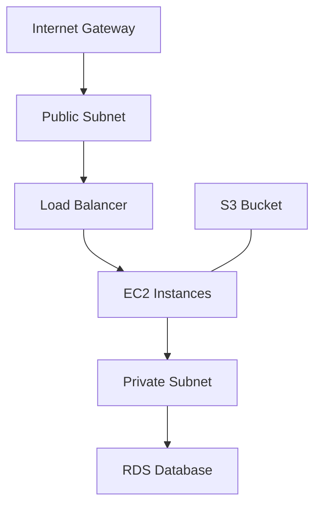

# Terraform AWS Resource Types

## Introduction

Terraform allows you to manage AWS infrastructure programmatically using Infrastructure as Code (IaC). One of the most powerful aspects of Terraform is its ability to work with a wide variety of AWS resource types. In this guide, we'll explore the common AWS resources you can manage with Terraform, how to define them, and how they work together to create complete cloud environments.

AWS resources in Terraform are defined as blocks of code within your configuration files, each representing a specific component of your infrastructure like virtual machines, storage systems, networking components, and more.

## Core AWS Resource Types

### EC2 Instances

Amazon EC2 (Elastic Compute Cloud) instances are virtual servers in the AWS cloud. Here's how to define an EC2 instance in Terraform:

```hcl
resource "aws_instance" "web_server" {
  ami           = "ami-0c55b159cbfafe1f0"
  instance_type = "t2.micro"
  
  tags = {
    Name = "WebServer"
    Environment = "Development"
  }
}
```

**Key parameters:**
- `ami`: The Amazon Machine Image ID that determines the operating system
- `instance_type`: The size and capabilities of the instance
- `tags`: Metadata to help organize and manage your instances

When applied, Terraform will create an EC2 instance and output its attributes:

```
aws_instance.web_server:
  id = "i-0123456789abcdef0"
  ami = "ami-0c55b159cbfafe1f0"
  availability_zone = "us-west-2a"
  instance_type = "t2.micro"
  private_ip = "172.31.16.139"
  public_ip = "34.215.187.52"
  ...
```

### S3 Buckets

Amazon S3 (Simple Storage Service) provides object storage through a web interface. Creating an S3 bucket with Terraform is straightforward:

```hcl
resource "aws_s3_bucket" "data_bucket" {
  bucket = "my-unique-bucket-name"
  
  tags = {
    Name = "Data Bucket"
    Environment = "Production"
  }
}

resource "aws_s3_bucket_acl" "data_bucket_acl" {
  bucket = aws_s3_bucket.data_bucket.id
  acl    = "private"
}
```

**Key concepts:**
- The bucket name must be globally unique across all AWS accounts
- ACLs (Access Control Lists) define who can access the bucket

### RDS Databases

Amazon RDS (Relational Database Service) makes it easy to set up and manage databases in the cloud:

```hcl
resource "aws_db_instance" "default" {
  allocated_storage    = 10
  engine               = "mysql"
  engine_version       = "5.7"
  instance_class       = "db.t3.micro"
  db_name              = "mydb"
  username             = "admin"
  password             = var.database_password
  parameter_group_name = "default.mysql5.7"
  skip_final_snapshot  = true
}
```

**Important parameters:**
- `engine`: Database type (mysql, postgres, oracle, etc.)
- `instance_class`: Determines computing and memory capacity
- `allocated_storage`: Amount of storage allocated in GB

## Networking Resources

### VPC (Virtual Private Cloud)

A VPC is your own isolated section of the AWS cloud where you can launch resources:

```hcl
resource "aws_vpc" "main" {
  cidr_block = "10.0.0.0/16"
  
  tags = {
    Name = "Main VPC"
  }
}
```

### Subnets

Subnets allow you to segment your VPC into smaller networks:

```hcl
resource "aws_subnet" "public" {
  vpc_id            = aws_vpc.main.id
  cidr_block        = "10.0.1.0/24"
  availability_zone = "us-west-2a"
  
  tags = {
    Name = "Public Subnet"
  }
}

resource "aws_subnet" "private" {
  vpc_id            = aws_vpc.main.id
  cidr_block        = "10.0.2.0/24"
  availability_zone = "us-west-2b"
  
  tags = {
    Name = "Private Subnet"
  }
}
```

### Security Groups

Security groups act as virtual firewalls for your instances:

```hcl
resource "aws_security_group" "web" {
  name        = "web_server_sg"
  description = "Allow web traffic"
  vpc_id      = aws_vpc.main.id

  ingress {
    from_port   = 80
    to_port     = 80
    protocol    = "tcp"
    cidr_blocks = ["0.0.0.0/0"]
  }
  
  ingress {
    from_port   = 443
    to_port     = 443
    protocol    = "tcp"
    cidr_blocks = ["0.0.0.0/0"]
  }

  egress {
    from_port   = 0
    to_port     = 0
    protocol    = "-1"
    cidr_blocks = ["0.0.0.0/0"]
  }
}
```

## Identity and Access Management (IAM)

### IAM Roles

IAM roles define permissions for what AWS services can do:

```hcl
resource "aws_iam_role" "lambda_role" {
  name = "lambda_execution_role"

  assume_role_policy = jsonencode({
    Version = "2012-10-17"
    Statement = [
      {
        Action = "sts:AssumeRole"
        Effect = "Allow"
        Principal = {
          Service = "lambda.amazonaws.com"
        }
      },
    ]
  })
}
```

### IAM Policies

Policies define the permissions that are allowed or denied:

```hcl
resource "aws_iam_policy" "s3_access" {
  name        = "s3_read_write_policy"
  description = "Policy that allows read and write to specific S3 bucket"

  policy = jsonencode({
    Version = "2012-10-17"
    Statement = [
      {
        Action = [
          "s3:GetObject",
          "s3:PutObject",
        ]
        Effect   = "Allow"
        Resource = [
          "${aws_s3_bucket.data_bucket.arn}/*",
        ]
      },
    ]
  })
}

resource "aws_iam_role_policy_attachment" "s3_access_attachment" {
  role       = aws_iam_role.lambda_role.name
  policy_arn = aws_iam_policy.s3_access.arn
}
```

## Serverless Resources

### Lambda Functions

AWS Lambda lets you run code without provisioning servers:

```hcl
resource "aws_lambda_function" "example" {
  function_name = "example_lambda"
  role          = aws_iam_role.lambda_role.arn
  handler       = "index.handler"
  runtime       = "nodejs14.x"
  
  filename      = "lambda_function.zip"
  
  environment {
    variables = {
      BUCKET_NAME = aws_s3_bucket.data_bucket.bucket
    }
  }
}
```

## Real-world Example: Web Application Infrastructure

Let's put these resources together to create a complete web application infrastructure:



Here's the Terraform code for this architecture:

```hcl
# Create a VPC
resource "aws_vpc" "app_vpc" {
  cidr_block = "10.0.0.0/16"
  enable_dns_support = true
  enable_dns_hostnames = true
  
  tags = {
    Name = "app-vpc"
  }
}

# Create an Internet Gateway
resource "aws_internet_gateway" "app_igw" {
  vpc_id = aws_vpc.app_vpc.id
  
  tags = {
    Name = "app-igw"
  }
}

# Create a public subnet
resource "aws_subnet" "public" {
  vpc_id            = aws_vpc.app_vpc.id
  cidr_block        = "10.0.1.0/24"
  availability_zone = "us-west-2a"
  map_public_ip_on_launch = true
  
  tags = {
    Name = "public-subnet"
  }
}

# Create a private subnet
resource "aws_subnet" "private" {
  vpc_id            = aws_vpc.app_vpc.id
  cidr_block        = "10.0.2.0/24"
  availability_zone = "us-west-2b"
  
  tags = {
    Name = "private-subnet"
  }
}

# Create a route table
resource "aws_route_table" "public" {
  vpc_id = aws_vpc.app_vpc.id
  
  route {
    cidr_block = "0.0.0.0/0"
    gateway_id = aws_internet_gateway.app_igw.id
  }
  
  tags = {
    Name = "public-route-table"
  }
}

# Associate route table with public subnet
resource "aws_route_table_association" "public" {
  subnet_id      = aws_subnet.public.id
  route_table_id = aws_route_table.public.id
}

# Create security group for web servers
resource "aws_security_group" "web" {
  name        = "web-sg"
  description = "Security group for web servers"
  vpc_id      = aws_vpc.app_vpc.id
  
  ingress {
    from_port   = 80
    to_port     = 80
    protocol    = "tcp"
    cidr_blocks = ["0.0.0.0/0"]
  }
  
  egress {
    from_port   = 0
    to_port     = 0
    protocol    = "-1"
    cidr_blocks = ["0.0.0.0/0"]
  }
}

# Create security group for database
resource "aws_security_group" "db" {
  name        = "db-sg"
  description = "Security group for database"
  vpc_id      = aws_vpc.app_vpc.id
  
  ingress {
    from_port   = 3306
    to_port     = 3306
    protocol    = "tcp"
    security_groups = [aws_security_group.web.id]
  }
}

# Create EC2 instance
resource "aws_instance" "web" {
  ami           = "ami-0c55b159cbfafe1f0"
  instance_type = "t2.micro"
  subnet_id     = aws_subnet.public.id
  security_groups = [aws_security_group.web.id]
  
  user_data = <<-EOF
              #!/bin/bash
              echo "Hello, World" > index.html
              nohup python -m SimpleHTTPServer 80 &
              EOF
  
  tags = {
    Name = "web-server"
  }
}

# Create RDS instance
resource "aws_db_instance" "app_db" {
  allocated_storage    = 10
  engine               = "mysql"
  engine_version       = "5.7"
  instance_class       = "db.t3.micro"
  db_name              = "appdb"
  username             = "admin"
  password             = var.db_password
  parameter_group_name = "default.mysql5.7"
  skip_final_snapshot  = true
  vpc_security_group_ids = [aws_security_group.db.id]
  db_subnet_group_name = aws_db_subnet_group.app.name
}

# Create DB subnet group
resource "aws_db_subnet_group" "app" {
  name       = "app-db-subnet-group"
  subnet_ids = [aws_subnet.private.id, aws_subnet.public.id]
  
  tags = {
    Name = "App DB subnet group"
  }
}

# Create S3 bucket
resource "aws_s3_bucket" "assets" {
  bucket = "app-assets-${random_id.bucket_suffix.hex}"
  
  tags = {
    Name = "App Assets"
  }
}

resource "random_id" "bucket_suffix" {
  byte_length = 8
}
```

## Resource Dependencies

Terraform automatically creates a dependency graph based on your resource definitions. For example:

1. The EC2 instance depends on the subnet and security group
2. The DB subnet group depends on both subnets
3. The RDS instance depends on the DB subnet group and security group

Terraform uses these dependencies to determine the correct order for creating, updating, and destroying resources.

## Data Sources

Data sources allow you to fetch information about existing AWS resources:

```hcl
data "aws_ami" "amazon_linux" {
  most_recent = true
  owners      = ["amazon"]

  filter {
    name   = "name"
    values = ["amzn2-ami-hvm-*-x86_64-gp2"]
  }
}

resource "aws_instance" "web" {
  ami           = data.aws_ami.amazon_linux.id
  instance_type = "t2.micro"
  # ...
}
```

This data source fetches the latest Amazon Linux AMI and uses it for the EC2 instance.

## Best Practices for AWS Resources in Terraform

1. **Use variables for reusable configurations**:
   ```hcl
   variable "instance_type" {
     description = "EC2 instance type"
     default     = "t2.micro"
   }
   
   resource "aws_instance" "web" {
     ami           = data.aws_ami.amazon_linux.id
     instance_type = var.instance_type
     # ...
   }
   ```

2. **Use modules for repeatable infrastructure patterns**:
   ```hcl
   module "vpc" {
     source = "terraform-aws-modules/vpc/aws"
     version = "3.14.0"
     
     name = "my-vpc"
     cidr = "10.0.0.0/16"
     
     azs             = ["us-west-2a", "us-west-2b", "us-west-2c"]
     private_subnets = ["10.0.1.0/24", "10.0.2.0/24", "10.0.3.0/24"]
     public_subnets  = ["10.0.101.0/24", "10.0.102.0/24", "10.0.103.0/24"]
     
     enable_nat_gateway = true
   }
   ```

3. **Use remote state for team collaboration**:
   ```hcl
   terraform {
     backend "s3" {
       bucket         = "terraform-state-bucket"
       key            = "terraform.tfstate"
       region         = "us-west-2"
       encrypt        = true
       dynamodb_table = "terraform-locks"
     }
   }
   ```

4. **Tag all resources consistently**:
   ```hcl
   locals {
     common_tags = {
       Project     = "MyApp"
       Environment = "Production"
       Owner       = "DevOps Team"
     }
   }
   
   resource "aws_instance" "web" {
     # ...
     tags = merge(
       local.common_tags,
       {
         Name