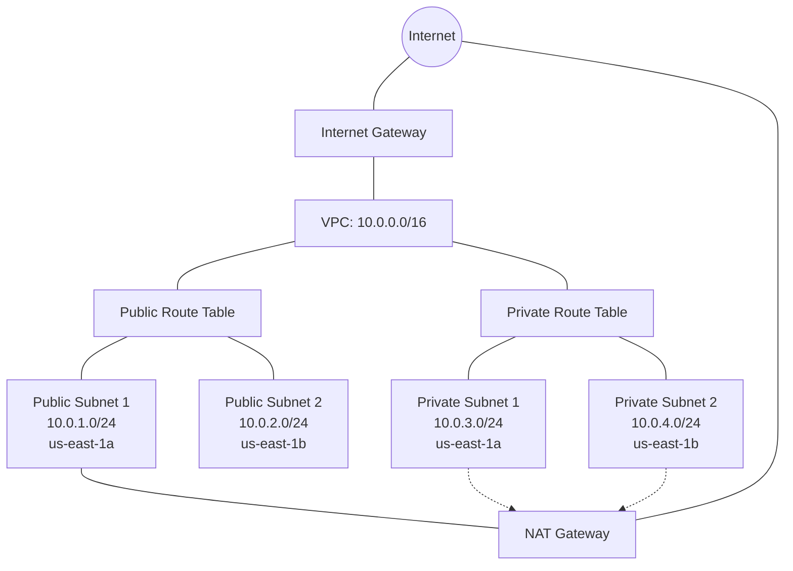

# Terraform AWS VPC

## Introduction

A Virtual Private Cloud (VPC) is one of the fundamental building blocks of your AWS infrastructure. It provides an isolated virtual network environment where you can launch AWS resources in a defined virtual network. Using Terraform to manage your VPCs brings the power of Infrastructure as Code (IaC) to network management, allowing you to version control, replicate, and automate your network infrastructure.

In this tutorial, we'll learn how to create an AWS VPC using Terraform. We'll cover:

- Basic VPC concepts
- Creating a VPC with public and private subnets
- Configuring internet connectivity
- Setting up routing tables
- Implementing security groups

## Prerequisites

Before we begin, make sure you have:

1. An AWS account
2. Terraform installed on your local machine
3. AWS CLI configured with appropriate credentials
4. Basic understanding of AWS and networking concepts

## Understanding AWS VPC Components

Before diving into the code, let's understand the key components we'll be working with:

- **VPC**: The virtual network dedicated to your AWS account
- **Subnet**: A range of IP addresses in your VPC
- **Internet Gateway**: Enables communication between your VPC and the internet
- **Route Table**: Contains rules (routes) that determine where network traffic is directed
- **NAT Gateway**: Allows instances in private subnets to connect to the internet
- **Security Group**: Acts as a virtual firewall for controlling inbound and outbound traffic

## VPC Architecture Diagram

Let's visualize what we'll be building:



## Creating a Basic VPC with Terraform

Let's start by setting up our Terraform project and creating a basic VPC.

### Project Structure

Create a new directory for your project and organize your files like this:

```
terraform-aws-vpc/
├── main.tf         # Main Terraform configuration
├── variables.tf    # Variable definitions
├── outputs.tf      # Output values
└── providers.tf    # Provider configuration
```

### Provider Configuration (providers.tf)

Let's begin by setting up our AWS provider:

```hcl
provider "aws" {
  region = var.aws_region
}

terraform {
  required_providers {
    aws = {
      source  = "hashicorp/aws"
      version = "~> 4.0"
    }
  }
  
  required_version = ">= 1.0.0"
}
```

### Variables Definition (variables.tf)

Define the variables we'll need for our VPC:

```hcl
variable "aws_region" {
  description = "AWS region"
  type        = string
  default     = "us-east-1"
}

variable "vpc_name" {
  description = "Name of the VPC"
  type        = string
  default     = "terraform-vpc"
}

variable "vpc_cidr" {
  description = "CIDR block for the VPC"
  type        = string
  default     = "10.0.0.0/16"
}

variable "public_subnet_cidrs" {
  description = "CIDR blocks for the public subnets"
  type        = list(string)
  default     = ["10.0.1.0/24", "10.0.2.0/24"]
}

variable "private_subnet_cidrs" {
  description = "CIDR blocks for the private subnets"
  type        = list(string)
  default     = ["10.0.3.0/24", "10.0.4.0/24"]
}

variable "availability_zones" {
  description = "Availability zones for subnets"
  type        = list(string)
  default     = ["us-east-1a", "us-east-1b"]
}
```

### Main Configuration (main.tf)

Now let's create our VPC resources:

```hcl
# Create VPC
resource "aws_vpc" "main" {
  cidr_block           = var.vpc_cidr
  enable_dns_support   = true
  enable_dns_hostnames = true

  tags = {
    Name = var.vpc_name
  }
}

# Create Internet Gateway
resource "aws_internet_gateway" "igw" {
  vpc_id = aws_vpc.main.id

  tags = {
    Name = "${var.vpc_name}-igw"
  }
}

# Create Public Subnets
resource "aws_subnet" "public" {
  count                   = length(var.public_subnet_cidrs)
  vpc_id                  = aws_vpc.main.id
  cidr_block              = var.public_subnet_cidrs[count.index]
  availability_zone       = var.availability_zones[count.index]
  map_public_ip_on_launch = true

  tags = {
    Name = "${var.vpc_name}-public-subnet-${count.index + 1}"
  }
}

# Create Private Subnets
resource "aws_subnet" "private" {
  count             = length(var.private_subnet_cidrs)
  vpc_id            = aws_vpc.main.id
  cidr_block        = var.private_subnet_cidrs[count.index]
  availability_zone = var.availability_zones[count.index]

  tags = {
    Name = "${var.vpc_name}-private-subnet-${count.index + 1}"
  }
}

# Create NAT Gateway Elastic IP
resource "aws_eip" "nat_eip" {
  domain = "vpc"
  
  tags = {
    Name = "${var.vpc_name}-nat-eip"
  }
}

# Create NAT Gateway
resource "aws_nat_gateway" "nat_gw" {
  allocation_id = aws_eip.nat_eip.id
  subnet_id     = aws_subnet.public[0].id

  tags = {
    Name = "${var.vpc_name}-nat-gw"
  }

  # To ensure proper ordering, add this explicit dependency
  depends_on = [aws_internet_gateway.igw]
}

# Create Public Route Table
resource "aws_route_table" "public" {
  vpc_id = aws_vpc.main.id

  route {
    cidr_block = "0.0.0.0/0"
    gateway_id = aws_internet_gateway.igw.id
  }

  tags = {
    Name = "${var.vpc_name}-public-rt"
  }
}

# Create Private Route Table
resource "aws_route_table" "private" {
  vpc_id = aws_vpc.main.id

  route {
    cidr_block     = "0.0.0.0/0"
    nat_gateway_id = aws_nat_gateway.nat_gw.id
  }

  tags = {
    Name = "${var.vpc_name}-private-rt"
  }
}

# Associate Public Subnets with Public Route Table
resource "aws_route_table_association" "public" {
  count          = length(aws_subnet.public)
  subnet_id      = aws_subnet.public[count.index].id
  route_table_id = aws_route_table.public.id
}

# Associate Private Subnets with Private Route Table
resource "aws_route_table_association" "private" {
  count          = length(aws_subnet.private)
  subnet_id      = aws_subnet.private[count.index].id
  route_table_id = aws_route_table.private.id
}

# Create Default Security Group
resource "aws_security_group" "default" {
  name        = "${var.vpc_name}-default-sg"
  description = "Default security group for ${var.vpc_name}"
  vpc_id      = aws_vpc.main.id

  ingress {
    from_port   = 0
    to_port     = 0
    protocol    = "-1"
    cidr_blocks = [var.vpc_cidr]
  }

  egress {
    from_port   = 0
    to_port     = 0
    protocol    = "-1"
    cidr_blocks = ["0.0.0.0/0"]
  }

  tags = {
    Name = "${var.vpc_name}-default-sg"
  }
}
```

### Outputs (outputs.tf)

Define outputs to make it easier to reference the VPC resources:

```hcl
output "vpc_id" {
  description = "ID of the VPC"
  value       = aws_vpc.main.id
}

output "vpc_cidr" {
  description = "CIDR block of the VPC"
  value       = aws_vpc.main.cidr_block
}

output "public_subnet_ids" {
  description = "IDs of the public subnets"
  value       = aws_subnet.public[*].id
}

output "private_subnet_ids" {
  description = "IDs of the private subnets"
  value       = aws_subnet.private[*].id
}

output "internet_gateway_id" {
  description = "ID of the Internet Gateway"
  value       = aws_internet_gateway.igw.id
}

output "nat_gateway_id" {
  description = "ID of the NAT Gateway"
  value       = aws_nat_gateway.nat_gw.id
}

output "public_route_table_id" {
  description = "ID of the public route table"
  value       = aws_route_table.public.id
}

output "private_route_table_id" {
  description = "ID of the private route table"
  value       = aws_route_table.private.id
}

output "default_security_group_id" {
  description = "ID of the default security group"
  value       = aws_security_group.default.id
}
```

## Deploying the VPC

Now that we have our Terraform configuration files ready, let's deploy our VPC:

1. Initialize Terraform:

```bash
terraform init
```

Expected output:
```
Initializing the backend...

Initializing provider plugins...
- Finding hashicorp/aws versions matching "~> 4.0"...
- Installing hashicorp/aws v4.67.0...
- Installed hashicorp/aws v4.67.0 (signed by HashiCorp)

Terraform has been successfully initialized!
```

2. Review the plan:

```bash
terraform plan
```

Expected output:
```
Terraform will perform the following actions:

  # aws_eip.nat_eip will be created
  # aws_internet_gateway.igw will be created
  # aws_nat_gateway.nat_gw will be created
  # aws_route_table.private will be created
  # aws_route_table.public will be created
  # aws_route_table_association.private[0] will be created
  # aws_route_table_association.private[1] will be created
  # aws_route_table_association.public[0] will be created
  # aws_route_table_association.public[1] will be created
  # aws_security_group.default will be created
  # aws_subnet.private[0] will be created
  # aws_subnet.private[1] will be created
  # aws_subnet.public[0] will be created
  # aws_subnet.public[1] will be created
  # aws_vpc.main will be created

Plan: 15 to add, 0 to change, 0 to destroy.
```

3. Apply the changes:

```bash
terraform apply
```

Enter `yes` when prompted to create the resources.

After successful deployment, Terraform will display the outputs we defined:

```
Apply complete! Resources: 15 added, 0 changed, 0 destroyed.

Outputs:

default_security_group_id = "sg-0a1b2c3d4e5f6g7h8"
internet_gateway_id = "igw-0a1b2c3d4e5f6g7h8"
nat_gateway_id = "nat-0a1b2c3d4e5f6g7h8"
private_route_table_id = "rtb-0a1b2c3d4e5f6g7h8"
private_subnet_ids = [
  "subnet-0a1b2c3d4e5f6g7h8",
  "subnet-1a2b3c4d5e6f7g8h9",
]
public_route_table_id = "rtb-1a2b3c4d5e6f7g8h9"
public_subnet_ids = [
  "subnet-2a3b4c5d6e7f8g9h0",
  "subnet-3a4b5c6d7e8f9g0h1",
]
vpc_cidr = "10.0.0.0/16"
vpc_id = "vpc-0a1b2c3d4e5f6g7h8"
```

## Real-World Example: Deploying a Web Application with Terraform

Now let's see how to use our VPC to deploy a simple web application. We'll create an EC2 instance in the public subnet and an RDS database in the private subnet.

Create a new file named `web_app.tf` with the following content:

```hcl
# Web Server Security Group
resource "aws_security_group" "web" {
  name        = "web-server-sg"
  description = "Security group for web servers"
  vpc_id      = aws_vpc.main.id

  ingress {
    from_port   = 80
    to_port     = 80
    protocol    = "tcp"
    cidr_blocks = ["0.0.0.0/0"]
    description = "Allow HTTP traffic"
  }

  ingress {
    from_port   = 22
    to_port     = 22
    protocol    = "tcp"
    cidr_blocks = ["0.0.0.0/0"]  # In production, restrict to your IP
    description = "Allow SSH traffic"
  }

  egress {
    from_port   = 0
    to_port     = 0
    protocol    = "-1"
    cidr_blocks = ["0.0.0.0/0"]
    description = "Allow all outbound traffic"
  }

  tags = {
    Name = "${var.vpc_name}-web-sg"
  }
}

# Database Security Group
resource "aws_security_group" "db" {
  name        = "database-sg"
  description = "Security group for database instances"
  vpc_id      = aws_vpc.main.id

  ingress {
    from_port       = 3306
    to_port         = 3306
    protocol        = "tcp"
    security_groups = [aws_security_group.web.id]
    description