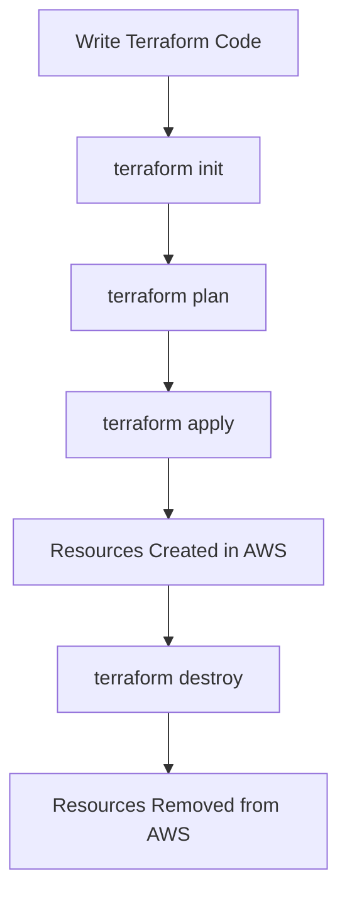

# Terraform AWS EC2

## Introduction

Amazon Elastic Compute Cloud (EC2) is one of AWS's core services, providing resizable virtual machines in the cloud. When combined with Terraform, you can define, launch, and manage these instances through code, enabling consistent, version-controlled infrastructure deployment.

In this tutorial, we'll explore how to use Terraform to provision and manage EC2 instances on AWS. We'll cover the basics and gradually move to more advanced configurations, providing you with a solid foundation for your infrastructure as code journey.

## Prerequisites

Before we begin, ensure you have:

- [Terraform](https://www.terraform.io/downloads.html) installed (version 1.0.0+)
- An AWS account with appropriate permissions
- AWS CLI installed and configured with your credentials
- Basic understanding of AWS services and Terraform concepts

## Setting Up Your Terraform Project

Let's start by creating a new directory for our Terraform project:

```bash
mkdir terraform-aws-ec2
cd terraform-aws-ec2
touch main.tf variables.tf outputs.tf
```

### Provider Configuration

First, we need to configure the AWS provider in our `main.tf` file:

```hcl
terraform {
  required_providers {
    aws = {
      source  = "hashicorp/aws"
      version = "~> 5.0"
    }
  }
  required_version = ">= 1.0.0"
}

provider "aws" {
  region = var.aws_region
}
```

Define the region variable in `variables.tf`:

```hcl
variable "aws_region" {
  description = "AWS region to deploy resources"
  type        = string
  default     = "us-east-1"
}
```

## Creating a Basic EC2 Instance

Let's start with a simple EC2 instance. Add the following to your `main.tf`:

```hcl
resource "aws_instance" "web_server" {
  ami           = var.ami_id
  instance_type = var.instance_type
  
  tags = {
    Name = "TerraformWebServer"
    Environment = "Development"
  }
}
```

And add the corresponding variables to `variables.tf`:

```hcl
variable "ami_id" {
  description = "AMI ID for the EC2 instance"
  type        = string
  default     = "ami-0c101f26f147fa7fd"  # Amazon Linux 2023 in us-east-1 (update as needed)
}

variable "instance_type" {
  description = "EC2 instance type"
  type        = string
  default     = "t2.micro"
}
```

Let's add an output to display the instance's public IP after creation in `outputs.tf`:

```hcl
output "instance_public_ip" {
  description = "Public IP address of the EC2 instance"
  value       = aws_instance.web_server.public_ip
}
```

## Deploying Your Infrastructure

Now, let's deploy our infrastructure:

```bash
# Initialize Terraform
terraform init

# Plan the deployment
terraform plan

# Apply the configuration
terraform apply
```

When you run `terraform apply`, Terraform will show you what resources it plans to create and ask for confirmation. After confirming, it will provision the EC2 instance and display the public IP address.

## Understanding the Terraform Flow



## Enhancing Your EC2 Configuration

### Security Groups

EC2 instances need security groups to control inbound and outbound traffic. Let's add a security group:

```hcl
resource "aws_security_group" "web_server_sg" {
  name        = "web-server-sg"
  description = "Security group for web server"

  ingress {
    from_port   = 80
    to_port     = 80
    protocol    = "tcp"
    cidr_blocks = ["0.0.0.0/0"]
    description = "Allow HTTP traffic"
  }

  ingress {
    from_port   = 22
    to_port     = 22
    protocol    = "tcp"
    cidr_blocks = ["0.0.0.0/0"]
    description = "Allow SSH traffic"
  }

  egress {
    from_port   = 0
    to_port     = 0
    protocol    = "-1"
    cidr_blocks = ["0.0.0.0/0"]
    description = "Allow all outbound traffic"
  }

  tags = {
    Name = "WebServerSG"
  }
}
```

Then, reference this security group in your EC2 instance:

```hcl
resource "aws_instance" "web_server" {
  ami           = var.ami_id
  instance_type = var.instance_type
  vpc_security_group_ids = [aws_security_group.web_server_sg.id]
  
  tags = {
    Name = "TerraformWebServer"
    Environment = "Development"
  }
}
```

### User Data for Instance Setup

User data allows you to run scripts when your instance launches. Let's add a script to install and start a web server:

```hcl
resource "aws_instance" "web_server" {
  ami           = var.ami_id
  instance_type = var.instance_type
  vpc_security_group_ids = [aws_security_group.web_server_sg.id]
  
  user_data = <<-EOF
    #!/bin/bash
    yum update -y
    yum install -y httpd
    systemctl start httpd
    systemctl enable httpd
    echo "<h1>Hello from Terraform</h1>" > /var/www/html/index.html
  EOF
  
  tags = {
    Name = "TerraformWebServer"
    Environment = "Development"
  }
}
```

### Key Pairs for SSH Access

To SSH into your instance, you'll need a key pair:

```hcl
resource "aws_key_pair" "deployer" {
  key_name   = "deployer-key"
  public_key = file(var.public_key_path)
}

resource "aws_instance" "web_server" {
  ami                    = var.ami_id
  instance_type          = var.instance_type
  vpc_security_group_ids = [aws_security_group.web_server_sg.id]
  key_name               = aws_key_pair.deployer.key_name
  
  user_data = <<-EOF
    #!/bin/bash
    yum update -y
    yum install -y httpd
    systemctl start httpd
    systemctl enable httpd
    echo "<h1>Hello from Terraform</h1>" > /var/www/html/index.html
  EOF
  
  tags = {
    Name = "TerraformWebServer"
    Environment = "Development"
  }
}
```

Add the public key path variable:

```hcl
variable "public_key_path" {
  description = "Path to the public key for SSH access"
  type        = string
  default     = "~/.ssh/id_rsa.pub"
}
```

## Advanced EC2 Configuration

### Elastic IP for Static Address

To ensure your instance keeps the same public IP address even after restarts:

```hcl
resource "aws_eip" "web_server_eip" {
  instance = aws_instance.web_server.id
  domain   = "vpc"
  
  tags = {
    Name = "WebServerEIP"
  }
}

# Update the output to use the Elastic IP
output "instance_public_ip" {
  description = "Public IP address of the EC2 instance"
  value       = aws_eip.web_server_eip.public_ip
}
```

### Using Data Sources for AMI Selection

Instead of hardcoding the AMI ID, we can use a data source to dynamically select the latest Amazon Linux 2 AMI:

```hcl
data "aws_ami" "amazon_linux" {
  most_recent = true
  owners      = ["amazon"]

  filter {
    name   = "name"
    values = ["al2023-ami-*-x86_64"]
  }

  filter {
    name   = "virtualization-type"
    values = ["hvm"]
  }
}

resource "aws_instance" "web_server" {
  ami                    = data.aws_ami.amazon_linux.id
  instance_type          = var.instance_type
  vpc_security_group_ids = [aws_security_group.web_server_sg.id]
  key_name               = aws_key_pair.deployer.key_name
  
  # Rest of the configuration remains the same
}
```

### Attaching an EBS Volume

For additional storage needs:

```hcl
resource "aws_ebs_volume" "web_server_data" {
  availability_zone = aws_instance.web_server.availability_zone
  size              = 10
  type              = "gp3"
  
  tags = {
    Name = "WebServerData"
  }
}

resource "aws_volume_attachment" "web_server_data_attachment" {
  device_name = "/dev/sdf"
  volume_id   = aws_ebs_volume.web_server_data.id
  instance_id = aws_instance.web_server.id
}
```

## Real-World Example: Web Server Cluster

Let's build a more realistic example - a web server cluster with load balancing:

```hcl
# Create a VPC
resource "aws_vpc" "main" {
  cidr_block = "10.0.0.0/16"
  
  tags = {
    Name = "MainVPC"
  }
}

# Create public subnets in different availability zones
resource "aws_subnet" "public_1" {
  vpc_id                  = aws_vpc.main.id
  cidr_block              = "10.0.1.0/24"
  availability_zone       = "${var.aws_region}a"
  map_public_ip_on_launch = true
  
  tags = {
    Name = "PublicSubnet1"
  }
}

resource "aws_subnet" "public_2" {
  vpc_id                  = aws_vpc.main.id
  cidr_block              = "10.0.2.0/24"
  availability_zone       = "${var.aws_region}b"
  map_public_ip_on_launch = true
  
  tags = {
    Name = "PublicSubnet2"
  }
}

# Internet gateway
resource "aws_internet_gateway" "igw" {
  vpc_id = aws_vpc.main.id
  
  tags = {
    Name = "MainIGW"
  }
}

# Route table
resource "aws_route_table" "public" {
  vpc_id = aws_vpc.main.id
  
  route {
    cidr_block = "0.0.0.0/0"
    gateway_id = aws_internet_gateway.igw.id
  }
  
  tags = {
    Name = "PublicRouteTable"
  }
}

# Route table associations
resource "aws_route_table_association" "public_1" {
  subnet_id      = aws_subnet.public_1.id
  route_table_id = aws_route_table.public.id
}

resource "aws_route_table_association" "public_2" {
  subnet_id      = aws_subnet.public_2.id
  route_table_id = aws_route_table.public.id
}

# Security group for the load balancer
resource "aws_security_group" "alb_sg" {
  name        = "alb-sg"
  description = "Security group for ALB"
  vpc_id      = aws_vpc.main.id
  
  ingress {
    from_port   = 80
    to_port     = 80
    protocol    = "tcp"
    cidr_blocks = ["0.0.0.0/0"]
  }
  
  egress {
    from_port   = 0
    to_port     = 0
    protocol    = "-1"
    cidr_blocks = ["0.0.0.0/0"]
  }
}

# Security group for EC2 instances
resource "aws_security_group" "web_sg" {
  name        = "web-sg"
  description = "Security group for web servers"
  vpc_id      = aws_vpc.main.id
  
  ingress {
    from_port       = 80
    to_port         = 80
    protocol        = "tcp"
    security_groups = [aws_security_group.alb_sg.id]
  }
  
  ingress {
    from_port   = 22
    to_port     = 22
    protocol    = "tcp"
    cidr_blocks = ["0.0.0.0/0"]
  }
  
  egress {
    from_port   = 0
    to_port     = 0
    protocol    = "-1"
    cidr_blocks = ["0.0.0.0/0"]
  }
}

# Launch template for EC2 instances
resource "aws_launch_template" "web" {
  name_prefix   = "web-"
  image_id      = data.aws_ami.amazon_linux.id
  instance_type = var.instance_type
  key_name      = aws_key_pair.deployer.key_name
  
  vpc_security_group_ids = [aws_security_group.web_sg.id]
  
  user_data = base64encode(<<-EOF
    #!/bin/bash
    yum update -y
    yum install -y httpd
    systemctl start httpd
    systemctl enable httpd
    echo "<h1>Hello from Terraform - $(hostname -f)</h1>" > /var/www/html/index.html
  EOF
  )
  
  tag_specifications {
    resource_type = "instance"
    tags = {
      Name = "WebServer"
    }
  }
}

# Auto Scaling Group
resource "aws_autoscaling_group" "web" {
  name                = "web-asg"
  min_size            = 2
  max_size            = 4
  desired_capacity    = 2
  vpc_zone_identifier = [aws_subnet.public_1.id, aws_subnet.public_2.id]
  
  launch_template {
    id      = aws_launch_template.web.id
    version = "$Latest"
  }
  
  target_group_arns = [aws_lb_target_group.web.arn]
  
  lifecycle {
    create_before_destroy = true
  }
}

# Application Load Balancer
resource "aws_lb" "web" {
  name               = "web-alb"
  internal           = false
  load_balancer_type = "application"
  security_groups    = [aws_security_group.alb_sg.id]
  subnets            = [aws_subnet.public_1.id, aws_subnet.public_2.id]
  
  tags = {
    Name = "WebALB"
  }
}

# Target Group
resource "aws_lb_target_group" "web" {
  name     = "web-tg"
  port     = 80
  protocol = "HTTP"
  vpc_id   = aws_vpc.main.id
  
  health_check {
    enabled             = true
    interval            = 30
    path                = "/"
    port                = "traffic-port"
    healthy_threshold   = 3
    unhealthy_threshold = 3
    timeout             = 5
    protocol            = "HTTP