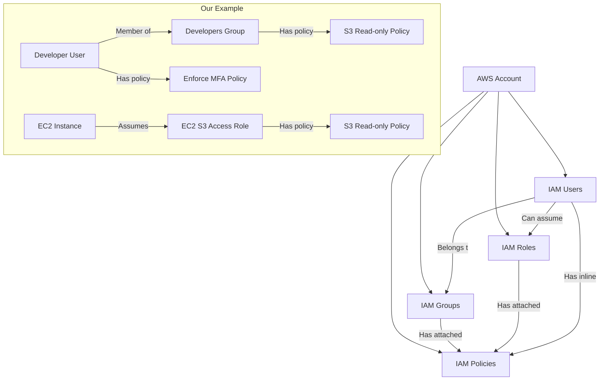

# Terraform AWS IAM

## Introduction

AWS Identity and Access Management (IAM) is a critical service that helps you control access to your AWS resources. It allows you to manage users, groups, roles, and their permissions within your AWS environment. When combined with Terraform, you can automate the creation and management of these IAM resources, ensuring consistent access controls across your infrastructure.

In this tutorial, we'll explore how to use Terraform to provision and manage AWS IAM resources. We'll cover creating users, groups, roles, and policies, as well as implementing best practices for secure IAM configurations.

## Prerequisites

Before you begin, ensure you have:

1. [Terraform installed](https://learn.hashicorp.com/tutorials/terraform/install-cli) (version 1.0.0 or later)
2. [AWS CLI installed](https://docs.aws.amazon.com/cli/latest/userguide/install-cliv2.html) and configured
3. Basic understanding of AWS IAM concepts
4. Basic knowledge of Terraform

## Setting Up the Terraform Project

Let's start by creating a new directory for our Terraform project:

```bash
mkdir terraform-aws-iam
cd terraform-aws-iam
touch main.tf variables.tf outputs.tf
```

### Provider Configuration

First, we need to configure the AWS provider in our `main.tf` file:

```hcl
terraform {
  required_providers {
    aws = {
      source  = "hashicorp/aws"
      version = "~> 5.0"
    }
  }
  required_version = ">= 1.0.0"
}

provider "aws" {
  region = var.aws_region
}
```

And in `variables.tf`:

```hcl
variable "aws_region" {
  description = "The AWS region to deploy resources"
  type        = string
  default     = "us-east-1"
}
```

## Managing IAM Users with Terraform

Let's start by creating an IAM user. Add the following to your `main.tf`:

```hcl
resource "aws_iam_user" "developer" {
  name = "developer"
  path = "/users/"

  tags = {
    Environment = "Production"
    Role        = "Developer"
  }
}

resource "aws_iam_access_key" "developer_key" {
  user = aws_iam_user.developer.name
}
```

This creates an IAM user named "developer" and generates an access key for this user.

Let's add an output to see the access key information in `outputs.tf`:

```hcl
output "developer_access_key_id" {
  value = aws_iam_access_key.developer_key.id
}

output "developer_secret_access_key" {
  value     = aws_iam_access_key.developer_key.secret
  sensitive = true
}
```

:::caution
Never commit access keys to version control. The `sensitive = true` flag helps prevent the secret from appearing in console output, but additional precautions should be taken in production environments.
:::

## Creating IAM Groups

Groups are an effective way to manage permissions for multiple users. Let's create a developers group:

```hcl
resource "aws_iam_group" "developers" {
  name = "developers"
  path = "/users/"
}

resource "aws_iam_group_membership" "developers_team" {
  name  = "developers-group-membership"
  users = [aws_iam_user.developer.name]
  group = aws_iam_group.developers.name
}
```

## Defining IAM Policies

Now, let's create a policy that grants read-only access to S3 and assign it to our developers group:

```hcl
resource "aws_iam_policy" "s3_read_only" {
  name        = "S3ReadOnlyAccess"
  description = "Provides read-only access to S3 buckets"
  
  policy = jsonencode({
    Version = "2012-10-17",
    Statement = [
      {
        Effect   = "Allow",
        Action   = [
          "s3:Get*",
          "s3:List*",
          "s3:Describe*",
          "s3-object-lambda:Get*",
          "s3-object-lambda:List*"
        ],
        Resource = "*"
      }
    ]
  })
}

resource "aws_iam_group_policy_attachment" "developers_s3_read_only" {
  group      = aws_iam_group.developers.name
  policy_arn = aws_iam_policy.s3_read_only.arn
}
```

## Creating IAM Roles

Roles are typically used by services or for cross-account access. Let's create a role that allows EC2 instances to access S3 buckets:

```hcl
resource "aws_iam_role" "ec2_s3_access" {
  name = "ec2-s3-access-role"
  
  assume_role_policy = jsonencode({
    Version = "2012-10-17",
    Statement = [
      {
        Effect = "Allow",
        Principal = {
          Service = "ec2.amazonaws.com"
        },
        Action = "sts:AssumeRole"
      }
    ]
  })
  
  tags = {
    Purpose = "Allow EC2 instances to access S3"
  }
}

resource "aws_iam_role_policy_attachment" "ec2_s3_access" {
  role       = aws_iam_role.ec2_s3_access.name
  policy_arn = "arn:aws:iam::aws:policy/AmazonS3ReadOnlyAccess"
}

resource "aws_iam_instance_profile" "ec2_s3_profile" {
  name = "ec2-s3-profile"
  role = aws_iam_role.ec2_s3_access.name
}
```

This creates a role that EC2 instances can assume, and attaches the AWS managed S3 read-only access policy to it.

## Implementing IAM Best Practices

### Password Policy

Setting a strong password policy is essential for security. Add this to your `main.tf`:

```hcl
resource "aws_iam_account_password_policy" "strict" {
  minimum_password_length        = 12
  require_lowercase_characters   = true
  require_uppercase_characters   = true
  require_numbers                = true
  require_symbols                = true
  allow_users_to_change_password = true
  password_reuse_prevention      = 24
  max_password_age               = 90
}
```

### Multi-Factor Authentication (MFA)

Let's enforce MFA for our developer user:

```hcl
resource "aws_iam_user_policy" "enforce_mfa" {
  name   = "enforce-mfa"
  user   = aws_iam_user.developer.name
  
  policy = jsonencode({
    Version = "2012-10-17",
    Statement = [
      {
        Sid    = "AllowViewAccountInfo",
        Effect = "Allow",
        Action = [
          "iam:GetAccountPasswordPolicy",
          "iam:GetAccountSummary",
          "iam:ListVirtualMFADevices"
        ],
        Resource = "*"
      },
      {
        Sid    = "AllowManageOwnVirtualMFADevice",
        Effect = "Allow",
        Action = [
          "iam:CreateVirtualMFADevice",
          "iam:DeleteVirtualMFADevice"
        ],
        Resource = "arn:aws:iam::*:mfa/*"
      },
      {
        Sid    = "AllowManageOwnUserMFA",
        Effect = "Allow",
        Action = [
          "iam:DeactivateMFADevice",
          "iam:EnableMFADevice",
          "iam:ListMFADevices",
          "iam:ResyncMFADevice"
        ],
        Resource = "arn:aws:iam::*:user/${aws_iam_user.developer.name}"
      },
      {
        Sid    = "DenyAllExceptListedIfNoMFA",
        Effect = "Deny",
        NotAction = [
          "iam:CreateVirtualMFADevice",
          "iam:EnableMFADevice",
          "iam:GetUser",
          "iam:ListMFADevices",
          "iam:ListVirtualMFADevices",
          "iam:ResyncMFADevice",
          "sts:GetSessionToken"
        ],
        Resource = "*",
        Condition = {
          BoolIfExists = {
            "aws:MultiFactorAuthPresent": "false"
          }
        }
      }
    ]
  })
}
```

This policy allows the user to manage their own MFA device and denies most actions if MFA is not present.

## Real-World Example: Complete IAM Configuration

Let's put everything together into a more comprehensive example for a small organization:

```hcl
# Define variables for team members
variable "team_members" {
  description = "List of team members to create IAM users for"
  type        = list(string)
  default     = ["alex", "taylor", "jordan", "casey"]
}

# Create IAM users for each team member
resource "aws_iam_user" "team" {
  for_each = toset(var.team_members)
  
  name = each.value
  path = "/users/"
  
  tags = {
    Team = "Development"
  }
}

# Create developer and admin groups
resource "aws_iam_group" "developers" {
  name = "developers"
}

resource "aws_iam_group" "administrators" {
  name = "administrators"
}

# Add users to groups (first two users are admins, others are developers)
resource "aws_iam_user_group_membership" "user_groups" {
  for_each = toset(var.team_members)
  
  user = aws_iam_user.team[each.value].name
  
  groups = [
    index(var.team_members, each.value) < 2 ? aws_iam_group.administrators.name : aws_iam_group.developers.name
  ]
}

# Create custom policy for developers
resource "aws_iam_policy" "developer_permissions" {
  name        = "DeveloperPermissions"
  description = "Permissions for developers"
  
  policy = jsonencode({
    Version = "2012-10-17",
    Statement = [
      {
        Effect   = "Allow",
        Action   = [
          "ec2:Describe*",
          "rds:Describe*",
          "s3:List*",
          "s3:Get*"
        ],
        Resource = "*"
      },
      {
        Effect   = "Allow",
        Action   = [
          "s3:PutObject",
          "s3:DeleteObject"
        ],
        Resource = "arn:aws:s3:::dev-*/*"
      }
    ]
  })
}

# Attach developer policy to developers group
resource "aws_iam_group_policy_attachment" "developers_permissions" {
  group      = aws_iam_group.developers.name
  policy_arn = aws_iam_policy.developer_permissions.arn
}

# Attach AdministratorAccess policy to administrators group
resource "aws_iam_group_policy_attachment" "admin_permissions" {
  group      = aws_iam_group.administrators.name
  policy_arn = "arn:aws:iam::aws:policy/AdministratorAccess"
}

# Create a role for Lambda functions
resource "aws_iam_role" "lambda_execution" {
  name = "lambda-execution-role"
  
  assume_role_policy = jsonencode({
    Version = "2012-10-17",
    Statement = [
      {
        Effect = "Allow",
        Principal = {
          Service = "lambda.amazonaws.com"
        },
        Action = "sts:AssumeRole"
      }
    ]
  })
}

# Attach basic Lambda execution policy
resource "aws_iam_role_policy_attachment" "lambda_basic" {
  role       = aws_iam_role.lambda_execution.name
  policy_arn = "arn:aws:iam::aws:policy/service-role/AWSLambdaBasicExecutionRole"
}

# Add S3 access for Lambda
resource "aws_iam_role_policy" "lambda_s3_access" {
  name   = "lambda-s3-access"
  role   = aws_iam_role.lambda_execution.id
  
  policy = jsonencode({
    Version = "2012-10-17",
    Statement = [
      {
        Effect   = "Allow",
        Action   = [
          "s3:GetObject",
          "s3:PutObject",
          "s3:ListBucket"
        ],
        Resource = [
          "arn:aws:s3:::app-data-bucket",
          "arn:aws:s3:::app-data-bucket/*"
        ]
      }
    ]
  })
}
```

This example:
1. Creates users for each team member
2. Organizes users into developer and administrator groups
3. Assigns appropriate permissions to each group
4. Creates a role for Lambda functions with specific S3 access

## Visualizing IAM Relationships

Let's create a diagram to help visualize the relationships between IAM resources:



## Common IAM Operations in Terraform

Here are some common IAM operations you might need to perform:

### Importing Existing IAM Resources

If you already have IAM resources in your AWS account, you can import them into Terraform:

```bash
terraform import aws_iam_user.developer "developer"
terraform import aws_iam_group.developers "developers"
terraform import aws_iam_role.ec2_s3_access "ec2-s3-access-role"
```

### Rotating Access Keys

A security best practice is to regularly rotate access keys:

```hcl
resource "aws_iam_access_key" "developer_key" {
  user    = aws_iam_user.developer.name
  # Set to inactive to create a new key while keeping the old one working
  status  = "Active"
  # Adding a lifecycle block to create a new resource before destroying the old one
  lifecycle {
    create_before_destroy = true
  }
}
```

### Cross-Account Access

For multi-account setups, you might need to allow cross-account access:

```hcl
resource "aws_iam_role" "cross_account" {
  name = "cross-account-access"
  
  assume_role_policy = jsonencode({
    Version = "2012-10-17",
    Statement = [
      {
        Effect = "Allow",
        Principal = {
          AWS = "arn:aws:iam::ACCOUNT_ID:root"