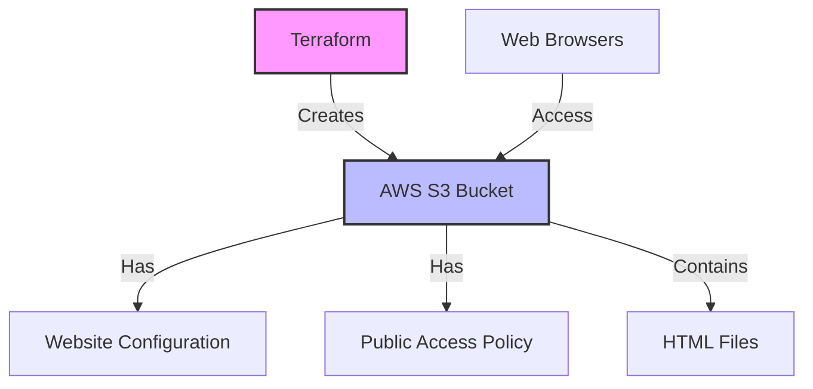

# Terraform AWS S3

## Introduction

Amazon Simple Storage Service (S3) is one of the most widely used AWS services, providing secure, durable, and scalable object storage. When building cloud infrastructure with Terraform, creating and managing S3 buckets is a common requirement for many applications. This guide will show you how to define, provision, and manage S3 buckets using Terraform, allowing you to incorporate cloud storage into your infrastructure as code workflows.

## Prerequisites

Before getting started, make sure you have:

- Terraform installed (version 0.12 or later)
- AWS CLI configured with appropriate credentials
- Basic understanding of AWS S3 concepts
- Basic knowledge of Terraform syntax

## Setting Up Your Terraform Project

Let's start by creating a new directory for our Terraform project and setting up the necessary files:

```bash
mkdir terraform-aws-s3
cd terraform-aws-s3
touch main.tf variables.tf outputs.tf
```

Next, we'll define the AWS provider in our `main.tf` file:

```hcl
provider "aws" {
  region = var.aws_region
}
```

And create corresponding variables in `variables.tf`:

```hcl
variable "aws_region" {
  description = "The AWS region to deploy resources"
  type        = string
  default     = "us-east-1"
}
```

## Creating a Basic S3 Bucket

Let's start with creating a simple S3 bucket. Add the following code to your `main.tf` file:

```hcl
resource "aws_s3_bucket" "my_bucket" {
  bucket = var.bucket_name

  tags = {
    Name        = var.bucket_name
    Environment = var.environment
  }
}
```

Add the corresponding variables to your `variables.tf` file:

```hcl
variable "bucket_name" {
  description = "Name of the S3 bucket (must be globally unique)"
  type        = string
}

variable "environment" {
  description = "Environment where the bucket will be deployed"
  type        = string
  default     = "dev"
}
```

To see the bucket name and ARN after creation, let's define outputs in `outputs.tf`:

```hcl
output "bucket_name" {
  description = "Name of the created S3 bucket"
  value       = aws_s3_bucket.my_bucket.id
}

output "bucket_arn" {
  description = "ARN of the created S3 bucket"
  value       = aws_s3_bucket.my_bucket.arn
}
```

## Applying the Configuration

Now, let's apply this configuration:

```bash
terraform init
terraform apply
```

When prompted, enter a globally unique name for your bucket. Terraform will show you the resources it plans to create. Type `yes` to proceed.

Output will look similar to:

```
Apply complete! Resources: 1 added, 0 changed, 0 destroyed.

Outputs:

bucket_name = "your-unique-bucket-name"
bucket_arn = "arn:aws:s3:::your-unique-bucket-name"
```

## Configuring Bucket Properties

S3 buckets have many configurable properties. Let's explore the most common ones.

### Enabling Versioning

Versioning allows you to keep multiple versions of an object in the same bucket, which is useful for data protection and recovery:

```hcl
resource "aws_s3_bucket_versioning" "versioning" {
  bucket = aws_s3_bucket.my_bucket.id
  
  versioning_configuration {
    status = "Enabled"
  }
}
```

### Setting Access Control

By default, new S3 buckets are private. Let's explicitly define access control:

```hcl
resource "aws_s3_bucket_ownership_controls" "ownership" {
  bucket = aws_s3_bucket.my_bucket.id
  
  rule {
    object_ownership = "BucketOwnerEnforced"
  }
}

resource "aws_s3_bucket_public_access_block" "public_access" {
  bucket = aws_s3_bucket.my_bucket.id
  
  block_public_acls       = true
  block_public_policy     = true
  ignore_public_acls      = true
  restrict_public_buckets = true
}
```

### Configuring Bucket Encryption

To ensure data security, you can configure server-side encryption:

```hcl
resource "aws_s3_bucket_server_side_encryption_configuration" "encryption" {
  bucket = aws_s3_bucket.my_bucket.id
  
  rule {
    apply_server_side_encryption_by_default {
      sse_algorithm = "AES256"
    }
  }
}
```

## Creating a Complete S3 Bucket Example

Let's combine all these configurations into a more complete example:

```hcl
resource "aws_s3_bucket" "complete_bucket" {
  bucket = "${var.bucket_prefix}-${var.environment}"
  
  tags = {
    Name        = "${var.bucket_prefix}-${var.environment}"
    Environment = var.environment
    Project     = var.project_name
  }
}

resource "aws_s3_bucket_versioning" "versioning" {
  bucket = aws_s3_bucket.complete_bucket.id
  
  versioning_configuration {
    status = var.enable_versioning ? "Enabled" : "Disabled"
  }
}

resource "aws_s3_bucket_server_side_encryption_configuration" "encryption" {
  bucket = aws_s3_bucket.complete_bucket.id
  
  rule {
    apply_server_side_encryption_by_default {
      sse_algorithm = "AES256"
    }
  }
}

resource "aws_s3_bucket_ownership_controls" "ownership" {
  bucket = aws_s3_bucket.complete_bucket.id
  
  rule {
    object_ownership = "BucketOwnerEnforced"
  }
}

resource "aws_s3_bucket_public_access_block" "public_access" {
  bucket = aws_s3_bucket.complete_bucket.id
  
  block_public_acls       = true
  block_public_policy     = true
  ignore_public_acls      = true
  restrict_public_buckets = true
}

resource "aws_s3_bucket_lifecycle_configuration" "lifecycle_rules" {
  bucket = aws_s3_bucket.complete_bucket.id
  
  rule {
    id     = "transition-to-ia"
    status = "Enabled"
    
    transition {
      days          = 30
      storage_class = "STANDARD_IA"
    }
    
    transition {
      days          = 90
      storage_class = "GLACIER"
    }
  }
}
```

Add the following variables to your `variables.tf` file:

```hcl
variable "bucket_prefix" {
  description = "Prefix for the S3 bucket name"
  type        = string
}

variable "project_name" {
  description = "Name of the project"
  type        = string
  default     = "terraform-demo"
}

variable "enable_versioning" {
  description = "Enable versioning on the bucket"
  type        = bool
  default     = true
}
```

## S3 Bucket Policy

You can also attach policies to your S3 bucket to define permissions:

```hcl
resource "aws_s3_bucket_policy" "bucket_policy" {
  bucket = aws_s3_bucket.complete_bucket.id
  
  policy = jsonencode({
    Version = "2012-10-17"
    Statement = [
      {
        Sid       = "AllowSSLRequestsOnly"
        Effect    = "Deny"
        Principal = "*"
        Action    = "s3:*"
        Resource = [
          aws_s3_bucket.complete_bucket.arn,
          "${aws_s3_bucket.complete_bucket.arn}/*",
        ]
        Condition = {
          Bool = {
            "aws:SecureTransport": "false"
          }
        }
      }
    ]
  })
}
```

This policy ensures that the bucket can only be accessed via HTTPS.

## Real-World Example: Static Website Hosting

Let's create a practical example of using S3 for static website hosting:

```hcl
resource "aws_s3_bucket" "website" {
  bucket = var.website_bucket_name
  
  tags = {
    Name = var.website_bucket_name
  }
}

resource "aws_s3_bucket_website_configuration" "website_config" {
  bucket = aws_s3_bucket.website.id
  
  index_document {
    suffix = "index.html"
  }
  
  error_document {
    key = "error.html"
  }
}

resource "aws_s3_bucket_ownership_controls" "website_ownership" {
  bucket = aws_s3_bucket.website.id
  
  rule {
    object_ownership = "BucketOwnerPreferred"
  }
}

resource "aws_s3_bucket_public_access_block" "website_public_access" {
  bucket = aws_s3_bucket.website.id
  
  block_public_acls       = false
  block_public_policy     = false
  ignore_public_acls      = false
  restrict_public_buckets = false
}

resource "aws_s3_bucket_acl" "website_acl" {
  depends_on = [
    aws_s3_bucket_ownership_controls.website_ownership,
    aws_s3_bucket_public_access_block.website_public_access,
  ]

  bucket = aws_s3_bucket.website.id
  acl    = "public-read"
}

resource "aws_s3_bucket_policy" "website_policy" {
  depends_on = [aws_s3_bucket_acl.website_acl]
  bucket = aws_s3_bucket.website.id
  
  policy = jsonencode({
    Version = "2012-10-17"
    Statement = [
      {
        Sid       = "PublicReadGetObject"
        Effect    = "Allow"
        Principal = "*"
        Action    = "s3:GetObject"
        Resource = [
          "${aws_s3_bucket.website.arn}/*",
        ]
      }
    ]
  })
}
```

Add the website bucket name variable:

```hcl
variable "website_bucket_name" {
  description = "Name of the S3 bucket for website hosting"
  type        = string
}
```

Add an output for the website URL:

```hcl
output "website_url" {
  description = "URL of the website"
  value       = "http://${aws_s3_bucket.website.bucket}.s3-website-${var.aws_region}.amazonaws.com"
}
```

## S3 Object Upload

You can also upload files to your S3 bucket using Terraform:

```hcl
resource "aws_s3_object" "index_html" {
  bucket = aws_s3_bucket.website.id
  key    = "index.html"
  source = "${path.module}/files/index.html"
  content_type = "text/html"
  
  # This will force update if the file content changes
  etag = filemd5("${path.module}/files/index.html")
}

resource "aws_s3_object" "error_html" {
  bucket = aws_s3_bucket.website.id
  key    = "error.html"
  source = "${path.module}/files/error.html"
  content_type = "text/html"
  
  etag = filemd5("${path.module}/files/error.html")
}
```

Create a `files` directory with sample HTML files:

```bash
mkdir -p files
```

Create `files/index.html`:

```html
<!DOCTYPE html>
<html>
<head>
    <title>My Terraform S3 Website</title>
</head>
<body>
    <h1>Hello from Terraform!</h1>
    <p>This website is hosted on AWS S3 and deployed with Terraform.</p>
</body>
</html>
```

Create `files/error.html`:

```html
<!DOCTYPE html>
<html>
<head>
    <title>Error</title>
</head>
<body>
    <h1>404 - Page Not Found</h1>
    <p>The requested page could not be found.</p>
</body>
</html>
```

## Architecture Diagram

Here's a visual representation of what we're building with the static website example:



## Best Practices for S3 Buckets in Terraform

1. **Use meaningful naming conventions**: Prefix your bucket names with your organization or project name to make them easily identifiable.

2. **Always enable encryption**: Enable default encryption for all S3 buckets to protect sensitive data.

3. **Use versioning for important data**: Enable versioning for buckets containing critical data to protect against accidental deletions or modifications.

4. **Restrict public access**: Unless specifically needed (like for static websites), block all public access to S3 buckets.

5. **Use lifecycle rules**: Implement lifecycle rules to automatically transition data to cheaper storage classes or delete old data.

6. **Use variables for reusability**: Parameterize your Terraform configurations to make them reusable across different environments.

7. **Use modules for complex setups**: For complex S3 configurations that you use repeatedly, create a Terraform module.

## Creating an S3 Module

For reusable S3 configurations, you can create a module. Here's a simple example:

First, create a directory structure:

```bash
mkdir -p modules/s3-bucket
touch modules/s3-bucket/{main.tf,variables.tf,outputs.tf}
```

In `modules/s3-bucket/main.tf`:

```hcl
resource "aws_s3_bucket" "this" {
  bucket = var.bucket_name
  
  tags = var.tags
}

resource "aws_s3_bucket_versioning" "this" {
  count = var.enable_versioning ? 1 : 0
  
  bucket = aws_s3_bucket.this.id
  
  versioning_configuration {
    status = "Enabled"
  }
}

resource "aws_s3_bucket_server_side_encryption_configuration" "this" {
  count = var.enable_encryption ? 1 : 0
  
  bucket = aws_s3_bucket.this.id
  
  rule {
    apply_server_side_encryption_by_default {
      sse_algorithm = var.encryption_algorithm
    }
  }
}

resource "aws_s3_bucket_public_access_block" "this" {
  bucket = aws_s3_bucket.this.id
  
  block_public_acls       = var.block_public_access
  block_public_policy     = var.block_public_access
  ignore_public_acls      = var.block_public_access
  restrict_public_buckets = var.block_public_access
}
```

In `modules/s3-bucket/variables.tf`:

```hcl
variable "bucket_name" {
  description = "Name of the S3 bucket"
  type        = string
}

variable "tags" {
  description = "Tags to apply to the bucket"
  type        = map(string)
  default     = {}