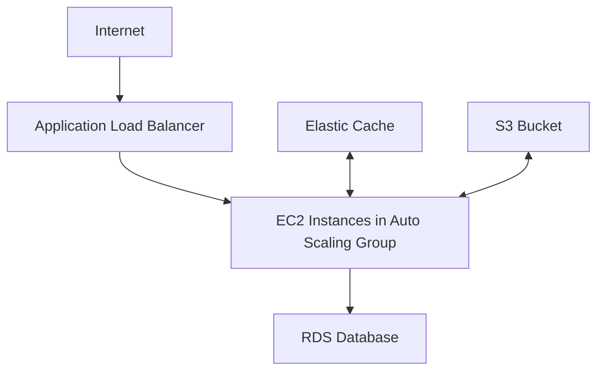

# Terraform AWS RDS

## Introduction

Amazon Relational Database Service (RDS) is a managed database service that makes it easy to set up, operate, and scale a relational database in the cloud. With Terraform, you can provision and manage your RDS instances as part of your infrastructure as code workflow, ensuring consistency and reproducibility across environments.

In this tutorial, we'll explore how to use Terraform to create and manage AWS RDS resources. By the end, you'll understand how to provision databases, configure security settings, manage backups, and integrate RDS with your other AWS resources.

## Prerequisites

Before getting started, ensure you have:

- Terraform installed (version 1.0.0 or later)
- AWS CLI configured with appropriate credentials
- Basic understanding of AWS services
- Familiarity with Terraform basics

## Understanding AWS RDS

AWS RDS supports multiple database engines:

- MySQL
- PostgreSQL
- MariaDB
- Oracle
- SQL Server
- Amazon Aurora

Using Terraform to manage RDS offers several benefits:

- **Consistency**: Define your database infrastructure in code for consistent deployments
- **Version Control**: Track changes to your database infrastructure over time
- **Automation**: Automate the creation and updates of your databases
- **Integration**: Easily connect your databases with other AWS resources

## Setting Up Your Terraform Project

Let's start by creating a basic project structure:

```
terraform-aws-rds/
├── main.tf          # Main Terraform configuration
├── variables.tf     # Variable definitions
├── outputs.tf       # Output values
├── providers.tf     # Provider configuration
└── terraform.tfvars # Variable values (gitignored for sensitive data)
```

### Provider Configuration

First, let's set up the AWS provider in `providers.tf`:

```hcl
terraform {
  required_providers {
    aws = {
      source  = "hashicorp/aws"
      version = "~> 5.0"
    }
  }
  required_version = ">= 1.0.0"
}

provider "aws" {
  region = var.aws_region
}
```

### Variables

In `variables.tf`, define the variables we'll need:

```hcl
variable "aws_region" {
  description = "AWS region to deploy resources"
  type        = string
  default     = "us-east-1"
}

variable "db_name" {
  description = "Name of the database to create"
  type        = string
}

variable "db_username" {
  description = "Username for the master DB user"
  type        = string
  sensitive   = true
}

variable "db_password" {
  description = "Password for the master DB user"
  type        = string
  sensitive   = true
}

variable "db_instance_class" {
  description = "The instance type of the RDS instance"
  type        = string
  default     = "db.t3.micro"
}

variable "allocated_storage" {
  description = "The allocated storage in gibibytes"
  type        = number
  default     = 20
}

variable "engine" {
  description = "The database engine to use"
  type        = string
  default     = "mysql"
}

variable "engine_version" {
  description = "The engine version to use"
  type        = string
  default     = "8.0"
}

variable "vpc_id" {
  description = "VPC ID where the RDS instance will be deployed"
  type        = string
}

variable "subnet_ids" {
  description = "A list of VPC subnet IDs"
  type        = list(string)
}
```

## Creating an RDS Instance

Now, let's define our RDS resources in `main.tf`:

### Security Group

First, create a security group to control access to your database:

```hcl
resource "aws_security_group" "rds" {
  name        = "allow-mysql"
  description = "Allow MySQL inbound traffic"
  vpc_id      = var.vpc_id

  ingress {
    description = "MySQL from VPC"
    from_port   = 3306
    to_port     = 3306
    protocol    = "tcp"
    cidr_blocks = ["10.0.0.0/16"]  # This should be your VPC CIDR
  }

  egress {
    from_port   = 0
    to_port     = 0
    protocol    = "-1"
    cidr_blocks = ["0.0.0.0/0"]
  }

  tags = {
    Name = "allow-mysql"
  }
}
```

### Subnet Group

Create a DB subnet group to specify which subnets your RDS instance can use:

```hcl
resource "aws_db_subnet_group" "main" {
  name       = "main-db-subnet-group"
  subnet_ids = var.subnet_ids

  tags = {
    Name = "My DB subnet group"
  }
}
```

### RDS Instance

Now, create the RDS instance itself:

```hcl
resource "aws_db_instance" "default" {
  allocated_storage      = var.allocated_storage
  storage_type           = "gp2"
  engine                 = var.engine
  engine_version         = var.engine_version
  instance_class         = var.db_instance_class
  identifier             = "my-rds-instance"
  db_name                = var.db_name
  username               = var.db_username
  password               = var.db_password
  parameter_group_name   = "default.${var.engine}${var.engine_version}"
  db_subnet_group_name   = aws_db_subnet_group.main.name
  vpc_security_group_ids = [aws_security_group.rds.id]
  publicly_accessible    = false
  skip_final_snapshot    = true
  
  tags = {
    Name        = "My RDS instance"
    Environment = "Development"
  }
}
```

### Outputs

In `outputs.tf`, define the outputs we want to expose:

```hcl
output "rds_endpoint" {
  description = "The connection endpoint for the RDS instance"
  value       = aws_db_instance.default.endpoint
}

output "rds_port" {
  description = "The port the RDS instance is listening on"
  value       = aws_db_instance.default.port
}

output "rds_name" {
  description = "The database name"
  value       = aws_db_instance.default.db_name
}

output "rds_username" {
  description = "The master username for the database"
  value       = aws_db_instance.default.username
  sensitive   = true
}
```

## Deploying Your RDS Instance

To deploy your RDS instance, follow these steps:

1. Create a `terraform.tfvars` file with your variable values (and make sure to gitignore it):

```hcl
aws_region       = "us-east-1"
db_name          = "mydb"
db_username      = "admin"
db_password      = "supersecretpassword"
db_instance_class = "db.t3.micro"
allocated_storage = 20
engine           = "mysql"
engine_version   = "8.0"
vpc_id           = "vpc-12345678"
subnet_ids       = ["subnet-12345678", "subnet-87654321"]
```

2. Initialize your Terraform workspace:

```bash
terraform init
```

3. Plan your changes:

```bash
terraform plan
```

4. Apply your changes:

```bash
terraform apply
```

After applying, Terraform will output the RDS endpoint and other information you defined in the outputs file.

## Advanced RDS Configurations

### Enabling Multi-AZ Deployment

For production environments, you might want to enable Multi-AZ deployment for high availability:

```hcl
resource "aws_db_instance" "default" {
  # Other configurations...
  
  multi_az = true
  
  # Additional configurations...
}
```

### Configuring Automated Backups

To ensure data durability, configure automated backups:

```hcl
resource "aws_db_instance" "default" {
  # Other configurations...
  
  backup_retention_period = 7  # Keep backups for 7 days
  backup_window           = "03:00-04:00"  # UTC time
  maintenance_window      = "Mon:04:00-Mon:05:00"  # UTC time
  
  # Additional configurations...
}
```

### Using Parameter Groups

You can customize your database settings using parameter groups:

```hcl
resource "aws_db_parameter_group" "example" {
  name   = "rds-mysql-params"
  family = "mysql8.0"

  parameter {
    name  = "max_connections"
    value = "150"
  }

  parameter {
    name  = "character_set_server"
    value = "utf8mb4"
  }
}

resource "aws_db_instance" "default" {
  # Other configurations...
  
  parameter_group_name = aws_db_parameter_group.example.name
  
  # Additional configurations...
}
```

### Encrypting Your RDS Instance

For security-sensitive applications, enable encryption:

```hcl
resource "aws_db_instance" "default" {
  # Other configurations...
  
  storage_encrypted = true
  kms_key_id        = aws_kms_key.rds.arn  # Optional: Use a specific KMS key
  
  # Additional configurations...
}
```

## Real-World Example: Complete Web Application Stack

Let's see how an RDS instance fits into a complete web application stack:



Here's an example of a more complete infrastructure setup:

```hcl
# VPC and networking resources
resource "aws_vpc" "main" {
  cidr_block = "10.0.0.0/16"
  
  tags = {
    Name = "main-vpc"
  }
}

resource "aws_subnet" "public" {
  count             = 2
  vpc_id            = aws_vpc.main.id
  cidr_block        = "10.0.${count.index + 1}.0/24"
  availability_zone = element(["us-east-1a", "us-east-1b"], count.index)
  
  tags = {
    Name = "public-subnet-${count.index + 1}"
  }
}

resource "aws_subnet" "private" {
  count             = 2
  vpc_id            = aws_vpc.main.id
  cidr_block        = "10.0.${count.index + 101}.0/24"
  availability_zone = element(["us-east-1a", "us-east-1b"], count.index)
  
  tags = {
    Name = "private-subnet-${count.index + 1}"
  }
}

# Security group for web servers
resource "aws_security_group" "web" {
  name        = "web"
  description = "Allow web inbound traffic"
  vpc_id      = aws_vpc.main.id

  ingress {
    description = "HTTP"
    from_port   = 80
    to_port     = 80
    protocol    = "tcp"
    cidr_blocks = ["0.0.0.0/0"]
  }

  egress {
    from_port   = 0
    to_port     = 0
    protocol    = "-1"
    cidr_blocks = ["0.0.0.0/0"]
  }
}

# RDS instance
resource "aws_db_subnet_group" "main" {
  name       = "main"
  subnet_ids = aws_subnet.private[*].id
}

resource "aws_db_instance" "default" {
  allocated_storage      = 20
  storage_type           = "gp2"
  engine                 = "mysql"
  engine_version         = "8.0"
  instance_class         = "db.t3.micro"
  identifier             = "webappdb"
  db_name                = "webapp"
  username               = var.db_username
  password               = var.db_password
  parameter_group_name   = "default.mysql8.0"
  db_subnet_group_name   = aws_db_subnet_group.main.name
  vpc_security_group_ids = [aws_security_group.rds.id]
  skip_final_snapshot    = true
  multi_az               = true
  
  tags = {
    Name = "WebAppDatabase"
  }
}

# Output the connection string
output "database_connection_string" {
  value = "mysql://${aws_db_instance.default.username}:${aws_db_instance.default.password}@${aws_db_instance.default.endpoint}/${aws_db_instance.default.db_name}"
  sensitive = true
}
```

## Best Practices for AWS RDS with Terraform

1. **Use Parameter Groups**: Create custom parameter groups to optimize database performance.

2. **Enable Encryption**: Always encrypt your databases in production environments.

3. **Use Multi-AZ**: For production workloads, enable Multi-AZ deployment for high availability.

4. **Implement Proper Security Groups**: Restrict access to your RDS instances using security groups.

5. **Use Read Replicas**: For read-heavy workloads, consider using read replicas to scale read capacity.

6. **Store Sensitive Information Securely**: Use AWS Secrets Manager or AWS Parameter Store for database credentials.

7. **Regular Backups**: Configure automated backups and test restoration procedures regularly.

8. **Monitor Your Database**: Set up CloudWatch alarms for database metrics.

## Troubleshooting Common Issues

### Connection Issues

If you're having trouble connecting to your RDS instance:

1. Check security group rules to ensure they allow traffic from your application.
2. Verify that the database subnet group includes subnets in the correct VPC.
3. Check if the instance is publicly accessible (if needed).
4. Verify that the endpoint address is correct.

### Performance Issues

For performance problems:

1. Check the CloudWatch metrics for CPU, memory, and I/O usage.
2. Consider upgrading your instance class if you're consistently hitting resource limits.
3. Review your database parameter group settings.
4. Consider using read replicas to offload read operations.

## Summary

In this tutorial, you've learned how to:

- Set up a Terraform project for AWS RDS
- Create and configure an RDS instance
- Configure security groups and subnet groups
- Implement best practices for production databases
- Integrate RDS with other AWS resources

By using Terraform to manage your AWS RDS instances, you can ensure consistent, reproducible database deployments across your environments. This approach allows you to treat your database infrastructure as code, making it easier to manage, version, and deploy.

## Additional Resources

- [Terraform AWS Provider Documentation](https://registry.terraform.io/providers/hashicorp/aws/latest/docs/resources/db_instance)
- [AWS RDS Documentation](https://docs.aws.amazon.com/rds/index.html)
- [Database Migration Strategies](https://docs.aws.amazon.com/prescriptive-guidance/latest/strategy-database-migration/welcome.html)

## Exercises

1. Create an RDS instance with a custom parameter group and specific performance configurations.
2. Set up a Multi-AZ deployment with automated backups and notification on backup completion.
3. Create a complete infrastructure with an RDS instance, EC2 instances, and an Application Load Balancer.
4. Implement a database migration using AWS Database Migration Service (DMS) with Terraform.
5. Set up CloudWatch alarms for your RDS instance to monitor key metrics.