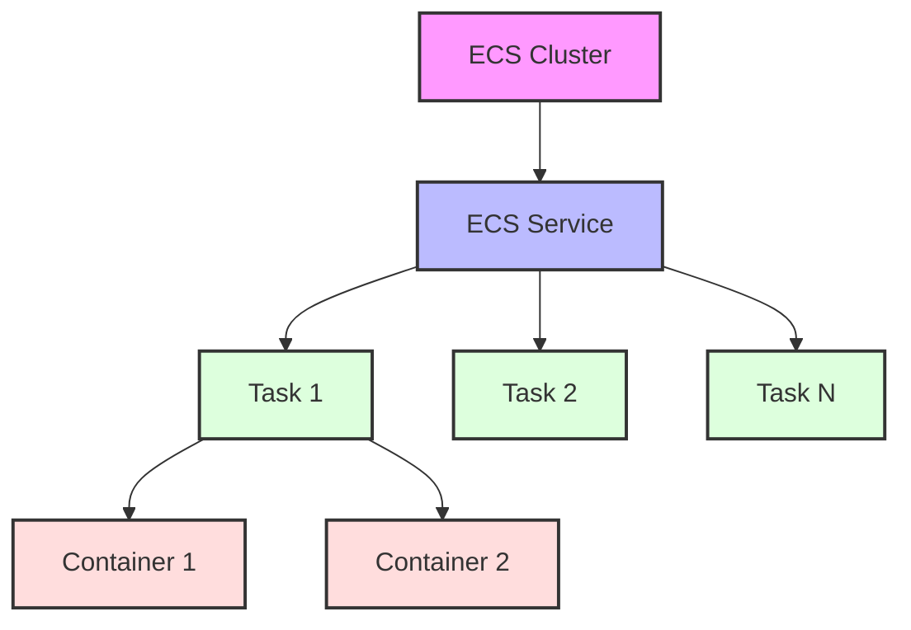

# Terraform AWS ECS

## Introduction

Amazon Elastic Container Service (ECS) is a fully managed container orchestration service that makes it easy to deploy, manage, and scale containerized applications. When combined with Terraform, you can define your ECS infrastructure as code, making it reproducible, version-controlled, and easily maintainable.

In this tutorial, we'll explore how to use Terraform to provision and manage AWS ECS resources. By the end, you'll understand how to create an ECS cluster, define task definitions, and deploy services using Terraform.

## Prerequisites

Before starting, make sure you have:

- An AWS account with appropriate permissions
- Terraform installed (version 0.12+)
- AWS CLI configured with your credentials
- Basic understanding of Docker and containerization concepts

## Understanding AWS ECS Components

Before we dive into the Terraform code, let's understand the key components of AWS ECS:

1. **ECS Cluster**: A logical grouping of tasks or services
2. **Task Definition**: A blueprint for your application that describes the container(s) to run
3. **ECS Service**: Maintains a specified number of instances of a task definition
4. **Container Instance**: An EC2 instance running the ECS agent (for EC2 launch type)
5. **Fargate**: A serverless compute engine for containers (alternative to EC2 launch type)



## Setting Up Your Terraform Project

Let's start by setting up our project structure:

```
terraform-aws-ecs/
├── main.tf
├── variables.tf
├── outputs.tf
└── terraform.tfvars
```

### Provider Configuration

First, configure the AWS provider in your `main.tf` file:

```hcl
provider "aws" {
  region = var.aws_region
}

terraform {
  required_providers {
    aws = {
      source  = "hashicorp/aws"
      version = "~> 4.0"
    }
  }
}
```

### Define Variables

Create your `variables.tf` file:

```hcl
variable "aws_region" {
  description = "The AWS region to create resources in"
  default     = "us-west-2"
}

variable "project_name" {
  description = "Project name to use in resource names"
  default     = "terraform-ecs-demo"
}

variable "container_image" {
  description = "Docker image to run in the ECS cluster"
  default     = "nginx:latest"
}

variable "container_port" {
  description = "Port exposed by the docker image"
  default     = 80
}

variable "container_cpu" {
  description = "CPU units to reserve for the container"
  default     = 256
}

variable "container_memory" {
  description = "Memory to reserve for the container"
  default     = 512
}

variable "desired_count" {
  description = "Number of instances of the task to place and keep running"
  default     = 1
}
```

## Creating an ECS Cluster

Now, let's add code to create an ECS cluster in your `main.tf`:

```hcl
resource "aws_ecs_cluster" "main" {
  name = "${var.project_name}-cluster"
  
  setting {
    name  = "containerInsights"
    value = "enabled"
  }
  
  tags = {
    Name        = "${var.project_name}-cluster"
    Environment = "development"
  }
}
```

## Defining a Task Definition

Next, let's define an ECS task definition:

```hcl
resource "aws_ecs_task_definition" "app" {
  family                   = "${var.project_name}-task"
  network_mode             = "awsvpc"
  requires_compatibilities = ["FARGATE"]
  cpu                      = var.container_cpu
  memory                   = var.container_memory
  execution_role_arn       = aws_iam_role.ecs_execution_role.arn

  container_definitions = jsonencode([
    {
      name      = "${var.project_name}-container"
      image     = var.container_image
      essential = true
      
      portMappings = [
        {
          containerPort = var.container_port
          hostPort      = var.container_port
        }
      ]
      
      logConfiguration = {
        logDriver = "awslogs"
        options = {
          "awslogs-group"         = aws_cloudwatch_log_group.ecs_logs.name
          "awslogs-region"        = var.aws_region
          "awslogs-stream-prefix" = "ecs"
        }
      }
    }
  ])

  tags = {
    Name        = "${var.project_name}-task"
    Environment = "development"
  }
}
```

## Creating IAM Roles

We need to create IAM roles for our ECS tasks:

```hcl
resource "aws_iam_role" "ecs_execution_role" {
  name = "${var.project_name}-ecs-execution-role"

  assume_role_policy = jsonencode({
    Version = "2012-10-17"
    Statement = [
      {
        Action = "sts:AssumeRole"
        Effect = "Allow"
        Principal = {
          Service = "ecs-tasks.amazonaws.com"
        }
      }
    ]
  })
}

resource "aws_iam_role_policy_attachment" "ecs_execution_role_policy" {
  role       = aws_iam_role.ecs_execution_role.name
  policy_arn = "arn:aws:iam::aws:policy/service-role/AmazonECSTaskExecutionRolePolicy"
}
```

## Setting Up Networking

For a Fargate deployment, we need to define our networking resources:

```hcl
resource "aws_vpc" "main" {
  cidr_block = "10.0.0.0/16"
  
  tags = {
    Name = "${var.project_name}-vpc"
  }
}

resource "aws_subnet" "private" {
  count             = 2
  vpc_id            = aws_vpc.main.id
  cidr_block        = "10.0.${count.index + 1}.0/24"
  availability_zone = data.aws_availability_zones.available.names[count.index]
  
  tags = {
    Name = "${var.project_name}-private-subnet-${count.index}"
  }
}

resource "aws_subnet" "public" {
  count             = 2
  vpc_id            = aws_vpc.main.id
  cidr_block        = "10.0.${count.index + 10}.0/24"
  availability_zone = data.aws_availability_zones.available.names[count.index]
  map_public_ip_on_launch = true
  
  tags = {
    Name = "${var.project_name}-public-subnet-${count.index}"
  }
}

data "aws_availability_zones" "available" {}

resource "aws_internet_gateway" "main" {
  vpc_id = aws_vpc.main.id
  
  tags = {
    Name = "${var.project_name}-igw"
  }
}

resource "aws_route_table" "public" {
  vpc_id = aws_vpc.main.id
  
  route {
    cidr_block = "0.0.0.0/0"
    gateway_id = aws_internet_gateway.main.id
  }
  
  tags = {
    Name = "${var.project_name}-public-route-table"
  }
}

resource "aws_route_table_association" "public" {
  count          = 2
  subnet_id      = aws_subnet.public[count.index].id
  route_table_id = aws_route_table.public.id
}

resource "aws_security_group" "ecs_tasks" {
  name        = "${var.project_name}-sg-ecs-tasks"
  description = "Allow inbound access from the ALB only"
  vpc_id      = aws_vpc.main.id

  ingress {
    protocol        = "tcp"
    from_port       = var.container_port
    to_port         = var.container_port
    cidr_blocks     = ["0.0.0.0/0"]
  }

  egress {
    protocol    = "-1"
    from_port   = 0
    to_port     = 0
    cidr_blocks = ["0.0.0.0/0"]
  }
  
  tags = {
    Name = "${var.project_name}-sg-ecs-tasks"
  }
}
```

## Setting Up CloudWatch Logs

We'll create a CloudWatch log group for our containers:

```hcl
resource "aws_cloudwatch_log_group" "ecs_logs" {
  name              = "/ecs/${var.project_name}"
  retention_in_days = 30
  
  tags = {
    Name        = "${var.project_name}-logs"
    Environment = "development"
  }
}
```

## Creating an ECS Service

Finally, let's create an ECS service:

```hcl
resource "aws_ecs_service" "main" {
  name            = "${var.project_name}-service"
  cluster         = aws_ecs_cluster.main.id
  task_definition = aws_ecs_task_definition.app.arn
  desired_count   = var.desired_count
  launch_type     = "FARGATE"

  network_configuration {
    subnets         = aws_subnet.private[*].id
    security_groups = [aws_security_group.ecs_tasks.id]
  }

  lifecycle {
    ignore_changes = [desired_count]
  }
  
  tags = {
    Name        = "${var.project_name}-service"
    Environment = "development"
  }
}
```

## Defining Outputs

In your `outputs.tf` file, define some useful outputs:

```hcl
output "cluster_id" {
  description = "ID of the created ECS cluster"
  value       = aws_ecs_cluster.main.id
}

output "task_definition_arn" {
  description = "ARN of the task definition"
  value       = aws_ecs_task_definition.app.arn
}

output "service_name" {
  description = "Name of the ECS service"
  value       = aws_ecs_service.main.name
}

output "vpc_id" {
  description = "ID of the VPC"
  value       = aws_vpc.main.id
}
```

## Deploying Our Infrastructure

Now that we've defined our Terraform configuration, let's deploy it:

1. Initialize Terraform:
   ```bash
   terraform init
   ```

2. Plan the deployment:
   ```bash
   terraform plan
   ```

3. Apply the changes:
   ```bash
   terraform apply
   ```

After approving the plan, Terraform will create all the resources we've defined. This process may take a few minutes.

## Extending with Application Load Balancer

For a more complete setup, you might want to add an Application Load Balancer (ALB) to distribute traffic to your ECS service. Here's how you can extend your configuration:

```hcl
resource "aws_lb" "main" {
  name               = "${var.project_name}-alb"
  internal           = false
  load_balancer_type = "application"
  security_groups    = [aws_security_group.alb.id]
  subnets            = aws_subnet.public[*].id
  
  tags = {
    Name = "${var.project_name}-alb"
  }
}

resource "aws_security_group" "alb" {
  name        = "${var.project_name}-sg-alb"
  description = "Allow HTTP inbound traffic"
  vpc_id      = aws_vpc.main.id

  ingress {
    protocol        = "tcp"
    from_port       = 80
    to_port         = 80
    cidr_blocks     = ["0.0.0.0/0"]
  }

  egress {
    protocol    = "-1"
    from_port   = 0
    to_port     = 0
    cidr_blocks = ["0.0.0.0/0"]
  }
  
  tags = {
    Name = "${var.project_name}-sg-alb"
  }
}

resource "aws_lb_target_group" "app" {
  name        = "${var.project_name}-tg"
  port        = var.container_port
  protocol    = "HTTP"
  vpc_id      = aws_vpc.main.id
  target_type = "ip"
  
  health_check {
    healthy_threshold   = 3
    unhealthy_threshold = 3
    timeout             = 5
    interval            = 30
    path                = "/"
    protocol            = "HTTP"
  }
}

resource "aws_lb_listener" "http" {
  load_balancer_arn = aws_lb.main.arn
  port              = 80
  protocol          = "HTTP"
  
  default_action {
    type             = "forward"
    target_group_arn = aws_lb_target_group.app.arn
  }
}

# Update the ECS service to use the ALB
resource "aws_ecs_service" "main" {
  name            = "${var.project_name}-service"
  cluster         = aws_ecs_cluster.main.id
  task_definition = aws_ecs_task_definition.app.arn
  desired_count   = var.desired_count
  launch_type     = "FARGATE"

  network_configuration {
    subnets         = aws_subnet.private[*].id
    security_groups = [aws_security_group.ecs_tasks.id]
  }

  load_balancer {
    target_group_arn = aws_lb_target_group.app.arn
    container_name   = "${var.project_name}-container"
    container_port   = var.container_port
  }

  depends_on = [aws_lb_listener.http]

  lifecycle {
    ignore_changes = [desired_count]
  }
}

output "alb_dns_name" {
  description = "DNS name of the load balancer"
  value       = aws_lb.main.dns_name
}
```

## Practical Example: Deploying a Web Application

Let's look at a practical example of deploying a simple web application on ECS using Terraform. We'll modify our task definition to use a custom application:

```hcl
variable "container_image" {
  description = "Docker image to run in the ECS cluster"
  default     = "your-docker-username/webapp:latest"  # Your custom image
}

variable "container_environment" {
  description = "Environment variables for the container"
  type        = map(string)
  default     = {
    "DB_HOST" = "my-database.example.com"
    "DB_NAME" = "production"
    "LOG_LEVEL" = "info"
  }
}

resource "aws_ecs_task_definition" "app"