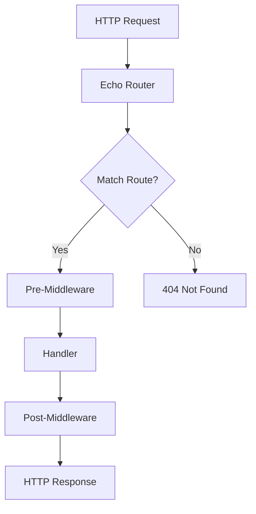

# Go Echo Framework

## Introduction

<div style={{
    "width": "20%",
    "margin": "0 auto",
    "text-align": "center"
}}>
    
</div>


Echo is a high-performance, extensible, and minimalist web framework for the Go programming language. Designed with simplicity and performance in mind, Echo makes it easy to build robust and scalable web applications and APIs. If you're new to Go web development, Echo provides an excellent starting point due to its straightforward API and comprehensive feature set.

In this guide, we'll explore the fundamentals of the Echo framework, from setup to creating your first API endpoints, and dive into more advanced concepts like middleware, request handling, and templating.

## Why Choose Echo?

Before diving into the technical details, let's understand why Echo stands out among Go web frameworks:

- **High Performance**: Optimized HTTP router with zero dynamic memory allocation
- **Extensible**: Easily extendable with middleware
- **Minimalist**: Focused API with just what you need
- **Scalable**: Designed for building robust and scalable applications
- **Community Support**: Active community and regular updates

## Getting Started

### Installation

To use Echo, you'll need Go installed on your system (version 1.13 or later is recommended). Install Echo using Go modules:

```go
go get github.com/labstack/echo/v4
```

### Creating Your First Echo Application

Let's create a simple "Hello, World!" application to understand the basic structure of an Echo application:

```go
package main

import (
    "net/http"

    "github.com/labstack/echo/v4"
)

func main() {
    // Create a new Echo instance
    e := echo.New()

    // Define a route
    e.GET("/", func(c echo.Context) error {
        return c.String(http.StatusOK, "Hello, World!")
    })

    // Start the server
    e.Logger.Fatal(e.Start(":8080"))
}
```

Save this file as `main.go` and run it:

```bash
go run main.go
```

Open your browser and navigate to `http://localhost:8080`. You should see "Hello, World!" displayed.

### Understanding the Basic Concepts

Let's break down the example above:

1. We import the Echo package.
2. We create a new Echo instance with `echo.New()`.
3. We define a route using `e.GET()`, which accepts two parameters:
- A URL path (`"/"` in this case)
- A handler function that accepts an `echo.Context` parameter and returns an error
4. We start the server on port 8080 with `e.Start(":8080")`.

## Routing

Echo provides a powerful routing system that allows you to define routes for different HTTP methods.

### Basic Routing

```go
// GET method
e.GET("/users", getUsers)

// POST method
e.POST("/users", createUser)

// PUT method
e.PUT("/users/:id", updateUser)

// DELETE method
e.DELETE("/users/:id", deleteUser)
```

### Route Parameters

Echo allows you to define dynamic routes with parameters:

```go
// Define a route with a parameter
e.GET("/users/:id", func(c echo.Context) error {
    // Extract the id parameter
    id := c.Param("id")
    return c.String(http.StatusOK, "User ID: " + id)
})
```

If you visit `http://localhost:8080/users/123`, you'll see "User ID: 123".

### Query Parameters

You can also handle query parameters:

```go
// Define a route that handles query parameters
e.GET("/search", func(c echo.Context) error {
    // Get query parameter
    query := c.QueryParam("q")
    return c.String(http.StatusOK, "Search query: " + query)
})
```

If you visit `http://localhost:8080/search?q=golang`, you'll see "Search query: golang".

### Group Routes

For organizing related routes, Echo provides route groups:

```go
// Create an API group
api := e.Group("/api")

// API v1 group
v1 := api.Group("/v1")

// Routes for API v1
v1.GET("/users", getUsers)
v1.POST("/users", createUser)

// API v2 group
v2 := api.Group("/v2")

// Routes for API v2
v2.GET("/users", getUsersV2)
```

This will create routes like `/api/v1/users` and `/api/v2/users`.

## Request Handling

Echo makes it easy to handle different types of requests and responses.

### Request Data Binding

Echo can automatically bind request data to Go structs:

```go
// Define a struct for our user
type User struct {
    Name  string `json:"name" form:"name"`
    Email string `json:"email" form:"email"`
}

// Handler for creating a user
func createUser(c echo.Context) error {
    // Initialize user struct
    user := new(User)

    // Bind request body to user struct
    if err := c.Bind(user); err != nil {
        return err
    }

    // Now use the user struct
    return c.JSON(http.StatusCreated, user)
}
```

### Response Types

Echo supports various response types:

```go
// JSON response
return c.JSON(http.StatusOK, user)

// HTML response
return c.HTML(http.StatusOK, "<h1>Hello, World!</h1>")

// String response
return c.String(http.StatusOK, "Hello, World!")

// File response
return c.File("path/to/file.pdf")

// Blob response
return c.Blob(http.StatusOK, "application/pdf", pdfBytes)
```

## Middleware

Middleware functions in Echo are executed in a pipeline before and after the request handler.

### Built-in Middleware

Echo comes with several built-in middleware:

```go
// Logger middleware
e.Use(middleware.Logger())

// Recover middleware
e.Use(middleware.Recover())

// CORS middleware
e.Use(middleware.CORS())

// Secure middleware
e.Use(middleware.Secure())
```

### Custom Middleware

You can also create your own middleware:

```go
// Custom middleware function
func ServerHeader(next echo.HandlerFunc) echo.HandlerFunc {
    return func(c echo.Context) error {
        // Set custom header
        c.Response().Header().Set("Server", "EchoServer/1.0")

        // Call the next handler
        return next(c)
    }
}

// Use custom middleware
e.Use(ServerHeader)
```

### Route-specific Middleware

You can apply middleware to specific routes:

```go
// Apply middleware to a single route
e.GET("/admin", adminHandler, requireAdmin)

// Apply middleware to a group of routes
adminGroup := e.Group("/admin", requireAdmin)
adminGroup.GET("/users", getUsers)
```

## Error Handling

Echo provides a simple error handling mechanism:

```go
func getUser(c echo.Context) error {
    // Get user ID from path parameter
    id := c.Param("id")

    // Check if user exists
    if id == "0" {
        return echo.NewHTTPError(http.StatusNotFound, "User not found")
    }

    // Return user
    return c.String(http.StatusOK, "User found: " + id)
}
```

You can also create a custom error handler:

```go
e.HTTPErrorHandler = func(err error, c echo.Context) {
    code := http.StatusInternalServerError
    message := "Internal Server Error"

    if he, ok := err.(*echo.HTTPError); ok {
        code = he.Code
        message = he.Message.(string)
    }

    // Send error response
    c.JSON(code, map[string]string{
        "error": message,
    })
}
```

## Validation

Echo can be integrated with the validator package for request validation:

```go
import (
    "github.com/go-playground/validator/v10"
)

// Define a validator
type CustomValidator struct {
    validator *validator.Validate
}

// Implement the Validate method
func (cv *CustomValidator) Validate(i interface{}) error {
    return cv.validator.Struct(i)
}

// In main function
e := echo.New()
e.Validator = &CustomValidator{validator: validator.New()}

// Define a struct with validation tags
type User struct {
    Name  string `json:"name" validate:"required"`
    Email string `json:"email" validate:"required,email"`
    Age   int    `json:"age" validate:"gte=0,lte=120"`
}

// Handler with validation
func createUser(c echo.Context) error {
    user := new(User)

    if err := c.Bind(user); err != nil {
        return err
    }

    if err := c.Validate(user); err != nil {
        return err
    }

    return c.JSON(http.StatusCreated, user)
}
```

## Templates

Echo supports HTML templates through the template renderer:

```go
import (
    "html/template"
    "io"
)

// Define template renderer
type TemplateRenderer struct {
    templates *template.Template
}

// Implement the Render method
func (t *TemplateRenderer) Render(w io.Writer, name string, data interface{}, c echo.Context) error {
    return t.templates.ExecuteTemplate(w, name, data)
}

// In main function
e := echo.New()

// Load templates
renderer := &TemplateRenderer{
    templates: template.Must(template.ParseGlob("views/*.html")),
}
e.Renderer = renderer

// Handler using templates
e.GET("/hello", func(c echo.Context) error {
    return c.Render(http.StatusOK, "hello.html", map[string]interface{}{
        "name": "Echo Framework",
    })
})
```

Create a template file at `views/hello.html`:

```html
<!DOCTYPE html>
<html>
<head>
    <title>Echo Templates</title>
</head>
<body>
    <h1>Hello, {{.name}}!</h1>
</body>
</html>
```

## Complete Example: RESTful API

Let's build a complete RESTful API for a simple user management system:

```go
package main

import (
    "net/http"
    "strconv"

    "github.com/labstack/echo/v4"
    "github.com/labstack/echo/v4/middleware"
)

// User represents a user in our system
type User struct {
    ID    int    `json:"id"`
    Name  string `json:"name"`
    Email string `json:"email"`
}

// In-memory database for demonstration
var users = map[int]*User{
    1: {ID: 1, Name: "John Doe", Email: "john@example.com"},
    2: {ID: 2, Name: "Jane Doe", Email: "jane@example.com"},
}

// Next user ID
var nextID = 3

func main() {
    // Create a new Echo instance
    e := echo.New()

    // Add middleware
    e.Use(middleware.Logger())
    e.Use(middleware.Recover())

    // Routes
    e.GET("/users", getUsers)
    e.GET("/users/:id", getUser)
    e.POST("/users", createUser)
    e.PUT("/users/:id", updateUser)
    e.DELETE("/users/:id", deleteUser)

    // Start server
    e.Logger.Fatal(e.Start(":8080"))
}

// Handler to get all users
func getUsers(c echo.Context) error {
    // Convert map to slice
    userList := make([]*User, 0, len(users))
    for _, user := range users {
        userList = append(userList, user)
    }

    return c.JSON(http.StatusOK, userList)
}

// Handler to get a single user
func getUser(c echo.Context) error {
    // Parse ID
    id, err := strconv.Atoi(c.Param("id"))
    if err != nil {
        return echo.NewHTTPError(http.StatusBadRequest, "Invalid ID")
    }

    // Find user
    user, exists := users[id]
    if !exists {
        return echo.NewHTTPError(http.StatusNotFound, "User not found")
    }

    return c.JSON(http.StatusOK, user)
}

// Handler to create a user
func createUser(c echo.Context) error {
    // Initialize user
    user := new(User)

    // Bind request body to user
    if err := c.Bind(user); err != nil {
        return err
    }

    // Validate user data
    if user.Name == "" || user.Email == "" {
        return echo.NewHTTPError(http.StatusBadRequest, "Name and Email are required")
    }

    // Assign ID and save
    user.ID = nextID
    users[nextID] = user
    nextID++

    return c.JSON(http.StatusCreated, user)
}

// Handler to update a user
func updateUser(c echo.Context) error {
    // Parse ID
    id, err := strconv.Atoi(c.Param("id"))
    if err != nil {
        return echo.NewHTTPError(http.StatusBadRequest, "Invalid ID")
    }

    // Find user
    user, exists := users[id]
    if !exists {
        return echo.NewHTTPError(http.StatusNotFound, "User not found")
    }

    // Create a temp user
    updatedUser := new(User)

    // Bind request body to temp user
    if err := c.Bind(updatedUser); err != nil {
        return err
    }

    // Update existing user (keep ID unchanged)
    user.Name = updatedUser.Name
    user.Email = updatedUser.Email

    return c.JSON(http.StatusOK, user)
}

// Handler to delete a user
func deleteUser(c echo.Context) error {
    // Parse ID
    id, err := strconv.Atoi(c.Param("id"))
    if err != nil {
        return echo.NewHTTPError(http.StatusBadRequest, "Invalid ID")
    }

    // Find user
    _, exists := users[id]
    if !exists {
        return echo.NewHTTPError(http.StatusNotFound, "User not found")
    }

    // Delete user
    delete(users, id)

    return c.NoContent(http.StatusNoContent)
}
```

## Request Flow in Echo

Here's a visualization of how Echo processes requests:



## Best Practices

When working with Echo, consider these best practices:

1. **Organize your code**: Separate your handlers, middleware, and models into different packages.

2. **Use middleware wisely**: Only apply middleware where necessary to avoid performance overhead.

3. **Handle errors properly**: Always check for errors and provide meaningful responses.

4. **Validate input**: Always validate user input before processing.

5. **Use context values carefully**: Be mindful of what you store in the context.

6. **Test your API**: Write unit and integration tests for your API endpoints.

## Summary

In this guide, we've covered the fundamentals of the Echo framework for Go:

- Setting up Echo
- Routing and request handling
- Middleware
- Error handling
- Validation
- Templates
- Building a RESTful API

Echo's combination of simplicity and power makes it an excellent choice for Go web development, whether you're building a small API or a large web application.

## Additional Resources and Exercises

### Additional Resources

- [Official Echo Documentation](https://echo.labstack.com/)
- [Echo GitHub Repository](https://github.com/labstack/echo)
- [Awesome Echo](https://github.com/ddliu/awesome-echo) - A curated list of Echo resources

### Exercises

1. **Basic API**: Create a simple API with CRUD operations for a resource of your choice (e.g., books, movies, tasks).

2. **Authentication**: Implement JWT authentication middleware for your API.

3. **File Upload**: Build an endpoint that accepts file uploads and stores them on the server.

4. **Websockets**: Create a simple chat application using Echo's websocket support.

5. **Database Integration**: Connect your Echo application to a database (like PostgreSQL or MongoDB) and perform database operations.

6. **Rate Limiting**: Implement rate limiting middleware to protect your API from abuse.

7. **Logging and Monitoring**: Set up comprehensive logging and monitoring for your Echo application.

By completing these exercises, you'll gain a deeper understanding of Echo and its capabilities, preparing you for real-world web development in Go.