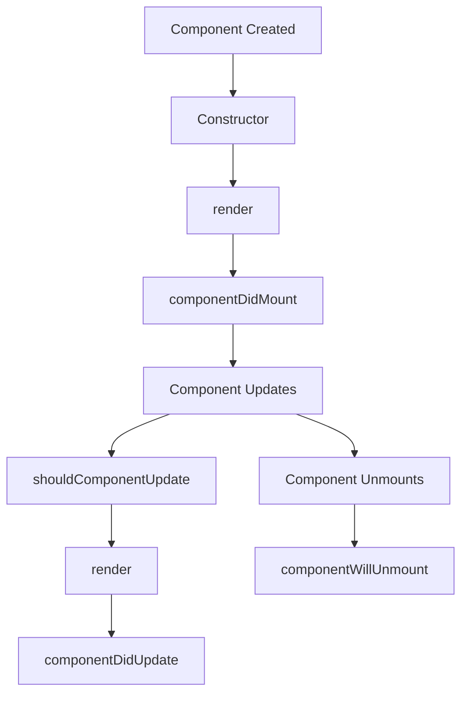

# React Introduction

## What is React?


<div style={{
    "width": "20%",
    "margin": "0 auto",
    "padding": "20px",
    "text-align": "center"
}}>
    
</div>

React is a popular JavaScript library for building user interfaces, particularly single-page applications. Developed and maintained by Facebook (now Meta), React has become one of the most widely used frontend development tools in the web development ecosystem.

At its core, React provides a component-based architecture that allows developers to build encapsulated, reusable UI elements that manage their own state. This approach makes it easier to develop and maintain complex user interfaces.

## Why Learn React?

Before diving into React, you might wonder why you should learn it. Here are some compelling reasons:

1. **Industry Demand**: React is widely used in the industry, with many tech companies utilizing it for their products.
2. **Component-Based**: The component-based architecture promotes reusability and maintainability.
3. **Virtual DOM**: React's Virtual DOM enables efficient UI updates.
4. **Rich Ecosystem**: React has a vast ecosystem of libraries, tools, and community support.
5. **Career Opportunities**: React skills are in high demand in the job market.

## Prerequisites

Before learning React, you should have a solid understanding of:

- HTML, CSS, and JavaScript
- ES6+ features (arrow functions, destructuring, spread operators, etc.)
- Basic DOM manipulation
- npm or yarn package managers

## Setting Up Your First React Application

Let's start by setting up a basic React application using Create React App, a tool that sets up a new React project with a good default configuration.

### Using Create React App

```bash
# Install Create React App globally
npm install -g create-react-app

# Create a new React project
npx create-react-app my-react-app

# Navigate to the project directory
cd my-react-app

# Start the development server
npm start
```

This will create a new React application and start a development server. You should see your app running at `http://localhost:3000`.

## Understanding the React Application Structure

After creating your app, you'll notice a directory structure like this:

```
my-react-app/
├── node_modules/
├── public/
│   ├── favicon.ico
│   ├── index.html
│   └── manifest.json
├── src/
│   ├── App.css
│   ├── App.js
│   ├── App.test.js
│   ├── index.css
│   ├── index.js
│   └── logo.svg
├── package.json
└── README.md
```

The most important directories and files are:

- **public/**: Contains static assets and the HTML file where your React app mounts.
- **src/**: Contains your React application code.
- **package.json**: Lists dependencies and scripts for your project.

## Core React Concepts

### 1. Components

Components are the building blocks of a React application. They are reusable pieces of code that return React elements describing what should appear on the screen.

There are two types of components:

- **Functional Components**: JavaScript functions that return JSX.
- **Class Components**: ES6 classes that extend from React.Component.

#### Functional Component Example:

```jsx
import React from 'react';

function Welcome(props) {
  return <h1>Hello, {props.name}</h1>;
}

export default Welcome;
```

#### Class Component Example:

```jsx
import React, { Component } from 'react';

class Welcome extends Component {
  render() {
    return <h1>Hello, {this.props.name}</h1>;
  }
}

export default Welcome;
```

### 2. JSX

JSX is a syntax extension for JavaScript that looks similar to HTML. It allows you to write HTML-like code in your JavaScript files, making it easier to visualize the UI structure.

```jsx
const element = <h1>Hello, world!</h1>;
```

Under the hood, JSX gets transformed into regular JavaScript function calls and objects:

```javascript
const element = React.createElement('h1', null, 'Hello, world!');
```

JSX allows you to embed JavaScript expressions within curly braces:

```jsx
const name = 'John';
const element = <h1>Hello, {name}!</h1>;
```

### 3. Props

Props (short for properties) are a way to pass data from a parent component to a child component. They are read-only and help make your components reusable.

```jsx
// Parent component
function App() {
  return <Welcome name="Alice" />;
}

// Child component
function Welcome(props) {
  return <h1>Hello, {props.name}</h1>;
}
```

In this example, `name="Alice"` is a prop passed from the `App` component to the `Welcome` component.

### 4. State

State is a built-in object that stores property values that belong to a component. When the state changes, the component re-renders.

```jsx
import React, { useState } from 'react';

function Counter() {
  // Declare a new state variable, which we'll call "count"
  const [count, setCount] = useState(0);

  return (
    <div>
      <p>You clicked {count} times</p>
      <button onClick={() => setCount(count + 1)}>
        Click me
      </button>
    </div>
  );
}
```

In this example:
- `useState(0)` creates a state variable `count` initialized to 0
- `setCount` is a function that updates the state
- When the button is clicked, `setCount` is called with the new value, causing the component to re-render

## Your First React Component

Let's create a simple React component that displays a greeting:

```jsx
import React from 'react';

function Greeting() {
  const username = 'Developer';
  
  return (
    <div className="greeting-container">
      <h1>Welcome to React</h1>
      <p>Hello, {username}! Let's learn React together.</p>
    </div>
  );
}

export default Greeting;
```

To use this component in your App.js:

```jsx
import React from 'react';
import './App.css';
import Greeting from './Greeting';

function App() {
  return (
    <div className="App">
      <Greeting />
    </div>
  );
}

export default App;
```

## Building a Simple Interactive Component

Let's create a component that allows users to toggle between light and dark mode:

```jsx
import React, { useState } from 'react';

function ThemeToggler() {
  // Initialize state with a default theme
  const [theme, setTheme] = useState('light');
  
  // Function to toggle the theme
  const toggleTheme = () => {
    setTheme(theme === 'light' ? 'dark' : 'light');
  };
  
  return (
    <div 
      style={{ 
        backgroundColor: theme === 'light' ? '#ffffff' : '#333333',
        color: theme === 'light' ? '#333333' : '#ffffff',
        padding: '20px',
        borderRadius: '5px',
        transition: 'all 0.3s ease'
      }}
    >
      <h2>Current Theme: {theme}</h2>
      <button onClick={toggleTheme}>
        Switch to {theme === 'light' ? 'Dark' : 'Light'} Mode
      </button>
    </div>
  );
}

export default ThemeToggler;
```

This component:
1. Creates a state variable `theme` with an initial value of 'light'
2. Defines a function `toggleTheme` that switches between 'light' and 'dark'
3. Renders a div with styles that change based on the current theme
4. Includes a button that calls `toggleTheme` when clicked

## React Component Lifecycle Visualization

The following diagram illustrates the lifecycle of a React component:



*Note: In modern React with hooks, this lifecycle is managed differently using effects, but understanding the concept is still valuable.*

## React vs Traditional DOM Manipulation

Let's compare how we'd update a counter using traditional DOM manipulation versus React:

### Traditional JavaScript Approach:

```html
<!-- HTML -->
<div>
  <p id="counter-value">0</p>
  <button id="increment-btn">Increment</button>
</div>

<script>
  // JavaScript
  let count = 0;
  const counterElement = document.getElementById('counter-value');
  const incrementButton = document.getElementById('increment-btn');
  
  incrementButton.addEventListener('click', function() {
    count++;
    counterElement.textContent = count;
  });
</script>
```

### React Approach:

```jsx
import React, { useState } from 'react';

function Counter() {
  const [count, setCount] = useState(0);
  
  return (
    <div>
      <p>{count}</p>
      <button onClick={() => setCount(count + 1)}>
        Increment
      </button>
    </div>
  );
}
```

In React:
- We don't need to select DOM elements manually
- The state update automatically triggers a re-render
- The component logic and UI are kept together

## Real-World Application: Todo List

Let's build a simple Todo List application to demonstrate React's capabilities:

```jsx
import React, { useState } from 'react';

function TodoApp() {
  const [todos, setTodos] = useState([]);
  const [input, setInput] = useState('');
  
  // Add a new todo
  const addTodo = () => {
    if (input.trim() !== '') {
      setTodos([...todos, { id: Date.now(), text: input, completed: false }]);
      setInput('');
    }
  };
  
  // Toggle todo completion status
  const toggleTodo = (id) => {
    setTodos(
      todos.map(todo => 
        todo.id === id ? { ...todo, completed: !todo.completed } : todo
      )
    );
  };
  
  // Delete a todo
  const deleteTodo = (id) => {
    setTodos(todos.filter(todo => todo.id !== id));
  };
  
  return (
    <div className="todo-app">
      <h2>Todo List</h2>
      
      <div className="add-todo">
        <input
          type="text"
          value={input}
          onChange={(e) => setInput(e.target.value)}
          placeholder="Add a new task"
        />
        <button onClick={addTodo}>Add</button>
      </div>
      
      <ul className="todo-list">
        {todos.length === 0 ? (
          <li className="empty-state">No tasks yet! Add one above.</li>
        ) : (
          todos.map(todo => (
            <li key={todo.id} className={todo.completed ? 'completed' : ''}>
              <span onClick={() => toggleTodo(todo.id)}>
                {todo.text}
              </span>
              <button onClick={() => deleteTodo(todo.id)}>Delete</button>
            </li>
          ))
        )}
      </ul>
      
      <div className="todo-stats">
        <p>Total: {todos.length}</p>
        <p>Completed: {todos.filter(todo => todo.completed).length}</p>
      </div>
    </div>
  );
}

export default TodoApp;
```

This todo list application demonstrates several key React concepts:
- Managing state for the list of todos and the input field
- Event handling for adding, toggling, and deleting todos
- Conditional rendering based on the state
- List rendering with the `map()` function
- Using unique keys for list items

## Summary

In this introduction to React, we've covered:

1. **What React is**: A JavaScript library for building user interfaces
2. **Core React concepts**: Components, JSX, props, and state
3. **Setting up a React project**: Using Create React App
4. **Creating components**: Functional and class components
5. **Building interactive components**: Using state and event handlers
6. **Real-world application**: Building a Todo List app

React's component-based architecture makes it powerful for building complex UIs by breaking them down into smaller, reusable pieces. The declarative nature of React means you describe what your UI should look like based on the current state, and React efficiently updates the DOM when the state changes.

## Practice Exercises

1. **Modify the ThemeToggler**: Add a new theme option called "blue" in addition to light and dark.
2. **Enhance the Todo List**: Add the ability to edit existing todos.
3. **Create a Counter Component**: Build a counter with increment, decrement, and reset functionality.
4. **Build a Simple Form**: Create a registration form that validates user input and displays success or error messages.

## Additional Resources

- [Official React Documentation](https://reactjs.org/docs/getting-started.html)
- [React Hooks Documentation](https://reactjs.org/docs/hooks-intro.html)
- [Create React App Documentation](https://create-react-app.dev/docs/getting-started/)
- Online courses on platforms like Udemy, Coursera, and freeCodeCamp
- Interactive tutorials on [CodeSandbox](https://codesandbox.io/) or [CodePen](https://codepen.io/)

Happy coding with React!