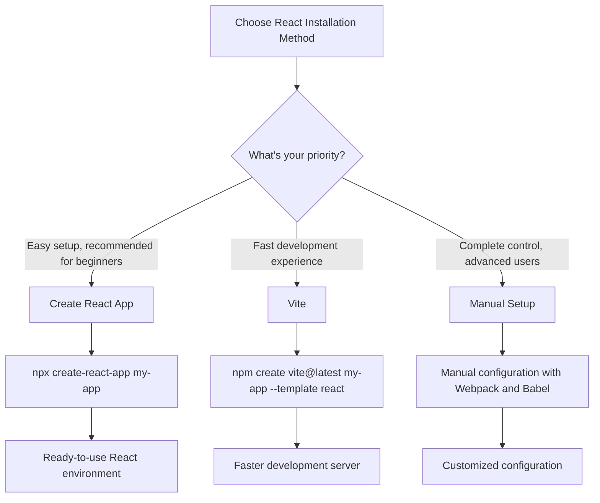

# React Installation

## Introduction

React is a popular JavaScript library for building user interfaces, particularly single-page applications. Before you can start building amazing web applications with React, you need to set up your development environment. This guide will walk you through the different methods to install and set up React, from the simplest approaches for beginners to more customized setups for advanced users.

## Prerequisites

Before installing React, make sure you have the following installed on your system:

1. **Node.js and npm (Node Package Manager)** - React projects depend on Node.js and npm for development and package management.

To check if you already have Node.js and npm installed, run these commands in your terminal:

```bash
node -v
npm -v
```

If these commands return version numbers, you're good to go! If not, you need to install Node.js.

### Installing Node.js and npm

Visit the [official Node.js website](https://nodejs.org/) and download the recommended LTS (Long Term Support) version. The installer will include both Node.js and npm.

## Methods to Install React

There are several ways to set up a React project:

1. Create React App (CRA) - Official, beginner-friendly approach
2. Vite - Faster, more modern alternative
3. Manual setup - For more control over your configuration

Let's explore each method.

## Method 1: Create React App (CRA)

Create React App is the officially supported way to create single-page React applications. It sets up your development environment so that you can use the latest JavaScript features, provides a good developer experience, and optimizes your app for production.

### Steps to create a new React app using CRA:

1. Open your terminal or command prompt
2. Run the following command:

```bash
npx create-react-app my-react-app
```

3. Navigate to your new project folder:

```bash
cd my-react-app
```

4. Start the development server:

```bash
npm start
```

Your browser should automatically open `http://localhost:3000/` showing your new React application:

```jsx
// What you'll see in App.js (the main component)
function App() {
  return (
    <div className="App">
      <header className="App-header">
        
        <p>
          Edit <code>src/App.js</code> and save to reload.
        </p>
        <a
          className="App-link"
          href="https://reactjs.org"
          target="_blank"
          rel="noopener noreferrer"
        >
          Learn React
        </a>
      </header>
    </div>
  );
}
```

### CRA Project Structure

After installation, your project folder will have this structure:

```
my-react-app/
├── README.md
├── node_modules/
├── package.json
├── .gitignore
├── public/
│   ├── favicon.ico
│   ├── index.html
│   └── manifest.json
└── src/
    ├── App.css
    ├── App.js
    ├── App.test.js
    ├── index.css
    ├── index.js
    ├── logo.svg
    └── serviceWorker.js
```

## Method 2: Using Vite

Vite is a newer, faster build tool that provides a more efficient development experience. It's gaining popularity in the React community due to its speed and simplicity.

### Steps to create a React app with Vite:

1. Run the following command:

```bash
npm create vite@latest my-vite-react -- --template react
```

2. Navigate to your project folder:

```bash
cd my-vite-react
```

3. Install dependencies:

```bash
npm install
```

4. Start the development server:

```bash
npm run dev
```

Your browser should open a new tab at `http://localhost:5173/` with your Vite React app.

### Vite Project Structure

```
my-vite-react/
├── README.md
├── node_modules/
├── package.json
├── vite.config.js
├── index.html
├── public/
│   └── favicon.ico
└── src/
    ├── App.css
    ├── App.jsx
    ├── index.css
    ├── main.jsx
    └── assets/
        └── react.svg
```

## Method 3: Manual Setup

For more advanced users who want complete control over their configuration, you can set up React manually. This approach is more complex but provides maximum flexibility.

### Steps for manual React setup:

1. Create a project directory:

```bash
mkdir my-custom-react
cd my-custom-react
```

2. Initialize npm:

```bash
npm init -y
```

3. Install React, React DOM, and development dependencies:

```bash
npm install react react-dom
npm install --save-dev @babel/core @babel/preset-env @babel/preset-react babel-loader webpack webpack-cli webpack-dev-server html-webpack-plugin
```

4. Create project files:

```bash
mkdir -p src public
touch src/index.js src/App.js public/index.html webpack.config.js .babelrc
```

5. Configure Babel (`.babelrc`):

```json
{
  "presets": ["@babel/preset-env", "@babel/preset-react"]
}
```

6. Configure Webpack (`webpack.config.js`):

```javascript
const path = require('path');
const HtmlWebpackPlugin = require('html-webpack-plugin');

module.exports = {
  entry: './src/index.js',
  output: {
    path: path.resolve(__dirname, 'dist'),
    filename: 'bundle.js'
  },
  module: {
    rules: [
      {
        test: /\.js$/,
        exclude: /node_modules/,
        use: {
          loader: 'babel-loader'
        }
      }
    ]
  },
  plugins: [
    new HtmlWebpackPlugin({
      template: './public/index.html'
    })
  ],
  devServer: {
    static: {
      directory: path.join(__dirname, 'public')
    },
    port: 3000,
    open: true
  }
};
```

7. Create a basic HTML file (`public/index.html`):

```html
<!DOCTYPE html>
<html lang="en">
<head>
  <meta charset="UTF-8">
  <meta name="viewport" content="width=device-width, initial-scale=1.0">
  <title>React App</title>
</head>
<body>
  <div id="root"></div>
</body>
</html>
```

8. Create your React entry point (`src/index.js`):

```jsx
import React from 'react';
import ReactDOM from 'react-dom/client';
import App from './App';

const root = ReactDOM.createRoot(document.getElementById('root'));
root.render(
  <React.StrictMode>
    <App />
  </React.StrictMode>
);
```

9. Create your App component (`src/App.js`):

```jsx
import React from 'react';

function App() {
  return (
    <div>
      <h1>Hello from React!</h1>
      <p>This is a custom React setup.</p>
    </div>
  );
}

export default App;
```

10. Add scripts to `package.json`:

```json
"scripts": {
  "start": "webpack serve --mode development",
  "build": "webpack --mode production"
}
```

11. Start the development server:

```bash
npm start
```

## React Installation Comparison



## Real-world Application Example

Let's create a simple React application that displays a counter. This example will work in any of the setup methods described above:

1. For Create React App or Vite, modify the `App.js` or `App.jsx`:

```jsx
import React, { useState } from 'react';
import './App.css';

function App() {
  const [count, setCount] = useState(0);

  return (
    <div className="app-container">
      <h1>React Counter App</h1>
      <div className="counter-display">
        <h2>{count}</h2>
      </div>
      <div className="button-group">
        <button onClick={() => setCount(count - 1)}>Decrement</button>
        <button onClick={() => setCount(0)}>Reset</button>
        <button onClick={() => setCount(count + 1)}>Increment</button>
      </div>
    </div>
  );
}

export default App;
```

2. Add some styling in `App.css`:

```css
.app-container {
  text-align: center;
  margin: 2rem auto;
  max-width: 500px;
  padding: 1rem;
  border-radius: 8px;
  box-shadow: 0 0 10px rgba(0,0,0,0.1);
}

.counter-display {
  font-size: 1.5rem;
  padding: 1rem;
  background-color: #f5f5f5;
  border-radius: 4px;
  margin: 1rem 0;
}

.button-group {
  display: flex;
  justify-content: space-between;
}

button {
  padding: 0.5rem 1rem;
  font-size: 1rem;
  cursor: pointer;
  border: none;
  border-radius: 4px;
  background-color: #0077cc;
  color: white;
  transition: background-color 0.3s;
}

button:hover {
  background-color: #005fa3;
}
```

This simple counter app demonstrates React's core concepts like components, state management with hooks, and event handling.

## Troubleshooting Common Installation Issues

### "npm command not found"
- Make sure Node.js is properly installed
- Restart your terminal/command prompt after installation

### "Port 3000 is already in use"
- Either close the application using port 3000
- Or modify the start script in package.json to use a different port: `"start": "PORT=3001 react-scripts start"`

### Missing dependencies
- Run `npm install` in your project directory to ensure all dependencies are installed

### "Cannot find module 'react'"
- Make sure you've run `npm install react react-dom`
- Check that your import statements are correct

## Summary

In this guide, you've learned multiple ways to install and set up React:

1. **Create React App (CRA)** - Official method with good defaults and easy setup
2. **Vite** - Modern, faster alternative to CRA
3. **Manual Setup** - For advanced users who want complete control

Each method has its advantages:
- CRA is beginner-friendly and officially maintained
- Vite offers better performance and faster refresh times
- Manual setup provides maximum customization

Choose the method that best fits your needs and project requirements.

## Additional Resources

- [Official React Documentation](https://react.dev/)
- [Create React App Documentation](https://create-react-app.dev/)
- [Vite Documentation](https://vitejs.dev/)
- [React GitHub Repository](https://github.com/facebook/react)

## Practice Exercises

1. Install React using Create React App and modify the default page to display your name.
2. Try installing React with Vite and compare the development experience with CRA.
3. Create a simple to-do list application using any of the installation methods.
4. Advanced: Set up a React project manually with Webpack and implement a theme switcher (light/dark mode).
5. Create a React project and add a third-party UI library like Material-UI or Chakra UI.

Happy coding with React!