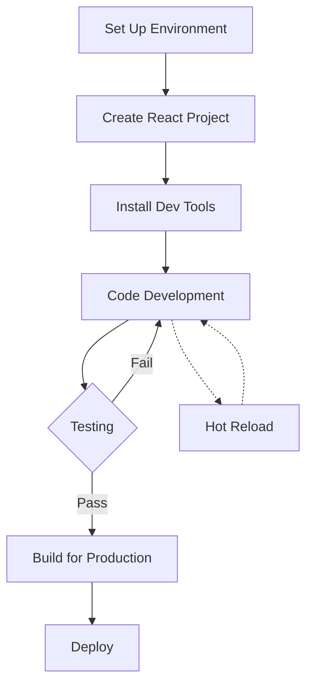

# React Development Environment

## Introduction

Setting up a proper development environment is a crucial first step in your journey with React. A well-configured environment not only makes coding more efficient but also helps avoid common pitfalls that beginners often encounter. In this guide, we'll walk through everything you need to know about setting up, configuring, and optimizing your React development environment.

## Prerequisites

Before diving into React-specific tools, let's ensure you have the fundamental requirements installed:

### Node.js and npm

React development requires Node.js (which includes npm - Node Package Manager):

1. **Install Node.js**: Download and install from [Node.js official website](https://nodejs.org/)
2. **Verify installation**: Open your terminal and run:

```bash
node -v
npm -v
```

You should see version numbers displayed. For React development, we recommend Node.js 14.0.0 or higher.

## Setting Up a React Project

There are several ways to set up a React project. We'll explore the most common approaches:

### 1. Using Create React App (CRA)

Create React App is the officially supported way to create single-page React applications. It sets up your development environment with a good default configuration.

```bash
# Install Create React App globally (optional)
npm install -g create-react-app

# Create a new React project
npx create-react-app my-react-app

# Navigate to project folder
cd my-react-app

# Start development server
npm start
```

After running these commands, your browser will open `http://localhost:3000` with your new React application.

The project structure will look like this:

```
my-react-app/
  README.md
  node_modules/
  package.json
  public/
    index.html
    favicon.ico
  src/
    App.css
    App.js
    App.test.js
    index.css
    index.js
    logo.svg
```

### 2. Using Vite

Vite is a newer, faster build tool that's gaining popularity in the React ecosystem:

```bash
# Create a new project with Vite
npm create vite@latest my-vite-app -- --template react

# Navigate to project folder
cd my-vite-app

# Install dependencies
npm install

# Start development server
npm run dev
```

### 3. Manual Setup (For Advanced Users)

For learning purposes, understanding how to set up React manually can be valuable:

```bash
# Create project directory
mkdir my-manual-react && cd my-manual-react

# Initialize npm
npm init -y

# Install React, React DOM and related packages
npm install react react-dom

# Install development dependencies
npm install --save-dev webpack webpack-cli webpack-dev-server babel-loader @babel/core @babel/preset-env @babel/preset-react html-webpack-plugin
```

You'll then need to configure Webpack and Babel, which is beyond the scope of this guide but demonstrates the complexity that CRA handles for you.

## Understanding the Development Server

When you run `npm start` (or `npm run dev` with Vite), a development server launches with several important features:

1. **Hot Module Replacement (HMR)**: Changes to your code appear instantly in the browser without a full page reload
2. **Error Overlay**: Shows syntax errors directly in the browser
3. **Auto-reloading**: The browser refreshes when you make changes to your code

### Example of the Development Workflow

1. Start the development server:

```bash
npm start
```

2. Edit a file (e.g., `src/App.js`):

```jsx
// Original
function App() {
  return (
    <div className="App">
      <h1>Hello World</h1>
    </div>
  );
}

// Change to
function App() {
  return (
    <div className="App">
      <h1>Hello React!</h1>
      <p>Welcome to my first React application</p>
    </div>
  );
}
```

3. As soon as you save, the changes appear in your browser without needing to refresh.

## Essential Development Tools

Let's enhance our development environment with some crucial tools:

### 1. React Developer Tools

The React Developer Tools extension for browsers allows you to inspect React component hierarchies:

1. Install for [Chrome](https://chrome.google.com/webstore/detail/react-developer-tools/fmkadmapgofadopljbjfkapdkoienihi) or [Firefox](https://addons.mozilla.org/en-US/firefox/addon/react-devtools/)
2. Once installed, you'll see a new "Components" and "Profiler" tab in your browser's developer tools

### 2. ESLint for Code Quality

ESLint helps catch errors and enforce coding standards:

```bash
# If using CRA, ESLint is included
# For other setups:
npm install --save-dev eslint eslint-plugin-react
```

Create a basic `.eslintrc.js` configuration:

```js
module.exports = {
  "env": {
    "browser": true,
    "es2021": true
  },
  "extends": [
    "eslint:recommended",
    "plugin:react/recommended"
  ],
  "parserOptions": {
    "ecmaFeatures": {
      "jsx": true
    },
    "ecmaVersion": 12,
    "sourceType": "module"
  },
  "plugins": [
    "react"
  ],
  "rules": {
    // Your custom rules
  }
};
```

### 3. Prettier for Code Formatting

Prettier ensures consistent code formatting:

```bash
npm install --save-dev prettier eslint-config-prettier eslint-plugin-prettier
```

Create `.prettierrc.js`:

```js
module.exports = {
  semi: true,
  trailingComma: 'all',
  singleQuote: true,
  printWidth: 80,
  tabWidth: 2,
};
```

Update `.eslintrc.js` to work with Prettier:

```js
module.exports = {
  // Previous config...
  "extends": [
    "eslint:recommended",
    "plugin:react/recommended",
    "plugin:prettier/recommended"  // Add this line
  ],
};
```

## Environment Configuration

### Environment Variables

React applications can use environment variables for configuration:

1. In Create React App, create a `.env` file in the project root:

```
REACT_APP_API_URL=https://api.example.com
REACT_APP_APP_NAME=My React App
```

2. Access these variables in your code:

```jsx
function App() {
  return (
    <div>
      <h1>{process.env.REACT_APP_APP_NAME}</h1>
      <p>API URL: {process.env.REACT_APP_API_URL}</p>
    </div>
  );
}
```

**Important**: In Create React App, environment variables must start with `REACT_APP_` to be accessible.

### Development vs Production

React handles development and production environments differently:

```bash
# Development build
npm start

# Production build
npm run build
```

The production build:
- Minifies all code
- Optimizes assets
- Removes development-only warnings
- Improves performance

## Customizing Your Environment

### Ejecting (Create React App)

If you need more configuration control in CRA:

```bash
npm run eject
```

⚠️ **Warning**: Ejecting is a one-way operation. Once you eject, you can't go back!

### Using React App Rewired

For less drastic customization, consider `react-app-rewired`:

```bash
npm install --save-dev react-app-rewired
```

Create a `config-overrides.js` file:

```js
module.exports = function override(config, env) {
  // Make changes to the webpack config here
  return config;
}
```

Update `package.json` scripts:

```json
"scripts": {
  "start": "react-app-rewired start",
  "build": "react-app-rewired build",
  "test": "react-app-rewired test"
}
```

## Project Structure Best Practices

A well-organized project structure makes development easier:

```
src/
  assets/            # Images, fonts, etc.
  components/        # Reusable components
    Button/
      Button.js
      Button.css
      Button.test.js
  contexts/          # React contexts
  hooks/             # Custom hooks
  pages/             # Components that represent pages
  services/          # API calls, utilities
  App.js             # Main component
  index.js           # Entry point
```

## Workflow Diagram



## Debugging React Applications

### Using console.log

The simplest debugging method:

```jsx
function App() {
  const data = { name: "User", id: 1 };
  console.log('App rendering with data:', data);
  
  return <div>{data.name}</div>;
}
```

### Using the Debugger Statement

Insert a breakpoint in your code:

```jsx
function handleClick() {
  const value = complexCalculation();
  debugger; // Execution will pause here in dev tools
  return processValue(value);
}
```

### Using React Developer Tools

1. Open your browser's developer tools
2. Go to the "Components" tab
3. Select a component to inspect its props and state
4. You can even modify state values to test different scenarios

## Common Development Environment Issues

### "Module not found" Errors

```
Module not found: Can't resolve './Component'
```

**Solution**: Check your import paths and file names (case sensitivity matters!).

### CORS Issues During API Development

```
Access to fetch at 'https://api.example.com' from origin 'http://localhost:3000' has been blocked by CORS policy
```

**Solution**: Set up a proxy in `package.json`:

```json
{
  "proxy": "https://api.example.com"
}
```

Then use relative paths for API calls:

```js
// Instead of fetch('https://api.example.com/data')
fetch('/data')
```

### Port Already in Use

```
Something is already running on port 3000.
```

**Solution**: Either close the application using port 3000 or start React with a different port:

```bash
PORT=3001 npm start
```

## Summary

Setting up a proper React development environment involves:

1. Installing Node.js and npm
2. Creating a project (CRA, Vite, or manual setup)
3. Understanding the development server and its features
4. Installing essential development tools (React DevTools, ESLint, Prettier)
5. Configuring environment variables
6. Organizing your project structure
7. Learning debugging techniques

With a well-configured development environment, you'll be more productive and encounter fewer issues as you build React applications.

## Exercises

1. Create a new React application using Create React App
2. Set up ESLint and Prettier in your project
3. Create a `.env` file with a custom environment variable and display it in your app
4. Install and use React Developer Tools to inspect your component hierarchy
5. Create a custom project structure following the best practices outlined in this guide

## Additional Resources

- [Create React App Documentation](https://create-react-app.dev/docs/getting-started)
- [Vite Documentation](https://vitejs.dev/guide/)
- [ESLint React Plugin](https://github.com/jsx-eslint/eslint-plugin-react)
- [Prettier Documentation](https://prettier.io/docs/en/index.html)
- [React Developer Tools](https://reactjs.org/blog/2019/08/15/new-react-devtools.html)

With these foundations in place, you're now ready to start building React applications with confidence!