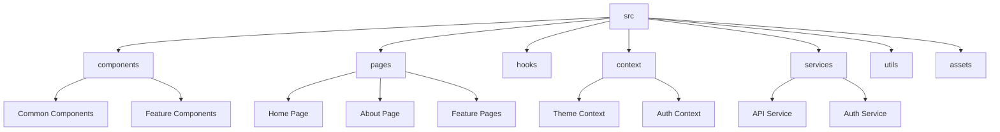

# React Project Structure

## Introduction

Organizing your React project is as important as writing clean code. A well-structured project improves maintainability, helps with collaboration, and makes debugging easier. This guide will walk you through common React project structures, best practices, and approaches to organizing your files and folders.

Whether you're starting a new project or refactoring an existing one, having a clear project structure will save you time and headaches as your application grows.

## Basic React Project Structure

When you create a new React application using Create React App (CRA), you'll get a default project structure that looks like this:

```bash
my-react-app/
├── node_modules/
├── public/
│   ├── favicon.ico
│   ├── index.html
│   └── manifest.json
├── src/
│   ├── App.css
│   ├── App.js
│   ├── App.test.js
│   ├── index.css
│   ├── index.js
│   ├── logo.svg
│   └── reportWebVitals.js
├── .gitignore
├── package.json
└── README.md
```

### Key Directories and Files

- **node_modules/** - Contains all npm packages
- **public/** - Contains static files that don't need processing
  - **index.html** - The HTML template for your app
- **src/** - Contains all your React source code
  - **index.js** - The entry point of your React application
  - **App.js** - Your main component
- **package.json** - Lists your project dependencies and scripts

This structure works well for small applications, but as your project grows, you'll need a more organized approach.

## Organizing a Growing React Project

Here's a more comprehensive structure for medium to large React applications:

```bash
my-react-app/
├── node_modules/
├── public/
├── src/
│   ├── assets/             # Static files like images, fonts
│   ├── components/         # Reusable UI components
│   │   ├── Button/
│   │   │   ├── Button.js
│   │   │   ├── Button.css
│   │   │   └── Button.test.js
│   │   └── ...
│   ├── hooks/             # Custom React hooks
│   ├── pages/             # Components that represent pages
│   ├── services/          # API calls and other services
│   ├── utils/             # Utility functions
│   ├── context/           # React context files
│   ├── reducers/          # Redux reducers (if using Redux)
│   ├── App.js
│   └── index.js
├── package.json
└── README.md
```

## Component Organization

There are two main approaches to organizing your components:

### 1. Component Type Organization

Components are grouped by their type or purpose:

```bash
src/
├── components/
│   ├── buttons/
│   │   ├── PrimaryButton.js
│   │   └── SecondaryButton.js
│   ├── forms/
│   │   ├── LoginForm.js
│   │   └── SignupForm.js
│   └── navigation/
│       ├── Navbar.js
│       └── Sidebar.js
```

### 2. Feature-Based Organization

Components are grouped by the feature they belong to:

```bash
src/
├── features/
│   ├── authentication/
│   │   ├── components/
│   │   │   ├── LoginForm.js
│   │   │   └── SignupForm.js
│   │   ├── services/
│   │   │   └── authService.js
│   │   └── hooks/
│   │       └── useAuth.js
│   └── products/
│       ├── components/
│       │   ├── ProductList.js
│       │   └── ProductDetail.js
│       └── services/
│           └── productService.js
```

## Component Files Structure

For each component, you can organize related files in different ways:

### Single File Components

All component code is in a single file:

```jsx
// Button.js
import React from 'react';
import './Button.css';

const Button = ({ children, onClick, type = 'primary' }) => {
  return (
    <button 
      className={`button ${type}`} 
      onClick={onClick}
    >
      {children}
    </button>
  );
};

export default Button;
```

### Component Folders

Each component has its own folder with related files:

```bash
Button/
├── Button.js         # Component logic
├── Button.css        # Component styles
├── Button.test.js    # Component tests
└── index.js          # Re-exports the component
```

Example of the index.js file:

```jsx
// Button/index.js
export { default } from './Button';
```

This approach makes imports cleaner in other files:

```jsx
// Instead of:
import Button from '../components/Button/Button';

// You can do:
import Button from '../components/Button';
```

## Real-World Example: Todo App Structure

Let's look at a practical example of structuring a simple todo application:

```bash
todo-app/
├── src/
│   ├── components/
│   │   ├── TodoItem/
│   │   │   ├── TodoItem.js
│   │   │   ├── TodoItem.css
│   │   │   └── index.js
│   │   ├── TodoList/
│   │   │   ├── TodoList.js
│   │   │   ├── TodoList.css
│   │   │   └── index.js
│   │   └── TodoForm/
│   │       ├── TodoForm.js
│   │       ├── TodoForm.css
│   │       └── index.js
│   ├── hooks/
│   │   └── useTodos.js
│   ├── context/
│   │   └── TodoContext.js
│   ├── services/
│   │   └── todoService.js
│   ├── App.js
│   └── index.js
```

Here's how the components might look:

```jsx
// TodoContext.js
import React, { createContext, useState } from 'react';

export const TodoContext = createContext();

export const TodoProvider = ({ children }) => {
  const [todos, setTodos] = useState([]);
  
  const addTodo = (text) => {
    setTodos([...todos, { id: Date.now(), text, completed: false }]);
  };
  
  const toggleTodo = (id) => {
    setTodos(
      todos.map(todo => 
        todo.id === id ? { ...todo, completed: !todo.completed } : todo
      )
    );
  };
  
  return (
    <TodoContext.Provider value={{ todos, addTodo, toggleTodo }}>
      {children}
    </TodoContext.Provider>
  );
};
```

```jsx
// TodoForm.js
import React, { useState, useContext } from 'react';
import { TodoContext } from '../../context/TodoContext';
import './TodoForm.css';

const TodoForm = () => {
  const [text, setText] = useState('');
  const { addTodo } = useContext(TodoContext);
  
  const handleSubmit = (e) => {
    e.preventDefault();
    if (text.trim()) {
      addTodo(text);
      setText('');
    }
  };
  
  return (
    <form className="todo-form" onSubmit={handleSubmit}>
      <input
        type="text"
        value={text}
        onChange={(e) => setText(e.target.value)}
        placeholder="Add a new task"
      />
      <button type="submit">Add</button>
    </form>
  );
};

export default TodoForm;
```

```jsx
// TodoItem.js
import React, { useContext } from 'react';
import { TodoContext } from '../../context/TodoContext';
import './TodoItem.css';

const TodoItem = ({ todo }) => {
  const { toggleTodo } = useContext(TodoContext);
  
  return (
    <div className="todo-item">
      <input
        type="checkbox"
        checked={todo.completed}
        onChange={() => toggleTodo(todo.id)}
      />
      <span className={todo.completed ? 'completed' : ''}>
        {todo.text}
      </span>
    </div>
  );
};

export default TodoItem;
```

```jsx
// TodoList.js
import React, { useContext } from 'react';
import { TodoContext } from '../../context/TodoContext';
import TodoItem from '../TodoItem';
import './TodoList.css';

const TodoList = () => {
  const { todos } = useContext(TodoContext);
  
  return (
    <div className="todo-list">
      {todos.length === 0 ? (
        <p>No todos yet. Add one above!</p>
      ) : (
        todos.map(todo => (
          <TodoItem key={todo.id} todo={todo} />
        ))
      )}
    </div>
  );
};

export default TodoList;
```

```jsx
// App.js
import React from 'react';
import { TodoProvider } from './context/TodoContext';
import TodoForm from './components/TodoForm';
import TodoList from './components/TodoList';
import './App.css';

function App() {
  return (
    <TodoProvider>
      <div className="app">
        <h1>Todo App</h1>
        <TodoForm />
        <TodoList />
      </div>
    </TodoProvider>
  );
}

export default App;
```

## Best Practices for React Project Structure

Here are some best practices to follow when structuring your React projects:

### 1. Keep Components Small and Focused

Each component should do one thing well. If a component grows too large, consider breaking it down into smaller components.

### 2. Use Consistent Naming Conventions

Choose a naming convention and stick to it. Some common ones are:

- **PascalCase** for component files and folders: `Button.js`, `UserProfile.js`
- **camelCase** for utility files: `formatDate.js`, `useLocalStorage.js`
- **kebab-case** for CSS files: `button-styles.css`

### 3. Group Related Files

Keep related files together to make them easier to find and work with.

### 4. Create an Index File for Exports

Use index files to simplify imports:

```jsx
// components/index.js
export { default as Button } from './Button';
export { default as Input } from './Input';
export { default as Card } from './Card';
```

This allows you to import multiple components in one line:

```jsx
import { Button, Input, Card } from './components';
```

### 5. Use Absolute Imports

In larger projects, configure absolute imports to avoid deeply nested relative paths:

```jsx
// Instead of:
import Button from '../../../components/Button';

// You can do:
import Button from 'components/Button';
```

To set up absolute imports, create a `jsconfig.json` file in your project root:

```json
{
  "compilerOptions": {
    "baseUrl": "src"
  },
  "include": ["src"]
}
```

## Project Structure Visualization

Here's a visualization of a typical React project structure:



## Summary

A well-organized React project structure leads to:

- Better code maintainability
- Easier collaboration with team members
- Faster debugging and feature implementation
- Scalability as your project grows

There's no one-size-fits-all approach to structuring React projects. The best structure depends on your project size, team preferences, and specific requirements. Start with a simple structure and refactor as your project grows.

Remember these key points:
- Group components logically (by type or feature)
- Keep related files together
- Use consistent naming conventions
- Create index files for cleaner imports
- Consider absolute imports for large projects

## Additional Resources and Exercises

### Further Learning
- [React Official Documentation](https://reactjs.org/docs/faq-structure.html) - React's FAQ on file structure
- [Atomic Design Methodology](https://bradfrost.com/blog/post/atomic-web-design/) - A methodology for creating design systems

### Exercises

1. **Refactoring Practice**:
   Take an existing React project and reorganize its files according to one of the structures discussed in this guide.

2. **Component Organization**:
   Create a simple app with at least 5 components and organize them using the component folder approach.

3. **Feature-Based Structure**:
   Build a multi-feature application (e.g., with authentication, user profile, and a dashboard) using a feature-based folder structure.

4. **Index Files**:
   Practice using index.js files to simplify imports in a React project.

By following these guidelines and practicing with the exercises, you'll develop a solid understanding of how to structure React projects efficiently.