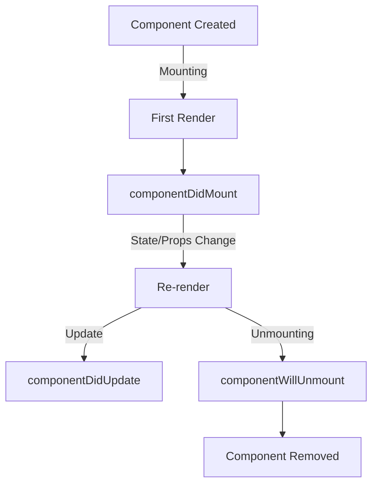

# React Hello World

## Introduction

Welcome to the world of React! If you're just starting your journey with this popular JavaScript library, you're in the right place. In this tutorial, we'll build your first React application—a simple "Hello World" program. This foundational example will help you understand the basic structure and essential concepts that make React so powerful for building user interfaces.

React is a JavaScript library created by Facebook (now Meta) that's used for building interactive user interfaces. Unlike traditional web development approaches, React uses a component-based architecture that makes it easier to build and maintain complex applications.

Let's dive in and create your first React component!

## Prerequisites

Before we begin, you should have:
- Basic knowledge of HTML, CSS, and JavaScript
- Node.js and npm installed on your computer
- A code editor (like VS Code, Sublime Text, or Atom)

## Setting Up Your First React Application

There are two main ways to start working with React:

1. **Using Create React App (recommended for beginners)**
2. **Adding React to an existing HTML page**

Let's explore both approaches.

### Method 1: Using Create React App

[Create React App](https://create-react-app.dev/) is an officially supported way to create single-page React applications. It offers a modern build setup with no configuration.

To create a new app, open your terminal and run:

```bash
npx create-react-app hello-world
cd hello-world
npm start
```

This will:
1. Create a new directory called `hello-world`
2. Install all the necessary dependencies
3. Set up the build configuration
4. Start the development server

Your browser should automatically open to `http://localhost:3000/` showing the default React app.

### Method 2: Adding React to an HTML Page

For simpler use cases, you can add React directly to an HTML page using script tags:

```html
<!DOCTYPE html>
<html>
<head>
  <meta charset="UTF-8" />
  <title>Hello React!</title>
  <script src="https://unpkg.com/react@18/umd/react.development.js"></script>
  <script src="https://unpkg.com/react-dom@18/umd/react-dom.development.js"></script>
  <script src="https://unpkg.com/@babel/standalone/babel.min.js"></script>
</head>
<body>
  <div id="root"></div>

  <script type="text/babel">
    // Your React code will go here
  </script>
</body>
</html>
```

## Creating Your First React Component

Let's create a simple `HelloWorld` component. If you're using Create React App, open `src/App.js` and replace its content with:

```jsx
import React from 'react';

function HelloWorld() {
  return (
    <div>
      <h1>Hello, World!</h1>
      <p>Welcome to my first React application</p>
    </div>
  );
}

export default HelloWorld;
```

Then, update `src/index.js` to:

```jsx
import React from 'react';
import ReactDOM from 'react-dom/client';
import HelloWorld from './App';
import './index.css';

const root = ReactDOM.createRoot(document.getElementById('root'));
root.render(
  <React.StrictMode>
    <HelloWorld />
  </React.StrictMode>
);
```

If you're using the HTML page method, put this inside the script tag:

```jsx
function HelloWorld() {
  return (
    <div>
      <h1>Hello, World!</h1>
      <p>Welcome to my first React application</p>
    </div>
  );
}

const root = ReactDOM.createRoot(document.getElementById('root'));
root.render(<HelloWorld />);
```

## Understanding the Code

Let's break down what's happening in our component:

1. **Component Declaration**: 
   ```jsx
   function HelloWorld() {
     // Component code
   }
   ```
   This creates a functional component named `HelloWorld`. In React, components are the building blocks of your UI.

2. **JSX Return Statement**: 
   ```jsx
   return (
     <div>
       <h1>Hello, World!</h1>
       <p>Welcome to my first React application</p>
     </div>
   );
   ```
   The component returns JSX (JavaScript XML), which looks like HTML but is actually a syntax extension for JavaScript. JSX lets you write HTML-like code in your JavaScript.

3. **Rendering**: 
   ```jsx
   const root = ReactDOM.createRoot(document.getElementById('root'));
   root.render(<HelloWorld />);
   ```
   This code finds the HTML element with id "root" and renders your `HelloWorld` component inside it.

## JSX: The Heart of React Components

JSX is a crucial part of React development. It allows you to write HTML-like syntax within JavaScript, making your component structure more readable and intuitive.

Key points about JSX:

1. **It's not HTML, but looks similar**
2. **JSX expressions must have one parent element** (that's why we wrap our content in a `<div>`)
3. **JavaScript expressions can be embedded in JSX using curly braces**

Let's enhance our component with some dynamic content using JSX:

```jsx
function HelloWorld() {
  const name = "React Beginner";
  const currentDate = new Date().toLocaleDateString();
  
  return (
    <div>
      <h1>Hello, {name}!</h1>
      <p>Welcome to my first React application</p>
      <p>Today is {currentDate}</p>
    </div>
  );
}
```

The curly braces `{}` allow us to embed JavaScript expressions directly in our JSX.

## Adding Props to Make Components Reusable

One of React's key principles is reusability. Let's modify our component to accept "props" (properties) that make it more flexible:

```jsx
function HelloWorld(props) {
  return (
    <div>
      <h1>Hello, {props.name}!</h1>
      <p>{props.message}</p>
    </div>
  );
}

// Then we can use it like this:
ReactDOM.createRoot(document.getElementById('root')).render(
  <div>
    <HelloWorld name="React Beginner" message="Welcome to your first React app!" />
    <HelloWorld name="Web Developer" message="React makes UI development fun!" />
  </div>
);
```

Now we can reuse our `HelloWorld` component with different content by passing different props.

## Adding Basic Styling

Let's add some basic styling to our component. In Create React App, you can modify the `src/App.css` file and import it in your component:

```jsx
import React from 'react';
import './App.css'; // Import the CSS file

function HelloWorld(props) {
  return (
    <div className="hello-container">
      <h1 className="hello-title">Hello, {props.name}!</h1>
      <p className="hello-message">{props.message}</p>
    </div>
  );
}

export default HelloWorld;
```

Then in `App.css`:

```css
.hello-container {
  text-align: center;
  margin-top: 50px;
  padding: 20px;
  border-radius: 8px;
  background-color: #f5f5f5;
  box-shadow: 0 2px 4px rgba(0, 0, 0, 0.1);
}

.hello-title {
  color: #4a90e2;
}

.hello-message {
  color: #333;
  font-size: 18px;
}
```

Note that in React, we use `className` instead of `class` for CSS classes, since `class` is a reserved keyword in JavaScript.

## Adding Interaction with Event Handlers

Let's make our Hello World app interactive by adding a button that changes the greeting:

```jsx
import React, { useState } from 'react';
import './App.css';

function HelloWorld(props) {
  const [greeting, setGreeting] = useState(`Hello, ${props.name}!`);
  
  const changeGreeting = () => {
    if (greeting === `Hello, ${props.name}!`) {
      setGreeting(`Nice to meet you, ${props.name}!`);
    } else {
      setGreeting(`Hello, ${props.name}!`);
    }
  };
  
  return (
    <div className="hello-container">
      <h1 className="hello-title">{greeting}</h1>
      <p className="hello-message">{props.message}</p>
      <button onClick={changeGreeting} className="hello-button">
        Change Greeting
      </button>
    </div>
  );
}

export default HelloWorld;
```

In this example, we've introduced:

1. **State** - Using the `useState` hook to keep track of the greeting
2. **Event Handler** - The `changeGreeting` function that updates our state
3. **Event Binding** - Using `onClick` to connect the button to our handler

## Component Lifecycle Visualization

React components go through a lifecycle from creation to removal from the DOM. Here's a simplified visualization:



For functional components with hooks, this looks a bit different, but the concept is similar.

## Real-World Application Example

Let's create a more practical example - a simple greeting card application:

```jsx
import React, { useState } from 'react';
import './App.css';

function GreetingCard() {
  const [name, setName] = useState('');
  const [submittedName, setSubmittedName] = useState('');
  const [submitted, setSubmitted] = useState(false);
  
  const handleSubmit = (event) => {
    event.preventDefault();
    setSubmittedName(name);
    setSubmitted(true);
  };
  
  const handleReset = () => {
    setName('');
    setSubmitted(false);
  };
  
  return (
    <div className="card-container">
      {!submitted ? (
        <div className="input-container">
          <h2>Create Your Greeting</h2>
          <form onSubmit={handleSubmit}>
            <label htmlFor="name-input">Enter your name:</label>
            <input 
              id="name-input"
              type="text" 
              value={name} 
              onChange={(e) => setName(e.target.value)} 
              placeholder="Your name"
              required
            />
            <button type="submit" disabled={!name.trim()}>
              Generate Greeting
            </button>
          </form>
        </div>
      ) : (
        <div className="greeting-card">
          <h1>Hello, {submittedName}!</h1>
          <p>Welcome to the wonderful world of React!</p>
          <p>This is your personalized greeting card.</p>
          <button onClick={handleReset}>Create New Greeting</button>
        </div>
      )}
    </div>
  );
}

export default GreetingCard;
```

This example demonstrates:

1. Form handling in React
2. Conditional rendering based on state
3. Event handling for multiple events
4. Two-way data binding with input fields
5. User interaction patterns common in real applications

## Summary

Congratulations! You've created your first React application and learned several key React concepts:

- **Components**: The building blocks of React applications
- **JSX**: The syntax extension that makes writing React components intuitive
- **Props**: How to make components flexible and reusable
- **State**: Managing data that changes over time
- **Event Handling**: Making your application interactive
- **Styling**: How to add CSS to your React components
- **Conditional Rendering**: Showing different UI based on conditions

This is just the beginning of your React journey! With these fundamentals, you're ready to start building more complex applications.

## Additional Resources and Exercises

To deepen your understanding of React, try these exercises:

1. **Exercise 1**: Modify the HelloWorld component to display the current time and update it every second.
2. **Exercise 2**: Create a counter component with increment and decrement buttons.
3. **Exercise 3**: Enhance the greeting card with options to change the background color or font.

### Recommended Resources:

- [Official React Documentation](https://reactjs.org/docs/getting-started.html)
- [React Hooks Documentation](https://reactjs.org/docs/hooks-intro.html)
- [MDN Web Docs on JavaScript](https://developer.mozilla.org/en-US/docs/Web/JavaScript)
- [CSS-Tricks React Guide](https://css-tricks.com/guides/react/)

Remember, learning React is a journey. Start with these basics, practice regularly, and gradually build more complex applications as you become comfortable with the fundamentals.

Happy coding!