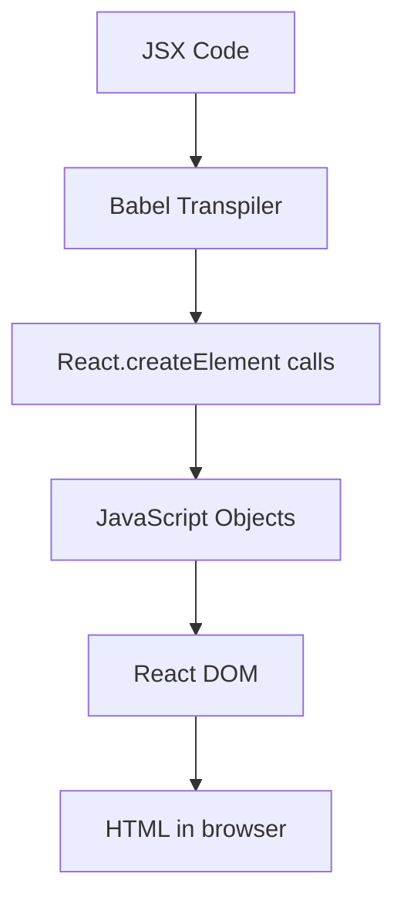

# React JSX Syntax

## Introduction

JSX (JavaScript XML) is one of the most distinctive features of React that sets it apart from other JavaScript frameworks. It allows you to write HTML-like code directly in your JavaScript files, making your React components more readable and intuitive to work with.

While JSX might look like HTML, it's actually a syntax extension to JavaScript that gets transformed into regular JavaScript function calls during the build process. Understanding JSX is fundamental to becoming proficient in React development.

## What is JSX?

JSX is a syntax extension for JavaScript that looks similar to XML or HTML. It was developed by Facebook for use with React to describe what the UI should look like.

Here's a simple example of JSX:

```jsx
const element = <h1>Hello, world!</h1>;
```

This might look like a strange mix of JavaScript and HTML, but it's neither a string nor HTML. It's JSX, and it's integral to how we write React applications.

### How JSX Works

Behind the scenes, JSX is transformed into regular JavaScript function calls by a transpiler (like Babel). The above JSX code gets converted to:

```javascript
const element = React.createElement(
  'h1',
  null,
  'Hello, world!'
);
```

This function call creates a JavaScript object that React uses to construct the DOM and keep it up to date.

## JSX Syntax Rules

### 1. Elements Must Be Closed

Unlike HTML, all JSX elements must be properly closed. Self-closing tags must include a slash before the closing bracket.

```jsx
// Correct JSX
<div>Content</div>


// Incorrect JSX
<div>Content  // Missing closing tag
 // Missing closing slash
```

### 2. Return a Single Root Element

Each JSX expression must have only one root element. If you want to return multiple elements, wrap them in a single parent element like a `<div>` or use React Fragments.

```jsx
// Correct JSX
function Component() {
  return (
    <div>
      <h1>Title</h1>
      <p>Paragraph</p>
    </div>
  );
}

// Also correct using React Fragments
function Component() {
  return (
    <>
      <h1>Title</h1>
      <p>Paragraph</p>
    </>
  );
}

// Incorrect JSX
function Component() {
  return (
    <h1>Title</h1>
    <p>Paragraph</p>
  );
}
```

### 3. JavaScript Expressions in JSX

You can embed JavaScript expressions within JSX by using curly braces `{}`. This allows you to work with dynamic data.

```jsx
const name = 'React Developer';
const element = <h1>Hello, {name}!</h1>;
```

You can also use more complex expressions:

```jsx
function formatName(user) {
  return user.firstName + ' ' + user.lastName;
}

const user = {
  firstName: 'Harper',
  lastName: 'Perez'
};

const element = <h1>Hello, {formatName(user)}!</h1>;
```

### 4. JSX as Expressions

Remember that JSX itself is an expression. After compilation, JSX expressions become regular JavaScript function calls and evaluate to JavaScript objects.

This means you can use JSX inside `if` statements and `for` loops, assign it to variables, accept it as arguments, and return it from functions:

```jsx
function getGreeting(user) {
  if (user) {
    return <h1>Hello, {user.name}!</h1>;
  }
  return <h1>Hello, Stranger.</h1>;
}
```

### 5. Specifying Attributes in JSX

You can use quotes to specify string literals as attributes:

```jsx
const element = <div tabIndex="0"></div>;
```

Or curly braces to embed a JavaScript expression in an attribute:

```jsx
const element = ;
```

Don't put quotes around curly braces when embedding a JavaScript expression in an attribute:

```jsx
// Correct
const element = ;

// Incorrect
const element = ;
```

### 6. JSX for CSS Classes and Styles

In JSX, you use `className` instead of `class` for CSS classes (since `class` is a reserved keyword in JavaScript):

```jsx
const element = <div className="container">Hello World</div>;
```

For inline styles, you pass a JavaScript object with camelCased properties rather than a CSS string:

```jsx
const divStyle = {
  backgroundColor: 'lightblue',
  fontSize: '20px',
  padding: '10px'
};

const element = <div style={divStyle}>Styled JSX</div>;

// Or inline
const inlineElement = <div style={{ color: 'blue', fontSize: '14px' }}>Inline Styled JSX</div>;
```

## Practical JSX Examples

### Example 1: Rendering a List

Here's how you can use JSX to render a list of items:

```jsx
function TodoList() {
  const todos = [
    { id: 1, text: 'Learn React' },
    { id: 2, text: 'Build a project' },
    { id: 3, text: 'Deploy to production' }
  ];
  
  return (
    <ul>
      {todos.map(todo => (
        <li key={todo.id}>{todo.text}</li>
      ))}
    </ul>
  );
}
```

In this example, we use the `map` function to transform an array of todo objects into an array of JSX elements. The `key` attribute is important for React to identify which items have changed.

### Example 2: Conditional Rendering

You can use JavaScript operators like `&&` or the ternary operator for conditional rendering:

```jsx
function Greeting({ isLoggedIn, username }) {
  return (
    <div>
      {isLoggedIn ? (
        <h1>Welcome back, {username}!</h1>
      ) : (
        <h1>Please sign in</h1>
      )}
      
      {/* Using logical AND operator */}
      {isLoggedIn && <p>You have 5 notifications</p>}
    </div>
  );
}
```

### Example 3: Handling Events

JSX allows you to add event handlers using a syntax similar to HTML but with camelCase naming:

```jsx
function ClickCounter() {
  const [count, setCount] = React.useState(0);
  
  const handleClick = () => {
    setCount(count + 1);
  };
  
  return (
    <div>
      <p>You clicked {count} times</p>
      <button onClick={handleClick}>Click me</button>
    </div>
  );
}
```

### Example 4: Form with JSX

Here's a more complex example showing a form with JSX:

```jsx
function SimpleForm() {
  const [formData, setFormData] = React.useState({
    username: '',
    email: '',
    message: ''
  });
  
  const handleChange = (e) => {
    const { name, value } = e.target;
    setFormData(prevData => ({
      ...prevData,
      [name]: value
    }));
  };
  
  const handleSubmit = (e) => {
    e.preventDefault();
    alert(`Form submitted!\nUsername: ${formData.username}\nEmail: ${formData.email}\nMessage: ${formData.message}`);
  };
  
  return (
    <form onSubmit={handleSubmit}>
      <div>
        <label htmlFor="username">Username:</label>
        <input
          type="text"
          id="username"
          name="username"
          value={formData.username}
          onChange={handleChange}
        />
      </div>
      
      <div>
        <label htmlFor="email">Email:</label>
        <input
          type="email"
          id="email"
          name="email"
          value={formData.email}
          onChange={handleChange}
        />
      </div>
      
      <div>
        <label htmlFor="message">Message:</label>
        <textarea
          id="message"
          name="message"
          value={formData.message}
          onChange={handleChange}
        />
      </div>
      
      <button type="submit">Submit</button>
    </form>
  );
}
```

## JSX Gotchas and Tips

### 1. HTML vs. JSX Differences

Several HTML attributes are named differently in JSX:

```jsx
// HTML: class, for, tabindex
// JSX: className, htmlFor, tabIndex

const element = (
  <label className="form-label" htmlFor="username">
    Username:
    <input id="username" tabIndex={1} />
  </label>
);
```

### 2. Comments in JSX

To add comments within JSX, you need to use JavaScript comment syntax inside curly braces:

```jsx
const element = (
  <div>
    {/* This is a comment in JSX */}
    <h1>Hello World</h1>
    {/* 
      Multi-line
      comment
    */}
  </div>
);
```

### 3. Data Attributes

For HTML5 data attributes, you can use the standard `data-*` syntax:

```jsx
const element = <div data-testid="test-element">Test</div>;
```

## JSX and React Components

JSX becomes truly powerful when used with React components. Here's how you might use JSX with both function and class components:

### Function Component

```jsx
function Welcome(props) {
  return <h1>Hello, {props.name}</h1>;
}

// Usage
const element = <Welcome name="Sara" />;
```

### Class Component

```jsx
class Welcome extends React.Component {
  render() {
    return <h1>Hello, {this.props.name}</h1>;
  }
}

// Usage
const element = <Welcome name="Sara" />;
```

## Under the Hood: JSX Transformation

To better understand how JSX works, let's look at how it gets transformed:



For example:

```jsx
const element = (
  <div className="container">
    <h1>Hello!</h1>
    <p>Welcome to JSX.</p>
  </div>
);
```

Gets transformed into:

```javascript
const element = React.createElement(
  'div',
  { className: 'container' },
  React.createElement('h1', null, 'Hello!'),
  React.createElement('p', null, 'Welcome to JSX.')
);
```

## Summary

JSX is a powerful syntax extension for JavaScript that makes React code more readable and expressive. It allows you to:

- Write HTML-like code directly in your JavaScript
- Embed JavaScript expressions within markup using `{}`
- Add attributes to elements with either string literals or JavaScript expressions
- Create complex UI structures in a declarative way

While it may look like HTML, JSX comes with its own set of rules and conventions that you need to follow, such as closing all tags, using `className` instead of `class`, and ensuring you have a single root element.

By mastering JSX, you'll be able to create more readable and maintainable React components, making your development experience smoother and more enjoyable.

## Exercises

1. **Basic JSX**: Create a JSX element that displays your name and favorite programming language.
2. **Lists in JSX**: Create a component that renders your top 5 favorite movies as an ordered list using the `map` function.
3. **Conditional Rendering**: Build a component that shows different messages based on the time of day (morning/afternoon/evening).
4. **Form Practice**: Create a registration form with fields for name, email, password, and confirm password.
5. **Component Composition**: Create a `Card` component that accepts title, content, and an optional image as props, then create multiple instances with different data.

## Additional Resources

- [React Official Documentation on JSX](https://reactjs.org/docs/introducing-jsx.html)
- [Babel REPL](https://babeljs.io/repl) - See how JSX gets transformed to JavaScript
- [ESLint React Plugin](https://github.com/jsx-eslint/eslint-plugin-react) - Helps catch common JSX mistakes
- [React DevTools](https://chrome.google.com/webstore/detail/react-developer-tools/fmkadmapgofadopljbjfkapdkoienihi) - Browser extension for inspecting React components and their props

Happy coding with JSX!