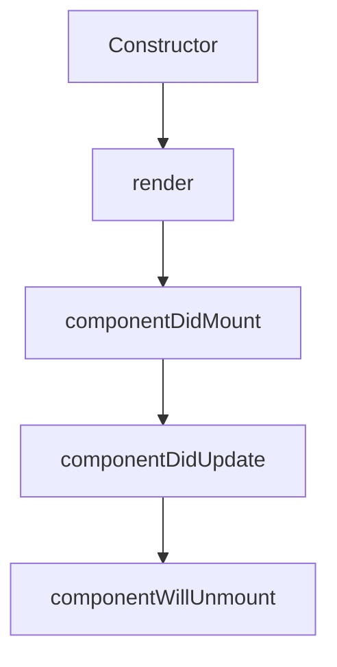

# React Components

## Introduction

React components are the building blocks of any React application. They are reusable pieces of code that return React elements describing what should appear on the screen. Components help you split the UI into independent, reusable pieces, and think about each piece in isolation.

Think of components as custom HTML elements that you define. They encapsulate functionality, can maintain their own state, and can be composed together to build complex UIs from simple pieces.

## Types of Components

React provides two ways to define components:

### Function Components

Function components are the simpler way to define a component. They are JavaScript functions that accept properties (props) as arguments and return React elements.

```jsx
function Greeting(props) {
  return <h1>Hello, {props.name}!</h1>;
}

// Using the component
const element = <Greeting name="World" />;
```

The above code renders: **Hello, World!**

### Class Components

Class components are ES6 classes that extend from `React.Component` and require a `render()` method.

```jsx
import React from 'react';

class Greeting extends React.Component {
  render() {
    return <h1>Hello, {this.props.name}!</h1>;
  }
}

// Using the component
const element = <Greeting name="World" />;
```

This also renders: **Hello, World!**

## Component Composition

One of React's powerful features is the ability to compose components together. You can nest components inside other components:

```jsx
function Welcome(props) {
  return <h1>Welcome, {props.name}</h1>;
}

function App() {
  return (
    <div>
      <Welcome name="Alice" />
      <Welcome name="Bob" />
      <Welcome name="Charlie" />
    </div>
  );
}
```

Output:
```
Welcome, Alice
Welcome, Bob
Welcome, Charlie
```

## Props

Props (short for "properties") are inputs to components. They are passed from a parent component to a child component.

```jsx
function UserProfile(props) {
  return (
    <div className="user-profile">
      
      <h2>{props.name}</h2>
      <p>Role: {props.role}</p>
    </div>
  );
}

// Using the component with different props
function App() {
  return (
    <div>
      <UserProfile 
        name="John Doe" 
        role="Developer" 
        avatarUrl="john-avatar.jpg" 
      />
      <UserProfile 
        name="Jane Smith" 
        role="Designer" 
        avatarUrl="jane-avatar.jpg" 
      />
    </div>
  );
}
```

### Important Characteristics of Props

1. **Read-Only**: Components should never modify their own props.
2. **Immutable**: When a component needs to modify data, it should use state instead of props.
3. **Can be any JavaScript value**: Strings, numbers, objects, arrays, and even functions.

## State

Unlike props, state is managed within the component. It's used for data that changes over time or from user interactions.

### State in Class Components

```jsx
import React from 'react';

class Counter extends React.Component {
  constructor(props) {
    super(props);
    this.state = { count: 0 }; // Initialize state
  }
  
  increment = () => {
    this.setState({ count: this.state.count + 1 });
  };
  
  render() {
    return (
      <div>
        <p>Count: {this.state.count}</p>
        <button onClick={this.increment}>Increment</button>
      </div>
    );
  }
}
```

### State in Function Components (using Hooks)

```jsx
import React, { useState } from 'react';

function Counter() {
  const [count, setCount] = useState(0); // Initialize state using useState hook
  
  const increment = () => {
    setCount(count + 1);
  };
  
  return (
    <div>
      <p>Count: {count}</p>
      <button onClick={increment}>Increment</button>
    </div>
  );
}
```

## Component Lifecycle

Components go through a series of events from birth (mounting) to death (unmounting). Understanding these phases helps you control what happens at each stage.



### Function Components with Hooks

Function components use the `useEffect` hook to handle lifecycle events:

```jsx
import React, { useState, useEffect } from 'react';

function Timer() {
  const [seconds, setSeconds] = useState(0);
  
  useEffect(() => {
    // Similar to componentDidMount
    const interval = setInterval(() => {
      setSeconds(prev => prev + 1);
    }, 1000);
    
    // Similar to componentWillUnmount
    return () => clearInterval(interval);
  }, []); // Empty dependency array means this runs once on mount
  
  return <div>Timer: {seconds} seconds</div>;
}
```

## Practical Example: Creating a ToDo List Component

Let's build a simple ToDo list application to demonstrate components, props, and state together:

```jsx
import React, { useState } from 'react';

// TodoItem component (presentational)
function TodoItem({ todo, onToggle, onDelete }) {
  return (
    <li style={{ textDecoration: todo.completed ? 'line-through' : 'none' }}>
      <input 
        type="checkbox" 
        checked={todo.completed} 
        onChange={() => onToggle(todo.id)} 
      />
      {todo.text}
      <button onClick={() => onDelete(todo.id)}>Delete</button>
    </li>
  );
}

// TodoList component (container)
function TodoList() {
  const [todos, setTodos] = useState([
    { id: 1, text: 'Learn React', completed: false },
    { id: 2, text: 'Build a todo app', completed: false }
  ]);
  const [input, setInput] = useState('');

  const handleToggle = (id) => {
    setTodos(
      todos.map(todo => 
        todo.id === id ? { ...todo, completed: !todo.completed } : todo
      )
    );
  };

  const handleDelete = (id) => {
    setTodos(todos.filter(todo => todo.id !== id));
  };

  const handleSubmit = (e) => {
    e.preventDefault();
    if (!input.trim()) return;
    
    const newTodo = {
      id: Date.now(),
      text: input,
      completed: false
    };
    
    setTodos([...todos, newTodo]);
    setInput('');
  };

  return (
    <div>
      <h1>Todo List</h1>
      
      <form onSubmit={handleSubmit}>
        <input 
          value={input} 
          onChange={e => setInput(e.target.value)} 
          placeholder="Add todo" 
        />
        <button type="submit">Add</button>
      </form>
      
      <ul>
        {todos.map(todo => (
          <TodoItem 
            key={todo.id} 
            todo={todo} 
            onToggle={handleToggle} 
            onDelete={handleDelete} 
          />
        ))}
      </ul>
    </div>
  );
}
```

In this example:
- We created two components: `TodoItem` and `TodoList`
- `TodoList` maintains state for the list of todos and input field
- `TodoItem` is a presentational component that receives props from its parent
- We demonstrated component composition, props, state, and event handling

## Component Design Patterns

As your application grows, these patterns will become valuable:

### Container/Presentational Pattern

Separating components into two types:
- **Container components**: Manage state, fetch data, handle logic
- **Presentational components**: Receive props and render UI elements

### Component Composition

Building complex UIs by combining simple components:

```jsx
function Page() {
  return (
    <div>
      <Header />
      <Sidebar />
      <MainContent />
      <Footer />
    </div>
  );
}
```

### Render Props Pattern

Sharing code between components using a prop whose value is a function:

```jsx
function MouseTracker({ render }) {
  const [position, setPosition] = useState({ x: 0, y: 0 });
  
  useEffect(() => {
    const handleMouseMove = (event) => {
      setPosition({ x: event.clientX, y: event.clientY });
    };
    
    window.addEventListener('mousemove', handleMouseMove);
    return () => window.removeEventListener('mousemove', handleMouseMove);
  }, []);
  
  return render(position);
}

// Usage
<MouseTracker 
  render={({ x, y }) => (
    <div>Mouse position: {x}, {y}</div>
  )}
/>
```

## Summary

React components are the fundamental building blocks of React applications. We've covered:

- **Function and class components**: Two ways to define components
- **Props**: How to pass data to components
- **State**: How components manage and update their own data
- **Component lifecycle**: How components mount, update, and unmount
- **Component composition**: How to build complex UIs from simple components
- **Practical example**: Building a todo list application
- **Design patterns**: Common patterns for structuring components

Understanding components is crucial for mastering React. With these fundamentals, you'll be well-prepared to build more complex React applications.

## Exercises

1. Create a simple counter component with increment and decrement buttons.
2. Build a toggle button that changes its text and color when clicked.
3. Create a user profile card component that accepts name, avatar, and bio as props.
4. Build a temperature converter that converts between Celsius and Fahrenheit.
5. Create a form component with validation for email and password fields.

## Additional Resources

- [React Official Documentation on Components and Props](https://reactjs.org/docs/components-and-props.html)
- [React Official Documentation on State and Lifecycle](https://reactjs.org/docs/state-and-lifecycle.html)
- [React Hooks Documentation](https://reactjs.org/docs/hooks-intro.html)
- [Thinking in React](https://reactjs.org/docs/thinking-in-react.html)