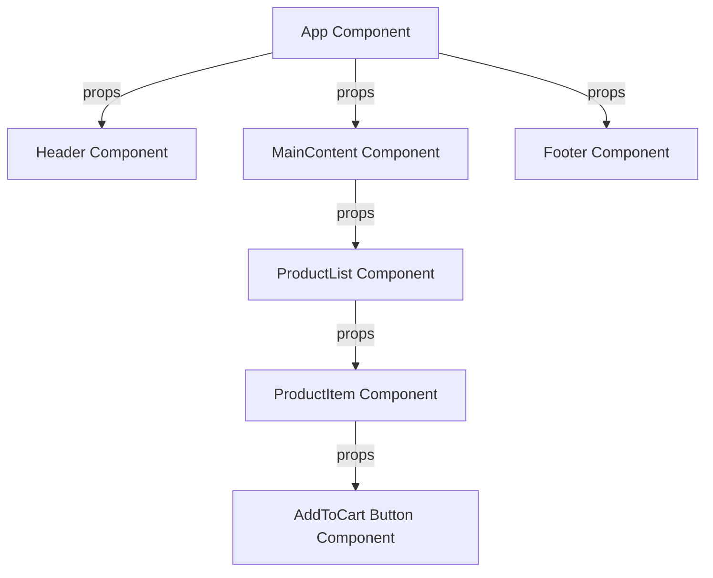

# React Props

## Introduction

Props (short for "properties") are a core concept in React that enable the flow of data between components. They allow you to pass data from parent components to child components, making your components reusable and dynamic. Props are read-only and help maintain a unidirectional data flow, which is a key principle in React architecture.

In this lesson, we'll dive deep into React props, understand how they work, and explore various use cases through practical examples.

## Understanding Props

Props are essentially arguments passed to React components. They behave very similarly to function arguments in JavaScript or attributes in HTML.

### Key Characteristics of Props

1. **Props are Read-Only**: Components should never modify their own props. React follows a strict rule: All React components must act like pure functions with respect to their props.

2. **Props Flow Downward**: Data flows from parent to child components, not the other way around (unidirectional data flow).

3. **Props Can Be of Any Type**: You can pass any JavaScript value through props, including strings, numbers, arrays, objects, and even functions.

## Basic Usage of Props

Let's start with a simple example to understand how props work.

```jsx
// Greeting.js - Child Component
function Greeting(props) {
  return <h1>Hello, {props.name}!</h1>;
}

// App.js - Parent Component
function App() {
  return (
    <div className="App">
      <Greeting name="John" />
      <Greeting name="Sarah" />
    </div>
  );
}
```

In this example:
- We created a `Greeting` component that expects a `name` prop
- In the `App` component, we use `Greeting` twice with different `name` values
- The result will display "Hello, John!" and "Hello, Sarah!" on the page

### Props Destructuring

For cleaner code, you can use destructuring to extract props:

```jsx
function Greeting({ name }) {
  return <h1>Hello, {name}!</h1>;
}
```

## Passing Different Types of Data as Props

Props can handle various data types:

### Strings, Numbers, and Booleans

```jsx
function Product({ name, price, inStock }) {
  return (
    <div>
      <h2>{name}</h2>
      <p>${price}</p>
      {inStock ? <span>In Stock</span> : <span>Out of Stock</span>}
    </div>
  );
}

// Usage
function Shop() {
  return (
    <div>
      <Product name="Laptop" price={999.99} inStock={true} />
      <Product name="Phone" price={699.99} inStock={false} />
    </div>
  );
}
```

### Arrays and Objects

```jsx
function UserProfile({ user }) {
  return (
    <div>
      <h2>{user.name}</h2>
      <p>Email: {user.email}</p>
      <p>Role: {user.role}</p>
      <div>
        <p>Skills:</p>
        <ul>
          {user.skills.map((skill, index) => (
            <li key={index}>{skill}</li>
          ))}
        </ul>
      </div>
    </div>
  );
}

// Usage
function App() {
  const userData = {
    name: "Alice Johnson",
    email: "alice@example.com",
    role: "Developer",
    skills: ["JavaScript", "React", "Node.js"]
  };
  
  return <UserProfile user={userData} />;
}
```

### Functions as Props

Passing functions as props allows child components to communicate with their parents:

```jsx
function Button({ text, onClick }) {
  return (
    <button onClick={onClick}>
      {text}
    </button>
  );
}

// Usage
function Counter() {
  const [count, setCount] = React.useState(0);
  
  const increment = () => {
    setCount(count + 1);
  };
  
  return (
    <div>
      <h2>Count: {count}</h2>
      <Button text="Increment" onClick={increment} />
    </div>
  );
}
```

## Default Props

You can specify default values for props in case they're not provided:

```jsx
function Greeting({ name = "Guest" }) {
  return <h1>Hello, {name}!</h1>;
}

// Alternatively, you can set default props using the defaultProps property
Greeting.defaultProps = {
  name: "Guest"
};

// Usage
function App() {
  return (
    <div>
      <Greeting /> {/* Will display "Hello, Guest!" */}
      <Greeting name="Alice" /> {/* Will display "Hello, Alice!" */}
    </div>
  );
}
```

## Props.children

React provides a special prop called `children` that lets you pass components as data to other components:

```jsx
function Card({ title, children }) {
  return (
    <div className="card">
      <h2 className="card-title">{title}</h2>
      <div className="card-content">
        {children}
      </div>
    </div>
  );
}

// Usage
function App() {
  return (
    <Card title="Welcome to React">
      <p>This paragraph is passed as children prop.</p>
      <button>Click me</button>
    </Card>
  );
}
```

## PropTypes for Type Checking

While React is flexible with props, it's good practice to validate the types of props your components receive. You can use the `prop-types` library for this:

```jsx
import PropTypes from 'prop-types';

function User({ name, age, isAdmin }) {
  return (
    <div>
      <h2>{name}</h2>
      <p>Age: {age}</p>
      {isAdmin && <p>Admin User</p>}
    </div>
  );
}

User.propTypes = {
  name: PropTypes.string.isRequired,
  age: PropTypes.number,
  isAdmin: PropTypes.bool
};

User.defaultProps = {
  age: 25,
  isAdmin: false
};
```

## Practical Example: Building a Blog Post Component

Let's put everything together in a practical example - a blog post component:

```jsx
function BlogPost({ post, onLike }) {
  const { title, author, date, content, likes, tags } = post;
  
  return (
    <article className="blog-post">
      <h2>{title}</h2>
      <div className="meta">
        <span>By {author.name}</span>
        <span>Posted on {new Date(date).toLocaleDateString()}</span>
      </div>
      
      <div className="content">
        {content}
      </div>
      
      <div className="tags">
        {tags.map((tag, index) => (
          <span key={index} className="tag">
            #{tag}
          </span>
        ))}
      </div>
      
      <button onClick={() => onLike(post.id)}>
        👍 Like ({likes})
      </button>
    </article>
  );
}

// Usage
function Blog() {
  const [posts, setPosts] = React.useState([
    {
      id: 1,
      title: "Getting Started with React",
      author: { name: "Jane Doe", avatar: "jane.jpg" },
      date: "2023-03-15T12:00:00Z",
      content: "React is a powerful JavaScript library for building user interfaces...",
      likes: 42,
      tags: ["react", "javascript", "beginners"]
    }
  ]);
  
  const handleLike = (postId) => {
    setPosts(posts.map(post => 
      post.id === postId ? { ...post, likes: post.likes + 1 } : post
    ));
  };
  
  return (
    <div className="blog">
      <h1>My React Blog</h1>
      {posts.map(post => (
        <BlogPost 
          key={post.id} 
          post={post} 
          onLike={handleLike}
        />
      ))}
    </div>
  );
}
```

## Props and Component Composition

React encourages composition over inheritance. Using props effectively enables powerful component compositions:

```jsx
function Dialog({ title, message, children }) {
  return (
    <div className="dialog-container">
      <div className="dialog">
        <h3>{title}</h3>
        <p>{message}</p>
        <div className="dialog-actions">
          {children}
        </div>
      </div>
    </div>
  );
}

function WelcomeDialog() {
  return (
    <Dialog 
      title="Welcome!" 
      message="Thank you for visiting our spacecraft!"
    >
      <button>Close</button>
      <button>Continue</button>
    </Dialog>
  );
}

function AlertDialog() {
  return (
    <Dialog 
      title="Warning" 
      message="You're about to delete this item."
    >
      <button>Cancel</button>
      <button>Delete</button>
    </Dialog>
  );
}
```

## Data Flow Visualization

Here's a visualization of how props flow in a React application:



## Summary

Props are a fundamental concept in React that enable:

1. **Passing data from parent to child components**
2. **Component reusability** through parameterization
3. **Unidirectional data flow**, making applications predictable and easier to debug
4. **Component composition** for building complex UIs from simpler pieces

Remember these key points about props:
- Props are read-only
- Props can be of any JavaScript data type
- Use destructuring for cleaner code
- Set default values for optional props
- Validate props with PropTypes
- Use `children` prop to nest components

By mastering props, you'll be able to create flexible, reusable components that can adapt to different contexts and data.

## Exercises

1. Create a `UserCard` component that accepts a user object with properties for name, job title, and profile picture URL, then displays them in a styled card.

2. Create a `Pagination` component that accepts the current page, total pages, and a function to change the page.

3. Build a simple e-commerce product listing where a parent component passes product data to multiple `ProductItem` components.

4. Create a `Tabs` component that uses props to display different content based on which tab is selected.

## Additional Resources

- [React Official Documentation on Components and Props](https://reactjs.org/docs/components-and-props.html)
- [Understanding React's Component Composition Model](https://reactjs.org/docs/composition-vs-inheritance.html)
- [PropTypes Documentation](https://reactjs.org/docs/typechecking-with-proptypes.html)
- [React TypeScript Cheatsheet](https://github.com/typescript-cheatsheets/react)