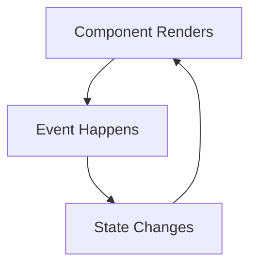

# React State

## Introduction

State is one of the most important concepts in React. It represents data that changes over time in your application and directly affects what the user sees on their screen. Unlike static props, state is internal to a component and can be updated based on user interactions or other events, making your React applications dynamic and interactive.

In this lesson, you'll learn:
- What state is and why it's necessary
- How to create and update state using the `useState` hook
- State management patterns and best practices
- How to solve common state-related challenges

## Understanding React State

### What Is State?

State is a JavaScript object that stores data values belonging to a component. When state changes, React re-renders the component, updating what the user sees.

Think of state like memory for your component—it "remembers" information between renders and can trigger new renders when updated.



### Why Do We Need State?

To understand why state is necessary, imagine creating a simple counter application:

- When the user clicks a button, the counter should increment
- The updated count should be displayed on the screen

Without state, there's no way to:
1. Store the current count value
2. Update this value when the user interacts
3. Reflect these changes in the UI

## Using State in React Components

### The useState Hook

React provides the `useState` hook, which lets you add state to functional components:

```jsx
import React, { useState } from 'react';

function Counter() {
  const [count, setCount] = useState(0);
  
  return (
    <div>
      <p>You clicked {count} times</p>
      <button onClick={() => setCount(count + 1)}>
        Click me
      </button>
    </div>
  );
}
```

Let's break this down:

1. `useState(0)` - This initializes a state variable with a value of `0`
2. `useState` returns an array with two items:
   - `count`: The current state value
   - `setCount`: A function to update the state value
3. When `setCount` is called, React schedules a re-render of the component

### State Updates and Rendering

When state changes, React does the following:
1. Updates the internal state value
2. Triggers a component re-render
3. Reflects the new state in the UI

This process happens automatically when you use the state setter function.

### Using State with Different Data Types

State can hold any JavaScript value: numbers, strings, booleans, arrays, objects, or even null/undefined.

#### Example: String State

```jsx
function Greeting() {
  const [name, setName] = useState('Guest');

  return (
    <div>
      <p>Hello, {name}!</p>
      <input
        value={name}
        onChange={(e) => setName(e.target.value)}
        placeholder="Enter your name"
      />
    </div>
  );
}
```

#### Example: Boolean State (Toggle)

```jsx
function LightSwitch() {
  const [isOn, setIsOn] = useState(false);

  return (
    <div>
      <p>The light is {isOn ? 'ON' : 'OFF'}</p>
      <button onClick={() => setIsOn(!isOn)}>
        {isOn ? 'Turn OFF' : 'Turn ON'}
      </button>
    </div>
  );
}
```

#### Example: Object State

```jsx
function UserProfile() {
  const [user, setUser] = useState({
    name: '',
    email: '',
    age: 0
  });

  const handleNameChange = (e) => {
    // Notice how we preserve other fields with the spread operator
    setUser({
      ...user,
      name: e.target.value
    });
  };

  return (
    <div>
      <input
        value={user.name}
        onChange={handleNameChange}
        placeholder="Name"
      />
      {/* Other fields would be similar */}
      <p>Name: {user.name}</p>
    </div>
  );
}
```

## State Management Patterns

### Rules for State Updates

1. **State is read-only**: Never modify state directly. Always use the setter function.

```jsx
// ❌ Wrong way
function WrongCounter() {
  const [count, setCount] = useState(0);
  
  const handleClick = () => {
    count = count + 1; // Direct modification doesn't work!
  };
}

// ✅ Correct way
function CorrectCounter() {
  const [count, setCount] = useState(0);
  
  const handleClick = () => {
    setCount(count + 1);
  };
}
```

2. **State updates may be asynchronous**: React batches state updates for performance reasons.

```jsx
function AsyncCounter() {
  const [count, setCount] = useState(0);
  
  const handleClick = () => {
    // These might be batched into a single update
    setCount(count + 1); // Uses current state (0)
    setCount(count + 1); // Still uses original state (0), not 1!
    
    // Result: count becomes 1, not 2
  };
}
```

3. **For state updates based on previous state, use the functional form**:

```jsx
function ProperCounter() {
  const [count, setCount] = useState(0);
  
  const handleDoubleIncrement = () => {
    // Functional form guarantees access to the latest state
    setCount(prevCount => prevCount + 1);
    setCount(prevCount => prevCount + 1);
    // Now correctly increments twice to 2
  };
}
```

### Lifting State Up

When multiple components need to share and update the same state, move that state up to their closest common ancestor.

```jsx
function ParentComponent() {
  const [count, setCount] = useState(0);

  return (
    <div>
      <DisplayCount count={count} />
      <ButtonPanel onIncrement={() => setCount(count + 1)} />
    </div>
  );
}

function DisplayCount({ count }) {
  return <p>Count: {count}</p>;
}

function ButtonPanel({ onIncrement }) {
  return <button onClick={onIncrement}>Increment</button>;
}
```

This pattern allows sibling components to share state without using more complex state management solutions.

## Real-World Application: A Todo List

Let's build a simple todo list application that demonstrates state management:

```jsx
import React, { useState } from 'react';

function TodoList() {
  const [todos, setTodos] = useState([]);
  const [inputValue, setInputValue] = useState('');
  
  const addTodo = () => {
    if (inputValue.trim() !== '') {
      setTodos([...todos, { 
        id: Date.now(), 
        text: inputValue, 
        completed: false 
      }]);
      setInputValue('');
    }
  };
  
  const toggleTodo = (id) => {
    setTodos(
      todos.map(todo => 
        todo.id === id ? { ...todo, completed: !todo.completed } : todo
      )
    );
  };
  
  const deleteTodo = (id) => {
    setTodos(todos.filter(todo => todo.id !== id));
  };

  return (
    <div>
      <h2>Todo List</h2>
      <div>
        <input
          value={inputValue}
          onChange={(e) => setInputValue(e.target.value)}
          placeholder="Add a new task"
        />
        <button onClick={addTodo}>Add</button>
      </div>
      <ul>
        {todos.map(todo => (
          <li key={todo.id} style={{ textDecoration: todo.completed ? 'line-through' : 'none' }}>
            <span onClick={() => toggleTodo(todo.id)}>{todo.text}</span>
            <button onClick={() => deleteTodo(todo.id)}>Delete</button>
          </li>
        ))}
      </ul>
      <div>
        <p>{todos.filter(todo => todo.completed).length} completed of {todos.length} todos</p>
      </div>
    </div>
  );
}
```

In this example, we manage three key aspects of state:
1. The list of todos (an array of objects)
2. The current input value (a string)
3. The completion status of each todo item

Notice how we correctly update state by:
- Creating new arrays instead of mutating the existing ones
- Using functional updates when needed
- Preserving object properties with the spread operator

## Common Challenges and Solutions

### Initializing State from Props

Sometimes you might want to initialize state based on props:

```jsx
function UserGreeting({ initialName }) {
  const [name, setName] = useState(initialName);
  
  return (
    <div>
      <p>Hello, {name}!</p>
      <input value={name} onChange={e => setName(e.target.value)} />
    </div>
  );
}
```

However, be careful: changing the `initialName` prop later won't update the state automatically. If you need to react to prop changes, consider using the `useEffect` hook (covered in another lesson).

### Complex State Logic

For components with complex state logic, consider using `useReducer` instead of multiple `useState` calls (we'll cover this in advanced lessons).

### Derived State

Avoid creating state for values that can be calculated from existing state or props:

```jsx
// ❌ Unnecessary state
function BadFilteredList() {
  const [items, setItems] = useState([1, 2, 3, 4, 5]);
  const [evenItems, setEvenItems] = useState([]);  // Derived state
  
  useEffect(() => {
    setEvenItems(items.filter(i => i % 2 === 0));
  }, [items]);
}

// ✅ Better approach
function GoodFilteredList() {
  const [items, setItems] = useState([1, 2, 3, 4, 5]);
  // Calculate this on the fly instead of storing in state
  const evenItems = items.filter(i => i % 2 === 0);
}
```

## Summary

In this lesson, you've learned:

- State is a way to handle data that changes over time in React components
- The `useState` hook provides a way to add state to functional components
- State can be any JavaScript value (number, string, boolean, array, object)
- When state changes, React re-renders the component automatically
- Always update state using the setter function, never modify state directly
- Use the functional update form when new state depends on previous state
- Lift state up when multiple components need to share it

State is fundamental to creating interactive React applications. By mastering state management, you've taken a significant step toward building dynamic user interfaces.

## Exercises

1. **Counter App**: Create a counter with increment, decrement, and reset buttons.

2. **Temperature Converter**: Build a component that converts between Celsius and Fahrenheit. When a user enters a value in one input, the other should update automatically.

3. **Form with Multiple Fields**: Create a form with at least three fields (name, email, password) and validate each field. Show validation messages when appropriate.

4. **Shopping Cart**: Build a simple shopping cart where users can add items, adjust quantities, and see the total price.

## Additional Resources

- [React Official Documentation on State](https://reactjs.org/docs/hooks-state.html)
- [Common mistakes with React state](https://kentcdodds.com/blog/dont-sync-state-derive-it)
- [Thinking in React](https://reactjs.org/docs/thinking-in-react.html)

In the next lesson, we'll explore how to manage side effects in React using the `useEffect` hook!