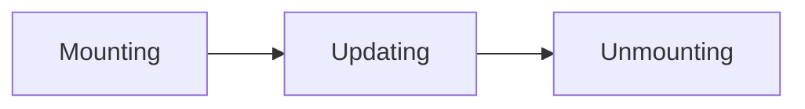
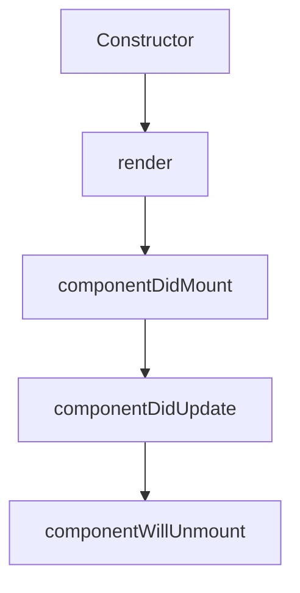

# React Lifecycle

## Introduction

In React applications, components go through a series of stages from birth (mounting) to death (unmounting). This journey is known as the **component lifecycle**. Understanding these lifecycle phases and the methods associated with them is crucial for building efficient React applications.

The React component lifecycle allows you to run code at specific points during a component's existence. For example, you might want to fetch data when a component first appears, update something when props change, or clean up resources when a component disappears.

In this lesson, we'll explore:
- The main phases of React component lifecycle
- Lifecycle methods in class components
- How hooks handle lifecycle events in functional components
- Practical examples of when and how to use lifecycle features

## Lifecycle Phases

React components go through three main phases during their existence:



Let's explore each phase in detail:

### 1. Mounting Phase

The mounting phase occurs when a component is being created and inserted into the DOM. This is where initialization happens.

### 2. Updating Phase

The updating phase happens when a component is being re-rendered due to changes in props or state.

### 3. Unmounting Phase

The unmounting phase occurs when a component is being removed from the DOM.

## Lifecycle Methods in Class Components

Class components have specific methods that are called automatically during different lifecycle phases:



Let's look at these methods in detail:

### Mounting Phase Methods

```jsx
class Clock extends React.Component {
  constructor(props) {
    super(props);
    this.state = { date: new Date() };
    console.log("Constructor called");
  }

  render() {
    console.log("Render called");
    return (
      <div>
        <h1>Hello, world!</h1>
        <h2>It is {this.state.date.toLocaleTimeString()}.</h2>
      </div>
    );
  }

  componentDidMount() {
    console.log("ComponentDidMount called");
    this.timerID = setInterval(
      () => this.tick(),
      1000
    );
  }
  
  tick() {
    this.setState({
      date: new Date()
    });
  }
}
```

In the console, you would see:
```
Constructor called
Render called
ComponentDidMount called
```

#### Constructor

- Called before anything else when the component is initialized
- Used for initializing state and binding methods
- You should call `super(props)` first to ensure proper initialization

#### render

- Required method in a class component
- Examines `this.props` and `this.state` 
- Returns React elements, arrays, portals, strings, numbers, booleans, or null
- Should be pure (doesn't modify component state)

#### componentDidMount

- Invoked immediately after a component is inserted into the DOM
- Perfect for:
  - API calls
  - DOM manipulation
  - Setting up subscriptions

### Updating Phase Methods

```jsx
componentDidUpdate(prevProps, prevState) {
  console.log("Component updated");
  
  // Only fetch new data if the userId prop has changed
  if (this.props.userId !== prevProps.userId) {
    this.fetchUserData(this.props.userId);
  }
}
```

#### componentDidUpdate

- Called after the component updates (re-renders)
- Not called for the initial render
- Perfect for:
  - Network requests based on prop changes
  - DOM manipulation after update
- Always compare current props/state with previous ones to avoid infinite loops

### Unmounting Phase Methods

```jsx
componentWillUnmount() {
  console.log("Component will unmount");
  // Clean up (e.g. removing event listeners, canceling network requests)
  clearInterval(this.timerID);
}
```

#### componentWillUnmount

- Called right before the component is removed from the DOM
- Perfect for:
  - Cleanup tasks
  - Canceling network requests
  - Removing event listeners
  - Clearing timers

## Lifecycle with Hooks in Functional Components

Modern React encourages the use of functional components with Hooks instead of class components. Hooks provide a more flexible way to use React features, including lifecycle events.

### The useEffect Hook

`useEffect` is the primary hook for handling lifecycle events in functional components:

```jsx
import React, { useState, useEffect } from 'react';

function ClockFunctional() {
  const [date, setDate] = useState(new Date());
  
  // Similar to componentDidMount and componentDidUpdate
  useEffect(() => {
    console.log("Effect ran - similar to componentDidMount and componentDidUpdate");
    const timerID = setInterval(() => {
      setDate(new Date());
    }, 1000);
    
    // Similar to componentWillUnmount - cleanup function
    return () => {
      console.log("Cleanup - similar to componentWillUnmount");
      clearInterval(timerID);
    };
  }, []); // Empty dependency array means this runs once on mount
  
  return (
    <div>
      <h1>Hello, world!</h1>
      <h2>It is {date.toLocaleTimeString()}.</h2>
    </div>
  );
}
```

### useEffect Dependency Array

The second argument to `useEffect` - the dependency array - controls when the effect runs:

- **Empty array `[]`**: Run once after initial render (like `componentDidMount`)
- **With dependencies `[prop1, state2]`**: Run when any dependency changes
- **No dependency array**: Run after every render

```jsx
// Runs on every render
useEffect(() => {
  console.log('The component rendered');
});

// Runs only on mount (first render)
useEffect(() => {
  console.log('The component mounted');
}, []);

// Runs on mount and when 'count' changes
useEffect(() => {
  console.log(`Count value: ${count}`);
}, [count]);
```

## Practical Examples

### 1. Data Fetching with Lifecycle Methods

#### Class Component Approach:

```jsx
class UserProfile extends React.Component {
  constructor(props) {
    super(props);
    this.state = {
      user: null,
      loading: true,
      error: null
    };
  }

  componentDidMount() {
    // Fetch user data when component mounts
    fetch(`https://api.example.com/users/${this.props.userId}`)
      .then(response => response.json())
      .then(data => {
        this.setState({ user: data, loading: false });
      })
      .catch(error => {
        this.setState({ error, loading: false });
      });
  }

  componentDidUpdate(prevProps) {
    // Refetch when userId changes
    if (prevProps.userId !== this.props.userId) {
      this.setState({ loading: true });
      fetch(`https://api.example.com/users/${this.props.userId}`)
        .then(response => response.json())
        .then(data => {
          this.setState({ user: data, loading: false });
        })
        .catch(error => {
          this.setState({ error, loading: false });
        });
    }
  }

  render() {
    const { user, loading, error } = this.state;

    if (loading) return <div>Loading...</div>;
    if (error) return <div>Error: {error.message}</div>;
    if (!user) return null;

    return (
      <div>
        <h1>{user.name}</h1>
        <p>Email: {user.email}</p>
      </div>
    );
  }
}
```

#### Functional Component with Hooks:

```jsx
import React, { useState, useEffect } from 'react';

function UserProfile({ userId }) {
  const [user, setUser] = useState(null);
  const [loading, setLoading] = useState(true);
  const [error, setError] = useState(null);

  useEffect(() => {
    // This effect runs on mount and when userId changes
    setLoading(true);
    
    fetch(`https://api.example.com/users/${userId}`)
      .then(response => response.json())
      .then(data => {
        setUser(data);
        setLoading(false);
      })
      .catch(error => {
        setError(error);
        setLoading(false);
      });
  }, [userId]); // Dependency array with userId

  if (loading) return <div>Loading...</div>;
  if (error) return <div>Error: {error.message}</div>;
  if (!user) return null;

  return (
    <div>
      <h1>{user.name}</h1>
      <p>Email: {user.email}</p>
    </div>
  );
}
```

### 2. Event Listeners and Cleanup

Event listeners should be cleaned up to prevent memory leaks:

#### Class Component:

```jsx
class WindowResizeTracker extends React.Component {
  constructor(props) {
    super(props);
    this.state = {
      windowWidth: window.innerWidth
    };
  }

  handleResize = () => {
    this.setState({ windowWidth: window.innerWidth });
  }

  componentDidMount() {
    window.addEventListener('resize', this.handleResize);
  }

  componentWillUnmount() {
    // Clean up to avoid memory leaks
    window.removeEventListener('resize', this.handleResize);
  }

  render() {
    return <div>Window width: {this.state.windowWidth}px</div>;
  }
}
```

#### Functional Component:

```jsx
import React, { useState, useEffect } from 'react';

function WindowResizeTracker() {
  const [windowWidth, setWindowWidth] = useState(window.innerWidth);

  useEffect(() => {
    const handleResize = () => setWindowWidth(window.innerWidth);
    
    // Add event listener
    window.addEventListener('resize', handleResize);
    
    // Cleanup function removes the event listener
    return () => {
      window.removeEventListener('resize', handleResize);
    };
  }, []); // Empty dependency array means this runs once on mount

  return <div>Window width: {windowWidth}px</div>;
}
```

## Best Practices

1. **Don't block rendering**: Avoid time-consuming operations in the `constructor` or `render` methods.

2. **Use dependency arrays wisely**: In `useEffect`, include all variables from the component scope that change over time and are used by the effect.

3. **Always clean up side effects**: Whether using class or functional components, clean up subscriptions, timers, and listeners.

4. **Don't update state in componentDidUpdate without a condition**: Always use a condition to prevent infinite loops.

5. **Data fetching patterns**: Consider using a separate library like React Query or SWR for complex data fetching needs.

```jsx
// Bad - will cause infinite loop
componentDidUpdate() {
  this.setState({ counter: this.state.counter + 1 });
}

// Good - has a condition
componentDidUpdate(prevProps) {
  if (prevProps.id !== this.props.id) {
    this.setState({ counter: 0 });
  }
}
```

## Summary

React's component lifecycle provides hooks into different phases of a component's existence. Understanding these phases and their associated methods/hooks is essential for building efficient React applications.

- **Class components** use lifecycle methods like `componentDidMount`, `componentDidUpdate`, and `componentWillUnmount`.
- **Functional components** use the `useEffect` hook to achieve the same functionality more flexibly.
- The component lifecycle is crucial for tasks like:
  - Data fetching
  - DOM manipulation
  - Event handling and cleanup
  - Performance optimization

By mastering React's lifecycle, you'll be able to create more predictable, maintainable, and efficient React applications.

## Additional Resources

- Practice building a data dashboard that fetches information when mounted and updates when filters change
- Create a component with cleanup needs, like a chat application that subscribes to messages
- Experiment with conditional rendering to observe mount and unmount behavior
- Explore debugging tools like React DevTools to observe component lifecycle in action

## Next Steps

Now that you understand React's component lifecycle, you're ready to explore more advanced React concepts like Context API, advanced hooks like useReducer, and state management solutions like Redux.