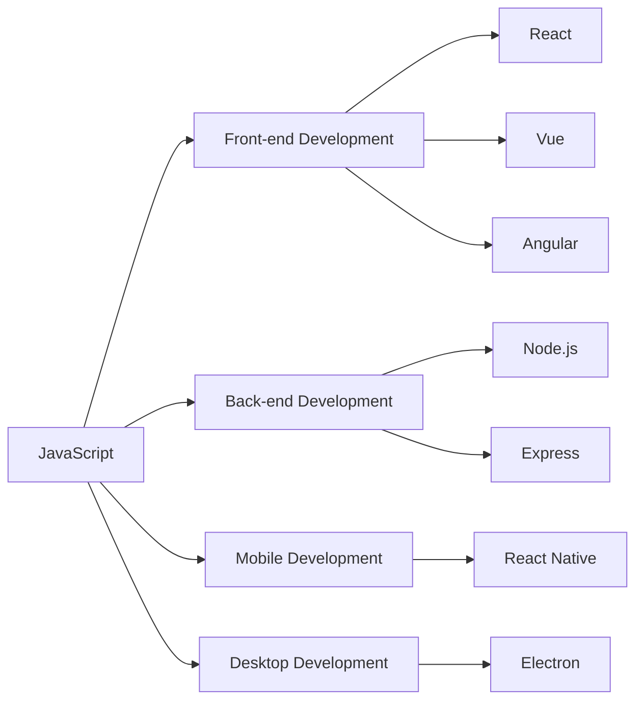

# JavaScript Introduction

## Overview

JavaScript is an essential programming language for web development, and it forms the foundation of React. Before diving into React, it's crucial to have a solid understanding of JavaScript fundamentals, especially the modern features that make React development more efficient and enjoyable.

In this guide, we'll explore the JavaScript concepts most relevant to React development, providing you with a strong foundation to build upon.

## What is JavaScript?

JavaScript is a high-level, interpreted programming language that enables interactive web pages. Originally created to add interactivity to websites, it has evolved into a versatile language used for:

- Front-end web development
- Back-end server development (Node.js)
- Mobile app development (React Native)
- Desktop application development (Electron)



## Why JavaScript for React?

React is a JavaScript library for building user interfaces. To work effectively with React, you need to understand JavaScript because:

1. React components are written in JavaScript (or TypeScript, a JavaScript superset)
2. React uses JSX, an extension of JavaScript syntax
3. React's state management and lifecycle methods rely on JavaScript concepts
4. Modern React emphasizes functional programming concepts from JavaScript

## Setting Up Your JavaScript Environment

You only need a browser to start writing JavaScript. Here's a simple way to get started:

1. Open your browser's developer tools (F12 or right-click and select "Inspect")
2. Go to the "Console" tab
3. Type JavaScript code and press Enter to execute

For a more structured environment, you can use:

- Online code editors like [CodeSandbox](https://codesandbox.io/) or [CodePen](https://codepen.io/)
- Local text editor like Visual Studio Code with Node.js installed

## JavaScript Basics for React

### Variables and Data Types

JavaScript has several ways to declare variables:

```javascript
// var (older, function-scoped)
var name = "John";

// let (modern, block-scoped)
let age = 25;

// const (modern, block-scoped, cannot be reassigned)
const isStudent = true;
```

In React, we typically use `const` for component declarations and `let` for variables that need to change.

JavaScript has the following primary data types:

```javascript
// String
const text = "Hello World";

// Number
const count = 42;
const price = 19.99;

// Boolean
const isActive = true;

// Array
const colors = ["red", "green", "blue"];

// Object
const person = {
  name: "Alice",
  age: 28,
  isStudent: false
};

// null and undefined
const empty = null;
let notDefined;  // undefined

// Symbol (ES6)
const uniqueId = Symbol("id");
```

### Functions

Functions are crucial in JavaScript, especially for React which uses a functional approach. There are several ways to define functions:

```javascript
// Traditional function declaration
function greet(name) {
  return `Hello, ${name}!`;
}

// Function expression
const sayHello = function(name) {
  return `Hello, ${name}!`;
};

// Arrow function (ES6) - commonly used in React
const welcome = (name) => {
  return `Welcome, ${name}!`;
};

// Shorter arrow function with implicit return
const shortGreet = name => `Hi, ${name}!`;
```

Let's see these functions in action:

```javascript
console.log(greet("Alex"));      // Output: Hello, Alex!
console.log(sayHello("Sarah"));  // Output: Hello, Sarah!
console.log(welcome("Jamie"));   // Output: Welcome, Jamie!
console.log(shortGreet("Pat"));  // Output: Hi, Pat!
```

### Template Literals

Modern JavaScript uses template literals (backticks) for string interpolation, which you'll frequently use in React:

```javascript
const name = "Maya";
const age = 24;

// Old way
console.log("My name is " + name + " and I am " + age + " years old.");

// Modern way with template literals
console.log(`My name is ${name} and I am ${age} years old.`);
// Output: My name is Maya and I am 24 years old.
```

### Object and Array Manipulation

React state often involves working with objects and arrays. Here are key operations:

**Object Destructuring**:

```javascript
const person = {
  firstName: "John",
  lastName: "Doe",
  age: 32
};

// Destructuring - extract properties
const { firstName, lastName } = person;

console.log(firstName);  // Output: John
console.log(lastName);   // Output: Doe

// Destructuring with new variable names
const { firstName: fName, lastName: lName } = person;
console.log(fName);  // Output: John
```

**Spread Operator for Objects**:

```javascript
const person = {
  name: "Alex",
  age: 28
};

// Creating a new object with all properties of person plus new ones
const updatedPerson = {
  ...person,
  age: 29,
  location: "New York"
};

console.log(updatedPerson);
// Output: { name: "Alex", age: 29, location: "New York" }
```

**Array Methods**:

```javascript
const numbers = [1, 2, 3, 4, 5];

// map - transform each element (used very often in React)
const doubled = numbers.map(num => num * 2);
console.log(doubled);  // Output: [2, 4, 6, 8, 10]

// filter - keep elements that pass a condition
const evenNumbers = numbers.filter(num => num % 2 === 0);
console.log(evenNumbers);  // Output: [2, 4]

// find - get first element that passes a condition
const firstGreaterThanThree = numbers.find(num => num > 3);
console.log(firstGreaterThanThree);  // Output: 4

// reduce - accumulate values
const sum = numbers.reduce((total, num) => total + num, 0);
console.log(sum);  // Output: 15
```

**Array Destructuring and Spread**:

```javascript
const rgb = ["red", "green", "blue"];

// Array destructuring
const [firstColor, secondColor] = rgb;
console.log(firstColor);   // Output: red
console.log(secondColor);  // Output: green

// Array spread operator
const extendedColors = [...rgb, "yellow", "purple"];
console.log(extendedColors);
// Output: ["red", "green", "blue", "yellow", "purple"]
```

### Modern JavaScript Features Useful for React

**Default Parameters**:

```javascript
const createUser = (name, role = "user") => {
  return {
    name,
    role,
    createdAt: new Date()
  };
};

const admin = createUser("Alex", "admin");
console.log(admin);
// Output: { name: "Alex", role: "admin", createdAt: [current date] }

const regularUser = createUser("Sarah");
console.log(regularUser);
// Output: { name: "Sarah", role: "user", createdAt: [current date] }
```

**Shorthand Property Names**:

```javascript
const name = "Alex";
const age = 30;

// Old way
const personOld = {
  name: name,
  age: age
};

// Modern way
const person = { name, age };
console.log(person);  // Output: { name: "Alex", age: 30 }
```

**Optional Chaining**:

```javascript
const user = {
  name: "Alex",
  address: {
    city: "New York"
  }
};

const emptyUser = {};

// Without optional chaining (can cause errors)
// console.log(emptyUser.address.city); // Error: Cannot read property 'city' of undefined

// With optional chaining (safe)
console.log(user?.address?.city);      // Output: New York
console.log(emptyUser?.address?.city); // Output: undefined
```

**Nullish Coalescing**:

```javascript
const settings = {
  theme: "dark",
  fontSize: 0,
  isEnabled: false
};

// Logical OR (||) treats 0 and false as falsy
const theme = settings.theme || "light";         // "dark"
const fontSize = settings.fontSize || 16;        // 16 (undesired, replaces 0)
const isEnabled = settings.isEnabled || true;    // true (undesired)

// Nullish coalescing (??) only replaces null or undefined
const fontSizeFixed = settings.fontSize ?? 16;   // 0 (keeps the value)
const isEnabledFixed = settings.isEnabled ?? true; // false (keeps the value)

console.log(fontSizeFixed);    // Output: 0
console.log(isEnabledFixed);   // Output: false
```

## JavaScript in the Context of React

Let's see how these JavaScript concepts apply in a React context:

```jsx
// A simple React component using modern JavaScript
function UserProfile({ user }) {
  // Object destructuring
  const { name, role, isActive } = user;
  
  // Default value with nullish coalescing
  const displayName = name ?? "Anonymous User";
  
  // Conditional rendering using ternary operator
  return (
    <div className="user-profile">
      <h2>{displayName}</h2>
      {role && <p>Role: {role}</p>}
      <p>Status: {isActive ? "Active" : "Inactive"}</p>
      
      {/* Array mapping - rendering lists */}
      {user.skills && (
        <ul>
          {user.skills.map((skill, index) => (
            <li key={index}>{skill}</li>
          ))}
        </ul>
      )}
    </div>
  );
}
```

## Asynchronous JavaScript for React

Modern web applications handle asynchronous operations like data fetching. Here are key concepts:

### Promises

Promises represent asynchronous operations that may complete in the future:

```javascript
// Creating a promise
const fetchData = () => {
  return new Promise((resolve, reject) => {
    // Simulating an API call
    setTimeout(() => {
      const data = { id: 1, name: "Product" };
      // Success case
      resolve(data);
      
      // Error case
      // reject("Error fetching data");
    }, 1000);
  });
};

// Using a promise
fetchData()
  .then(data => console.log("Fetched data:", data))
  .catch(error => console.error("Error:", error));

// Output after 1 second: Fetched data: { id: 1, name: "Product" }
```

### Async/Await

A cleaner way to work with promises, commonly used in React components and hooks:

```javascript
const fetchUserData = async (userId) => {
  try {
    // In a real app, this would be a fetch call to an API
    const response = await fetch(`https://api.example.com/users/${userId}`);
    const userData = await response.json();
    return userData;
  } catch (error) {
    console.error("Failed to fetch user:", error);
    throw error;
  }
};

// Using async/await function
const loadUser = async () => {
  try {
    const user = await fetchUserData(123);
    console.log("User loaded:", user);
  } catch (error) {
    console.log("Could not load user");
  }
};

// This would be called in a React component
loadUser();
```

## Practical Example: Building a Todo List Helper

Let's create a set of JavaScript functions to manage a todo list, which could be used in a React application:

```javascript
// Todo list management functions
const todoHelpers = {
  // Add a new todo
  addTodo: (todos, text) => {
    const newTodo = {
      id: Date.now(),
      text,
      completed: false
    };
    return [...todos, newTodo];
  },
  
  // Toggle todo completion status
  toggleTodo: (todos, id) => {
    return todos.map(todo => 
      todo.id === id ? { ...todo, completed: !todo.completed } : todo
    );
  },
  
  // Delete a todo
  deleteTodo: (todos, id) => {
    return todos.filter(todo => todo.id !== id);
  },
  
  // Filter todos by status
  filterTodos: (todos, status) => {
    switch (status) {
      case "active":
        return todos.filter(todo => !todo.completed);
      case "completed":
        return todos.filter(todo => todo.completed);
      default:
        return todos;
    }
  }
};

// Example usage
let myTodos = [];

// Add todos
myTodos = todoHelpers.addTodo(myTodos, "Learn JavaScript");
myTodos = todoHelpers.addTodo(myTodos, "Study React");
myTodos = todoHelpers.addTodo(myTodos, "Build a project");

console.log("Initial todos:", myTodos);
// Output: Array of 3 todo objects

// Mark "Learn JavaScript" as completed
const firstTodoId = myTodos[0].id;
myTodos = todoHelpers.toggleTodo(myTodos, firstTodoId);

console.log("After completing first todo:", myTodos);
// Output: First todo has completed: true

// Show only active todos
const activeTodos = todoHelpers.filterTodos(myTodos, "active");
console.log("Active todos:", activeTodos);
// Output: Array without the completed todo

// Delete a todo
myTodos = todoHelpers.deleteTodo(myTodos, firstTodoId);
console.log("After deleting first todo:", myTodos);
// Output: Array with the first todo removed
```

This example demonstrates key JavaScript concepts for React:
- Immutability (creating new arrays instead of modifying existing ones)
- Object/array spread operator
- Higher-order functions like map and filter
- Arrow functions

## Summary

In this introduction, we've covered the essential JavaScript concepts you need to know before diving into React:

- Modern variable declarations with `let` and `const`
- Functions, with emphasis on arrow functions
- Object and array manipulation with destructuring and spread operators
- Important array methods like map, filter, and reduce
- Modern features like optional chaining and nullish coalescing
- Asynchronous JavaScript with promises and async/await
- Practical patterns common in React applications

Understanding these JavaScript features will make your React journey much smoother, as React heavily leverages these modern JavaScript patterns for creating components, managing state, and handling side effects.

## Additional Resources and Exercises

### Resources to Learn More
- [MDN JavaScript Guide](https://developer.mozilla.org/en-US/docs/Web/JavaScript/Guide)
- [JavaScript.info](https://javascript.info/) - Modern JavaScript Tutorial
- [ES6 Features](https://github.com/lukehoban/es6features) - Overview of ES6 features

### Practice Exercises

1. **Basic JavaScript**
   - Create a function that takes an array of numbers and returns a new array with each number doubled
   - Write a function that filters out all negative numbers from an array

2. **Working with Objects**
   - Create a function that merges two objects, with the second object's properties overriding the first
   - Write a function that extracts specific properties from an object

3. **Asynchronous JavaScript**
   - Create a function that simulates fetching data with a delay
   - Chain multiple async operations together

4. **Data Transformation Challenge**
   - Create a function that transforms an array of user objects (with name, age, and role properties) into an object where keys are user roles and values are arrays of user names

Try implementing these exercises to reinforce your understanding of JavaScript concepts that will be useful in React!