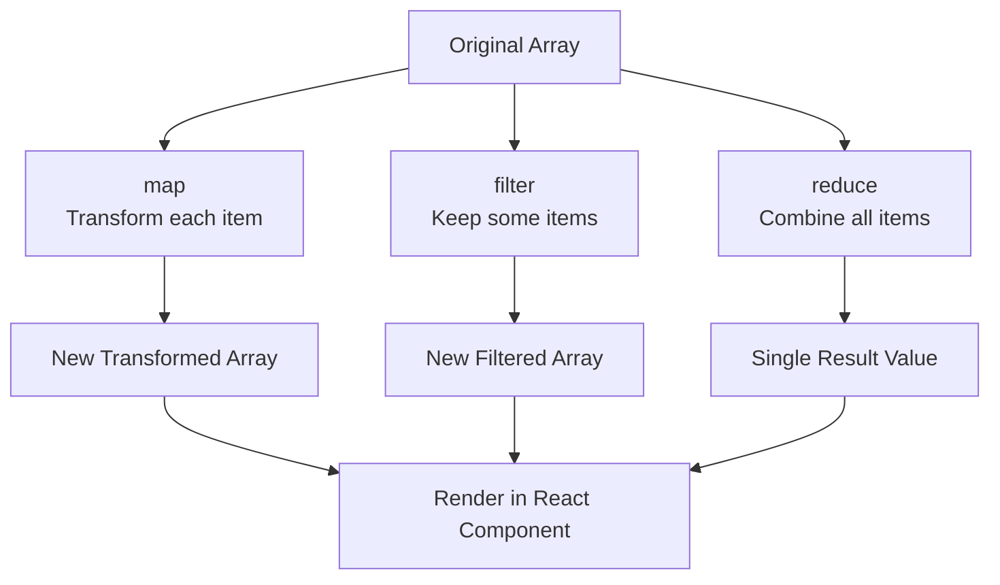

# JavaScript Array Methods

Arrays are fundamental data structures in JavaScript, and mastering array methods is crucial for effective React development. React often requires transforming, filtering, and manipulating arrays of data to render components dynamically.

## Introduction to Array Methods

JavaScript provides numerous built-in methods for working with arrays. These methods help you transform data, filter elements, find specific items, and perform complex operations with clean, readable code. When working with React, these methods become especially important as they enable you to handle data efficiently without mutating the original arrays—a key principle in React's functional programming approach.

## Essential Array Methods for React Development

### 1. The `map()` Method

The `map()` method creates a new array by calling a function on each element of the original array. This is one of the most commonly used array methods in React applications.

**Syntax:**

```javascript
const newArray = array.map(callback(element, index, array))
```

**Example:**

```javascript
const numbers = [1, 2, 3, 4, 5];
const doubled = numbers.map(num => num * 2);

console.log(doubled); // Output: [2, 4, 6, 8, 10]
```

**React Usage Example:**

```jsx
function UserList({ users }) {
  return (
    <ul>
      {users.map(user => (
        <li key={user.id}>{user.name}</li>
      ))}
    </ul>
  );
}
```

:::tip
In React, always remember to include a unique `key` prop when using `map()` to create lists of elements. This helps React identify which items have changed, are added, or removed.
:::

### 2. The `filter()` Method

The `filter()` method creates a new array with elements that pass a test implemented by the provided function.

**Syntax:**

```javascript
const newArray = array.filter(callback(element, index, array))
```

**Example:**

```javascript
const numbers = [1, 2, 3, 4, 5, 6];
const evenNumbers = numbers.filter(num => num % 2 === 0);

console.log(evenNumbers); // Output: [2, 4, 6]
```

**React Usage Example:**

```jsx
function ActiveUserList({ users }) {
  const activeUsers = users.filter(user => user.isActive);
  
  return (
    <div>
      <h2>Active Users: {activeUsers.length}</h2>
      <ul>
        {activeUsers.map(user => (
          <li key={user.id}>{user.name}</li>
        ))}
      </ul>
    </div>
  );
}
```

### 3. The `reduce()` Method

The `reduce()` method executes a reducer function on each element of the array, resulting in a single output value. This is useful for calculating totals, combining arrays of objects, or other cumulative operations.

**Syntax:**

```javascript
const result = array.reduce(callback(accumulator, currentValue, index, array), initialValue)
```

**Example:**

```javascript
const numbers = [1, 2, 3, 4, 5];
const sum = numbers.reduce((total, num) => total + num, 0);

console.log(sum); // Output: 15
```

**React Usage Example:**

```jsx
function ShoppingCart({ items }) {
  const totalPrice = items.reduce((total, item) => total + (item.price * item.quantity), 0);
  
  return (
    <div>
      <ul>
        {items.map(item => (
          <li key={item.id}>
            {item.name}: ${item.price} x {item.quantity}
          </li>
        ))}
      </ul>
      <p>Total: ${totalPrice.toFixed(2)}</p>
    </div>
  );
}
```

### 4. The `find()` Method

The `find()` method returns the first element in the array that satisfies the provided testing function.

**Syntax:**

```javascript
const element = array.find(callback(element, index, array))
```

**Example:**

```javascript
const users = [
  { id: 1, name: 'Alice', role: 'admin' },
  { id: 2, name: 'Bob', role: 'user' },
  { id: 3, name: 'Charlie', role: 'user' }
];

const admin = users.find(user => user.role === 'admin');
console.log(admin); // Output: { id: 1, name: 'Alice', role: 'admin' }
```

**React Usage Example:**

```jsx
function UserProfile({ userId, users }) {
  const user = users.find(user => user.id === userId);
  
  if (!user) {
    return <p>User not found</p>;
  }
  
  return (
    <div>
      <h2>{user.name}</h2>
      <p>Role: {user.role}</p>
    </div>
  );
}
```

### 5. The `some()` and `every()` Methods

The `some()` method tests whether at least one element passes the test, while `every()` tests if all elements pass.

**Example with `some()`:**

```javascript
const numbers = [1, 2, 3, 4, 5];
const hasEven = numbers.some(num => num % 2 === 0);

console.log(hasEven); // Output: true
```

**Example with `every()`:**

```javascript
const numbers = [2, 4, 6, 8];
const allEven = numbers.every(num => num % 2 === 0);

console.log(allEven); // Output: true
```

**React Usage Example:**

```jsx
function PermissionCheck({ user, requiredPermissions }) {
  // Check if user has at least one of the required permissions
  const hasPermission = requiredPermissions.some(
    permission => user.permissions.includes(permission)
  );
  
  return (
    <div>
      {hasPermission ? (
        <p>You have access to this content.</p>
      ) : (
        <p>You don't have permission to view this content.</p>
      )}
    </div>
  );
}
```

## Advanced Array Methods for React Development

### 1. The `forEach()` Method

While not returning a new array, `forEach()` executes a function on each element of an array.

```javascript
const numbers = [1, 2, 3, 4, 5];
let sum = 0;

numbers.forEach(num => {
  sum += num;
});

console.log(sum); // Output: 15
```

### 2. The `sort()` Method

The `sort()` method sorts the elements of an array in place and returns the sorted array.

```javascript
const users = [
  { name: 'Charlie', age: 30 },
  { name: 'Alice', age: 25 },
  { name: 'Bob', age: 35 }
];

// Sort by name
const sortedByName = [...users].sort((a, b) => a.name.localeCompare(b.name));
console.log(sortedByName);
/* Output:
[
  { name: 'Alice', age: 25 },
  { name: 'Bob', age: 35 },
  { name: 'Charlie', age: 30 }
]
*/
```

:::caution
The `sort()` method mutates the original array. To avoid this in React, always create a copy of the array first using the spread operator (`[...array]`) or `array.slice()`.
:::

**React Usage Example:**

```jsx
function SortableUserList({ users }) {
  const [sortedUsers, setSortedUsers] = useState([...users]);
  const [sortOrder, setSortOrder] = useState('asc');
  
  const sortByName = () => {
    const sorted = [...users].sort((a, b) => {
      return sortOrder === 'asc' 
        ? a.name.localeCompare(b.name) 
        : b.name.localeCompare(a.name);
    });
    
    setSortedUsers(sorted);
    setSortOrder(sortOrder === 'asc' ? 'desc' : 'asc');
  };
  
  return (
    <div>
      <button onClick={sortByName}>
        Sort {sortOrder === 'asc' ? '▼' : '▲'}
      </button>
      <ul>
        {sortedUsers.map(user => (
          <li key={user.id}>{user.name}</li>
        ))}
      </ul>
    </div>
  );
}
```

### 3. The `flat()` and `flatMap()` Methods

The `flat()` method creates a new array with all sub-array elements concatenated into it recursively up to the specified depth. The `flatMap()` method combines `map()` and `flat()` operations.

```javascript
const nestedArray = [1, [2, 3], [4, [5, 6]]];
const flattened = nestedArray.flat();

console.log(flattened); // Output: [1, 2, 3, 4, [5, 6]]

const flattenedDeep = nestedArray.flat(2);
console.log(flattenedDeep); // Output: [1, 2, 3, 4, 5, 6]
```

**Example with `flatMap()`:**

```javascript
const sentences = ['Hello world', 'How are you?'];
const words = sentences.flatMap(sentence => sentence.split(' '));

console.log(words); // Output: ["Hello", "world", "How", "are", "you?"]
```

## Chaining Array Methods

One of the most powerful features of array methods is the ability to chain them together to perform complex operations in a clean, readable way.

**Example:**

```javascript
const products = [
  { id: 1, name: 'Laptop', price: 1000, inStock: true },
  { id: 2, name: 'Phone', price: 700, inStock: true },
  { id: 3, name: 'Tablet', price: 500, inStock: false },
  { id: 4, name: 'Headphones', price: 150, inStock: true }
];

const affordableProducts = products
  .filter(product => product.inStock)
  .filter(product => product.price < 800)
  .map(product => ({
    id: product.id,
    name: product.name,
    price: `$${product.price}`
  }));

console.log(affordableProducts);
/* Output:
[
  { id: 2, name: 'Phone', price: '$700' },
  { id: 4, name: 'Headphones', price: '$150' }
]
*/
```

**React Usage Example:**

```jsx
function ProductList({ products, maxPrice }) {
  const availableProducts = products
    .filter(product => product.inStock)
    .filter(product => product.price <= maxPrice)
    .sort((a, b) => a.price - b.price);
    
  return (
    <div>
      <h2>Available Products Under ${maxPrice}</h2>
      <ul>
        {availableProducts.map(product => (
          <li key={product.id}>
            {product.name} - ${product.price}
          </li>
        ))}
      </ul>
      <p>Found {availableProducts.length} products</p>
    </div>
  );
}
```

## Array Method Flow Visualization

Here's a visual representation of how different array methods transform data:



## Immutability in React

When working with arrays in React, always maintain immutability by creating new arrays rather than modifying existing ones. Array methods like `map()`, `filter()`, and `reduce()` are perfect for this as they return new arrays without modifying the original.

:::warning
Avoid methods that modify the original array (`push`, `pop`, `shift`, `unshift`, `sort`, `reverse`) directly in React components. Instead, create new arrays with the desired changes.
:::

**Example - Incorrect (Mutating):**

```jsx
function AddItem({ items, setItems }) {
  const handleAdd = (newItem) => {
    // ❌ Bad: Mutates the original array
    items.push(newItem);
    setItems(items); // This may not trigger re-render!
  };
}
```

**Example - Correct (Immutable):**

```jsx
function AddItem({ items, setItems }) {
  const handleAdd = (newItem) => {
    // ✅ Good: Creates a new array
    setItems([...items, newItem]);
  };
}
```

## Summary

JavaScript array methods are essential tools for React development, allowing you to transform, filter, and manipulate data efficiently while maintaining immutability. The most commonly used methods in React include:

1. `map()` - For transforming arrays and rendering lists
2. `filter()` - For showing only elements that meet certain criteria
3. `reduce()` - For combining array values into a single result
4. `find()` - For locating specific elements
5. `some()` and `every()` - For testing array conditions

Mastering these methods will significantly improve your ability to write clean, efficient React code and handle complex data transformations with ease.

## Additional Resources and Exercises

### Exercises

1. **Practice `map()`**: Create a component that takes an array of product objects and displays them as cards with their name, description, and price.

2. **Practice `filter()`**: Build a filterable list where users can toggle between showing all items, only active items, or only completed items.

3. **Practice `reduce()`**: Create a shopping cart summary component that calculates the total price, applicable discounts, and final amount.

4. **Combine Methods**: Build a searchable, sortable table component that displays data from an array of objects.

### Resources

- [MDN Web Docs: Array](https://developer.mozilla.org/en-US/docs/Web/JavaScript/Reference/Global_Objects/Array)
- [JavaScript Array Methods Cheatsheet](https://developer.mozilla.org/en-US/docs/Web/JavaScript/Reference/Global_Objects/Array#instance_methods)

Remember that practice is key to mastering these methods. The more you use them in your React projects, the more comfortable and efficient you'll become at handling complex data operations.