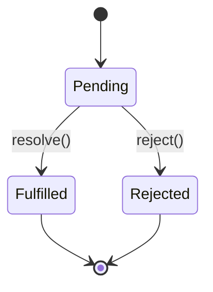

# JavaScript Promises

## Introduction

JavaScript Promises are a powerful way to handle asynchronous operations in your code. If you're learning React, understanding Promises is essential because they're frequently used for data fetching, API calls, and managing side effects.

A Promise represents the eventual completion (or failure) of an asynchronous operation and its resulting value. Think of it as a "promise" that a result will be available at some point in the future—either a resolved value or a reason why the operation failed.

## Understanding Promises

### What is a Promise?

A Promise is an object representing the eventual completion or failure of an asynchronous operation. It can be in one of three states:

1. **Pending**: Initial state, neither fulfilled nor rejected
2. **Fulfilled**: Operation completed successfully
3. **Rejected**: Operation failed



### Creating a Promise

Here's how to create a basic Promise:

```javascript
const myPromise = new Promise((resolve, reject) => {
  // Asynchronous operation here
  const success = true;
  
  if (success) {
    resolve('Operation completed successfully!');
  } else {
    reject('Operation failed!');
  }
});
```

### Using Promises

To consume a Promise, we use the `.then()` and `.catch()` methods:

```javascript
myPromise
  .then((result) => {
    console.log(result); // 'Operation completed successfully!'
  })
  .catch((error) => {
    console.error(error); // This won't run if the Promise resolves
  });
```

## Practical Promise Examples

### Example 1: Fetching Data

One of the most common use cases for Promises is fetching data from an API:

```javascript
function fetchUserData(userId) {
  return fetch(`https://api.example.com/users/${userId}`)
    .then(response => {
      if (!response.ok) {
        throw new Error('Network response was not ok');
      }
      return response.json();
    });
}

// Usage
fetchUserData(123)
  .then(user => {
    console.log('User data:', user);
  })
  .catch(error => {
    console.error('Error fetching user:', error);
  });
```

### Example 2: Delayed Execution with Promises

Creating a delay function using Promises:

```javascript
function delay(milliseconds) {
  return new Promise(resolve => {
    setTimeout(() => {
      resolve(`Delayed for ${milliseconds} ms`);
    }, milliseconds);
  });
}

// Usage
console.log('Starting delay...');

delay(2000)
  .then(message => {
    console.log(message); // Outputs: "Delayed for 2000 ms"
    return delay(1000);
  })
  .then(message => {
    console.log(message); // Outputs: "Delayed for 1000 ms"
    console.log('All done!');
  });

console.log('Delay initiated, continuing execution...');
```

Output:
```
Starting delay...
Delay initiated, continuing execution...
Delayed for 2000 ms
Delayed for 1000 ms
All done!
```

## Promise Chaining

One of the most powerful features of Promises is the ability to chain them together:

```javascript
fetchUserData(123)
  .then(user => {
    console.log('User data:', user);
    return fetchUserPosts(user.id);
  })
  .then(posts => {
    console.log('User posts:', posts);
    return fetchPostComments(posts[0].id);
  })
  .then(comments => {
    console.log('Post comments:', comments);
  })
  .catch(error => {
    console.error('Error in the chain:', error);
  });
```

Each `.then()` returns a new Promise, allowing you to create a sequence of asynchronous operations.

## Error Handling in Promises

Proper error handling is crucial when working with Promises:

```javascript
fetchData()
  .then(result => {
    // This might throw an error
    const processedData = processData(result);
    return processedData;
  })
  .then(processedData => {
    // This won't execute if the previous step failed
    displayData(processedData);
  })
  .catch(error => {
    // This catches errors from any previous step
    console.error('Error in the Promise chain:', error);
    showErrorMessage(error);
  })
  .finally(() => {
    // This always executes, regardless of success or failure
    hideLoadingSpinner();
  });
```

The `.finally()` method is useful for cleanup operations that should run regardless of whether the Promise succeeded or failed.

## Promise.all and Promise.race

### Promise.all

Use `Promise.all()` when you need to wait for multiple Promises to complete:

```javascript
const promiseA = fetchUserProfile();
const promiseB = fetchUserPosts();
const promiseC = fetchUserSettings();

Promise.all([promiseA, promiseB, promiseC])
  .then(([profile, posts, settings]) => {
    console.log('All data loaded:', profile, posts, settings);
    renderUserDashboard(profile, posts, settings);
  })
  .catch(error => {
    console.error('One of the requests failed:', error);
  });
```

If any of the Promises reject, the `.catch()` will be called immediately with that rejection reason.

### Promise.race

Use `Promise.race()` when you need to act on whichever Promise resolves or rejects first:

```javascript
const dataPromise = fetchData();
const timeoutPromise = new Promise((_, reject) => {
  setTimeout(() => reject(new Error('Request timed out')), 5000);
});

Promise.race([dataPromise, timeoutPromise])
  .then(data => {
    console.log('Data received in time:', data);
  })
  .catch(error => {
    console.error('Either the request failed or timed out:', error);
  });
```

## Promises in React

In React applications, Promises are commonly used for:

### Data Fetching in useEffect

```javascript
import React, { useState, useEffect } from 'react';

function UserProfile({ userId }) {
  const [user, setUser] = useState(null);
  const [loading, setLoading] = useState(true);
  const [error, setError] = useState(null);

  useEffect(() => {
    fetch(`https://api.example.com/users/${userId}`)
      .then(response => {
        if (!response.ok) throw new Error('Failed to fetch user');
        return response.json();
      })
      .then(userData => {
        setUser(userData);
        setLoading(false);
      })
      .catch(err => {
        setError(err.message);
        setLoading(false);
      });
  }, [userId]);

  if (loading) return <div>Loading...</div>;
  if (error) return <div>Error: {error}</div>;
  if (!user) return null;

  return (
    <div>
      <h1>{user.name}</h1>
      <p>Email: {user.email}</p>
    </div>
  );
}
```

### Event Handlers

```javascript
function SubmitButton() {
  const [submitting, setSubmitting] = useState(false);
  
  const handleSubmit = () => {
    setSubmitting(true);
    
    saveData()
      .then(() => {
        console.log('Data saved successfully');
        showSuccessMessage();
      })
      .catch(error => {
        console.error('Failed to save data:', error);
        showErrorMessage(error);
      })
      .finally(() => {
        setSubmitting(false);
      });
  };
  
  return (
    <button 
      onClick={handleSubmit} 
      disabled={submitting}
    >
      {submitting ? 'Saving...' : 'Save'}
    </button>
  );
}
```

## Async/Await: Syntactic Sugar for Promises

While not directly about Promises, it's important to mention that modern JavaScript provides a cleaner way to work with Promises using `async/await` syntax:

```javascript
// Using Promise syntax
function getUserData(userId) {
  return fetch(`https://api.example.com/users/${userId}`)
    .then(response => response.json())
    .then(data => {
      return data;
    });
}

// Using async/await syntax
async function getUserData(userId) {
  const response = await fetch(`https://api.example.com/users/${userId}`);
  const data = await response.json();
  return data;
}
```

Error handling is managed with try/catch blocks:

```javascript
async function getUserData(userId) {
  try {
    const response = await fetch(`https://api.example.com/users/${userId}`);
    if (!response.ok) {
      throw new Error('Failed to fetch user data');
    }
    const data = await response.json();
    return data;
  } catch (error) {
    console.error('Error fetching user data:', error);
    throw error; // Re-throw to let calling code handle it
  }
}
```

## Summary

JavaScript Promises provide an elegant way to handle asynchronous operations, making your code more readable and maintainable. Key points to remember:

- Promises represent the eventual completion or failure of an async operation
- They have three states: pending, fulfilled, or rejected
- Use `.then()` for successful outcomes and `.catch()` for errors
- Promise chaining allows for sequential async operations
- `Promise.all()` and `Promise.race()` help manage multiple Promises
- In React, Promises are commonly used for data fetching and event handlers
- `async/await` provides a more readable syntax for working with Promises

Understanding Promises is essential for React development, as they're the foundation for managing asynchronous operations like API calls, which are a core part of most React applications.

## Exercises

1. Create a Promise that resolves after a random delay between 1-5 seconds
2. Chain three Promises together with each step transforming the data
3. Use `Promise.all()` to fetch data from multiple endpoints simultaneously
4. Implement a timeout mechanism using `Promise.race()`
5. Refactor a Promise chain to use async/await syntax

## Additional Resources

- [MDN Web Docs: Promise](https://developer.mozilla.org/en-US/docs/Web/JavaScript/Reference/Global_Objects/Promise)
- [JavaScript.info: Promises, async/await](https://javascript.info/async)
- [React Documentation: Data Fetching](https://reactjs.org/docs/faq-ajax.html)